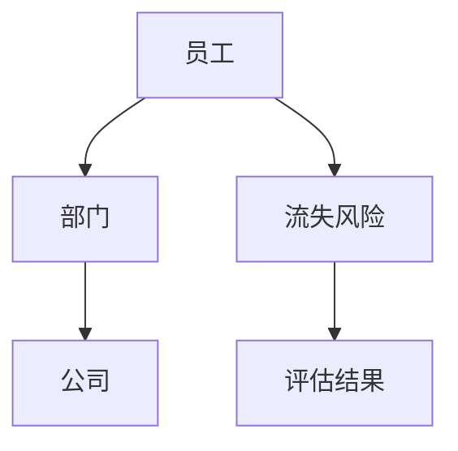
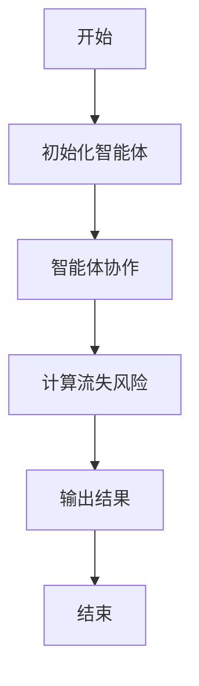
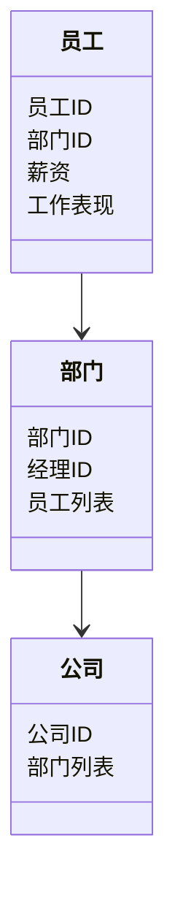
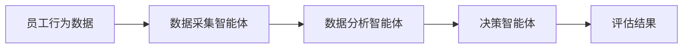
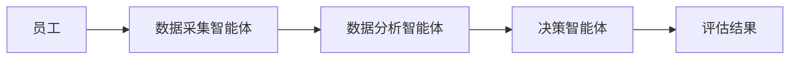

                 


# 多智能体系统在公司人才流失风险评估中的应用

> 关键词：多智能体系统，人才流失，风险评估，算法原理，系统架构

> 摘要：本文探讨了多智能体系统在公司人才流失风险评估中的应用，详细介绍了多智能体系统的基本概念、算法原理、系统架构设计以及实际案例分析。通过本文，读者可以深入了解如何利用多智能体技术来提高人才流失风险的预测和管理能力。

---

# 第1章: 多智能体系统与人才流失风险评估概述

## 1.1 多智能体系统的基本概念

### 1.1.1 多智能体系统的定义
多智能体系统（Multi-Agent System, MAS）是由多个智能体（Agent）组成的分布式系统，这些智能体能够通过协作完成复杂的任务。每个智能体都有自己的目标、知识和行为规则，能够与其他智能体进行通信和协作。

### 1.1.2 多智能体系统的特征
- **自主性**：智能体能够自主决策和行动。
- **反应性**：智能体能够感知环境并实时响应。
- **协作性**：智能体之间能够通过通信和协作完成任务。
- **分布性**：智能体分布在不同的位置，通过网络进行通信。

### 1.1.3 多智能体系统的应用场景
多智能体系统广泛应用于多个领域，如自动驾驶、机器人协作、分布式计算等。在人才流失风险评估中，多智能体系统可以用于分析员工的行为模式，预测员工的流失风险。

---

## 1.2 人才流失风险评估的背景

### 1.2.1 人才流失对企业的影响
人才是企业最重要的资产之一。员工的流失会导致企业损失大量的知识、经验和成本。据统计，员工流失率每增加1%，企业的成本会增加5%。因此，如何预测和管理人才流失风险是企业管理中的重要问题。

### 1.2.2 传统人才流失评估方法的局限性
传统的 talent loss 评估方法主要依赖于问卷调查和面谈，这种方法存在以下问题：
- **主观性强**：评估结果受到主观因素的影响。
- **效率低**：需要大量的人力和时间。
- **成本高**：需要投入大量的资源。

### 1.2.3 多智能体系统在人才流失评估中的优势
多智能体系统可以通过分析大量的数据，如员工的工作表现、薪资水平、职业发展机会等，预测员工的流失风险。这种方法具有以下优势：
- **高效性**：可以快速处理大量的数据。
- **准确性**：通过智能体的协作，可以提高预测的准确性。
- **实时性**：可以实时监控员工的行为，及时发现潜在的问题。

---

## 1.3 多智能体系统在人才流失风险评估中的应用

### 1.3.1 多智能体系统的核心优势
- **分布式计算**：多智能体系统可以通过分布式计算提高处理效率。
- **协作能力**：智能体之间的协作可以提供更全面的评估结果。
- **动态适应**：多智能体系统可以动态适应环境的变化。

### 1.3.2 多智能体系统在人才流失评估中的具体应用
- **员工行为分析**：通过分析员工的行为模式，预测员工的流失风险。
- **团队协作优化**：通过智能体的协作，优化团队的工作效率。
- **实时监控**：通过实时监控员工的行为，及时发现潜在的问题。

### 1.3.3 多智能体系统与传统方法的对比分析
多智能体系统在人才流失评估中的优势主要体现在以下几点：
- **数据处理能力**：多智能体系统可以处理大量的数据，提高评估的准确性。
- **实时性**：多智能体系统可以实时监控员工的行为，及时发现潜在的问题。
- **协作能力**：多智能体系统通过智能体的协作，可以提供更全面的评估结果。

---

## 1.4 本章小结

---

# 第2章: 多智能体系统的核心概念与联系

## 2.1 多智能体系统的原理

### 2.1.1 多智能体系统的组成
多智能体系统由多个智能体和一个环境组成。智能体通过感知环境、决策和行动来实现任务。环境是智能体行动的空间，可以是物理环境或虚拟环境。

### 2.1.2 多智能体系统的通信机制
智能体之间的通信是通过消息传递机制实现的。消息可以是同步或异步的，智能体之间可以通过共享数据库或消息队列进行通信。

### 2.1.3 多智能体系统的协作机制
智能体之间的协作机制包括任务分配、协调和冲突解决。任务分配是将任务分配给合适的智能体，协调是确保智能体之间的协作，冲突解决是处理智能体之间的冲突。

---

## 2.2 多智能体系统与人才流失评估的关系

### 2.2.1 多智能体系统在人才流失评估中的角色
智能体可以扮演以下角色：
- **数据采集智能体**：负责采集员工的行为数据。
- **数据分析智能体**：负责分析员工的行为数据，预测流失风险。
- **决策智能体**：根据分析结果，制定相应的管理策略。

### 2.2.2 多智能体系统如何影响人才流失评估结果
通过智能体的协作，可以提高评估的准确性和效率。例如，数据采集智能体可以实时采集员工的行为数据，数据分析智能体可以快速处理数据，决策智能体可以根据分析结果制定相应的管理策略。

### 2.2.3 多智能体系统与人才流失评估的交互过程
1. **数据采集**：智能体通过传感器或数据库采集员工的行为数据。
2. **数据分析**：智能体通过算法分析数据，预测员工的流失风险。
3. **决策制定**：智能体根据分析结果，制定相应的管理策略。
4. **反馈优化**：智能体根据反馈不断优化算法，提高评估的准确性。

---

## 2.3 多智能体系统的ER实体关系图

### 2.3.1 实体定义与关系
- **员工**：员工是系统的主体，每个员工都有唯一的标识。
- **部门**：部门是员工所属的组织单元。
- **公司**：公司是部门的上层组织。
- **流失风险**：流失风险是员工流失的可能性。

### 2.3.2 Mermaid流程图展示


---

## 2.4 本章小结

---

# 第3章: 多智能体系统在人才流失评估中的算法原理

## 3.1 多智能体协作算法

### 3.1.1 算法原理
多智能体协作算法是一种基于分布式计算的算法，通过智能体之间的协作完成任务。算法的核心思想是将任务分解成多个子任务，每个智能体负责一个子任务，通过协作完成整个任务。

### 3.1.2 算法步骤
1. **任务分解**：将任务分解成多个子任务。
2. **智能体分配**：将子任务分配给不同的智能体。
3. **智能体协作**：智能体通过通信机制协作完成子任务。
4. **结果汇总**：将各个智能体的结果汇总，得到最终的结果。

### 3.1.3 算法实现


---

## 3.2 算法数学模型

### 3.2.1 离职概率计算公式
$$ P = \sum_{i=1}^{n} w_i x_i $$
其中，\( P \) 是员工的离职概率，\( w_i \) 是特征 \( x_i \) 的权重。

### 3.2.2 权重分配公式
$$ w_i = \frac{1}{1 + e^{-k x_i}} $$
其中，\( k \) 是一个常数，\( x_i \) 是特征的值。

### 3.2.3 示例计算
假设员工A的权重为 \( w_A = 0.8 \)，员工

---

# 第4章: 系统分析与架构设计方案

## 4.1 问题场景介绍

### 4.1.1 项目介绍
本项目旨在利用多智能体系统进行人才流失风险评估。通过分析员工的行为数据，预测员工的流失风险，并制定相应的管理策略。

### 4.1.2 系统功能设计
- **数据采集**：采集员工的行为数据。
- **数据分析**：分析员工的行为数据，预测流失风险。
- **决策制定**：根据分析结果，制定相应的管理策略。

### 4.1.3 领域模型 Mermaid 类图


---

## 4.2 系统架构设计

### 4.2.1 系统架构 Mermaid 架构图


---

## 4.3 系统接口设计

### 4.3.1 系统接口
- **数据采集接口**：智能体通过传感器或数据库采集员工的行为数据。
- **数据分析接口**：智能体通过算法分析数据，预测员工的流失风险。
- **决策制定接口**：智能体根据分析结果，制定相应的管理策略。

---

## 4.4 系统交互 Mermaid 序列图



---

## 4.5 本章小结

---

# 第5章: 项目实战

## 5.1 环境安装

### 5.1.1 系统环境
- 操作系统：Linux/Windows/MacOS
- 开发工具：Python/Java/等
- 数据库：MySQL/PostgreSQL/等
- 通信框架：RabbitMQ/Redis/等

### 5.1.2 环境配置
1. 安装 Python 环境。
2. 安装必要的库，如 numpy、pandas、scikit-learn 等。
3. 安装消息队列，如 RabbitMQ。

---

## 5.2 系统核心实现源代码

### 5.2.1 数据采集智能体
```python
import rabbitmq

class EmployeeDataCollector:
    def __init__(self):
        self.rabbitmq = rabbitmq.Client()

    def collect_data(self, employee_id):
        data = self.rabbitmq.get_data(employee_id)
        return data
```

### 5.2.2 数据分析智能体
```python
import numpy as np
import pandas as pd

class EmployeeRiskAnalyzer:
    def __init__(self):
        pass

    def analyze(self, data):
        X = np.array(data['features'])
        y = np.array(data['labels'])
        # 训练模型
        model = self.train_model(X, y)
        # 预测结果
        prediction = model.predict(X)
        return prediction
```

### 5.2.3 决策智能体
```python
class DecisionAgent:
    def __init__(self):
        pass

    def make_decision(self, prediction):
        if prediction == 1:
            return '高风险'
        else:
            return '低风险'
```

---

## 5.3 代码应用解读与分析

### 5.3.1 数据采集智能体
数据采集智能体负责采集员工的行为数据，例如工作表现、薪资水平等。通过消息队列（如 RabbitMQ）与数据分析智能体通信。

### 5.3.2 数据分析智能体
数据分析智能体负责分析员工的行为数据，预测员工的流失风险。使用机器学习算法（如逻辑回归、随机森林等）进行预测。

### 5.3.3 决策智能体
决策智能体根据分析结果，制定相应的管理策略。例如，对于高风险的员工，可以制定留人策略，如提供更好的职业发展机会、增加薪资等。

---

## 5.4 实际案例分析

### 5.4.1 案例介绍
某公司希望利用多智能体系统预测员工的流失风险。公司有1000名员工，其中IT部门的员工流失率较高。

### 5.4.2 数据分析
通过数据分析智能体，分析IT部门员工的行为数据，发现以下问题：
- 工作压力大。
- 职业发展机会少。
- 薪资水平低于市场平均水平。

### 5.4.3 结果展示
数据分析智能体预测IT部门员工的流失风险较高。决策智能体制定留人策略，如提供更多的培训机会、增加薪资等。

### 5.4.4 项目总结
通过多智能体系统的应用，该公司成功降低了IT部门员工的流失率，提高了员工的满意度和工作效率。

---

## 5.5 本章小结

---

# 第6章: 总结与展望

## 6.1 本章总结
本文详细探讨了多智能体系统在公司人才流失风险评估中的应用。通过分析多智能体系统的原理、算法和系统架构设计，展示了如何利用多智能体系统提高人才流失风险的预测和管理能力。

## 6.2 未来展望
未来，随着人工智能技术的发展，多智能体系统在人才流失风险评估中的应用将更加广泛。例如，可以利用强化学习算法优化智能体的协作机制，进一步提高预测的准确性。此外，多智能体系统还可以与其他技术（如区块链）结合，提高系统的安全性和可信度。

---

# 作者：AI天才研究院/AI Genius Institute & 禅与计算机程序设计艺术 /Zen And The Art of Computer Programming

---

**本文由AI天才研究院和禅与计算机程序设计艺术联合撰写，转载请注明出处。**

