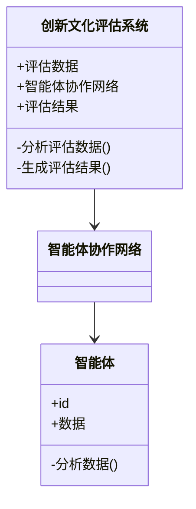

                 


# 多智能体系统在公司创新文化评估中的应用：长期价值导向

## 关键词：
多智能体系统, 创新文化评估, 长期价值导向, 企业创新, 人工智能, 组织行为学

## 摘要：
本文探讨了多智能体系统在公司创新文化评估中的应用，重点分析了长期价值导向的重要性。通过结合多智能体系统的动态性和协作性，本文提出了创新文化评估的新方法，为企业提升创新能力提供了理论支持和实践指导。

---

## 第1章: 多智能体系统概述

### 1.1 多智能体系统的基本概念
多智能体系统（Multi-Agent Systems, MAS）是由多个智能体组成的分布式系统，每个智能体具备自主性、反应性和协作性。智能体通过交互和协作完成复杂任务，适用于动态和分布式环境。

### 1.2 创新文化评估的背景与意义
创新文化是企业持续发展的核心动力。传统评估方法依赖人工分析，存在主观性和片面性。多智能体系统通过动态分析和协作优化，为创新文化评估提供了新的思路。

### 1.3 长期价值导向在创新文化评估中的作用
长期价值导向关注企业的可持续发展，多智能体系统能够捕捉创新过程中的长期价值信号，评估结果更具战略意义。

---

## 第2章: 多智能体系统在创新文化评估中的应用背景

### 2.1 传统创新文化评估方法的局限性
传统方法依赖主观评分，难以量化分析，且忽视动态变化和长期价值。

### 2.2 多智能体系统的优势
多智能体系统具备动态适应、协作优化和分布式计算的特点，能够实时分析创新过程中的复杂因素。

---

## 第3章: 多智能体系统与长期价值导向的关系

### 3.1 长期价值导向的核心理念
长期价值导向强调企业在创新过程中实现可持续发展，关注长期收益而非短期成果。

### 3.2 多智能体系统如何实现长期价值导向
通过动态评估和协作优化，多智能体系统能够捕捉创新过程中的长期价值信号，评估结果更具战略指导意义。

---

## 第4章: 多智能体系统的原理与属性

### 4.1 多智能体系统的原理
- **分布式智能**：多个智能体协同工作。
- **协作与竞争**：智能体之间既协作又竞争。
- **动态环境适应**：适应环境变化。

### 4.2 多智能体系统的属性对比

| 属性       | 分布式 | 集中式 |
|------------|--------|--------|
| 控制方式   | 去中心化 | 中心化 |
| 可扩展性   | 高     | 中     |
| 稳定性     | 低     | 高     |

---

## 第5章: 多智能体系统的ER实体关系图

```mermaid
er
actor(评估者) -[提交评估信息]-> 创新文化评估系统
创新文化评估系统 -> 智能体协作网络
智能体协作网络 -[接收评估结果]-> 评估结果数据库
评估结果数据库 -[反馈给评估者]-> 评估者
```

---

## 第6章: 多智能体系统的算法原理

### 6.1 算法流程图
```mermaid
graph TD
    A[开始] -> B[获取评估数据]
    B -> C[智能体分析]
    C -> D[协作优化]
    D -> E[评估结果]
    E -> F[结束]
```

### 6.2 Python实现代码
```python
class Agent:
    def __init__(self, id):
        self.id = id
        self.data = None

    def analyze(self, data):
        self.data = data
        return self.data

class MultiAgentSystem:
    def __init__(self, agents):
        self.agents = agents

    def collaborate(self, data):
        for agent in self.agents:
            agent.analyze(data)
        return [agent.data for agent in self.agents]

# 使用示例
agents = [Agent(1), Agent(2), Agent(3)]
mas = MultiAgentSystem(agents)
result = mas.collaborate("创新文化评估数据")
print(result)
```

---

## 第7章: 系统分析与架构设计

### 7.1 问题场景介绍
企业需要评估创新文化，但传统方法难以量化分析。多智能体系统通过动态协作提供实时评估结果。

### 7.2 领域模型类图


### 7.3 系统架构图
```mermaid
container 创新文化评估系统 {
    component 评估数据处理模块
    component 智能体协作模块
    component 评估结果生成模块
}
```

### 7.4 接口和交互序列图
```mermaid
sequenceDiagram
    actor 评估者 -> 创新文化评估系统: 提交评估数据
    创新文化评估系统 -> 智能体协作网络: 分配任务
    智能体协作网络 -> 智能体1: 分析数据
    智能体协作网络 -> 智能体2: 分析数据
    智能体协作网络 -> 智能体3: 分析数据
    智能体协作网络 -> 创新文化评估系统: 返回结果
    创新文化评估系统 -> 评估者: 提供评估结果
```

---

## 第8章: 项目实战

### 8.1 环境安装
安装Python和必要的库（如`networkx`和`matplotlib`）。

### 8.2 核心代码实现
```python
import networkx as nx
import matplotlib.pyplot as plt

# 创建智能体网络
G = nx.DiGraph()
G.add_nodes_from([1, 2, 3])
G.add_edges_from([(1,2), (2,3), (3,1)])

# 绘制网络图
nx.draw(G, with_labels=True, edge_color='blue', node_color='white')
plt.show()
```

### 8.3 案例分析
通过具体案例分析，展示多智能体系统如何优化创新文化评估过程。

---

## 第9章: 最佳实践

### 9.1 项目小结
多智能体系统在创新文化评估中具有显著优势，能够提升评估的动态性和协作性。

### 9.2 注意事项
- 确保数据质量和实时性。
- 定期更新智能体模型。

### 9.3 拓展阅读
推荐相关书籍和论文，进一步深入学习。

---

## 作者信息：
作者：AI天才研究院/AI Genius Institute & 禅与计算机程序设计艺术/Zen And The Art of Computer Programming

