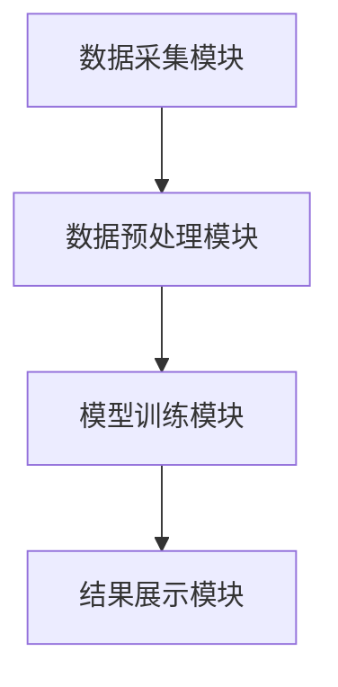
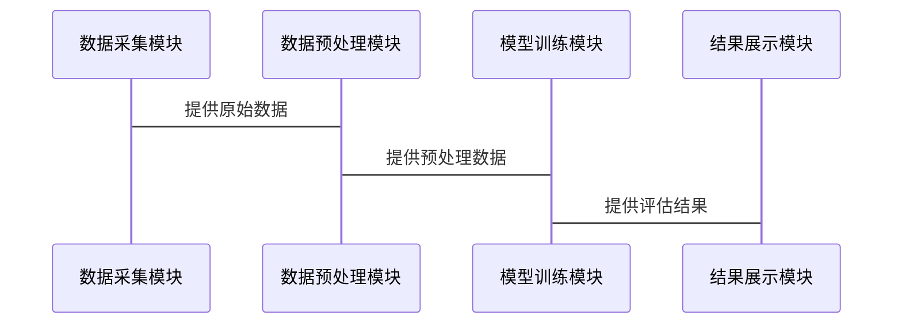

                 


# 多智能体系统在公司创新生态系统健康度评估中的应用

> 关键词：多智能体系统，创新生态系统，健康度评估，协作机制，算法实现，系统架构

> 摘要：随着公司创新生态系统变得越来越复杂，如何有效地评估其健康度成为了一个关键问题。本文探讨了多智能体系统（Multi-Agent System, MAS）在公司创新生态系统健康度评估中的应用。通过分析MAS的基本原理、健康度评估模型的设计与实现、算法实现以及系统架构，本文为读者提供了一个全面的视角，展示如何利用MAS来提升公司创新生态系统的健康度评估的准确性和效率。

---

## 第一部分: 多智能体系统概述

### 第1章: 多智能体系统基础

#### 1.1 多智能体系统的基本概念

##### 1.1.1 多智能体系统的定义

多智能体系统（Multi-Agent System, MAS）是由多个智能体组成的分布式系统，这些智能体通过协作和通信完成特定任务。智能体（Agent）是指具有感知、决策和执行能力的实体，能够自主地完成任务。

##### 1.1.2 多智能体系统的特征

- **自主性**：智能体能够自主决策。
- **反应性**：能够实时感知环境并做出反应。
- **协作性**：多个智能体协同工作以实现共同目标。
- **分布性**：智能体分布在网络中，不依赖于中心节点。

##### 1.1.3 多智能体系统的分类

- **基于任务的MAS**：智能体协作完成特定任务。
- **基于市场的MAS**：智能体通过市场机制进行资源分配。
- **基于社会的MAS**：智能体之间基于社会规范和角色进行协作。

#### 1.2 多智能体系统的体系结构

##### 1.2.1 分层体系结构

将MAS分为多个层次，每个层次负责不同的功能。例如，感知层负责数据采集，决策层负责策略制定，执行层负责任务执行。

##### 1.2.2 分布式体系结构

智能体分布在网络中，通过通信协议进行交互。分布式体系结构能够提高系统的容错性和扩展性。

##### 1.2.3 基于角色的体系结构

智能体被赋予不同的角色，每个角色负责特定的任务。例如，监控智能体负责数据监控，决策智能体负责策略制定。

#### 1.3 多智能体系统的通信机制

##### 1.3.1 智能体之间的通信协议

智能体之间的通信需要遵循特定的协议，例如FIPA（Foundation for Intelligent Physical Agents）。

##### 1.3.2 通信模型与协议选择

通信模型包括发布-订阅模型、请求-响应模型等。协议选择需要考虑系统的实时性、可靠性和安全性。

##### 1.3.3 通信中的安全性问题

智能体之间的通信需要加密和认证机制，以防止数据泄露和恶意攻击。

#### 1.4 多智能体系统的协作与协调

##### 1.4.1 协作的基本概念

协作是指多个智能体为了实现共同目标而协同工作。

##### 1.4.2 协调机制与算法

协调机制包括同步、轮询、仲裁等。常见的协调算法有基于优先级的仲裁算法、基于时间的同步算法等。

##### 1.4.3 协作中的冲突解决

冲突解决方法包括协商、仲裁、妥协等。例如，智能体可以通过协商来分配资源。

#### 1.5 本章小结

本章介绍了多智能体系统的基本概念、体系结构、通信机制和协作机制。MAS的自主性、分布性和协作性使其在复杂系统中具有广泛的应用。

---

## 第二部分: 公司创新生态系统健康度评估

### 第2章: 创新生态系统的核心概念

#### 2.1 创新生态系统的基本特征

创新生态系统是指由企业、合作伙伴、客户、供应商等组成的生态网络，通过协作和创新推动系统的发展。

#### 2.2 公司创新生态系统中的关键角色

##### 2.2.1 企业内部角色

包括研发团队、市场团队、销售团队等。

##### 2.2.2 企业外部角色

包括合作伙伴、客户、供应商、行业专家等。

##### 2.2.3 系统集成与协同

系统集成是指将各个部分整合成一个整体，协同是指各部分之间的协调合作。

#### 2.3 创新生态系统健康度的定义与指标

##### 2.3.1 健康度评估的基本概念

健康度评估是指通过指标衡量创新生态系统的运行状态。

##### 2.3.2 健康度评估的关键指标

- 创新能力：包括研发投入、专利数量、新产品发布频率等。
- 合作伙伴关系：包括合作伙伴的数量、合作深度、信任度等。
- 市场表现：包括市场份额、客户满意度、品牌影响力等。
- 组织能力：包括组织结构、团队协作、资源配置等。

##### 2.3.3 指标权重的确定方法

可以通过层次分析法（AHP）确定各指标的权重。

#### 2.4 本章小结

本章介绍了创新生态系统的定义、关键角色和健康度评估的指标。健康度评估是衡量创新生态系统运行状态的重要手段。

---

## 第三部分: 多智能体系统在健康度评估中的应用

### 第3章: 健康度评估模型的设计与实现

#### 3.1 健康度评估模型的构建

##### 3.1.1 数据采集与预处理

数据来源包括企业内部数据、合作伙伴数据、市场数据等。数据预处理包括清洗、转换、标准化等。

##### 3.1.2 特征提取与选择

通过分析数据，提取与健康度相关的特征，例如创新能力、合作伙伴关系等。

##### 3.1.3 模型构建与训练

使用机器学习算法（例如支持向量机、随机森林）构建健康度评估模型，并通过训练数据进行模型训练。

#### 3.2 健康度评估模型的实现

##### 3.2.1 数据预处理代码

```python
import pandas as pd
from sklearn.preprocessing import StandardScaler

# 数据加载
data = pd.read_csv('innovation_ecosystem.csv')

# 数据清洗
data.dropna(inplace=True)

# 数据标准化
scaler = StandardScaler()
scaled_data = scaler.fit_transform(data)
```

##### 3.2.2 模型训练代码

```python
from sklearn.ensemble import RandomForestRegressor
from sklearn.metrics import mean_squared_error

# 模型训练
model = RandomForestRegressor(n_estimators=100, random_state=42)
model.fit(scaled_data, target)

# 模型评估
预测值 = model.predict(scaled_data)
 mse = mean_squared_error(target, 预测值)
 print('均方误差:', mse)
```

#### 3.2.3 模型评估与优化

通过交叉验证等方法评估模型性能，并进行参数调优以提高模型精度。

#### 3.3 本章小结

本章详细介绍了健康度评估模型的设计与实现过程，包括数据预处理、特征提取、模型训练和评估。

---

### 第4章: 多智能体系统的算法实现

#### 4.1 多智能体系统的算法设计

##### 4.1.1 分布式算法

例如，分布式协同算法、分布式优化算法等。

##### 4.1.2 协作算法

例如，基于角色的协作算法、基于市场的协作算法等。

##### 4.1.3 冲突解决算法

例如，协商算法、仲裁算法等。

#### 4.2 算法实现的代码示例

```python
import numpy as np
import random

# 分布式协同算法
def distributed_coordination_agents(n_agents, target):
    agents = []
    for _ in range(n_agents):
        agents.append(random.uniform(0, 1))
    
    # 协同过程
    for _ in range(10):
        total = sum(agents)
        avg = total / n_agents
        for i in range(n_agents):
            agents[i] = avg + random.gauss(0, 0.1)
    
    return agents

# 冲突解决算法
def conflict_resolution_agents(agents):
    max_agent = max(agents)
    min_agent = min(agents)
    diff = max_agent - min_agent
    return [agent - min_agent for agent in agents]
```

#### 4.3 算法优化与性能分析

通过分析算法的时间复杂度和空间复杂度，评估算法的性能，并进行优化以提高效率。

#### 4.4 本章小结

本章介绍了多智能体系统的算法设计与实现，包括分布式算法、协作算法和冲突解决算法，并给出了具体的代码示例。

---

### 第5章: 系统架构设计与实现

#### 5.1 系统架构设计

##### 5.1.1 系统功能模块设计

包括数据采集模块、模型训练模块、结果展示模块等。

##### 5.1.2 系统架构图



##### 5.1.3 系统接口设计

定义系统的输入输出接口，例如API接口。

#### 5.2 系统实现

##### 5.2.1 系统功能实现

实现数据采集、预处理、模型训练和结果展示等功能。

##### 5.2.2 系统交互流程



#### 5.3 系统优化与测试

通过测试评估系统性能，并进行优化以提高系统的稳定性和效率。

#### 5.4 本章小结

本章详细介绍了系统的架构设计与实现过程，包括功能模块设计、系统架构图和系统交互流程。

---

## 第四部分: 项目实战与总结

### 第6章: 项目实战

#### 6.1 项目背景与目标

介绍项目背景，明确项目目标，例如构建一个基于MAS的公司创新生态系统健康度评估系统。

#### 6.2 项目设计与实现

##### 6.2.1 系统设计

包括系统功能设计、数据库设计、界面设计等。

##### 6.2.2 系统实现

实现系统的各个功能模块，例如数据采集、模型训练、结果展示等。

##### 6.2.3 项目代码示例

```python
import pandas as pd
from sklearn.ensemble import RandomForestRegressor

# 数据加载
data = pd.read_csv('innovation_ecosystem.csv')

# 数据预处理
data.dropna(inplace=True)

# 特征选择
features = data.drop('健康度', axis=1)
target = data['健康度']

# 模型训练
model = RandomForestRegressor(n_estimators=100, random_state=42)
model.fit(features, target)

# 模型预测
预测值 = model.predict(features)
print('预测值:', 预测值)
```

#### 6.3 项目结果与分析

分析系统的评估结果，验证系统的准确性和效率。

#### 6.4 本章小结

本章通过一个具体的项目案例，展示了如何基于MAS实现公司创新生态系统健康度评估系统。

---

## 第五部分: 总结与展望

### 第7章: 总结与展望

#### 7.1 核心观点总结

总结本文的主要观点，即MAS在公司创新生态系统健康度评估中的应用。

#### 7.2 未来研究方向

提出未来的研究方向，例如MAS的优化算法、健康度评估模型的改进等。

#### 7.3 最佳实践 tips

- 在MAS设计中，应注重智能体之间的通信和协作。
- 在健康度评估中，应合理选择指标和模型。

#### 7.4 本章小结

本文总结了MAS在公司创新生态系统健康度评估中的应用，并展望了未来的研究方向。

---

## 作者：AI天才研究院/AI Genius Institute & 禅与计算机程序设计艺术 /Zen And The Art of Computer Programming

---

以上是关于《多智能体系统在公司创新生态系统健康度评估中的应用》的完整文章结构和内容。希望对您有所帮助！

