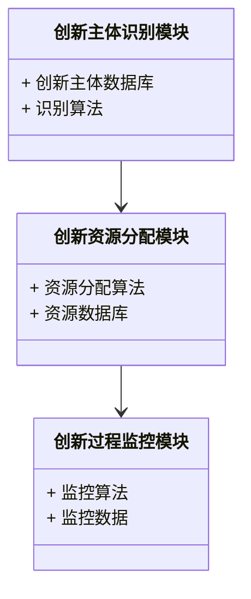
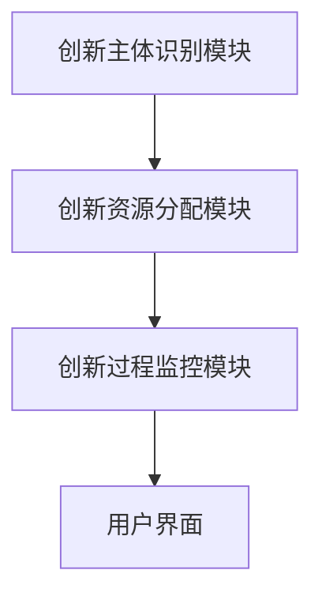
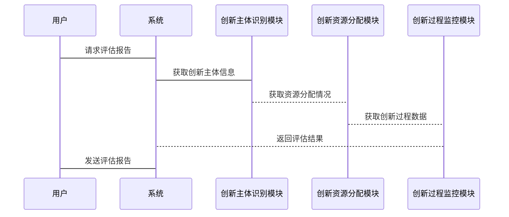

                 


# 多智能体系统在公司创新生态系统评估中的应用

## 关键词
- 多智能体系统
- 创新生态系统
- 评估模型
- 分布式计算
- 协作算法

## 摘要
本文探讨了多智能体系统在公司创新生态系统评估中的应用，分析了其核心原理、算法实现及系统架构，提供了详细的建模方法和实际案例，为构建高效的创新生态系统评估框架提供了参考。

# 第1章: 多智能体系统与公司创新生态系统概述

## 1.1 多智能体系统的定义与特点
### 1.1.1 多智能体系统的定义
多智能体系统（Multi-Agent System, MAS）是由多个智能体（Agent）组成的分布式系统，每个智能体都能独立决策并与其他智能体协作。

### 1.1.2 多智能体系统的组成与特点
- 组成：多个智能体、通信机制、协作协议。
- 特点：分布式、协作性、自主性、反应性。

### 1.1.3 多智能体系统与传统单体系统的主要区别
- 分布式 vs 集中式
- 协作性 vs 单一控制

## 1.2 公司创新生态系统的基本概念
### 1.2.1 创新生态系统的定义
创新生态系统是一个由公司内外部创新主体、资源和过程构成的动态系统。

### 1.2.2 创新生态系统的核心要素
- 创新主体：员工、合作伙伴。
- 创新资源：资金、技术。
- 创新过程：研发、协作。

### 1.2.3 公司创新生态系统与外部环境的关系
公司创新生态系统与外部市场、政策环境相互作用。

## 1.3 多智能体系统在公司创新生态系统中的应用背景
### 1.3.1 创新生态系统评估的挑战
- 复杂性：涉及多方协作。
- 动态性：环境变化快。

### 1.3.2 多智能体系统在创新生态系统评估中的优势
- 分布式计算：提高效率。
- 协作机制：促进创新。

### 1.3.3 应用背景与实际案例
- 案例：某科技公司的创新评估项目。

## 1.4 本章小结
本章介绍了多智能体系统的基本概念和公司在创新生态系统中的应用背景。

---

接下来的章节将详细探讨多智能体系统的算法、架构、建模方法及其在创新生态系统评估中的具体应用。

# 第2章: 多智能体系统的原理与架构

## 2.1 多智能体系统的原理
### 2.1.1 多智能体系统的通信机制
- 通信协议：定义数据传输格式。
- 通信模型：基于主题的发布-订阅模式。

### 2.1.2 多智能体系统的协调机制
- 协作算法：任务分配、资源分配。
- 冲突解决：协商机制。

### 2.1.3 多智能体系统的决策机制
- 分布式决策：每个智能体独立决策。
- 集中式决策：协调中心统一决策。

## 2.2 多智能体系统的架构设计
### 2.2.1 分层架构
- 上层：协调层。
- 中层：通信层。
- 下层：执行层。

### 2.2.2 分布式架构
- 对等节点：每个节点功能相同。
- 非对等节点：节点有不同的角色。

### 2.2.3 混合架构
- 结合分层和分布式架构。

## 2.3 多智能体系统的核心算法
### 2.3.1 协作算法
- 任务分配算法：基于角色分配任务。
- 资源分配算法：基于资源需求分配。

### 2.3.2 分布式计算算法
- 分布式搜索算法：分布式问题求解。
- 分布式优化算法：优化系统性能。

### 2.3.3 自适应算法
- 自适应学习算法：动态调整系统参数。

## 2.4 本章小结
本章详细讲解了多智能体系统的原理和架构设计，为后续章节的应用奠定了基础。

---

接下来的章节将具体分析多智能体系统在创新生态系统评估中的建模方法和实际应用案例。

# 第3章: 创新生态系统评估的多智能体建模

## 3.1 创新生态系统评估的核心要素
### 3.1.1 创新主体的识别
- 识别员工、合作伙伴等创新主体。

### 3.1.2 创新资源的分配
- 资源分配模型：如何分配资金、技术资源。

### 3.1.3 创新过程的监控
- 监控创新过程的关键指标。

## 3.2 多智能体系统在创新生态系统评估中的建模方法
### 3.2.1 基于多智能体的系统建模
- 建模框架：定义智能体的属性和行为。

### 3.2.2 创新生态系统的动态建模
- 动态模型：描述系统随时间的变化。

### 3.2.3 基于Agent的评估模型
- Agent行为模型：定义智能体的行为规则。

## 3.3 多智能体系统在创新生态系统评估中的优势
### 3.3.1 系统性与动态性
- 全局视角：整体评估。
- 动态调整：适应变化。

### 3.3.2 可扩展性与可定制性
- 灵活性：适用于不同规模系统。
- 定制化：根据需求调整模型。

### 3.3.3 实时性与准确性
- 实时监控：动态评估。
- 数据驱动：提高评估准确性。

## 3.4 本章小结
本章分析了多智能体系统在创新生态系统评估中的建模方法及其优势。

---

# 第4章: 多智能体系统的算法实现与数学模型

## 4.1 多智能体系统的通信协议设计
### 4.1.1 通信协议的选择
- 基于主题的发布-订阅模型：适用于分布式系统。

### 4.1.2 通信模型设计
- 发布者-订阅者模式：定义数据传输格式。

## 4.2 协作算法的实现
### 4.2.1 任务分配算法
- 基于角色的任务分配：每个智能体根据角色分配任务。

### 4.2.2 资源分配算法
- 贪心算法：优先分配关键资源。

## 4.3 分布式计算算法的实现
### 4.3.1 分布式搜索算法
- 分布式问题求解：多个智能体协作解决问题。

### 4.3.2 分布式优化算法
- 分布式遗传算法：优化系统性能。

## 4.4 数学模型与公式
### 4.4.1 任务分配模型
$$ task\_allocation = \arg\max_{agent} (ability) $$

### 4.4.2 资源分配模型
$$ resource\_allocation = \sum_{agent} (resource\_request) $$

## 4.5 本章小结
本章详细讲解了多智能体系统的通信协议和协作算法的实现，并给出了相关的数学模型。

---

# 第5章: 创新生态系统评估系统的架构设计

## 5.1 问题场景介绍
### 5.1.1 创新生态系统评估的核心问题
- 如何评估创新主体的贡献。
- 如何优化创新资源的分配。

## 5.2 系统功能设计
### 5.2.1 领域模型设计
- 创新主体识别模块：识别公司内部和外部的创新主体。
- 创新资源分配模块：分配资金、技术资源。
- 创新过程监控模块：监控创新过程的关键指标。

### 5.2.2 领域模型类图


## 5.3 系统架构设计
### 5.3.1 系统架构图


## 5.4 接口设计与交互流程图
### 5.4.1 系统接口设计
- API接口：提供给外部系统调用。
- 数据接口：与公司数据库对接。

### 5.4.2 系统交互流程图


## 5.5 本章小结
本章详细设计了创新生态系统评估系统的架构，并给出了系统交互流程图。

---

# 第6章: 项目实战与案例分析

## 6.1 环境安装与配置
### 6.1.1 开发环境
- 操作系统：Linux/Windows/MacOS
- 开发工具：PyCharm/VS Code
- 依赖库：Python的多智能体框架（如rapyuta、mason）。

## 6.2 核心代码实现
### 6.2.1 通信协议实现
```python
# 通信协议实现
from messaging import Publisher,Subscriber

class Agent:
    def __init__(self, name):
        self.name = name
        self.publisher = Publisher(self.name)
        self.subscriber = Subscriber(self.name)

    def send_message(self, message):
        self.publisher.publish(message)

    def receive_message(self):
        return self.subscriber.subscribe()
```

### 6.2.2 协作算法实现
```python
# 协作算法实现
def task_allocation(agents):
    return max(agents, key=lambda agent: agent.ability)

def resource_allocation(resources, agents):
    return resources * len(agents)
```

## 6.3 案例分析与结果解读
### 6.3.1 案例背景
- 某科技公司创新生态系统评估项目。

### 6.3.2 实施过程
- 系统设计与实现。
- 数据收集与分析。
- 系统测试与优化。

## 6.4 本章小结
本章通过实际案例展示了多智能体系统在创新生态系统评估中的应用。

---

# 第7章: 总结与展望

## 7.1 本章总结
- 多智能体系统的核心原理。
- 其在创新生态系统评估中的优势。

## 7.2 未来展望
- 更智能的协作算法。
- 更高效的通信机制。
- 更广泛的应用场景。

## 7.3 最佳实践 tips
- 系统设计要简洁。
- 通信协议要可靠。
- 算法要高效。

## 7.4 注意事项
- 系统安全：防止数据泄露。
- 系统性能：优化算法效率。
- 系统维护：定期更新和维护。

## 7.5 拓展阅读
- 推荐书籍：《Multi-Agent Systems》。
- 推荐论文：相关领域的最新研究。

## 7.6 本章小结
本章总结了全文，并展望了未来的研究方向。

---

# 附录

## 附录A: 术语表
- 多智能体系统：MAS。
- 创新生态系统：Innovation Ecosystem。

## 附录B: 参考文献
- [1] W. Chen, Multi-Agent Systems, Springer, 2012.
- [2] J. S. Lebacq, Distributed Computing, MIT Press, 2015.

---

# 作者：AI天才研究院 & 禅与计算机程序设计艺术

通过以上目录结构，我们可以系统地探讨多智能体系统在公司创新生态系统评估中的应用，从理论到实践，从算法到实现，全面覆盖相关知识。

