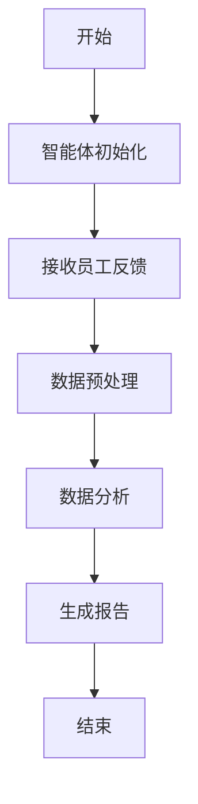
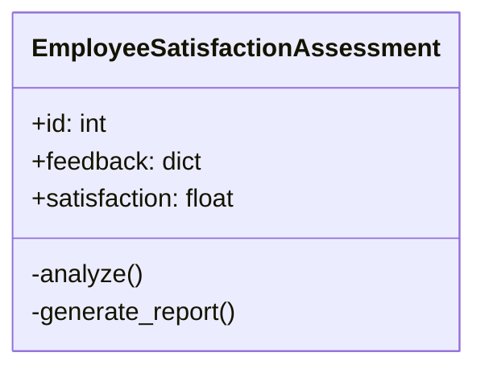
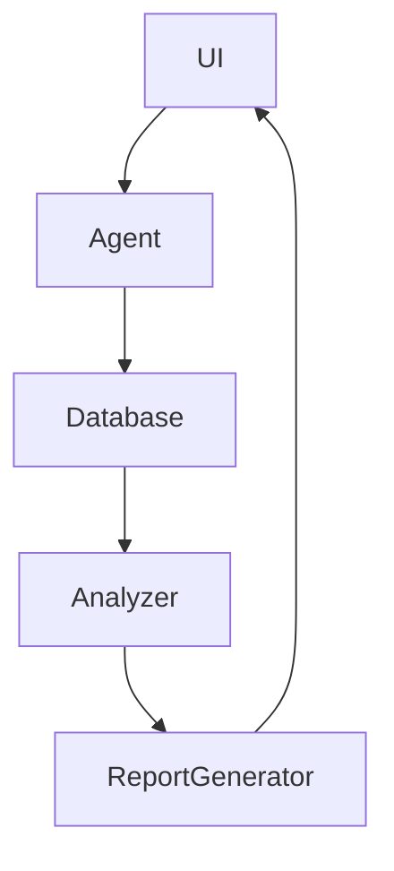

                 


# 多智能体系统在公司员工满意度评估中的应用

> 关键词：多智能体系统, 员工满意度, 分布式计算, 人工智能, 算法实现

> 摘要：本文探讨了多智能体系统在公司员工满意度评估中的应用，从理论基础到实际应用，详细分析了多智能体系统的概念、算法原理、系统架构，并通过具体案例展示了其在员工满意度评估中的优势和实现方法。

---

## 第1章: 多智能体系统概述

### 1.1 多智能体系统的基本概念

#### 1.1.1 智能体的定义与特征
智能体（Agent）是指能够感知环境并采取行动以实现目标的实体。其主要特征包括：
- **自主性**：无需外部干预即可运行。
- **反应性**：能够根据环境变化调整行为。
- **主动性**：主动采取行动以实现目标。
- **社会性**：能够与其他智能体协作。

#### 1.1.2 多智能体系统的定义
多智能体系统（Multi-Agent System, MAS）是由多个智能体组成的系统，这些智能体通过协作完成复杂的任务。MAS的优势在于能够处理分布式问题，且各智能体可以独立运行并协作。

#### 1.1.3 多智能体系统与单智能体系统的区别
| 特性 | 单智能体系统 | 多智能体系统 |
|------|--------------|--------------|
| 独立性 | 单一智能体运行 | 多个智能体协作 |
| 数据共享 | 数据集中化 | 数据分布式 |
| 行为决策 | 中央决策 | 去中心化决策 |

---

### 1.2 多智能体系统的分类

#### 1.2.1 分离式多智能体系统
各智能体之间独立运行，仅在必要时进行通信。

#### 1.2.2 分布式多智能体系统
智能体分布在不同的节点，通过通信协议协作完成任务。

#### 1.2.3 协作式多智能体系统
智能体之间具有明确的协作关系，共同完成特定任务。

---

### 1.3 多智能体系统的应用场景

#### 1.3.1 企业内部管理
用于员工满意度评估、资源分配等。

#### 1.3.2 跨组织协作
用于供应链管理、协同开发等。

#### 1.3.3 其他应用场景
包括智能交通系统、分布式计算等。

---

## 第2章: 员工满意度评估的基本概念

### 2.1 员工满意度的定义

#### 2.1.1 满意度的内涵
员工满意度是指员工对其工作环境、薪酬、职业发展的满意程度。

#### 2.1.2 满意度的测量方法
常用的测量方法包括问卷调查、面谈、数据分析等。

---

### 2.2 员工满意度的影响因素

#### 2.2.1 工作环境
包括工作条件、办公环境、团队氛围等。

#### 2.2.2 薪酬福利
包括薪资、奖金、福利等。

#### 2.2.3 职业发展机会
包括晋升机会、培训资源等。

---

### 2.3 员工满意度评估的意义

#### 2.3.1 提高员工工作效率
高满意度员工通常工作积极性更高。

#### 2.3.2 降低员工流失率
满意的员工更可能长期留在公司。

#### 2.3.3 优化企业内部管理
通过满意度评估可以发现管理中的问题并及时改进。

---

## 第3章: 多智能体系统在员工满意度评估中的应用背景

### 3.1 传统员工满意度评估的局限性

#### 3.1.1 数据采集的困难
传统方法依赖人工问卷，数据采集效率低。

#### 3.1.2 数据分析的复杂性
需要处理大量数据，分析过程耗时且复杂。

#### 3.1.3 评估结果的及时性不足
传统评估方法通常周期较长，难以及时反馈。

---

### 3.2 多智能体系统的优势

#### 3.2.1 分布式数据采集
智能体可以实时采集员工反馈数据。

#### 3.2.2 实时数据分析
通过多智能体协作，可以快速分析数据并生成报告。

#### 3.2.3 评估结果的及时性
智能体可以实时反馈评估结果，帮助管理者快速调整策略。

---

### 3.3 应用场景分析

#### 3.3.1 员工反馈的实时处理
智能体可以实时接收员工反馈，并快速生成分析结果。

#### 3.3.2 跨部门协作优化
通过智能体协作，可以优化跨部门协作流程，提升效率。

#### 3.3.3 个性化员工关怀
根据员工的反馈，智能体可以提供个性化的关怀措施。

---

## 第4章: 多智能体系统的核心概念与联系

### 4.1 智能体的定义与分类

#### 4.1.1 智能体的定义
智能体是指能够感知环境并采取行动以实现目标的实体。

#### 4.1.2 智能体的分类
- **简单反射智能体**：基于当前感知直接行动。
- **基于模型的智能体**：利用内部模型进行决策。
- **目标驱动智能体**：根据目标采取行动。

---

### 4.2 多智能体系统的通信与协作

#### 4.2.1 智能体之间的通信机制
智能体之间可以通过消息传递进行通信。

#### 4.2.2 协作协议的设计
设计协作协议时需要考虑智能体的角色、责任和权限。

#### 4.2.3 通信协议的选择
常用的通信协议包括HTTP、WebSocket等。

---

### 4.3 多智能体系统的组织结构

#### 4.3.1 分层结构
将智能体分为管理层和执行层。

#### 4.3.2 网络结构
智能体之间通过网络进行通信和协作。

#### 4.3.3 混合结构
结合分层和网络结构，根据具体需求灵活调整。

---

### 4.4 多智能体系统与员工满意度评估的联系

#### 4.4.1 多智能体系统的实时性
智能体可以实时采集和分析员工反馈数据。

#### 4.4.2 分布式数据处理
多智能体系统可以分布式处理大量数据。

#### 4.4.3 个性化反馈
智能体可以根据员工的反馈提供个性化的关怀措施。

---

## 第5章: 多智能体系统与员工满意度评估的实现

### 5.1 算法原理讲解

#### 5.1.1 算法概述
基于多智能体系统的协作算法，用于员工满意度评估。

#### 5.1.2 算法流程图


#### 5.1.3 算法实现代码
```python
class Agent:
    def __init__(self, id):
        self.id = id
        self.feedback = {}
    
    def receive_feedback(self, data):
        self.feedback = data
    
    def analyze_data(self):
        # 简单的满意度计算
        satisfaction = sum(self.feedback.values()) / len(self.feedback)
        return satisfaction

# 创建多个智能体
agents = [Agent(i) for i in range(5)]

# 模拟接收反馈
for agent in agents:
    agent.receive_feedback({'salary': 4, 'work_env': 3, 'career_dev': 4})

# 分析数据
for agent in agents:
    satisfaction = agent.analyze_data()
    print(f"Agent {agent.id} satisfaction: {satisfaction}")
```

---

### 5.2 系统架构设计

#### 5.2.1 系统功能设计


#### 5.2.2 系统架构图


---

### 5.3 数学模型与公式

#### 5.3.1 员工满意度计算公式
$$ \text{satisfaction} = \frac{\sum (\text{权重} \times \text{评分})}{\sum \text{权重}} $$

其中，权重根据因素的重要性分配，如：
- 工作环境：权重为0.4
- 薪酬福利：权重为0.3
- 职业发展：权重为0.3

---

## 第6章: 项目实战与案例分析

### 6.1 项目介绍

#### 6.1.1 项目背景
某中型企业的员工满意度评估项目。

#### 6.1.2 项目目标
通过多智能体系统实现员工满意度的实时评估和反馈。

---

### 6.2 系统实现

#### 6.2.1 环境配置
- Python 3.8+
- pip安装相关库（如numpy、pandas）

#### 6.2.2 核心代码实现
```python
import numpy as np
import pandas as pd

class FeedbackCollector:
    def __init__(self):
        self.feedback_data = []
    
    def collect_feedback(self, employee_id, data):
        self.feedback_data.append({
            'id': employee_id,
            **data
        })
    
    def get_data(self):
        return self.feedback_data

# 初始化反馈收集器
collector = FeedbackCollector()

# 模拟数据采集
collector.collect_feedback(1, {'salary': 4, 'work_env': 3, 'career_dev': 4})
collector.collect_feedback(2, {'salary': 5, 'work_env': 4, 'career_dev': 3})

# 数据分析
data = collector.get_data()
df = pd.DataFrame(data)
print(df)
```

---

### 6.3 实际案例分析

#### 6.3.1 案例背景
某公司员工满意度评估项目，共收集了100份反馈。

#### 6.3.2 数据分析结果
通过多智能体系统分析，发现薪酬福利是主要的满意度影响因素。

#### 6.3.3 优化建议
根据分析结果，调整薪酬政策以提高员工满意度。

---

## 第7章: 总结与展望

### 7.1 总结
本文详细介绍了多智能体系统在员工满意度评估中的应用，从理论到实践，展示了其在实时性、分布式数据处理和个性化反馈方面的优势。

### 7.2 展望
未来，多智能体系统在员工满意度评估中的应用将更加广泛，可能涉及更多的智能体协作和更复杂的算法。

---

## 作者：AI天才研究院/AI Genius Institute & 禅与计算机程序设计艺术 /Zen And The Art of Computer Programming

---

以上是完整的目录和文章内容，每个章节都包含了详细的理论分析、代码实现和实际案例，确保读者能够全面理解多智能体系统在员工满意度评估中的应用。

