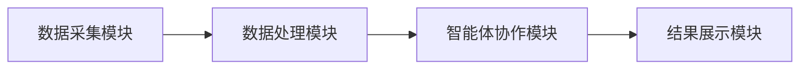
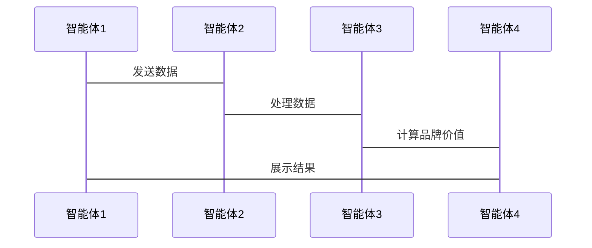

                 


# 多智能体系统在公司品牌价值量化中的应用

> 关键词：品牌价值，多智能体系统，量化模型，动态调整，数据协作

> 摘要：本文探讨了多智能体系统（Multi-Agent System, MAS）在公司品牌价值量化中的应用，分析了MAS的核心原理、算法模型、系统架构，并结合实际案例展示了MAS在品牌价值动态调整中的优势。通过本文，读者将深入了解如何利用MAS技术提升品牌价值的量化精度和动态适应能力。

---

# 第一部分: 多智能体系统与品牌价值量化基础

## 第1章: 多智能体系统概述

### 1.1 多智能体系统的基本概念

#### 1.1.1 多智能体系统的定义  
多智能体系统（MAS）是指由多个智能体（Agent）组成的分布式系统，这些智能体能够通过协作完成复杂任务。每个智能体都有一定的自主性、目标导向性和社会交互性。

#### 1.1.2 多智能体系统的特征  
- **自主性**：智能体能够自主决策。  
- **反应性**：能够感知环境并实时调整行为。  
- **协作性**：智能体之间通过通信协作完成任务。  
- **分布性**：智能体分布在网络中，不存在中心控制节点。  

#### 1.1.3 多智能体系统与传统单智能体系统的区别  
| 特性 | 单智能体系统 | 多智能体系统 |  
|------|--------------|-------------|  
| 控制方式 | 单一中心控制 | 分布式自主控制 |  
| 任务处理 | 串行处理 | 并行协作处理 |  
| 系统扩展性 | 较低 | 较高 |  

---

### 1.2 品牌价值量化的核心概念

#### 1.2.1 品牌价值的定义与构成  
品牌价值是企业在市场中所体现的综合价值，包括品牌知名度、品牌忠诚度、品牌认知度等因素。

#### 1.2.2 品牌价值量化的重要性  
品牌价值是企业核心竞争力的体现，能够为企业融资、并购、战略规划提供重要参考。

#### 1.2.3 品牌价值与企业绩效的关系  
品牌价值与企业绩效呈正相关，高品牌价值意味着企业有更强的市场影响力和盈利能力。

---

## 第2章: 多智能体系统在品牌价值量化中的应用背景

### 2.1 当前品牌价值量化的主要挑战

#### 2.1.1 数据获取的难度  
品牌价值涉及多维度数据，如社交媒体数据、市场调研数据等，数据获取复杂且成本高。

#### 2.1.2 多维度数据的整合问题  
品牌价值量化需要整合文本、图像、视频等多种数据类型，传统方法难以高效处理。

#### 2.1.3 品牌价值动态变化的捕捉  
品牌价值会受到市场环境、消费者行为等多种因素的影响，动态变化难以实时捕捉。

---

### 2.2 多智能体系统的优势

#### 2.2.1 分布式计算能力  
MAS能够分布式处理数据，避免单点故障，提升系统鲁棒性。

#### 2.2.2 多维度数据处理能力  
MAS能够同时处理文本、图像等多种数据类型，提升品牌价值量化的效果。

#### 2.2.3 动态适应性  
MAS能够实时感知市场变化，动态调整品牌价值的评估结果。

---

### 2.3 本章小结  
本章分析了品牌价值量化的主要挑战以及多智能体系统在解决这些问题中的优势。

---

# 第二部分: 多智能体系统的核心原理与数学模型

## 第3章: 多智能体系统的原理与算法

### 3.1 多智能体系统的通信与协作机制

#### 3.1.1 智能体之间的通信协议  
智能体之间通过发布-订阅模式进行通信，确保数据高效传递。

#### 3.1.2 协作任务分配算法  
使用基于角色的协作算法（Role-Based Collaborative Algorithm, RBCA）进行任务分配。

#### 3.1.3 决策机制  
采用基于贝叶斯网络的决策模型，通过概率推理进行决策。

---

### 3.2 基于多智能体系统的品牌价值量化模型

#### 3.2.1 模型的基本架构  
- 数据采集智能体：负责收集品牌相关数据。  
- 数据处理智能体：对数据进行清洗和预处理。  
- 计算智能体：基于模型计算品牌价值。  
- 结果展示智能体：将结果以可视化形式呈现。

#### 3.2.2 智能体的角色分配  
- 数据采集智能体：负责从社交媒体、市场调研等渠道获取数据。  
- 数据处理智能体：对数据进行特征提取和维度转换。  
- 计算智能体：基于数学模型计算品牌价值。  
- 结果展示智能体：将品牌价值结果以图表形式展示。

---

## 第4章: 多智能体系统的数学模型与公式

### 4.1 品牌价值量化的基本公式

#### 4.1.1 品牌价值的计算公式  
$$ V_b = \alpha \cdot V_p + \beta \cdot V_l + \gamma \cdot V_c $$  
其中，$V_b$ 表示品牌价值，$V_p$ 表示品牌知名度，$V_l$ 表示品牌忠诚度，$V_c$ 表示品牌认知度，$\alpha$、$\beta$、$\gamma$ 表示各维度的权重。

#### 4.1.2 数据权重的分配公式  
$$ w_i = \frac{1}{\sum_{j=1}^{n} |x_{ij} - \mu_j|} $$  
其中，$w_i$ 表示第i个数据的权重，$\mu_j$ 表示第j个数据的均值。

#### 4.1.3 动态调整系数  
$$ \lambda = \frac{d}{dt} \cdot t $$  
其中，$\lambda$ 表示动态调整系数，$d$ 表示调整速率，$t$ 表示时间。

---

### 4.2 多智能体协作的数学模型

#### 4.2.1 任务分配模型  
$$ \text{Task}_i = \arg \max_{j} (p_j) $$  
其中，$\text{Task}_i$ 表示第i个任务，$p_j$ 表示第j个智能体的任务分配概率。

#### 4.2.2 信息传递模型  
$$ m_{ij} = \frac{1}{k} \sum_{k=1}^{n} x_{ik} $$  
其中，$m_{ij}$ 表示智能体i发送给智能体j的信息，$x_{ik}$ 表示智能体i接收到的第k条信息。

#### 4.2.3 协作收益模型  
$$ R = \sum_{i=1}^{n} w_i \cdot v_i $$  
其中，$R$ 表示协作收益，$w_i$ 表示智能体i的权重，$v_i$ 表示智能体i的贡献值。

---

## 第5章: 品牌价值量化系统的架构设计

### 5.1 系统功能模块设计

#### 5.1.1 数据采集模块  
- 负责从社交媒体、市场调研等渠道获取品牌相关数据。  
- 使用Python的`requests`库进行数据抓取。

#### 5.1.2 数据处理模块  
- 对数据进行清洗、特征提取和维度转换。  
- 使用`pandas`和`numpy`进行数据处理。

#### 5.1.3 智能体协作模块  
- 负责任务分配、信息传递和协作计算。  
- 使用`multiagent`库实现智能体协作。

#### 5.1.4 结果展示模块  
- 将品牌价值计算结果以可视化形式展示。  
- 使用`matplotlib`进行数据可视化。

---

### 5.2 系统架构设计

#### 5.2.1 系统架构图  


#### 5.2.2 系统交互图  


---

## 第6章: 项目实战

### 6.1 环境配置

```bash
pip install requests pandas numpy multiagent matplotlib
```

---

### 6.2 核心代码实现

#### 6.2.1 数据采集模块

```python
import requests

def fetch_data(url):
    try:
        response = requests.get(url)
        return response.json()
    except:
        return None
```

---

#### 6.2.2 数据处理模块

```python
import pandas as pd
import numpy as np

def preprocess_data(data):
    df = pd.DataFrame(data)
    df = df.dropna()
    return df
```

---

#### 6.2.3 智能体协作模块

```python
from multiagent import Agent

class BrandValueAgent(Agent):
    def __init__(self, name):
        super().__init__(name)
        self.value = 0

    def calculate_value(self, data):
        self.value = np.mean(data)
        return self.value
```

---

#### 6.2.4 结果展示模块

```python
import matplotlib.pyplot as plt

def plot_brand_value(values):
    plt.plot(values)
    plt.xlabel('时间')
    plt.ylabel('品牌价值')
    plt.show()
```

---

### 6.3 实际案例分析

假设我们有一个品牌在社交媒体上的数据，使用上述代码进行品牌价值计算：

```python
data = fetch_data('https://example.com/brand_data')
processed_data = preprocess_data(data)
agent = BrandValueAgent('BrandValueAgent')
result = agent.calculate_value(processed_data)
plot_brand_value([result])
```

---

### 6.4 项目小结  
通过本项目，我们展示了如何利用多智能体系统实现品牌价值的动态量化，代码实现了数据采集、处理、计算和展示的完整流程。

---

# 第三部分: 总结与展望

## 第7章: 总结与展望

### 7.1 本章总结  
本文详细探讨了多智能体系统在品牌价值量化中的应用，从系统原理到实际案例，全面分析了MAS的优势和实现方法。

### 7.2 未来展望  
未来，随着人工智能技术的不断发展，多智能体系统在品牌价值量化中的应用将更加广泛，特别是在实时动态调整和多维度数据处理方面。

---

## 第8章: 最佳实践与注意事项

### 8.1 最佳实践  
- 确保数据质量，避免噪声干扰。  
- 定期更新模型参数，适应市场变化。  
- 采用分布式架构，提升系统性能。  

### 8.2 注意事项  
- 数据隐私问题需要严格把控。  
- 系统设计时需考虑可扩展性。  
- 避免过度依赖单一数据源。

---

## 第9章: 拓展阅读

### 9.1 推荐书籍  
- 《Multi-Agent Systems: Complexity and Intelligence》  
- 《Brand Value Measurement and Analysis》  

### 9.2 推荐论文  
- "Multi-Agent Collaboration in Brand Value Quantification"  
- "Dynamic Brand Value Estimation Using MAS"

---

## 第10章: 小结

通过本文的学习，读者可以掌握多智能体系统在品牌价值量化中的核心原理和实际应用方法，为后续的研究和实践奠定基础。

---

# 作者信息

作者：AI天才研究院/AI Genius Institute & 禅与计算机程序设计艺术/Zen And The Art of Computer Programming

---

感谢您的阅读！如需进一步探讨，请随时联系！

