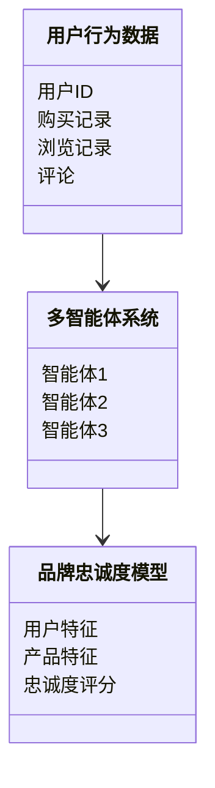
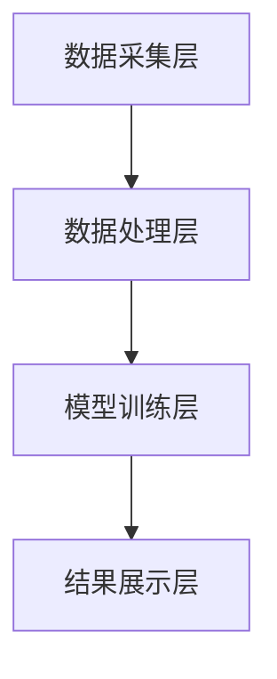
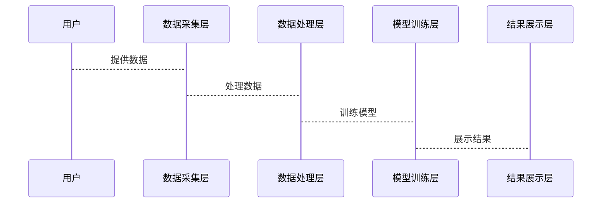

                 


# 多智能体系统在公司品牌忠诚度分析中的应用

> 关键词：多智能体系统，品牌忠诚度，分布式计算，协同过滤，机器学习，数据分析

> 摘要：本文探讨了多智能体系统在公司品牌忠诚度分析中的应用，从背景介绍、核心概念、算法原理到系统架构设计，结合实际案例分析，深入剖析了多智能体系统如何提升品牌忠诚度分析的效率和准确性。通过协同过滤算法和分布式计算的结合，展示了如何利用多智能体系统的优势解决复杂的数据分析问题。

---

## 第1章: 多智能体系统与品牌忠诚度分析的背景介绍

### 1.1 多智能体系统的定义与特点
多智能体系统（Multi-Agent System, MAS）是由多个智能体（Agent）组成的分布式系统，这些智能体通过协作完成特定任务。每个智能体都有一定的自主性，能够感知环境、做出决策并与其他智能体或外部系统交互。

#### 1.1.1 多智能体系统的定义
- 智能体：具有感知、推理、规划和执行能力的实体。
- 多智能体系统：多个智能体通过通信和协作完成复杂任务的系统。

#### 1.1.2 多智能体系统的核心特点
1. **分布式性**：智能体独立运行，通过通信协作解决问题。
2. **自主性**：每个智能体具有自主决策能力。
3. **协作性**：智能体之间通过协作完成共同目标。
4. **反应性**：智能体能够实时感知环境并做出反应。

#### 1.1.3 多智能体系统与传统单智能体系统的区别
- **单智能体系统**：集中式计算，单点决策。
- **多智能体系统**：分布式计算，去中心化决策。

### 1.2 品牌忠诚度分析的定义与重要性
品牌忠诚度是指消费者对某个品牌的情感依赖和重复购买意愿。在商业分析中，品牌忠诚度分析帮助企业了解客户行为，优化市场策略。

#### 1.2.1 品牌忠诚度的定义
品牌忠诚度是客户对品牌的情感认同和行为表现，通常通过客户购买频率、复购率和推荐行为来衡量。

#### 1.2.2 品牌忠诚度分析的重要性
1. **客户 retention**：提高客户留存率，降低获取新客户的成本。
2. **市场策略优化**：通过分析客户行为，优化市场推广和产品设计。
3. **竞争优势**：高品牌忠诚度意味着更强的市场竞争力。

#### 1.2.3 品牌忠诚度分析的挑战与难点
1. **数据复杂性**：客户行为数据多维复杂，难以处理。
2. **实时性要求**：品牌忠诚度分析需要实时反馈。
3. **个性化需求**：每个客户的行为模式不同，需要个性化分析。

### 1.3 多智能体系统在品牌忠诚度分析中的应用背景
多智能体系统的优势在于其分布式计算和协作能力，这与品牌忠诚度分析的需求高度契合。

#### 1.3.1 多智能体系统的优势
1. **分布式计算**：多智能体系统能够处理大规模数据，适合品牌忠诚度分析的复杂场景。
2. **协作能力**：智能体之间可以协同工作，提升分析效率。
3. **灵活性**：多智能体系统可以根据需求动态调整。

#### 1.3.2 品牌忠诚度分析的复杂性
1. **数据多样性**：涉及文本、图像、行为数据等多种数据类型。
2. **实时性需求**：需要实时分析客户行为，提供及时反馈。
3. **个性化分析**：每个客户的忠诚度分析需要个性化处理。

#### 1.3.3 多智能体系统与品牌忠诚度分析的结合
通过多智能体系统，可以将品牌忠诚度分析任务分解为多个子任务，由多个智能体分别处理，最终协同完成整体分析。

---

## 第2章: 多智能体系统的核心概念与联系

### 2.1 多智能体系统的原理
多智能体系统的原理包括智能体的定义、通信机制和协作机制。

#### 2.1.1 智能体的定义与属性
智能体（Agent）是一个能够感知环境、做出决策并执行动作的实体。智能体的核心属性包括：
1. **自主性**：智能体能够自主决策。
2. **反应性**：智能体能够实时感知环境并做出反应。
3. **协作性**：智能体能够与其他智能体协作完成任务。

#### 2.1.2 多智能体系统的通信机制
智能体之间通过通信机制交换信息，常用的通信方式包括：
1. **直接通信**：智能体之间直接交换信息。
2. **间接通信**：通过中间媒介传递信息。

#### 2.1.3 多智能体系统的协作机制
协作机制是多智能体系统的核心，常见的协作方式包括：
1. **任务分配**：智能体之间分配任务。
2. **信息共享**：智能体共享信息，共同完成任务。
3. **协调与同步**：智能体之间协调动作，确保任务顺利进行。

### 2.2 品牌忠诚度分析的核心要素
品牌忠诚度分析需要考虑客户行为、市场环境等多个因素。

#### 2.2.1 品牌忠诚度的影响因素
1. **客户满意度**：客户对品牌或产品的满意程度。
2. **客户忠诚度**：客户对品牌的依赖程度。
3. **客户生命周期价值**：客户在生命周期内为企业带来的价值。

#### 2.2.2 数据特征的提取方法
1. **行为数据**：客户的购买记录、浏览记录等。
2. **情感数据**：客户对品牌的评价、评论等。
3. **人口统计信息**：客户的年龄、性别、地理位置等。

#### 2.2.3 数据分析的维度
1. **时间维度**：分析客户行为的时间序列。
2. **空间维度**：分析客户分布的地理区域。
3. **产品维度**：分析不同产品对品牌忠诚度的影响。

### 2.3 多智能体系统与品牌忠诚度分析的联系
多智能体系统的优势在于其分布式计算和协作能力，这与品牌忠诚度分析的需求高度契合。

#### 2.3.1 多智能体系统的分布式计算优势
1. **数据处理能力**：多智能体系统能够处理大规模数据，适合品牌忠诚度分析的复杂场景。
2. **任务分解**：多智能体系统能够将复杂任务分解为多个子任务，分别处理。

#### 2.3.2 品牌忠诚度分析的多维度需求
1. **数据多样性**：品牌忠诚度分析需要处理多种类型的数据，包括行为数据、情感数据等。
2. **实时性要求**：需要实时分析客户行为，提供及时反馈。
3. **个性化分析**：每个客户的忠诚度分析需要个性化处理。

#### 2.3.3 多智能体系统在品牌忠诚度分析中的具体应用
通过多智能体系统，可以将品牌忠诚度分析任务分解为多个子任务，由多个智能体分别处理，最终协同完成整体分析。

---

## 第3章: 多智能体系统在品牌忠诚度分析中的算法原理

### 3.1 协同过滤算法
协同过滤是一种常用的品牌忠诚度分析算法，通过相似用户的推荐来预测客户的忠诚度。

#### 3.1.1 协同过滤算法的定义
协同过滤是一种基于用户相似性推荐算法，通过分析用户的行为数据，找到与目标用户相似的用户，推荐其可能感兴趣的产品或服务。

#### 3.1.2 基于用户的协同过滤
基于用户的协同过滤算法通过计算用户之间的相似度，将相似用户的购买记录推荐给目标用户。

#### 3.1.3 基于物品的协同过滤
基于物品的协同过滤算法通过计算物品之间的相似度，将相似物品推荐给目标用户。

### 3.2 基于多智能体的分布式计算算法
多智能体系统的分布式计算能力使其在品牌忠诚度分析中具有独特优势。

#### 3.2.1 分布式计算的基本原理
分布式计算通过将任务分解到多个计算节点，利用并行计算提高处理效率。

#### 3.2.2 多智能体协同计算的流程
1. **任务分解**：将品牌忠诚度分析任务分解为多个子任务。
2. **智能体协作**：多个智能体分别处理子任务，通过通信机制共享信息。
3. **结果整合**：将各个智能体的计算结果整合，得到最终的分析结果。

#### 3.2.3 算法的收敛性分析
收敛性分析是评估分布式计算算法的重要指标，通过分析算法的收敛速度和稳定性，优化算法性能。

### 3.3 品牌忠诚度分析的数学模型
数学模型是品牌忠诚度分析的核心，通过建立模型可以量化客户行为和品牌忠诚度之间的关系。

#### 3.3.1 基于协同过滤的数学模型
协同过滤算法通过相似度计算公式，量化用户或物品之间的相似程度。

$$ \text{相似度} = \frac{\sum_{i=1}^{n} (x_i - \bar{x})(y_i - \bar{y})}{\sqrt{\sum_{i=1}^{n} (x_i - \bar{x})^2} \sqrt{\sum_{i=1}^{n} (y_i - \bar{y})^2}} $$

#### 3.3.2 基于多智能体的数学模型
通过多智能体系统的协作机制，建立分布式计算模型，实现品牌忠诚度的分析。

$$ \text{忠诚度} = \sum_{i=1}^{n} \text{智能体}_i(\text{任务}_i) $$

#### 3.3.3 模型的优化与改进
通过优化算法参数和改进模型结构，提升品牌忠诚度分析的准确性和效率。

### 3.4 算法实现的代码示例
以下是协同过滤算法的Python实现示例：

```python
import numpy as np

def cosine_similarity(X, Y):
    # 计算余弦相似度
    dot_product = np.sum(X * Y)
    norm_X = np.linalg.norm(X)
    norm_Y = np.linalg.norm(Y)
    return dot_product / (norm_X * norm_Y)

# 示例数据
X = np.array([1, 2, 3])
Y = np.array([2, 4, 6])

similarity = cosine_similarity(X, Y)
print("余弦相似度：", similarity)
```

---

## 第4章: 多智能体系统与品牌忠诚度分析的系统架构设计

### 4.1 问题场景介绍
在品牌忠诚度分析中，需要处理大量复杂的数据，包括客户的购买记录、评论、评分等。

### 4.2 系统功能设计
系统功能设计包括数据采集、特征提取、模型训练、结果分析等。

#### 4.2.1 领域模型Mermaid类图


### 4.3 系统架构设计
系统架构设计包括数据采集层、数据处理层、模型训练层和结果展示层。

#### 4.3.1 系统架构Mermaid架构图


### 4.4 系统接口设计
系统接口设计包括数据接口、模型接口和用户接口。

### 4.5 系统交互Mermaid序列图


---

## 第5章: 项目实战

### 5.1 环境安装
安装必要的库，如Python的scikit-learn、numpy等。

### 5.2 核心代码实现
以下是协同过滤算法的Python实现示例：

```python
from sklearn.metrics.pairwise import cosine_similarity
import numpy as np

# 示例数据
X = np.array([[1, 2, 3], [4, 5, 6]])

# 计算余弦相似度
similarity_matrix = cosine_similarity(X)
print("相似度矩阵：", similarity_matrix)
```

### 5.3 实际案例分析
通过分析客户的购买记录和评论，利用多智能体系统进行品牌忠诚度分析，优化市场策略。

---

## 第6章: 最佳实践与小结

### 6.1 最佳实践
1. **数据预处理**：确保数据质量，避免噪声干扰。
2. **模型优化**：通过参数调优和模型改进提升分析准确度。
3. **实时性优化**：优化算法性能，提升实时性。

### 6.2 小结
本文详细探讨了多智能体系统在品牌忠诚度分析中的应用，从理论到实践，结合具体案例，展示了如何利用多智能体系统的分布式计算和协作能力，提升品牌忠诚度分析的效率和准确性。

---

## 作者信息

作者：AI天才研究院/AI Genius Institute & 禅与计算机程序设计艺术 /Zen And The Art of Computer Programming

