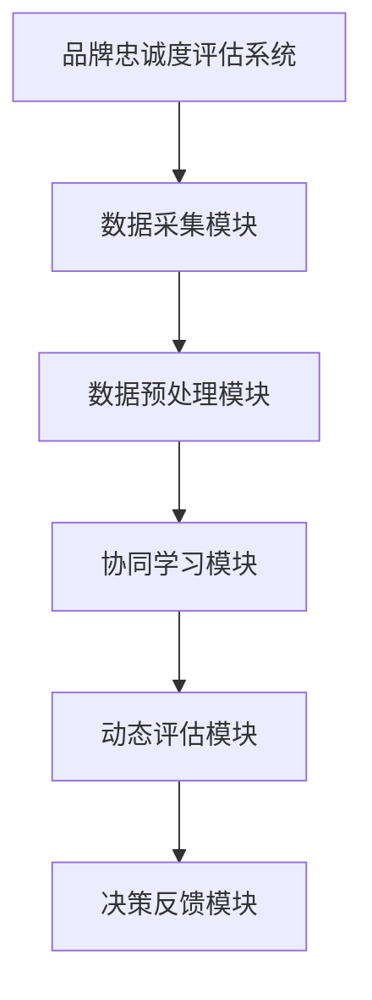
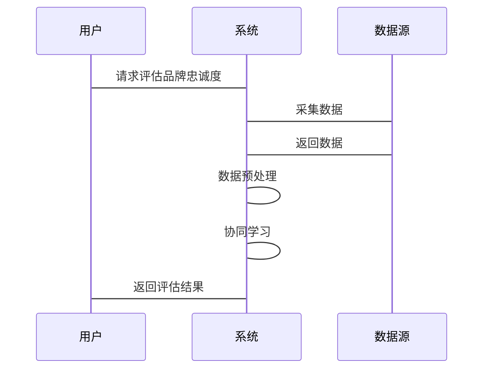

                 


# 多智能体系统在公司品牌忠诚度动态评估中的应用

> 关键词：多智能体系统，品牌忠诚度，动态评估，协同学习，数据融合，系统架构

> 摘要：本文探讨了多智能体系统在公司品牌忠诚度动态评估中的应用，从背景、核心概念、算法原理到系统架构设计、项目实战和最佳实践等方面进行了详细阐述。文章旨在通过理论与实践相结合的方式，帮助读者理解多智能体系统如何在动态评估中发挥作用，以及如何通过系统化的方法提升品牌忠诚度的评估精度和效率。

---

## 第一部分：多智能体系统与品牌忠诚度评估的背景

### 第1章：多智能体系统的定义与特点

#### 1.1 多智能体系统的定义
多智能体系统（Multi-Agent System，MAS）是由多个相互作用的智能体（Agent）组成的分布式系统。智能体是具有感知环境、自主决策和行动能力的实体，能够通过通信和协作完成复杂任务。

#### 1.2 多智能体系统的特性
- **自主性**：智能体能够自主决策，无需外部干预。
- **反应性**：能够实时感知环境变化并做出反应。
- **协作性**：多个智能体通过通信和协作完成共同目标。
- **分布性**：系统由多个独立的智能体组成，不存在单一的控制中心。

#### 1.3 多智能体系统的优缺点
- **优点**：
  - 高度灵活，适应复杂环境。
  - 分布式计算，避免单点故障。
  - 可扩展性强，适用于大规模数据处理。
- **缺点**：
  - 系统复杂性高，设计和实现难度大。
  - 智能体之间的通信和协作需要高效的机制。

---

### 第2章：品牌忠诚度评估的定义与重要性

#### 2.1 品牌忠诚度的定义
品牌忠诚度是指消费者对某一品牌长期偏好和重复购买的程度。高忠诚度的消费者通常会忽略价格波动和市场竞争，持续选择同一品牌。

#### 2.2 品牌忠诚度评估的重要性
- **帮助企业制定精准营销策略**：通过评估品牌忠诚度，企业可以更好地了解客户行为，制定个性化的营销方案。
- **提高客户满意度**：通过分析忠诚度低的客户，企业可以针对性地解决客户问题，提升整体满意度。
- **增强品牌竞争力**：高忠诚度的客户往往是品牌口碑传播的核心，能够为企业带来更多的潜在客户。

#### 2.3 品牌忠诚度评估的常见方法
- **问卷调查**：通过收集客户反馈数据进行评估。
- **购买记录分析**：通过客户的购买频率和金额变化进行评估。
- **情感分析**：通过社交媒体数据和客户评论进行情感分析，评估品牌忠诚度。

---

### 第3章：多智能体系统在品牌忠诚度评估中的应用背景

#### 3.1 品牌忠诚度评估的传统方法与局限性
传统方法通常依赖于问卷调查和购买记录分析，存在以下问题：
- **数据单一**：无法全面捕捉客户的动态行为和情感变化。
- **实时性差**：评估结果往往滞后，无法实时反映客户忠诚度的变化。
- **缺乏协同性**：不同数据源之间缺乏有效的协同分析。

#### 3.2 多智能体系统在动态评估中的优势
- **实时性**：多智能体系统能够实时感知客户行为和情感变化，快速进行评估。
- **数据融合**：通过多个智能体的协同工作，实现多源数据的融合分析，提高评估的准确性。
- **动态适应性**：系统能够根据环境变化自适应调整评估策略，提升动态评估的灵活性。

#### 3.3 应用场景与实际需求
- **实时监测**：企业需要实时监测客户忠诚度变化，及时应对市场波动。
- **精准营销**：通过动态评估结果，制定个性化的营销策略。
- **风险管理**：识别忠诚度下降的客户，提前采取措施降低客户流失率。

---

## 第二部分：多智能体系统与品牌忠诚度评估的核心概念

### 第4章：多智能体系统与品牌忠诚度评估的核心概念

#### 4.1 多智能体系统的组成与功能
- **智能体**：负责收集、分析和传递数据。
- **通信模块**：实现智能体之间的数据交换和协作。
- **决策模块**：基于多源数据，生成评估结果和决策建议。

#### 4.2 品牌忠诚度评估的核心要素
- **消费者行为分析**：分析客户的购买记录、浏览行为等数据。
- **品牌认知与情感分析**：通过社交媒体数据，分析客户对品牌的看法和情感。
- **动态变化分析**：实时监测客户忠诚度的变化趋势。

#### 4.3 多智能体系统与品牌忠诚度评估的关联
- **数据协同**：多个智能体协同工作，实现多源数据的融合分析。
- **动态评估**：通过智能体的实时感知和协作，实现品牌忠诚度的动态评估。
- **结果反馈**：评估结果反哺智能体，优化后续分析过程。

---

### 第5章：多智能体系统在品牌忠诚度评估中的算法原理

#### 5.1 多智能体协同学习算法
- **协同学习**：多个智能体通过共享知识和经验，共同完成学习任务。
- **实现步骤**：
  1. 数据采集：智能体从不同数据源采集客户行为数据。
  2. 数据预处理：对采集的数据进行清洗和标准化处理。
  3. 协同学习：智能体通过通信模块共享数据，共同训练模型。
  4. 模型优化：通过迭代优化，提升模型的准确性和鲁棒性。

#### 5.2 品牌忠诚度动态评估的算法
- **动态评估模型**：基于时间序列分析和机器学习算法，实现品牌忠诚度的动态预测。
- **实现步骤**：
  1. 数据采集：收集客户的购买记录、浏览行为和社交媒体评论。
  2. 数据预处理：对数据进行清洗和特征提取。
  3. 模型训练：使用时间序列算法（如ARIMA）和机器学习算法（如随机森林）进行训练。
  4. 模型预测：基于训练好的模型，预测未来的品牌忠诚度变化。

#### 5.3 数据融合与决策算法
- **数据融合**：将多源数据进行融合，消除冗余和矛盾，提升数据的准确性和一致性。
- **决策算法**：
  1. 数据融合：通过加权融合和规则融合，实现多源数据的综合分析。
  2. 决策生成：基于融合后的数据，生成品牌忠诚度评估结果和决策建议。

---

### 第6章：数学模型与公式

#### 6.1 协同学习的数学模型
$$ y = f(x_1, x_2, \ldots, x_n) $$
其中，$y$ 是模型的输出，$x_i$ 是输入特征。

#### 6.2 动态评估的数学模型
$$ L(t) = \alpha L(t-1) + (1-\alpha)y(t) $$
其中，$L(t)$ 表示第 $t$ 时刻的忠诚度评估值，$\alpha$ 是衰减因子，$y(t)$ 是当前时刻的输入值。

#### 6.3 数据融合的数学公式
$$ F = \sum_{i=1}^{n} w_i x_i $$
其中，$F$ 是融合后的结果，$w_i$ 是第 $i$ 个数据源的权重，$x_i$ 是第 $i$ 个数据源的输入值。

---

## 第三部分：多智能体系统与品牌忠诚度评估的系统架构设计

### 第7章：系统功能设计

#### 7.1 功能模块划分
- **数据采集模块**：负责从多源数据源采集客户行为数据。
- **数据预处理模块**：对数据进行清洗和标准化处理。
- **协同学习模块**：实现多智能体的协同学习和模型训练。
- **动态评估模块**：基于协同学习的结果，生成品牌忠诚度的动态评估。
- **决策反馈模块**：将评估结果反哺智能体，优化后续分析过程。

#### 7.2 功能流程
1. 数据采集：智能体从不同的数据源（如数据库、API接口）采集客户行为数据。
2. 数据预处理：对采集的数据进行清洗和特征提取。
3. 协同学习：智能体通过通信模块共享数据，共同训练模型。
4. 动态评估：基于训练好的模型，预测未来的品牌忠诚度变化。
5. 决策反馈：评估结果反哺智能体，优化后续分析过程。

---

### 第8章：系统架构设计

#### 8.1 系统架构图


#### 8.2 系统接口设计
- **数据采集接口**：提供API接口，实现与数据源的对接。
- **协同学习接口**：实现智能体之间的通信和数据共享。
- **动态评估接口**：提供动态评估结果的查询和输出。

#### 8.3 系统交互流程图


---

## 第四部分：项目实战与最佳实践

### 第9章：项目实战

#### 9.1 环境安装
- **安装Python**：推荐使用Python 3.8及以上版本。
- **安装依赖库**：安装numpy、pandas、scikit-learn等第三方库。

#### 9.2 核心代码实现

```python
import numpy as np
import pandas as pd
from sklearn.ensemble import RandomForestClassifier
from sklearn.metrics import accuracy_score

# 数据采集模块
def collect_data():
    # 示例数据：客户购买记录
    data = pd.DataFrame({
        '客户ID': [1, 2, 3, 4, 5],
        '购买次数': [3, 5, 2, 4, 6],
        '购买金额': [100, 200, 80, 150, 300]
    })
    return data

# 数据预处理模块
def preprocess_data(data):
    # 特征提取
    features = data[['购买次数', '购买金额']]
    return features

# 协同学习模块
def collaborative_learning(features):
    # 训练随机森林模型
    model = RandomForestClassifier()
    model.fit(features, [1, 1, 0, 1, 1])
    return model

# 动态评估模块
def dynamic_assessment(model, new_features):
    # 预测品牌忠诚度
    prediction = model.predict(new_features)
    return prediction

# 决策反馈模块
def decision_feedback(prediction):
    # 反馈结果
    return prediction
```

#### 9.3 案例分析
假设我们有一个客户的数据集，如下：
| 客户ID | 购买次数 | 购买金额 |
|-------|----------|----------|
| 1     | 3        | 100      |
| 2     | 5        | 200      |
| 3     | 2        | 80       |
| 4     | 4        | 150      |
| 5     | 6        | 300      |

通过上述代码，我们可以实现品牌忠诚度的动态评估，并预测未来的忠诚度变化。

---

### 第10章：最佳实践

#### 10.1 小结
本文详细探讨了多智能体系统在公司品牌忠诚度动态评估中的应用，从理论到实践，全面阐述了系统的构建和实现过程。

#### 10.2 注意事项
- 数据质量是评估结果的关键，需确保数据的准确性和完整性。
- 智能体之间的通信和协作需要高效的机制，避免数据冗余和通信延迟。
- 动态评估模型需要根据实际情况进行调优，确保模型的准确性和实时性。

#### 10.3 拓展阅读
- 《Multi-Agent Systems: Complexity and Cognitive Models》
- 《Dynamic Brand Loyalty Analysis Using Machine Learning》

---

## 作者：AI天才研究院/AI Genius Institute & 禅与计算机程序设计艺术 /Zen And The Art of Computer Programming

