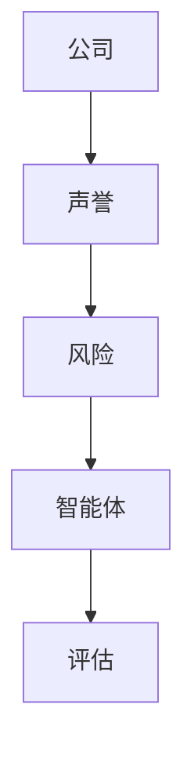
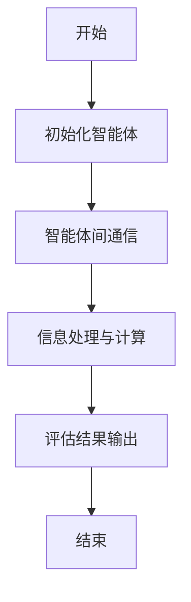
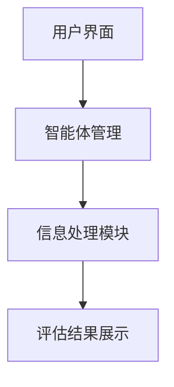
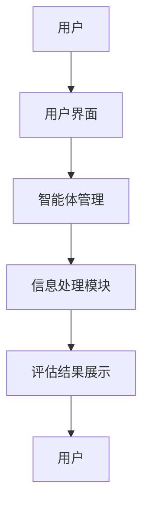

                 


# 多智能体系统在公司声誉风险评估中的应用

## 关键词：多智能体系统、声誉风险评估、公司声誉、风险管理、人工智能

## 摘要：本文探讨了多智能体系统在公司声誉风险评估中的应用，分析了声誉风险评估的核心概念，详细介绍了基于多智能体系统的声誉评估算法，并通过实际案例展示了系统的架构设计和实现过程。文章旨在为公司声誉风险管理提供一种创新的方法论，帮助企业在复杂的商业环境中更好地应对声誉风险。

---

## 第一部分: 多智能体系统与公司声誉风险评估的背景

### 第1章: 多智能体系统与声誉风险评估概述

#### 1.1 多智能体系统的定义与特点
##### 1.1.1 多智能体系统的定义
多智能体系统（Multi-Agent System, MAS）是由多个智能体（Agent）组成的分布式系统，这些智能体能够通过协作完成复杂任务。每个智能体都有一定的自主性，能够感知环境、做出决策并采取行动。

##### 1.1.2 多智能体系统的核心特点
- **自主性**：智能体能够自主决策。
- **反应性**：智能体能够实时感知环境并做出反应。
- **协作性**：多个智能体能够通过通信和协作完成任务。
- **分布性**：智能体分布在不同的位置，通过网络进行通信。

##### 1.1.3 多智能体系统与传统单智能体系统的区别
| 特性       | 单智能体系统                | 多智能体系统                |
|------------|-----------------------------|-----------------------------|
| 结构       | 单点结构                   | 分布式结构                   |
| 通信       | 无                         | 智能体间通信                 |
| 协作       | 无                         | 智能体协作完成任务           |
| 灵活性     | 低                         | 高                         |

#### 1.2 公司声誉风险的定义与重要性
##### 1.2.1 公司声誉的定义
公司声誉是指公司在市场、客户、员工和社会公众中的形象和信任度。良好的声誉能够提升公司的市场地位和竞争力。

##### 1.2.2 声誉风险的定义与分类
- **声誉风险**：由于公司行为或外部事件导致声誉受损的风险。
- **分类**：包括市场风险、运营风险、声誉危机等。

##### 1.2.3 声誉风险对公司的影响
- **直接影响**：影响公司股价、客户信任度和市场地位。
- **间接影响**：可能引发连锁反应，影响供应链和合作伙伴关系。

#### 1.3 多智能体系统在声誉风险评估中的应用背景
##### 1.3.1 声誉风险评估的传统方法与局限性
传统声誉风险评估方法通常依赖于人工分析，存在效率低、覆盖面窄、实时性差等问题。

##### 1.3.2 多智能体系统的优势与潜力
- **优势**：能够实时监测和分析海量数据，快速响应声誉风险。
- **潜力**：通过智能体协作，实现对声誉风险的全面、精准评估。

##### 1.3.3 当前研究现状与发展趋势
目前，多智能体系统在声誉风险评估中的应用仍处于探索阶段，但随着人工智能技术的发展，其应用潜力巨大。

#### 1.4 本章小结
本章介绍了多智能体系统的定义、特点以及公司在声誉风险评估中的应用背景，为后续内容奠定了基础。

---

### 第2章: 多智能体系统与声誉风险评估的核心概念

#### 2.1 多智能体系统的组成与功能
##### 2.1.1 智能体的定义与角色
智能体是具有感知、决策和行动能力的实体。在声誉风险评估中，智能体可以扮演数据采集、分析和预警的角色。

##### 2.1.2 多智能体系统的组成结构
多智能体系统通常包括以下组成部分：
- **智能体**：负责具体任务的执行。
- **通信层**：负责智能体之间的信息传递。
- **协调层**：负责智能体之间的协作与协调。

##### 2.1.3 智能体之间的通信与协作
智能体之间的通信可以通过消息传递、共享数据库等方式实现。协作可以通过任务分配、协同决策等方式完成。

#### 2.2 声誉风险评估的多智能体模型
##### 2.2.1 声誉风险评估的指标体系
- **指标**：包括产品质量、客户满意度、媒体报道等。
- **权重**：不同指标的重要性可以通过权重来体现。

##### 2.2.2 多智能体系统的声誉评估模型
声誉评估模型可以通过多个智能体协作完成，每个智能体负责不同的评估任务。

##### 2.2.3 模型的输入与输出
- **输入**：包括公司运营数据、媒体报道、客户反馈等。
- **输出**：包括声誉风险评分、风险预警等。

#### 2.3 多智能体系统与声誉风险评估的实体关系图


#### 2.4 本章小结
本章详细介绍了多智能体系统在声誉风险评估中的核心概念和模型，为后续的算法设计奠定了基础。

---

### 第3章: 多智能体系统在声誉风险评估中的算法原理

#### 3.1 基于多智能体的声誉评估算法
##### 3.1.1 算法的总体流程
- **步骤1**：智能体收集相关数据。
- **步骤2**：智能体对数据进行分析和处理。
- **步骤3**：智能体之间协作，生成最终的声誉评分。

##### 3.1.2 智能体之间的信息传递与处理
智能体之间的信息传递可以通过消息队列或共享数据库实现。

##### 3.1.3 算法的收敛性与稳定性分析
算法需要在有限的迭代次数内收敛到稳定的结果。

#### 3.2 声誉评估模型的数学公式
##### 3.2.1 基于概率的声誉评估公式
$$P(r_i) = \frac{1}{1 + e^{-x_i}}$$
其中，$x_i$ 表示第 $i$ 个指标的评分。

##### 3.2.2 基于加权的声誉评估公式
$$R = \sum_{i=1}^{n} w_i x_i$$
其中，$w_i$ 表示第 $i$ 个指标的权重，$x_i$ 表示评分。

#### 3.3 算法流程图


#### 3.4 本章小结
本章详细介绍了多智能体系统在声誉风险评估中的算法原理，为系统的实现提供了理论基础。

---

### 第4章: 系统架构与设计

#### 4.1 系统功能需求分析
##### 4.1.1 系统目标与范围
系统的目标是通过多智能体协作，实现对公司声誉风险的实时监测和评估。

##### 4.1.2 系统功能模块划分
- **数据采集模块**：负责收集公司运营数据和外部信息。
- **智能体协作模块**：负责智能体之间的通信和协作。
- **评估模块**：负责声誉风险的计算和评估。

##### 4.1.3 系统的输入与输出
- **输入**：包括公司运营数据、媒体报道等。
- **输出**：包括声誉风险评分、风险预警等。

#### 4.2 系统架构设计
##### 4.2.1 系统架构图


##### 4.2.2 系统架构的详细描述
系统架构采用分层设计，包括数据采集层、智能体协作层和用户界面层。

#### 4.3 系统接口设计
##### 4.3.1 智能体间的通信接口
智能体之间的通信可以通过API接口实现。

##### 4.3.2 系统与外部数据源的接口
系统需要与公司内部数据库和外部数据源（如新闻网站）进行对接。

##### 4.3.3 系统与用户界面的接口
用户界面需要展示评估结果，并允许用户进行交互操作。

#### 4.4 系统交互流程图


#### 4.5 本章小结
本章详细介绍了系统的架构设计和接口设计，为系统的实现提供了指导。

---

## 第五章: 项目实战与案例分析

### 第5章: 项目实战
#### 5.1 环境安装
- **安装Python**：需要安装Python 3.8及以上版本。
- **安装依赖库**：包括numpy、pandas、matplotlib等。

#### 5.2 系统核心实现源代码
##### 5.2.1 数据采集模块
```python
import requests
from bs4 import BeautifulSoup

def fetch_data(url):
    response = requests.get(url)
    soup = BeautifulSoup(response.text, 'html.parser')
    return soup
```

##### 5.2.2 智能体协作模块
```python
class Agent:
    def __init__(self, id):
        self.id = id
        self.data = {}

    def send_message(self, message, recipient):
        recipient.data = message

    def receive_message(self):
        return self.data
```

##### 5.2.3 评估模块
```python
def calculate_reputation(agents):
    reputation = 0
    for agent in agents:
        reputation += agent.data['score']
    return reputation / len(agents)
```

#### 5.3 代码应用解读与分析
- **数据采集模块**：用于从指定URL获取数据。
- **智能体协作模块**：定义了智能体的通信接口。
- **评估模块**：计算公司声誉的综合评分。

#### 5.4 案例分析
##### 5.4.1 案例背景
某公司面临产品质量问题，可能导致声誉受损。

##### 5.4.2 案例分析过程
- **数据采集**：收集客户反馈和媒体报道。
- **智能体协作**：多个智能体协作分析数据。
- **评估结果**：计算出声誉风险评分为70分（满分100分）。

##### 5.4.3 结果解读
评分为70分，表示公司声誉存在较高风险，需要采取措施进行改进。

#### 5.5 本章小结
本章通过实际案例展示了系统的实现过程和应用效果。

---

## 第六章: 最佳实践、小结与展望

### 6.1 最佳实践
- **数据质量**：确保数据的准确性和完整性。
- **智能体协作**：合理设计智能体的通信和协作机制。
- **系统优化**：定期优化系统架构和算法。

### 6.2 本章小结
本文详细探讨了多智能体系统在公司声誉风险评估中的应用，分析了系统的架构设计和实现过程，并通过实际案例展示了系统的应用效果。

### 6.3 未来展望
随着人工智能技术的不断发展，多智能体系统在声誉风险评估中的应用将更加广泛和深入。未来的研究方向可以包括智能体的自适应能力、系统的实时性优化等方面。

---

## 作者：AI天才研究院/AI Genius Institute & 禅与计算机程序设计艺术 /Zen And The Art of Computer Programming

---

**注**：以上目录大纲为示例，具体内容需根据实际需求进一步扩展和完善。

