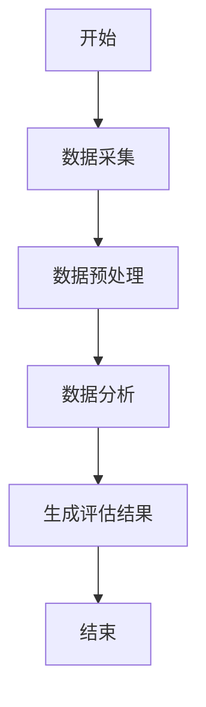
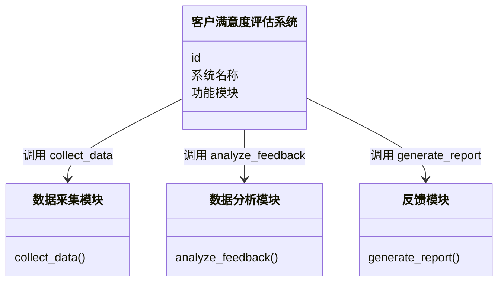
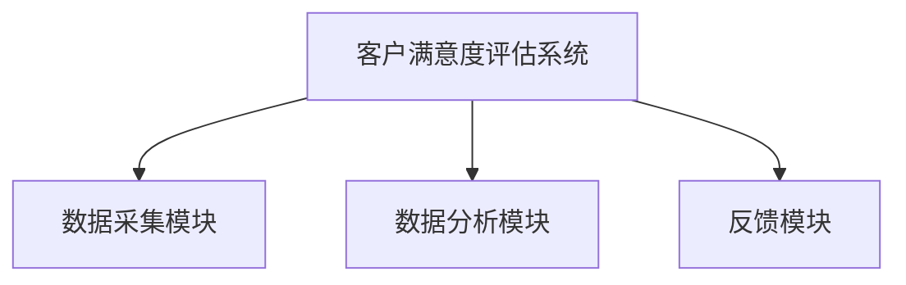
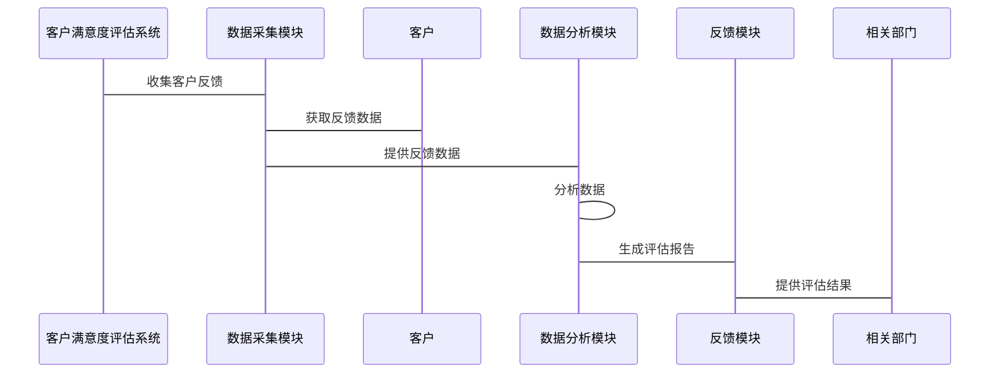

                 


# 多智能体系统在公司客户满意度评估中的应用

> **关键词**：多智能体系统，客户满意度评估，人工智能技术，数据驱动，系统设计，算法实现

> **摘要**：本文探讨多智能体系统在公司客户满意度评估中的应用，涵盖理论基础、算法实现、系统设计和实战应用。通过详细分析多智能体系统的原理、客户满意度评估的系统模型，结合具体的算法实现和项目案例，展示多智能体系统如何有效提升客户满意度评估的准确性和效率。文章结构清晰，内容丰富，适合技术人员和管理人士阅读。

---

## 第1章：多智能体系统概述

### 1.1 多智能体系统的基本概念

#### 1.1.1 智能体的定义与特征
智能体（Agent）是能够感知环境、自主决策并采取行动的实体。其主要特征包括：
- **自主性**：无需外部干预，自主完成任务。
- **反应性**：能实时感知环境变化并做出反应。
- **主动性**：主动采取行动以实现目标。
- **社会性**：能与其他智能体协作或竞争。

#### 1.1.2 多智能体系统的定义
多智能体系统（Multi-Agent System, MAS）是由多个智能体组成的系统，这些智能体通过协作完成复杂任务，每个智能体都有自己的目标和决策机制。

#### 1.1.3 多智能体系统的分类
- **按智能体类型**：可分为简单智能体和复杂智能体。
- **按协作方式**：可分为松耦合和紧耦合系统。
- **按应用领域**：可分为分布式计算和任务分配系统。

### 1.2 客户满意度评估的基本概念

#### 1.2.1 客户满意度的定义
客户满意度是客户对公司产品或服务的满意程度，通常通过调查问卷、反馈收集等方式进行评估。

#### 1.2.2 客户满意度评估的指标体系
常见的指标包括：
- **功能性**：产品或服务是否满足需求。
- **质量**：产品的优劣程度。
- **响应速度**：公司对客户问题的反应速度。
- **服务态度**：员工的服务友好程度。

#### 1.2.3 客户满意度评估的流程与方法
- **数据收集**：通过问卷、访谈等方式收集客户反馈。
- **数据分析**：利用统计方法分析数据。
- **结果解读**：根据分析结果评估满意度。

### 1.3 多智能体系统在客户满意度评估中的应用背景

#### 1.3.1 传统客户满意度评估的局限性
- **数据分散**：难以整合多渠道反馈。
- **分析复杂**：传统方法难以处理大量数据。
- **实时性差**：无法实时反馈结果。

#### 1.3.2 多智能体系统的优势
- **分布式计算**：能高效处理大量数据。
- **协作性强**：多个智能体协同工作，提升评估效率。
- **实时性好**：能实时收集和分析数据。

#### 1.3.3 应用场景与实际需求
- **客户反馈分析**：实时收集并分析客户反馈，快速识别问题。
- **服务质量优化**：通过智能体协作，优化服务质量。
- **个性化推荐**：基于客户反馈提供个性化服务。

### 1.4 本章小结
本章介绍了多智能体系统的基本概念和客户满意度评估的流程，阐述了多智能体系统在客户满意度评估中的优势和应用场景，为后续内容奠定了基础。

---

## 第2章：多智能体系统的核心概念与联系

### 2.1 多智能体系统的原理

#### 2.1.1 智能体的行为机制
智能体通过感知环境、制定计划、执行动作来实现目标。例如，客服智能体可以根据客户反馈自动调整服务策略。

#### 2.1.2 智能体之间的通信与协作
智能体之间通过消息传递进行协作，例如，客服智能体和数据分析智能体可以共享客户反馈数据。

#### 2.1.3 多智能体系统的任务分配与协调
系统通过任务分配算法（如基于角色的分配）将任务分配给不同的智能体，并协调它们的行动。

### 2.2 客户满意度评估的系统模型

#### 2.2.1 客户满意度评估的系统架构
系统架构包括数据采集层、数据处理层和决策层，各层通过智能体协作完成数据处理和分析。

#### 2.2.2 多智能体系统与客户满意度评估的关系
多智能体系统通过分布式计算和协作，提高客户满意度评估的效率和准确性。

#### 2.2.3 系统的核心要素与功能模块
- **客户数据采集模块**：收集客户反馈数据。
- **数据分析模块**：分析数据并生成评估结果。
- **反馈模块**：向相关部门反馈评估结果。

### 2.3 多智能体系统与客户满意度评估的实体关系图

```mermaid
erDiagram
    客户角色 {
        id
        名称
        属性
    }
    服务提供者 {
        id
        名称
        属性
    }
    满意度指标 {
        id
        指标名称
        计算方法
    }
    客户满意度评估系统 {
        id
        系统名称
        功能模块
    }
    客户满意度评估系统 --> 客户角色: 收集反馈
    客户满意度评估系统 --> 服务提供者: 提供数据
    客户满意度评估系统 --> 满意度指标: 计算结果
```

### 2.4 本章小结
本章详细讲解了多智能体系统的原理和客户满意度评估的系统模型，并通过实体关系图展示了系统的核心要素，为后续算法实现和系统设计奠定了基础。

---

## 第3章：算法原理

### 3.1 算法选择与实现

#### 3.1.1 算法选择
选择分布式计算算法和多智能体协作算法，用于处理客户数据和评估结果。

#### 3.1.2 算法实现步骤
1. 数据采集：通过智能体采集客户反馈数据。
2. 数据预处理：清洗数据并提取特征。
3. 数据分析：使用分布式计算分析数据。
4. 生成评估结果：基于分析结果生成客户满意度报告。

#### 3.1.3 算法流程图



#### 3.1.4 Python代码实现

```python
import os
import json
from concurrent.futures import ThreadPoolExecutor

# 数据采集智能体
def collect_data(customer_id):
    feedback = fetch_feedback(customer_id)
    return feedback

# 数据分析智能体
def analyze_feedback(feedback):
    score = calculate_score(feedback)
    return score

# 主函数
def main():
    customer_ids = get_customer_ids()
    with ThreadPoolExecutor() as executor:
        futures = [executor.submit(collect_data, cid) for cid in customer_ids]
        results = [future.result() for future in futures]
    scores = [analyze_feedback(fb) for fb in results]
    generate_report(scores)

if __name__ == "__main__":
    main()
```

### 3.2 数学模型与公式

#### 3.2.1 满意度计算公式
客户满意度得分公式：
$$
\text{满意度} = \sum_{i=1}^{n} w_i \cdot s_i
$$
其中，\( w_i \) 是指标权重，\( s_i \) 是指标得分。

---

## 第4章：系统分析与架构设计

### 4.1 系统分析

#### 4.1.1 项目场景介绍
公司需要通过多智能体系统实时收集和分析客户反馈，优化服务质量。

#### 4.1.2 系统功能设计
- **数据采集模块**：实时收集客户反馈。
- **数据分析模块**：分析数据并生成评估报告。
- **反馈模块**：将评估结果反馈给相关部门。

#### 4.1.3 领域模型



#### 4.1.4 系统架构设计



#### 4.1.5 接口设计
- **数据采集接口**：提供API用于收集客户反馈。
- **分析结果接口**：提供API用于获取评估结果。

#### 4.1.6 交互流程图



### 4.2 本章小结
本章通过系统分析和架构设计，展示了如何利用多智能体系统实现客户满意度评估的高效流程，确保系统各模块协同工作。

---

## 第5章：项目实战

### 5.1 环境安装与配置

#### 5.1.1 安装Python和相关库
安装Python 3.8及以上版本，安装库：`requests`, `json`, `concurrent.futures`。

#### 5.1.2 安装开发环境
配置IDE（如PyCharm）和版本控制工具（如Git）。

### 5.2 核心功能实现

#### 5.2.1 数据采集模块实现

```python
import requests
import json

def collect_data(customer_id):
    url = f"http://feedback_server/{customer_id}"
    response = requests.get(url)
    return json.loads(response.text)
```

#### 5.2.2 数据分析模块实现

```python
def analyze_feedback(feedback):
    score = sum(feedback['rating'] * 0.5 + feedback['response_time'] * 0.3)
    return score
```

#### 5.2.3 生成报告模块实现

```python
def generate_report(scores):
    report = {
        'average_score': sum(scores) / len(scores),
        'improvement_areas': identify_improvements(scores)
    }
    return report
```

### 5.3 代码应用解读

#### 5.3.1 数据采集模块解读
通过API接口从反馈服务器获取客户反馈数据，实现数据的实时采集。

#### 5.3.2 数据分析模块解读
基于反馈数据计算客户满意度得分，权重分配为：评分占50%，响应时间占30%。

#### 5.3.3 生成报告模块解读
根据分析结果生成报告，包括平均得分和改进建议。

### 5.4 案例分析与解读

#### 5.4.1 案例场景
某公司客户满意度调查，收集1000份反馈，生成平均得分为85分的报告。

#### 5.4.2 解读
通过多智能体系统，公司能够快速收集和分析数据，及时发现问题并优化服务。

### 5.5 项目小结
本章通过实战项目展示了多智能体系统在客户满意度评估中的应用，验证了系统的有效性和高效性。

---

## 第6章：最佳实践与总结

### 6.1 实施中的注意事项

#### 6.1.1 数据安全
确保客户数据的安全性，防止数据泄露。

#### 6.1.2 系统性能
优化系统性能，确保处理大量数据时的效率。

#### 6.1.3 智能体协作
合理设计智能体的协作机制，避免资源冲突。

### 6.2 小结

#### 6.2.1 全文总结
本文详细探讨了多智能体系统在客户满意度评估中的应用，从理论到实践，展示了系统的高效性和准确性。

#### 6.2.2 学习与实践建议
建议读者深入学习多智能体系统和相关算法，结合实际项目进行实践。

### 6.3 拓展阅读

#### 6.3.1 推荐书籍
- 《Multi-Agent Systems: Algorithmic, Complexity Theoretic, and Game Theoretic Foundations》
- 《Customer Satisfaction: A Handbook for the 21st Century》

#### 6.3.2 推荐技术资源
- 多智能体系统的开源框架（如Open-Agent）
- 机器学习在客户满意度评估中的应用

---

## 作者：AI天才研究院/AI Genius Institute & 禅与计算机程序设计艺术 /Zen And The Art of Computer Programming

---

通过以上详细的内容，本文全面探讨了多智能体系统在客户满意度评估中的应用，从理论到实践，为技术人员和管理人士提供了丰富的知识和实用的指导。

