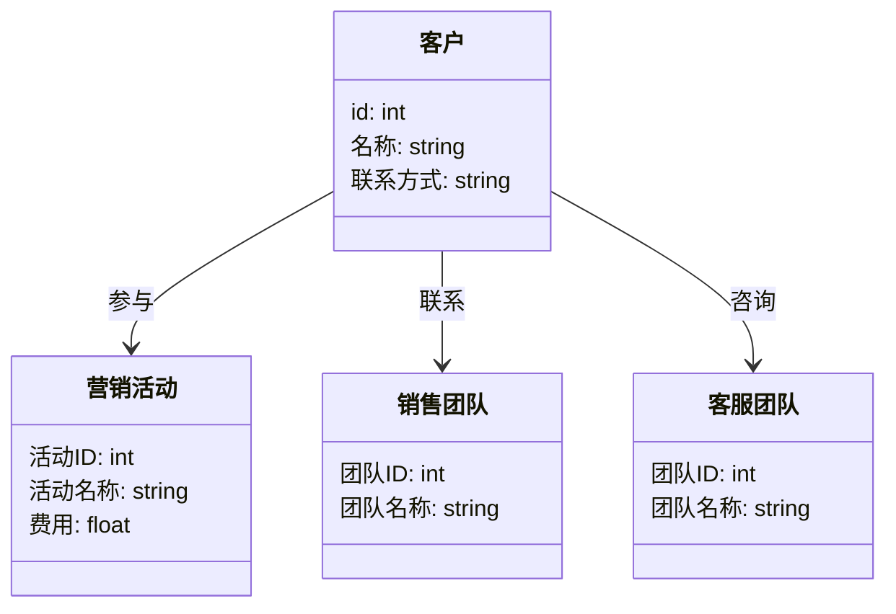
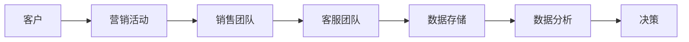
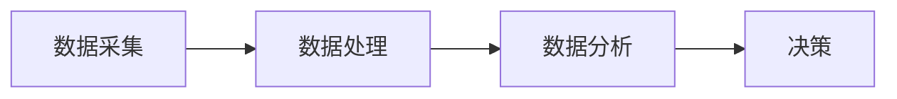

                 


# 多智能体系统在公司客户获取成本评估中的应用

> 关键词：多智能体系统，客户获取成本，成本评估，分布式系统，一致性算法，系统架构

> 摘要：本文探讨了多智能体系统在公司客户获取成本评估中的应用。通过详细分析多智能体系统的概念、算法原理和系统架构，结合实际案例，展示了如何利用多智能体系统优化客户获取成本评估过程。文章还提供了系统设计和实现的详细步骤，帮助读者理解并应用相关技术。

---

## 第1章: 多智能体系统概述

### 1.1 多智能体系统的基本概念

#### 1.1.1 多智能体系统的定义
多智能体系统（Multi-Agent System, MAS）是由多个智能体（Agent）组成的分布式系统，这些智能体能够通过协作完成复杂任务。智能体是具有感知、决策和行动能力的实体，可以是软件程序或物理设备。

#### 1.1.2 多智能体系统的特点
- **分布性**：智能体独立运行，通过通信协作完成任务。
- **自主性**：每个智能体具有自主决策能力。
- **协作性**：智能体之间通过协作提高整体性能。
- **动态性**：系统环境和智能体状态动态变化。

#### 1.1.3 多智能体系统与单智能体系统的区别
| 特性 | 单智能体系统 | 多智能体系统 |
|------|--------------|--------------|
| 结构  | 单一中心     | 分布式       |
| 决策  | 集中控制     | 分布式决策   |
| 性能  | 可扩展性差   | 高可扩展性   |

### 1.2 客户获取成本评估的基本概念

#### 1.2.1 客户获取成本的定义
客户获取成本（Customer Acquisition Cost, CAC）是指公司吸引一位新客户所花费的总成本，包括营销、销售和客服等费用。

#### 1.2.2 客户获取成本评估的重要性
- **优化预算分配**：通过评估，企业可以更有效地分配资源。
- **提高 ROI**：降低CAC可以提高投资回报率。
- **市场策略调整**：根据评估结果调整营销策略。

#### 1.2.3 客户获取成本评估的挑战
- **数据复杂性**：涉及多个部门的数据。
- **动态变化**：市场环境不断变化。
- **数据孤岛**：各部门数据分散，难以整合。

---

## 第2章: 多智能体系统的核心概念与联系

### 2.1 多智能体系统的组成部分

#### 2.1.1 智能体的定义与属性
- **智能体**：能够感知环境、做出决策并采取行动的实体。
- **属性**：
  - 知识表示：智能体的知识表示方式。
  - 感知能力：获取环境信息的能力。
  - 决策能力：基于信息做出决策的能力。

#### 2.1.2 智能体之间的关系
- **协作关系**：智能体之间通过协作完成共同目标。
- **竞争关系**：智能体之间可能存在竞争，但最终目标一致。

#### 2.1.3 系统整体架构
- **层次结构**：由多个智能体组成的分层架构。
- **通信机制**：智能体之间通过通信机制协作。

#### 2.1.4 实体关系图
```mermaid
er
actor 客户;
actor 营销团队;
actor 销售团队;
actor 客服团队;
```

### 2.2 多智能体系统与客户获取成本评估的关系

#### 2.2.1 多智能体系统在客户获取成本评估中的作用
- **数据整合**：通过多智能体系统整合各部门数据。
- **协作优化**：通过协作降低数据处理成本。
- **动态调整**：实时调整营销策略。

#### 2.2.2 多智能体系统如何优化客户获取成本
- **数据共享**：智能体之间共享数据，减少重复计算。
- **协作决策**：通过协作决策优化资源配置。
- **实时反馈**：实时反馈市场变化，快速调整策略。

#### 2.2.3 多智能体系统与客户获取成本评估的结合点
- **数据采集**：智能体实时采集客户数据。
- **数据分析**：智能体协作分析数据。
- **决策制定**：智能体基于分析结果制定策略。

---

## 第3章: 多智能体系统在客户获取成本评估中的算法原理

### 3.1 多智能体系统中的算法概述

#### 3.1.1 分布式算法
- **一致性算法**：确保系统中各智能体的状态一致。
- **分布式优化算法**：在分布式系统中优化资源分配。

#### 3.1.2 协作算法
- **协商算法**：智能体之间通过协商达成一致。
- **任务分配算法**：智能体之间协作分配任务。

#### 3.1.3 一致性算法
- **一致性算法的数学模型**
  $$ \text{一致性算法} = \sum_{i=1}^{n} \text{智能体}_i \text{的状态} $$
- **一致性算法的实现步骤**
  1. 初始化各智能体的状态。
  2. 智能体之间进行通信，交换状态信息。
  3. 各智能体根据通信结果更新自身状态。
  4. 重复步骤2和3，直到所有智能体状态一致。

#### 3.1.4 一致性算法的优缺点
- **优点**：确保系统一致性，提高系统可靠性。
- **缺点**：通信开销大，可能影响系统性能。

### 3.2 一致性算法的详细讲解

#### 3.2.1 一致性算法的数学模型
$$ \text{一致性算法} = \sum_{i=1}^{n} \text{智能体}_i \text{的状态} $$

#### 3.2.2 一致性算法的实现步骤
1. 初始化各智能体的状态。
2. 智能体之间进行通信，交换状态信息。
3. 各智能体根据通信结果更新自身状态。
4. 重复步骤2和3，直到所有智能体状态一致。

#### 3.2.3 一致性算法的优缺点
- **优点**：确保系统一致性，提高系统可靠性。
- **缺点**：通信开销大，可能影响系统性能。

---

## 第4章: 多智能体系统在客户获取成本评估中的系统分析与架构设计

### 4.1 问题场景介绍

#### 4.1.1 客户获取成本评估的典型场景
- **数据来源分散**：客户数据分散在不同部门。
- **数据处理复杂**：需要整合和分析大量数据。
- **实时性要求高**：需要实时调整营销策略。

### 4.2 系统功能设计

#### 4.2.1 领域模型设计


#### 4.2.2 功能模块划分
- **数据采集模块**：采集客户数据。
- **数据分析模块**：分析数据，计算CAC。
- **决策模块**：根据分析结果制定策略。

#### 4.2.3 数据流设计


### 4.3 系统架构设计

#### 4.3.1 分层架构设计
- **数据采集层**：负责数据采集。
- **数据处理层**：对数据进行处理和分析。
- **决策层**：基于分析结果制定决策。

#### 4.3.2 组件间交互设计


#### 4.3.3 系统扩展性设计
- **模块化设计**：各模块独立，便于扩展。
- **异构架构**：支持多种硬件和软件平台。

---

## 第5章: 多智能体系统在客户获取成本评估中的项目实战

### 5.1 环境安装与配置

#### 5.1.1 开发环境搭建
- **操作系统**：Linux/Windows/MacOS
- **编程语言**：Python
- **开发工具**：PyCharm/VSCode

#### 5.1.2 依赖库安装
- **Python库**：numpy, pandas, matplotlib
- **安装命令**：`pip install numpy pandas matplotlib`

#### 5.1.3 系统配置
- **配置文件**：设置数据库连接信息。
- **环境变量**：设置相关路径。

### 5.2 系统核心实现

#### 5.2.1 多智能体系统实现
- **智能体类**：定义智能体的基本功能。
  ```python
  class Agent:
      def __init__(self, id):
          self.id = id
          self.state = 0
      def get_state(self):
          return self.state
      def set_state(self, state):
          self.state = state
  ```

#### 5.2.2 客户获取成本评估算法实现
- **一致性算法实现**
  ```python
  def consistency_algorithm(agents):
      while True:
          for agent in agents:
              neighbor = agents[(agents.index(agent) + 1) % len(agents)]
              agent.set_state(neighbor.get_state())
          if all(a.get_state() == agents[0].get_state() for a in agents):
              break
  ```

#### 5.2.3 系统接口设计
- **API接口**：提供数据采集、分析和决策接口。
- **RESTful API**：使用Flask框架实现。

### 5.3 实际案例分析

#### 5.3.1 案例背景介绍
- **公司A**：希望通过多智能体系统优化客户获取成本。

#### 5.3.2 系统实现过程
1. 数据采集：从各部门获取客户数据。
2. 数据分析：计算CAC，识别优化点。
3. 决策制定：根据分析结果调整营销策略。

#### 5.3.3 项目总结
- **成果**：CAC降低10%，营销预算优化。
- **经验**：多智能体系统在数据整合和协作优化方面优势明显。

---

## 第6章: 最佳实践与小结

### 6.1 最佳实践

#### 6.1.1 数据质量管理
- 确保数据准确性和完整性。
- 定期更新和维护数据。

#### 6.1.2 系统维护
- 定期检查系统性能。
- 及时修复漏洞和优化系统。

#### 6.1.3 团队协作
- 加强各部门之间的协作。
- 提高团队成员的技术能力。

### 6.2 小结

#### 6.2.1 核心内容回顾
- 多智能体系统的概念和特点。
- 客户获取成本评估的重要性。
- 多智能体系统在成本评估中的应用。

#### 6.2.2 应用中的注意事项
- 数据安全和隐私保护。
- 系统的可扩展性和维护性。
- 智能体之间的通信效率。

#### 6.2.3 未来发展方向
- 研究更高效的算法。
- 探索新的应用场景。
- 提高系统的智能化水平。

---

## 作者

作者：AI天才研究院/AI Genius Institute & 禅与计算机程序设计艺术/Zen And The Art of Computer Programming

---

希望这篇文章能够为您提供有价值的信息，帮助您更好地理解多智能体系统在公司客户获取成本评估中的应用。

