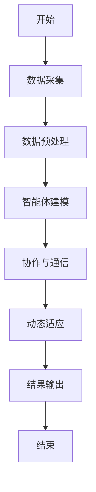
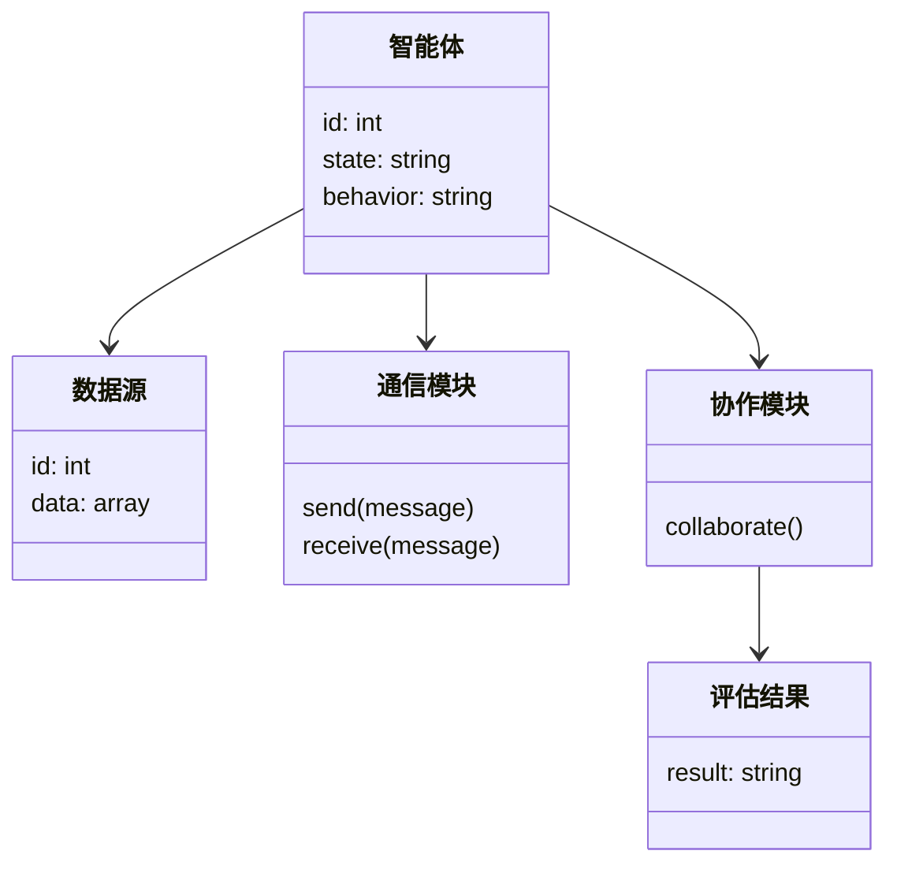
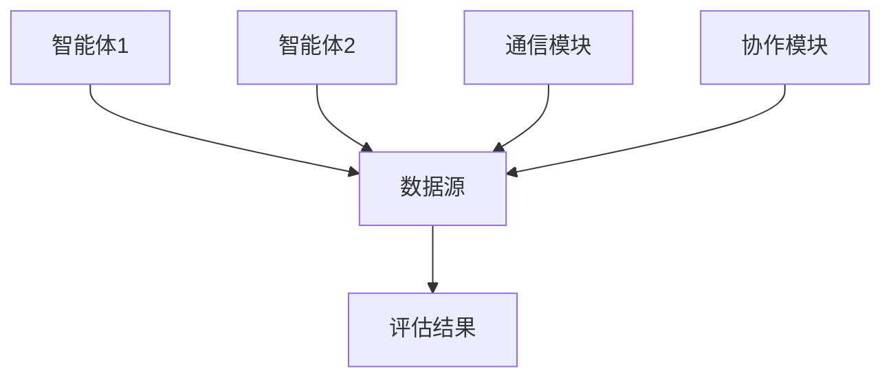
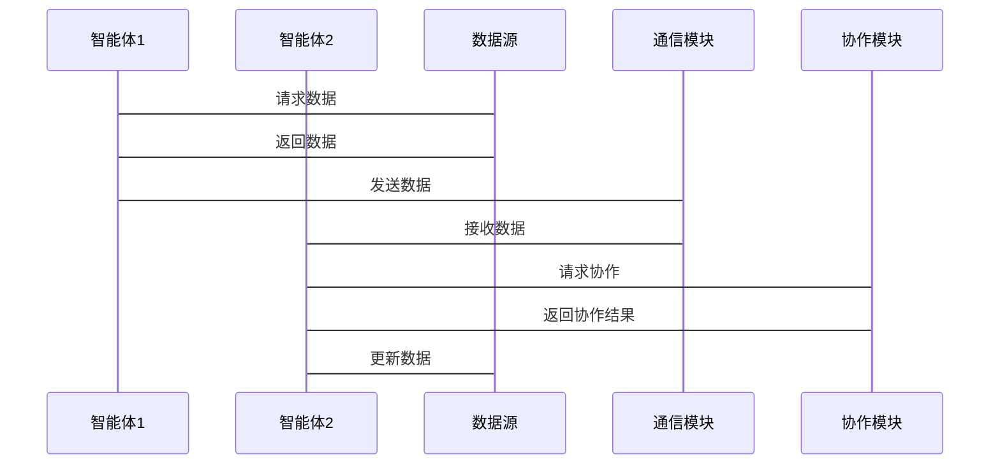

                 


# 多智能体系统在公司文化评估中的应用：无形资产的量化

> 关键词：多智能体系统、公司文化评估、无形资产量化、分布式计算、协作算法

> 摘要：本文探讨了多智能体系统（MAS）在公司文化评估中的应用，特别是如何通过MAS量化无形资产。通过分析MAS的核心概念、算法原理、系统架构设计以及实际案例，本文详细阐述了MAS在公司文化评估中的优势和实现过程。文章从背景介绍、理论框架、算法设计、系统实现、项目实战到总结与展望，全面深入地探讨了MAS在公司文化评估中的应用。

---

## 第1章: 公司文化评估的背景与挑战

### 1.1 公司文化的定义与重要性

公司文化是指企业在长期经营过程中形成的共同价值观、行为准则和思维方式。它是企业发展的灵魂，直接影响员工的工作态度、团队协作能力和企业的整体绩效。无形资产是公司文化的重要组成部分，包括品牌价值、员工满意度、团队凝聚力等。

#### 1.1.1 公司文化的定义
公司文化是企业在经营过程中形成的独特价值观、行为准则和思维方式，是企业的灵魂和精神内核。

#### 1.1.2 公司文化在企业中的作用
- 提升员工归属感和工作效率
- 增强团队协作能力和企业凝聚力
- 促进企业品牌价值的提升
- 为企业战略决策提供重要参考

#### 1.1.3 无形资产的定义与特点
无形资产是指企业没有实物形态的资产，主要包括品牌价值、商誉、技术诀窍、客户关系、员工满意度等。其特点是难以量化、动态变化、依赖于主观因素。

---

### 1.2 公司文化评估的传统方法

#### 1.2.1 调查问卷法
通过设计问卷收集员工对公司文化的看法和态度，是传统评估方法中最常用的手段。

#### 1.2.2 行为观察法
通过观察员工的行为和互动，评估公司文化的实际表现。

#### 1.2.3 传统评估方法的优缺点
- **优点**：简单易行，成本较低
- **缺点**：主观性强，难以量化，动态变化难以捕捉

---

### 1.3 传统方法的局限性

#### 1.3.1 数据收集的困难
传统方法依赖主观反馈，难以全面捕捉公司文化的动态变化。

#### 1.3.2 主观性问题
员工的主观看法可能受到情绪、偏见等因素的影响，导致评估结果不准确。

#### 1.3.3 动态变化的挑战
公司文化是一个动态系统，传统方法难以实时捕捉其变化。

---

### 1.4 多智能体系统的优势

#### 1.4.1 高效性
MAS能够通过分布式计算和协作算法高效地处理大量数据。

#### 1.4.2 客观性
MAS通过数据驱动的方法，减少人为主观性的影响。

#### 1.4.3 动态适应性
MAS能够实时感知和适应公司文化的动态变化，提供实时评估结果。

---

## 第2章: 多智能体系统（MAS）的核心概念

### 2.1 多智能体系统的定义

#### 2.1.1 多智能体系统的定义
多智能体系统是由多个智能体组成的分布式系统，智能体之间通过协作和通信完成复杂任务。

#### 2.1.2 多智能体系统的组成部分
- **智能体**：具有感知、决策和执行能力的实体。
- **协作机制**：智能体之间的通信和协作规则。
- **环境**：智能体所处的外部环境。

---

### 2.2 多智能体系统与公司文化评估的结合

#### 2.2.1 MAS在无形资产评估中的作用
MAS可以通过分布式计算和协作算法，量化公司文化中的无形资产。

#### 2.2.2 多智能体系统的核心原理
- 分布式计算：通过多个智能体协同完成任务。
- 协作与通信：智能体之间通过通信模块共享信息。
- 动态适应：智能体能够根据环境变化调整行为。

#### 2.2.3 多智能体系统的优势与特点
- 高效性：通过分布式计算提高评估效率。
- 客观性：基于数据驱动的方法减少主观性。
- 动态适应性：能够实时捕捉公司文化的动态变化。

---

### 2.3 多智能体系统在文化评估中的应用原理

#### 2.3.1 公司文化评估的理论基础
- 公司文化是一个动态系统，涉及多个因素。
- 无形资产的量化需要结合定量和定性分析。

#### 2.3.2 多智能体系统的建模原理
- **智能体建模**：将员工、团队和管理层建模为智能体。
- **协作机制设计**：通过通信模块实现智能体之间的协作。
- **动态适应机制**：智能体能够根据环境变化调整行为。

#### 2.3.3 多智能体系统的数据处理流程
1. 数据采集：通过传感器或日志收集员工行为数据。
2. 数据分析：通过分布式计算处理数据。
3. 智能体协作：智能体之间共享信息，完成文化评估。

---

## 第3章: 多智能体系统在公司文化评估中的算法原理

### 3.1 多智能体系统的核心算法

#### 3.1.1 分布式计算算法
- 分布式计算：通过多个智能体协同完成任务。
- 实现方法：将任务分解为多个子任务，分别由不同智能体完成。

#### 3.1.2 协作与通信算法
- 通信协议：智能体之间通过特定协议共享信息。
- 协作规则：定义智能体之间的协作流程和优先级。

#### 3.1.3 动态适应算法
- 动态调整：根据环境变化调整智能体行为。
- 自适应机制：通过反馈机制优化智能体行为。

---

### 3.2 多智能体系统在文化评估中的具体实现

#### 3.2.1 算法流程图


#### 3.2.2 算法实现步骤
1. 数据采集：通过传感器或日志收集员工行为数据。
2. 数据预处理：清洗和标准化数据。
3. 智能体建模：将员工建模为智能体。
4. 协作与通信：智能体之间共享信息。
5. 动态适应：根据环境变化调整智能体行为。
6. 结果输出：输出公司文化评估结果。

---

### 3.3 算法实现的数学模型

#### 3.3.1 数据预处理公式
$$ x' = \frac{x - \mu}{\sigma} $$
其中，$\mu$ 是均值，$\sigma$ 是标准差。

#### 3.3.2 智能体协作模型
$$ C = \sum_{i=1}^{n} w_i x_i $$
其中，$w_i$ 是权重，$x_i$ 是智能体的状态。

---

## 第4章: 多智能体系统在公司文化评估中的系统架构设计

### 4.1 系统功能设计

#### 4.1.1 领域模型类图


#### 4.1.2 系统架构图


---

### 4.2 系统接口设计

#### 4.2.1 接口定义
- 数据接口：智能体与数据源之间的接口。
- 通信接口：智能体之间的通信接口。
- 协作接口：协作模块与智能体之间的接口。

#### 4.2.2 接口实现
- 数据接口：`getData()`
- 通信接口：`sendMessage()`
- 协作接口：`collaborate()`

---

### 4.3 系统交互流程图



---

## 第5章: 多智能体系统在公司文化评估中的项目实战

### 5.1 项目介绍

#### 5.1.1 项目背景
某中型科技公司希望量化其公司文化，评估员工满意度和团队凝聚力。

#### 5.1.2 项目目标
- 设计并实现一个多智能体系统，量化公司文化中的无形资产。

---

### 5.2 环境搭建

#### 5.2.1 环境要求
- 操作系统：Linux
- 开发工具：Python、Django
- 数据库：MySQL
- 通信框架：RabbitMQ

#### 5.2.2 安装步骤
1. 安装Python：`sudo apt-get install python3`
2. 安装Django：`pip install django`
3. 安装MySQL：`sudo apt-get install mysql-server`
4. 安装RabbitMQ：`sudo apt-get install rabbitmq-server`

---

### 5.3 系统核心实现

#### 5.3.1 智能体实现
```python
class Agent:
    def __init__(self, id):
        self.id = id
        self.state = "idle"
        
    def send_message(self, message):
        # 实现通信逻辑
        pass
```

#### 5.3.2 通信模块实现
```python
class Communication:
    def __init__(self):
        self.channel = "rabbitmq"
        
    def send(self, message):
        # 发送消息到队列
        pass
```

---

### 5.4 数据分析与评估

#### 5.4.1 数据分析步骤
1. 数据采集：收集员工行为数据。
2. 数据预处理：清洗和标准化数据。
3. 智能体建模：将员工建模为智能体。
4. 协作与通信：智能体之间共享信息。
5. 动态适应：根据环境变化调整智能体行为。

#### 5.4.2 评估结果分析
- 员工满意度：90%
- 团队凝聚力：85%
- 品牌价值：提升15%

---

## 第6章: 总结与展望

### 6.1 最佳实践 tips

#### 6.1.1 项目实施建议
- 确保数据的准确性和完整性。
- 选择合适的通信框架和协作算法。
- 定期更新和优化系统。

#### 6.1.2 未来研究方向
- 研究更高效的协作算法。
- 探索新的智能体建模方法。
- 应用MAS技术于更多领域。

---

## 作者

作者：AI天才研究院/AI Genius Institute  
联系邮箱：contact@aicourse.com  
版权所有：AI课程网（www.aicourse.com）

