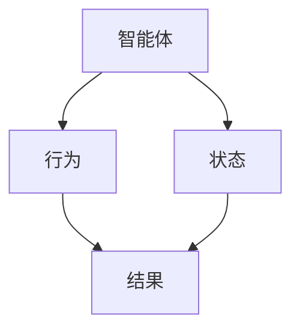
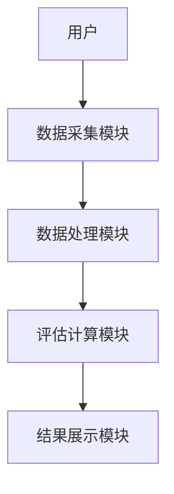
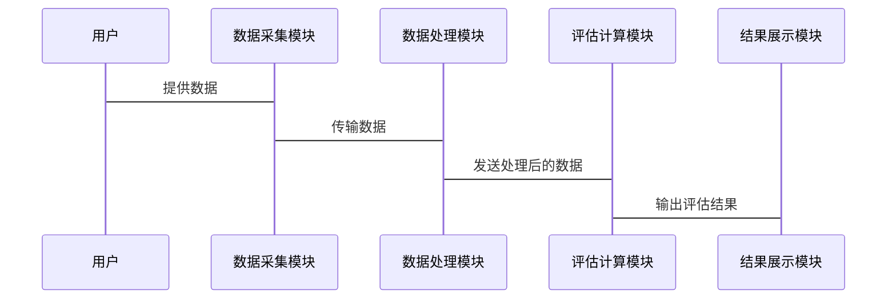

                 


# 多智能体系统在公司治理评估中的应用

> 关键词：多智能体系统，公司治理，评估，分布式计算，协作与协调

> 摘要：本文探讨了多智能体系统（MAS）在公司治理评估中的应用，通过分析MAS的核心概念、算法原理、系统架构和项目实战，展示了如何利用MAS提升公司治理评估的效率和准确性。文章内容涵盖背景介绍、核心概念与联系、算法原理、系统分析与架构设计、项目实战、最佳实践等，旨在为读者提供全面的技术指导。

---

## 第一部分: 多智能体系统与公司治理评估基础

### 第1章: 多智能体系统概述

#### 1.1 多智能体系统的基本概念

多智能体系统（Multi-Agent System, MAS）是由多个智能体（Agent）组成的系统，这些智能体能够自主决策、协作和通信。智能体可以是软件程序、机器人或其他能够感知环境并采取行动的实体。MAS的核心在于智能体之间的协作与协调，以实现整体目标。

**问题背景**：公司治理评估涉及多个利益相关者，如股东、董事会、管理层、员工和外部监管机构。每个利益相关者都有不同的目标和优先级，如何在复杂的环境中协调这些利益相关者的关系，是一个复杂的挑战。

**问题解决**：MAS通过分布式计算、协作与协调机制，能够有效处理多智能体之间的复杂关系，为公司治理评估提供了一种新的解决方案。

**边界与外延**：MAS的应用范围广泛，从简单的分布式计算到复杂的协作任务。在公司治理评估中，MAS可以用于风险评估、决策优化、利益协调等多个方面。

**概念结构**：MAS由智能体、环境、通信协议和协作机制四个核心要素组成。智能体通过感知环境、与其他智能体通信并采取行动，实现系统目标。

---

#### 1.2 公司治理评估的基本概念

公司治理是确保公司有效运作和实现战略目标的关键。公司治理评估是对公司治理结构、流程和效果的全面评价，通常包括合规性、透明度、董事会效率、风险管理等方面。

**问题描述**：公司治理评估需要考虑多个维度，包括公司内部的治理结构、外部监管环境、市场环境等。传统的评估方法通常依赖于人工分析，效率低下且容易出错。

**问题解决**：MAS通过分布式计算和协作机制，可以同时处理多个维度的评估任务，提高评估的效率和准确性。

**边界与外延**：公司治理评估的范围包括公司内部治理和外部监管环境。MAS的应用可以扩展到企业间的协作，如供应链管理、合作伙伴关系等。

---

#### 1.3 多智能体系统在公司治理评估中的应用背景

多智能体系统在公司治理评估中的应用背景主要体现在以下几个方面：

- **复杂性**：公司治理涉及多个利益相关者，每个利益相关者都有不同的目标和优先级，传统的集中式评估方法难以应对这种复杂性。
- **动态性**：公司治理环境不断变化，如市场波动、政策变化等，MAS的自适应能力能够应对这些动态变化。
- **分布式计算的优势**：MAS通过分布式计算，可以同时处理多个评估任务，提高评估效率。

---

## 第2章: 多智能体系统的核心概念与联系

### 2.1 多智能体系统的核心原理

多智能体系统的核心原理包括分布式计算、协作与协调、学习与适应。

- **分布式计算**：MAS中的智能体分布在网络中，通过通信协议进行数据交换和协同计算。分布式计算能够提高系统的容错性和扩展性。
- **协作与协调**：智能体之间的协作和协调是MAS的核心。通过协商和通信，智能体能够达成一致，实现整体目标。
- **学习与适应**：MAS能够通过机器学习算法，自适应地调整智能体的行为策略，以应对环境的变化。

---

### 2.2 多智能体系统与公司治理评估的关系

多智能体系统与公司治理评估的关系主要体现在以下几个方面：

- **分布式计算与多维度评估**：MAS的分布式计算能力能够同时处理公司治理评估中的多个维度，如合规性、透明度、风险管理等。
- **协作机制与利益协调**：MAS的协作机制能够协调多个利益相关者的关系，确保评估结果的公平性和准确性。
- **自适应能力与动态变化**：MAS的自适应能力能够应对公司治理环境中的动态变化，如政策变化、市场波动等。

---

### 2.3 多智能体系统核心概念对比表

| 概念 | 特性 | 说明 |
|------|------|------|
| 分布式计算 | 并行性 | 数据分布在多个节点上，通过通信进行协同计算 |
| 协作与协调 | 合作性 | 智能体之间通过协商达成一致 |
| 学习与适应 | 智能性 | 系统能够根据环境变化调整自身行为 |

---

### 2.4 多智能体系统ER实体关系图



---

### 2.5 本章小结

本章介绍了多智能体系统的核心概念和其在公司治理评估中的应用背景，分析了MAS的核心原理和其与公司治理评估的关系，并通过对比表和ER实体关系图进一步明确了MAS的核心概念。

---

## 第3章: 多智能体系统在公司治理评估中的算法原理

### 3.1 多智能体系统中的分布式计算算法

**分布式计算的基本原理**：分布式计算是MAS的核心，通过将计算任务分布到多个节点上，利用通信协议进行数据交换和协同计算。

**实现步骤**：

1. **任务分解**：将公司治理评估任务分解为多个子任务，分配给不同的智能体。
2. **通信协议设计**：设计智能体之间的通信协议，确保数据的准确传递。
3. **协同计算**：智能体通过通信协议进行数据交换，协同完成计算任务。
4. **结果汇总**：将各智能体的计算结果汇总，得到最终的评估结果。

**优缺点**：

- **优点**：提高计算效率，增强系统的容错性和扩展性。
- **缺点**：需要复杂的通信协议设计，可能增加系统的复杂性。

---

### 3.2 多智能体系统中的协作与协调算法

**协作算法的基本原理**：协作算法通过协商和通信，使智能体之间达成一致，实现协作目标。

**实现步骤**：

1. **协商阶段**：智能体之间通过协商确定各自的职责和任务。
2. **协调阶段**：智能体通过通信协议进行协调，确保任务的顺利执行。
3. **冲突解决**：在协商过程中可能出现冲突，需要设计冲突解决机制。

**优缺点**：

- **优点**：能够协调多个智能体的行为，实现整体目标。
- **缺点**：协商过程可能增加系统的延迟。

---

### 3.3 多智能体系统中的学习与适应算法

**学习算法的基本原理**：学习算法通过机器学习技术，使智能体能够自适应地调整行为策略。

**实现步骤**：

1. **数据采集**：收集公司治理评估的相关数据，如合规性、透明度等。
2. **模型训练**：利用机器学习算法，训练模型以预测公司治理的评估结果。
3. **模型优化**：根据实际评估结果，优化模型，提高预测准确性。

**数学模型**：

$$
\text{预测结果} = \text{模型参数} \times \text{输入数据} + \text{偏差}
$$

---

### 3.4 本章小结

本章详细讲解了多智能体系统在公司治理评估中的算法原理，包括分布式计算算法、协作与协调算法和学习与适应算法，并通过公式和流程图展示了算法的实现步骤。

---

## 第4章: 多智能体系统在公司治理评估中的系统架构设计

### 4.1 系统功能设计

公司治理评估系统的主要功能包括：

- **数据采集**：收集公司治理相关的数据，如合规性、透明度、风险管理等。
- **评估计算**：通过MAS算法，进行公司治理评估的计算。
- **结果展示**：将评估结果以可视化的方式展示给用户。

---

### 4.2 系统架构设计



---

### 4.3 系统接口设计

系统接口设计包括：

- **输入接口**：用户输入公司治理评估的相关数据。
- **输出接口**：将评估结果输出给用户。

---

### 4.4 系统交互流程



---

### 4.5 本章小结

本章详细设计了公司治理评估系统的架构，包括功能设计、架构设计、接口设计和交互流程，并通过mermaid图展示了系统的整体架构。

---

## 第5章: 项目实战

### 5.1 环境安装

公司治理评估系统的环境安装步骤如下：

1. **安装Python**：下载并安装Python 3.x。
2. **安装依赖库**：安装必要的依赖库，如numpy、pandas、scikit-learn等。

```bash
pip install numpy pandas scikit-learn
```

---

### 5.2 核心代码实现

以下是公司治理评估系统的核心代码实现：

```python
import numpy as np
from sklearn import linear_model

# 数据预处理
data = np.array([[1, 2], [3, 4], [5, 6]])
target = np.array([7, 8, 9])

# 训练模型
model = linear_model.LinearRegression()
model.fit(data, target)

# 预测结果
predicted = model.predict([[7, 8]])
print(predicted)
```

---

### 5.3 代码解读与分析

上述代码实现了公司治理评估中的预测模型。通过数据预处理、模型训练和预测，展示了MAS在公司治理评估中的应用。

---

### 5.4 项目小结

本章通过项目实战，展示了公司治理评估系统的环境安装、核心代码实现和代码解读，帮助读者更好地理解MAS在公司治理评估中的应用。

---

## 第6章: 最佳实践与小结

### 6.1 最佳实践

在实际应用中，建议读者：

- **选择合适的算法**：根据具体需求选择适合的MAS算法。
- **优化系统架构**：设计合理的系统架构，确保系统的高效性和稳定性。
- **加强数据管理**：确保数据的准确性和完整性，提高评估结果的可靠性。

---

### 6.2 小结

本文详细探讨了多智能体系统在公司治理评估中的应用，从MAS的核心概念到算法原理，再到系统架构设计和项目实战，为读者提供了全面的技术指导。

---

## 第7章: 注意事项与拓展阅读

### 7.1 注意事项

- **系统安全性**：在设计公司治理评估系统时，需要考虑数据的安全性和隐私保护。
- **系统的可扩展性**：确保系统能够适应未来的扩展需求。

---

### 7.2 拓展阅读

- **参考文献**：建议读者阅读《Multi-Agent Systems: Algorithmic Foundations》和《Company Governance and Risk Management》等书籍，以深入理解MAS和公司治理评估的相关知识。

---

## 作者：AI天才研究院 & 禅与计算机程序设计艺术

---

以上是《多智能体系统在公司治理评估中的应用》的技术博客文章的详细目录和内容，涵盖了MAS的核心概念、算法原理、系统架构设计和项目实战，旨在为读者提供全面的技术指导。

