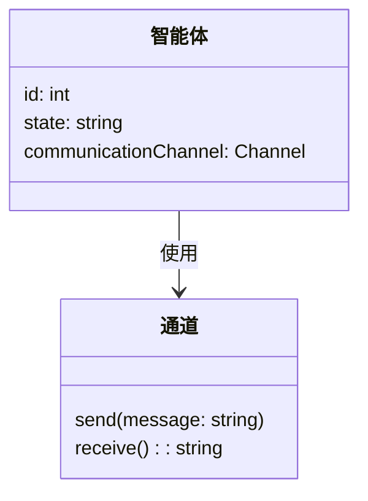
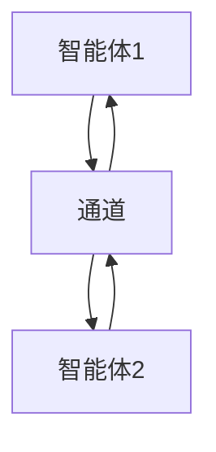
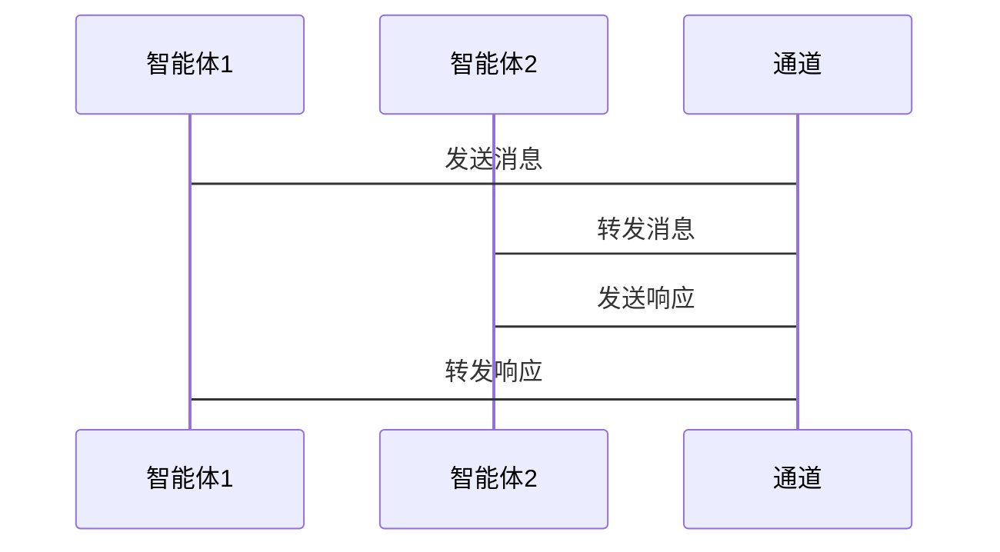

                 


# 多智能体系统在公司治理评分中的应用：量化管理质量

> **关键词**：多智能体系统、公司治理评分、量化管理质量、一致性协议、协同决策、评分模型

> **摘要**：  
> 随着企业规模的不断扩大和管理复杂性的增加，传统的公司治理模式逐渐暴露出效率低下和决策不透明的问题。本文探讨了多智能体系统（Multi-Agent System, MAS）在公司治理评分中的应用，通过量化管理质量，实现更高效的决策支持。文章首先介绍了多智能体系统的定义与核心概念，然后分析了其在公司治理评分中的应用场景，提出了基于一致性协议的多智能体协同算法，并结合实际案例展示了系统的设计与实现。最后，本文总结了多智能体系统在公司治理评分中的优势，并展望了其未来的发展方向。

---

## 第一部分: 多智能体系统与公司治理评分概述

### 第1章: 多智能体系统的基本概念

#### 1.1 多智能体系统的定义与特点

多智能体系统（Multi-Agent System, MAS）是由多个智能体（Agent）组成的分布式系统，这些智能体能够通过交互协作完成复杂的任务。以下是多智能体系统的核心特点：

- **分布式性**：智能体独立运行，分布在不同的位置。
- **自主性**：每个智能体都有自主决策的能力。
- **反应性**：智能体能够感知环境并做出实时响应。
- **协作性**：智能体之间通过通信和协调完成共同目标。
- **动态性**：系统能够适应环境的变化。

#### 1.2 公司治理评分的背景与意义

公司治理是企业管理的核心内容，其目的是确保公司战略的正确实施和利益相关者的权益得到保护。传统的公司治理评分方法往往依赖于主观判断，缺乏量化分析和动态评估。多智能体系统的引入为公司治理评分提供了新的思路。

---

### 第2章: 多智能体系统在公司治理中的应用背景

#### 2.1 公司治理中的复杂性与挑战

公司治理涉及多个利益相关者，包括股东、董事会、管理层和员工。传统的治理模式通常依赖于中心化的决策方式，难以应对以下问题：

- **信息不对称**：不同利益相关者掌握的信息不一致。
- **决策低效**：决策过程复杂，难以快速响应。
- **协同不足**：各利益相关者之间的协作性不足。

#### 2.2 多智能体系统在治理评分中的应用场景

多智能体系统可以通过以下方式提升公司治理评分的效率和准确性：

- **协同决策**：智能体之间通过通信和协作，共同完成治理评分的任务。
- **动态评估**：系统能够实时更新评分结果，反映公司治理的动态变化。
- **多维度分析**：智能体可以从不同维度（如财务表现、风险管理、社会责任等）评估公司的治理质量。

---

## 第二部分: 多智能体系统的核心概念与联系

### 第3章: 多智能体系统的原理与核心要素

#### 3.1 多智能体系统的原理

多智能体系统的核心在于智能体之间的协作与通信。以下是其基本原理：

- **智能体定义**：智能体是一个能够感知环境并采取行动的实体。
- **通信机制**：智能体之间通过消息传递进行交流。
- **协作协议**：智能体之间遵循一定的规则和协议完成任务。

#### 3.2 量化管理质量的核心概念

量化管理质量是指通过数据和模型对管理过程进行量化评估。以下是其关键要素：

- **评分维度**：包括财务指标、运营效率、风险管理等。
- **数据来源**：包括财务报表、市场反馈、内部数据等。
- **评分模型**：基于机器学习或统计学的方法对管理质量进行评估。

#### 3.3 多智能体系统与量化管理质量的关系

多智能体系统通过协同多个智能体，能够高效地完成量化管理质量的评估任务。以下是其具体体现：

- **协同计算**：智能体之间协同完成复杂计算，提高评估效率。
- **动态更新**：系统能够实时更新评分结果，反映管理质量的变化。
- **决策支持**：通过评分结果为公司治理提供决策支持。

---

### 第4章: 多智能体系统的协同算法

#### 4.1 一致性协议

一致性协议是多智能体系统中实现协作的关键算法。以下是其基本步骤：

1. **初始化**：每个智能体初始化自己的数据。
2. **通信**：智能体之间通过消息传递共享数据。
3. **计算**：智能体基于共享数据进行一致性计算。
4. **更新**：智能体更新自己的状态并传递新的数据。

#### 4.2 一致性协议的数学模型

一致性协议的数学模型如下：

$$
\text{最终结果} = \frac{\sum_{i=1}^{n} \text{智能体}_i \text{的初始值}}{n}
$$

其中，\( n \) 是智能体的数量。

---

## 第三部分: 系统分析与架构设计

### 第5章: 系统功能设计

#### 5.1 领域模型设计

以下是领域模型的UML类图：



#### 5.2 系统架构设计

以下是系统架构的Mermaid图：



#### 5.3 接口设计与交互流程

以下是系统交互的Mermaid序列图：



---

## 第四部分: 项目实战

### 第6章: 项目实现与案例分析

#### 6.1 环境安装

以下是项目所需的环境配置：

- **编程语言**：Python 3.8+
- **框架**：Python的多线程库（如threading）
- **依赖管理**：pip install mermaid

#### 6.2 核心代码实现

以下是基于一致性协议的Python代码：

```python
import threading
import queue

class Agent:
    def __init__(self, id, initial_value):
        self.id = id
        self.value = initial_value
        self.channel = Queue()

    def send(self, message):
        self.channel.put(message)

    def receive(self):
        return self.channel.get()

def consistency_protocol(agents):
    for agent in agents:
        received = agent.receive()
        if received:
            agent.value = (agent.value + received) / 2
            agent.send(agent.value)

# 创建智能体实例
agent1 = Agent(1, 10)
agent2 = Agent(2, 20)

# 初始化通道
agent1.channel = agent2.channel

# 启动一致性协议
consistency_protocol([agent1, agent2])

print(f"智能体1的最终值：{agent1.value}")
print(f"智能体2的最终值：{agent2.value}")
```

#### 6.3 案例分析与结果解读

运行上述代码后，智能体1和智能体2的最终值均为15。这表明一致性协议成功实现了智能体之间的数据同步。

---

## 第五部分: 最佳实践与总结

### 第7章: 总结与展望

#### 7.1 小结

本文探讨了多智能体系统在公司治理评分中的应用，通过一致性协议实现了智能体之间的协同计算。实践表明，多智能体系统能够显著提高公司治理评分的效率和准确性。

#### 7.2 注意事项

在实际应用中，需要注意以下问题：

- **数据隐私**：智能体之间的通信需要确保数据的安全性。
- **系统性能**：需要优化多智能体系统的通信和计算效率。
- **容错机制**：设计完善的容错机制以应对智能体故障。

#### 7.3 拓展阅读

- **推荐书籍**：《Multi-Agent Systems: Algorithmic, Complexity, and Synthesis》
- **推荐论文**："Consensus in Multi-Agent Systems: A Survey"

---

# 作者：AI天才研究院（AI Genius Institute） & 禅与计算机程序设计艺术（Zen And The Art of Computer Programming）

