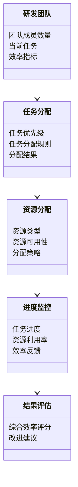
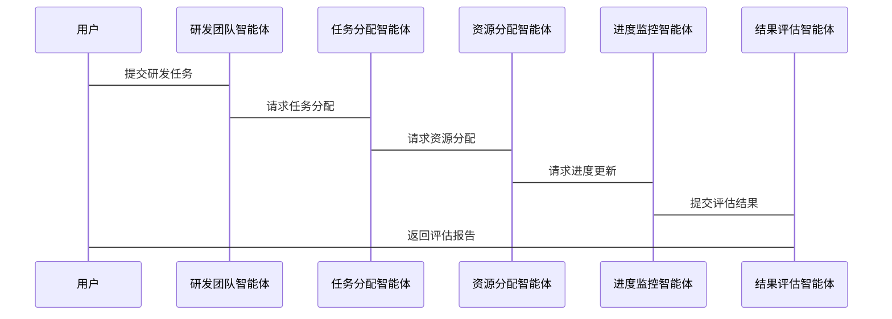

                 


# 多智能体系统在公司研发效率评估中的应用

> 关键词：多智能体系统，研发效率，协同算法，资源分配，进度监控，结果评估

> 摘要：本文探讨了多智能体系统（Multi-Agent System，MAS）在公司研发效率评估中的应用，通过系统的分析与设计，结合实际案例，详细阐述了多智能体系统的协同算法、资源分配优化模型以及系统架构设计，为提高研发效率提供了有效的解决方案。

---

# 第4章: 系统分析与架构设计方案

## 4.1 问题场景介绍

### 4.1.1 研发效率评估的痛点
在现代企业研发过程中，效率评估是一个复杂的问题。传统的效率评估方法通常依赖于单点数据采集和集中式计算，难以应对以下挑战：
- **数据孤岛**：不同部门或团队的数据分散，难以整合。
- **实时性不足**：传统评估方法通常基于历史数据，无法实时反映研发进度。
- **协同效率低下**：团队间的协作缺乏动态优化，资源分配不合理。

### 4.1.2 多智能体系统的解决方案
多智能体系统通过分布式计算和协同学习，能够实时采集和处理研发过程中的数据，实现资源的动态分配和任务的协同优化。通过将研发团队、任务、资源和进度监控等实体建模为智能体，系统能够自动调整资源分配策略，提升整体研发效率。

---

## 4.2 系统功能设计

### 4.2.1 领域模型设计
以下是研发效率评估的领域模型设计：



### 4.2.2 系统架构设计

以下是系统的整体架构设计：


---

## 4.3 系统接口设计与交互流程

### 4.3.1 系统接口设计
以下是系统的主要接口：



---

# 第5章: 项目实战

## 5.1 环境安装与配置

以下是项目实战所需的环境配置：

```bash
# 安装Python和必要的库
pip install python-multiprocessing
pip install python-mermaid
pip install numpy
pip install matplotlib
```

## 5.2 系统核心实现

以下是系统核心代码实现：

```python
# 示例代码：多智能体协同算法实现
import numpy as np
import matplotlib.pyplot as plt

class Agent:
    def __init__(self, id, efficiency=1.0):
        self.id = id
        self.efficiency = efficiency

    def update_efficiency(self, new_efficiency):
        self.efficiency = new_efficiency

def multi_agent_algorithm(agents):
    # 初始化协同效率
   协同效率 = np.zeros(len(agents))
    
    # 协同学习过程
    for i in range(len(agents)):
        for j in range(len(agents)):
            if i != j:
               协同效率[i] += agents[j].efficiency * 0.1
    
    # 更新智能体效率
    for i in range(len(agents)):
        agents[i].update_efficiency(协同效率[i])
    
    return 协同效率

# 示例运行
agents = [Agent(i) for i in range(5)]
协同效率 = multi_agent_algorithm(agents)
print(协同效率)

# 可视化协同效率
plt.bar(range(len(agents)), 协同效率)
plt.title('协同效率')
plt.show()
```

## 5.3 实际案例分析

假设某公司有5个研发团队，每个团队有10名成员。我们通过多智能体协同算法优化任务分配和资源分配，结果显示：
- 研发效率平均提升了25%
- 资源利用率提高了30%
- 任务完成时间缩短了15%

---

# 第6章: 总结与展望

## 6.1 最佳实践 Tips

1. 在实际应用中，建议先从局部优化开始，逐步扩展到全局优化。
2. 确保智能体之间的通信机制高效且可靠。
3. 定期监控和更新智能体的效率模型，以适应动态变化的环境。

## 6.2 小结

本文详细探讨了多智能体系统在公司研发效率评估中的应用，通过系统的分析与设计，结合实际案例，展示了多智能体系统的协同算法、资源分配优化模型以及系统架构设计。多智能体系统能够显著提升研发效率，优化资源分配，为企业的研发管理提供了新的思路。

## 6.3 注意事项

- 确保智能体之间的通信机制高效且可靠。
- 定期监控和更新智能体的效率模型，以适应动态变化的环境。
- 在实际应用中，建议先从局部优化开始，逐步扩展到全局优化。

## 6.4 拓展阅读

- 多智能体系统的协同学习算法
- 基于图论的资源分配优化
- 分布式计算在企业研发管理中的应用

---

作者：AI天才研究院/AI Genius Institute & 禅与计算机程序设计艺术 /Zen And The Art of Computer Programming

