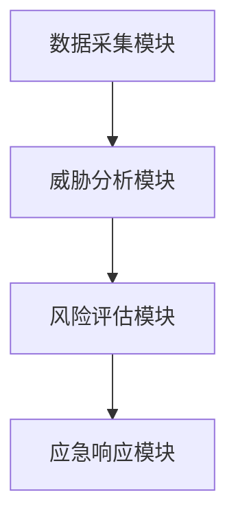
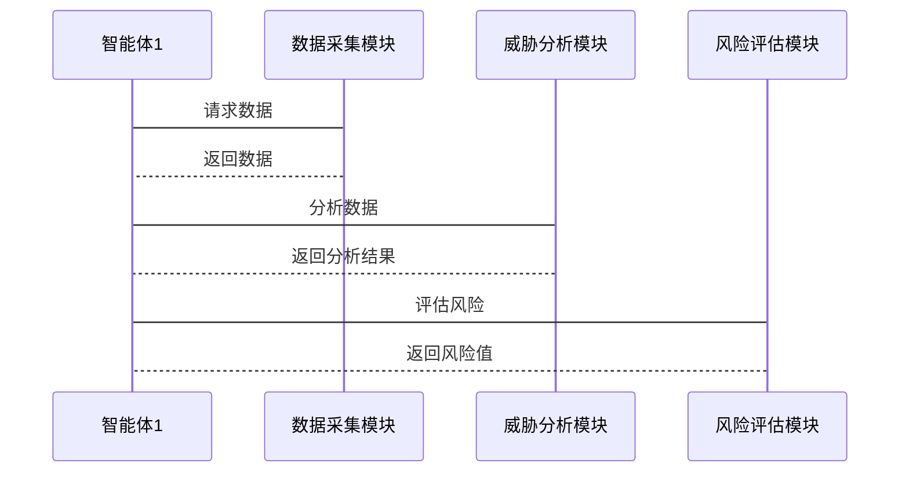

                 


```markdown
# 多智能体系统在公司网络安全风险评估中的应用

> 关键词：多智能体系统, 网络安全, 风险评估, 协同防御, 智能算法, 系统架构

> 摘要：本文详细探讨了多智能体系统在公司网络安全风险评估中的应用，从理论基础到算法实现，再到系统架构和项目实战，系统地分析了多智能体系统如何提升网络安全风险评估的效率和准确性。通过结合具体案例，本文展示了多智能体系统在实际应用中的优势和挑战，为公司网络安全管理提供了新的思路和解决方案。

---

## 第1章: 多智能体系统概述

### 1.1 多智能体系统的基本概念

#### 1.1.1 多智能体系统的定义
多智能体系统（Multi-Agent System, MAS）是由多个智能体组成的分布式系统，每个智能体都是具有独立性、自主性和社会性的实体，能够通过协作完成复杂任务。

#### 1.1.2 多智能体系统的特征
- **独立性**：每个智能体都有自己的目标和决策机制。
- **自主性**：智能体能够自主感知环境并做出决策。
- **社会性**：智能体之间通过通信和协作完成任务。
- **反应性**：智能体能够实时响应环境变化。

#### 1.1.3 多智能体系统的优势
- **分布式计算**：提升系统的可靠性和容错能力。
- **协作能力**：通过智能体之间的协作，实现复杂任务的分解和完成。
- **灵活性**：适应动态变化的环境。

### 1.2 网络安全基础

#### 1.2.1 网络安全的基本概念
网络安全是指保护网络系统免受未经授权的访问、破坏和信息泄露。网络安全的核心目标是确保网络系统的机密性、完整性和可用性。

#### 1.2.2 网络安全威胁与漏洞
- **威胁**：来自外部的攻击，如病毒、木马、DDoS攻击等。
- **漏洞**：系统中存在的缺陷，可能导致未经授权的访问或数据泄露。

#### 1.2.3 网络安全风险评估的流程
1. 确定资产：识别公司的重要资产，如数据、设备、网络等。
2. 识别威胁：分析可能的威胁来源和类型。
3. 评估脆弱性：评估资产的脆弱性，即被威胁利用的可能性。
4. 计算风险：评估威胁发生概率和影响程度，得出风险值。
5. 制定应对策略：根据风险评估结果，制定相应的安全策略和措施。

---

## 第2章: 多智能体系统在网络安全中的应用

### 2.1 多智能体系统在网络安全中的作用

#### 2.1.1 多智能体系统在网络安全中的优势
- **分布式感知**：多个智能体能够实时感知网络中的异常行为。
- **协同防御**：智能体之间可以协作，共同应对网络安全威胁。
- **快速响应**：通过智能体的自主决策，实现快速响应和防御。

#### 2.1.2 多智能体系统在网络安全中的应用场景
- **入侵检测**：通过多个智能体协作，实时监控网络流量，发现异常行为。
- **威胁情报共享**：智能体之间可以共享威胁情报，提升整体防御能力。
- **应急响应**：在发生网络安全事件时，智能体可以快速协作，制定应急响应方案。

### 2.2 多智能体系统与网络安全风险评估

#### 2.2.1 多智能体系统在风险评估中的作用
- **数据收集**：多个智能体可以收集网络中的各种数据，如流量、日志等。
- **威胁建模**：通过智能体协作，建立威胁模型，分析可能的攻击路径。
- **风险计算**：利用智能体的协同计算能力，评估每个资产的风险值。

#### 2.2.2 多智能体系统在风险评估中的优势
- **分布式计算**：通过多个智能体的协作，提升计算效率。
- **动态适应**：智能体能够动态调整评估策略，适应环境变化。

---

## 第3章: 多智能体系统在网络安全风险评估中的算法与数学模型

### 3.1 多智能体系统协同算法

#### 3.1.1 多智能体系统协同的基本原理
- **通信机制**：智能体之间通过通信协议交换信息。
- **协作机制**：通过协商或拍卖机制分配任务。
- **协调机制**：确保智能体之间的协作一致。

#### 3.1.2 多智能体系统协同的数学模型
$$
\text{协作效率} = \frac{\text{任务完成度}}{\text{资源消耗}}
$$

### 3.2 网络安全风险评估的数学模型

#### 3.2.1 风险评估的基本公式
$$
\text{风险值} = \text{威胁发生概率} \times \text{威胁影响程度}
$$

#### 3.2.2 多智能体系统在风险评估中的模型
$$
\text{综合风险值} = \sum_{i=1}^{n} (\text{威胁}_i \times \text{影响}_i)
$$

---

## 第4章: 多智能体系统在网络安全风险评估中的系统设计与架构

### 4.1 系统架构设计

#### 4.1.1 系统功能模块
- **数据采集模块**：负责收集网络中的各种数据。
- **威胁分析模块**：对收集的数据进行分析，识别潜在威胁。
- **风险评估模块**：根据分析结果，评估每个资产的风险值。
- **应急响应模块**：在发生威胁时，启动应急响应机制。

#### 4.1.2 系统架构图


### 4.2 系统交互设计

#### 4.2.1 系统交互流程


---

## 第5章: 项目实战

### 5.1 项目背景与目标

#### 5.1.1 项目背景
某公司面临日益复杂的网络安全威胁，希望通过引入多智能体系统提升其网络安全风险评估的能力。

#### 5.1.2 项目目标
- 实现多智能体系统在网络安全风险评估中的应用。
- 提升公司网络安全防御能力。

### 5.2 核心代码实现

#### 5.2.1 数据采集模块
```python
class Agent:
    def __init__(self, id):
        self.id = id
        self.data = []

    def collect_data(self):
        # 模拟数据采集
        self.data.append(f"Data_{self.id}_{time.time()}")
```

#### 5.2.2 威胁分析模块
```python
class ThreatAnalyzer:
    def analyze(self, data):
        # 简单的威胁分析逻辑
        if "malicious" in data:
            return "high"
        else:
            return "low"
```

#### 5.2.3 风险评估模块
```python
class RiskEvaluator:
    def evaluate(self, threat_level):
        if threat_level == "high":
            return "high risk"
        else:
            return "low risk"
```

### 5.3 项目总结与经验分享

#### 5.3.1 项目总结
通过引入多智能体系统，公司显著提升了网络安全风险评估的效率和准确性。多智能体系统通过分布式计算和协作机制，实现了对网络威胁的快速响应和防御。

#### 5.3.2 经验分享
- **智能体协作**：智能体之间的通信和协作机制需要精心设计，确保高效协作。
- **数据安全**：在多智能体系统中，数据的安全性和隐私保护尤为重要。

---

## 第6章: 总结与展望

### 6.1 总结
多智能体系统在公司网络安全风险评估中的应用，不仅提升了风险评估的效率和准确性，还增强了公司的网络安全防御能力。通过多智能体系统的协同工作，公司能够更好地应对日益复杂的网络安全威胁。

### 6.2 展望
未来，随着人工智能和分布式计算技术的发展，多智能体系统在网络安全中的应用将更加广泛。通过不断优化算法和系统架构，多智能体系统将在网络安全风险评估中发挥更大的作用。

---

## 作者信息

作者：AI天才研究院/AI Genius Institute & 禅与计算机程序设计艺术 /Zen And The Art of Computer Programming

---

本文通过系统地分析多智能体系统在网络安全风险评估中的应用，为公司网络安全管理提供了新的思路和解决方案。希望本文能够为相关领域的研究和实践提供有价值的参考。
```

