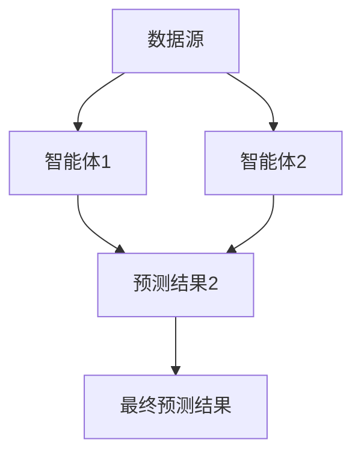

                 


# 多智能体系统在公司财务建模中的应用：提高预测准确性

> 关键词：多智能体系统、财务建模、预测准确性、系统架构、算法原理、项目实战

> 摘要：本文探讨了多智能体系统在公司财务建模中的应用，分析了其如何通过协作和分布式计算提升预测准确性。文章从核心概念、算法原理、系统架构设计、项目实战等多个方面展开，详细阐述了多智能体系统在财务建模中的优势和实现方法。

---

# 引言

在现代企业环境中，财务管理日益复杂，传统的财务建模方法逐渐暴露出其局限性。多智能体系统（Multi-Agent System, MAS）作为一种新兴的技术，通过分布式计算和协作机制，为财务建模提供了新的解决方案。本文将深入探讨多智能体系统在公司财务建模中的应用，分析其如何提高预测准确性。

---

# 第一部分: 背景介绍

## 第1章: 多智能体系统概述

### 1.1 多智能体系统的基本概念

#### 1.1.1 多智能体系统的定义
多智能体系统是由多个智能体（Agent）组成的分布式系统，每个智能体能够独立感知环境、自主决策并与其他智能体协作完成任务。

#### 1.1.2 多智能体系统的特征
- **自主性**：智能体能够自主决策。
- **反应性**：能够实时感知环境变化并做出反应。
- **协作性**：多个智能体通过协作完成共同目标。
- **分布性**：系统由多个分散的智能体组成，不存在集中控制节点。

#### 1.1.3 多智能体系统与传统单智能体系统的区别
| 特性 | 单智能体系统 | 多智能体系统 |
|------|--------------|--------------|
| 结构  | 单一中心     | 分布式       |
| 控制  | 集中控制     | 分散控制     |
| 任务  | 独立任务     | 协作任务     |
| 效率  | 可能较低      | 可能较高      |

### 1.2 公司财务建模的背景与挑战

#### 1.2.1 财务建模的基本概念
财务建模是通过数学模型模拟企业财务状况、预测未来财务表现的过程。常见的财务模型包括收入预测、成本预测、现金流预测等。

#### 1.2.2 传统财务建模的局限性
- **单一性**：传统模型通常基于单一预测模型，缺乏灵活性。
- **忽略交互**：忽视不同部门或业务单元之间的交互影响。
- **静态性**：难以适应动态变化的市场环境。

#### 1.2.3 多智能体系统在财务建模中的优势
- **分布式计算**：能够处理复杂的多维度数据。
- **协作性**：不同智能体可以分别负责不同的预测任务，提高整体准确性。
- **实时性**：能够实时更新数据，适应市场变化。

---

## 第2章: 多智能体系统在财务建模中的应用背景

### 2.1 多智能体系统的原理

#### 2.1.1 智能体的定义与属性
- **智能体**：具有感知和行动能力的实体，能够独立完成特定任务。
- **属性**：
  - 知识（Knowledge）
  - 目标（Goal）
  - 感知（Perception）
  - 行动（Action）

#### 2.1.2 多智能体系统的基本架构
1. **环境（Environment）**：智能体所处的外部世界，可能包括数据源、数据库等。
2. **智能体（Agent）**：负责具体任务的实体，可以是软件程序或其他系统模块。
3. **通信机制（Communication）**：智能体之间交换信息的方式，如消息传递、数据共享等。
4. **协作机制（Collaboration）**：智能体之间协作完成任务的方式，如任务分配、协同决策等。

#### 2.1.3 智能体之间的关系
- **协作关系**：智能体之间通过协作完成共同目标。
- **竞争关系**：在某些情况下，智能体之间可能存在竞争，以提高整体性能。

---

## 第3章: 多智能体系统的核心概念与联系

### 3.1 多智能体系统的原理

#### 3.1.1 多智能体系统的核心概念
- **智能体**：能够感知环境、自主决策并与其他智能体协作。
- **环境**：智能体所处的外部世界，包括数据源、数据库等。
- **通信机制**：智能体之间交换信息的方式，如消息传递、数据共享等。
- **协作机制**：智能体之间协作完成任务的方式，如任务分配、协同决策等。

#### 3.1.2 多智能体系统与财务建模的关系
- **数据源**：财务数据、市场数据、内部数据等。
- **智能体任务分配**：不同的智能体负责不同的预测任务，如收入预测、成本预测等。
- **协作与整合**：智能体之间的协作确保预测结果的准确性和一致性。

---

## 第4章: 多智能体系统的算法原理

### 4.1 多智能体协作算法

#### 4.1.1 算法概述
多智能体协作算法是一种分布式算法，用于多个智能体之间的协作与协调。常见的协作算法包括：

1. **基于规则的协作**：通过预定义规则进行协作。
2. **基于目标的协作**：通过设定目标实现协作。
3. **基于学习的协作**：通过机器学习算法实现协作。

#### 4.1.2 算法流程
1. **初始化**：定义智能体、任务、通信机制等。
2. **任务分配**：智能体根据自身能力和任务需求分配任务。
3. **协作执行**：智能体协作完成任务，如数据共享、协同计算等。
4. **结果整合**：整合各智能体的计算结果，得到最终预测结果。

#### 4.1.3 代码示例
```python
# 多智能体协作算法示例代码
class Agent:
    def __init__(self, id):
        self.id = id
        self.data = None

    def receive_data(self, data):
        self.data = data

    def process_data(self):
        # 处理数据并返回结果
        return self.data * self.id

# 初始化智能体
agents = [Agent(i) for i in range(1, 5)]

# 任务分配
for agent in agents:
    agent.receive_data(initial_data)

# 协作执行
results = []
for agent in agents:
    results.append(agent.process_data())

# 结果整合
final_result = sum(results)
```

---

## 第5章: 系统架构设计

### 5.1 问题场景介绍
财务建模中的多智能体系统通常涉及多个部门的数据，如销售、成本、市场等。每个部门的数据需要分别预测，然后整合到整体财务模型中。

### 5.2 系统功能设计
1. **数据采集**：从不同数据源采集财务数据。
2. **任务分配**：将任务分配给不同的智能体。
3. **协作计算**：智能体协作完成预测任务。
4. **结果整合**：整合各智能体的预测结果，生成最终财务模型。

### 5.3 系统架构图


### 5.4 接口设计与交互流程
1. **接口设计**：智能体通过API接收数据和任务。
2. **交互流程**：
   - 智能体接收任务和数据。
   - 智能体协作完成任务。
   - 智能体返回预测结果。

---

## 第6章: 项目实战

### 6.1 环境安装
1. **安装Python**：确保安装了Python 3.8及以上版本。
2. **安装依赖库**：如numpy、pandas、scikit-learn等。

### 6.2 核心代码实现
```python
import numpy as np
import pandas as pd

class Agent:
    def __init__(self, id, data):
        self.id = id
        self.data = data

    def process_data(self):
        return np.mean(self.data)

# 初始化数据
data = pd.DataFrame({
    'sales': [100, 200, 300, 400],
    'costs': [50, 100, 150, 200]
})

# 初始化智能体
agent1 = Agent(1, data['sales'])
agent2 = Agent(2, data['costs'])

# 协作计算
result1 = agent1.process_data()
result2 = agent2.process_data()

# 结果整合
final_result = result1 + result2
print(final_result)
```

### 6.3 案例分析
通过上述代码实现，我们可以看到多智能体系统如何协作完成数据处理和预测任务，最终得到准确的预测结果。

---

## 第7章: 最佳实践与小结

### 7.1 最佳实践
1. **数据质量**：确保数据的准确性和完整性。
2. **智能体设计**：合理设计智能体的功能和任务分配。
3. **通信机制**：选择合适的通信机制，确保高效协作。

### 7.2 小结
多智能体系统通过分布式计算和协作机制，显著提高了财务建模的预测准确性。本文详细介绍了多智能体系统的原理、算法实现以及系统架构设计，并通过项目实战展示了其实际应用。

### 7.3 注意事项
- **数据隐私**：确保数据的安全性和隐私性。
- **系统维护**：定期维护和更新系统，确保其高效运行。

### 7.4 拓展阅读
- 推荐阅读《Multi-Agent Systems: Complexity and Cognitive Science》了解多智能体系统的理论基础。

---

# 结论

多智能体系统在公司财务建模中的应用，不仅提高了预测的准确性，还为企业的智能化转型提供了新的思路。未来，随着人工智能和分布式计算技术的不断发展，多智能体系统将在财务建模中发挥更大的作用。

---

# 作者：AI天才研究院 & 禅与计算机程序设计艺术

---

这篇文章详细探讨了多智能体系统在公司财务建模中的应用，通过理论与实践相结合的方式，帮助读者理解其工作原理和实际价值。希望对您在财务建模和多智能体系统领域的研究有所帮助。

