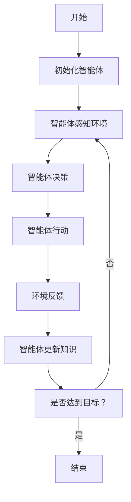
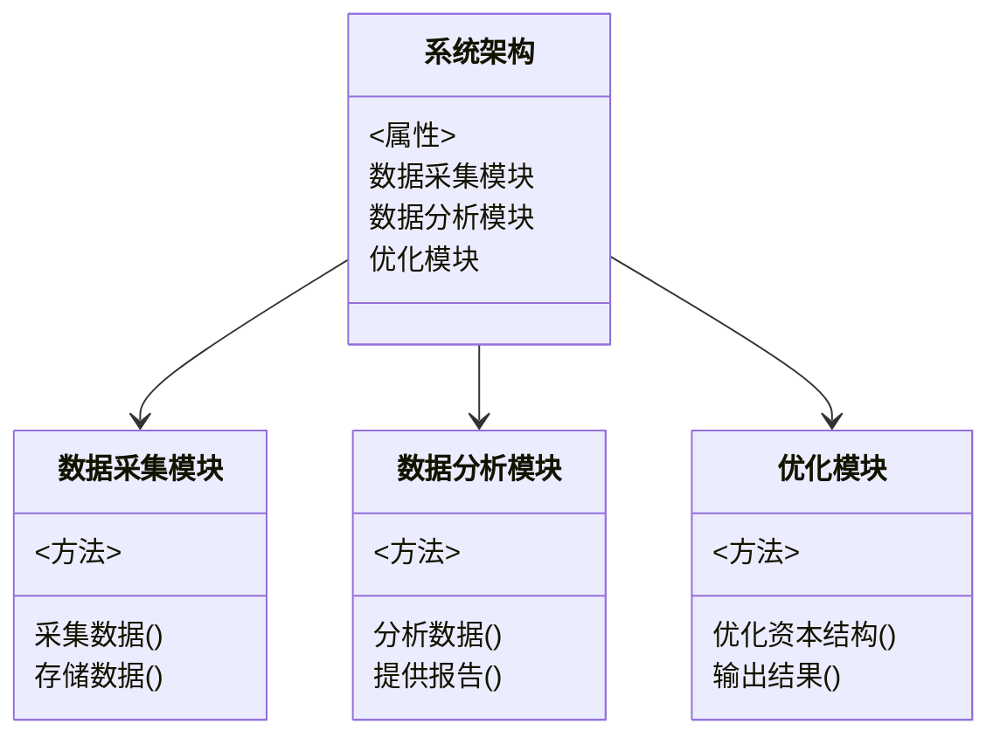
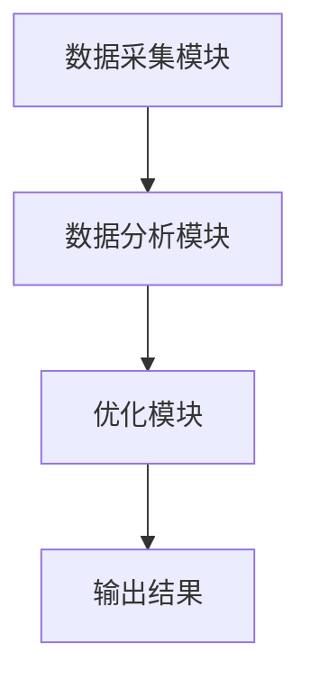
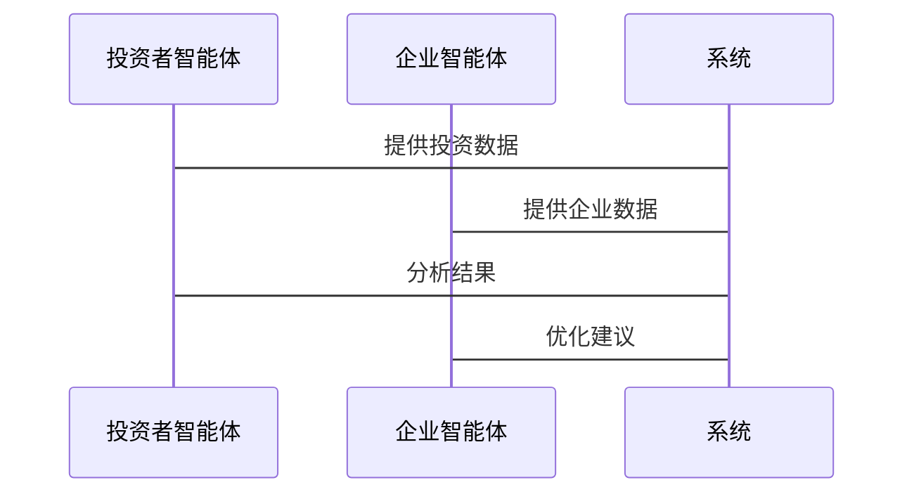

                 


# 多智能体系统在公司资本结构分析中的应用

## 关键词：多智能体系统，资本结构分析，协同优化，智能体算法，资本成本，财务风险

## 摘要：
随着企业规模的不断扩大和市场竞争的加剧，资本结构优化已成为企业财务管理的核心问题之一。传统的资本结构分析方法往往依赖于单一智能体的决策，难以应对复杂多变的市场环境。而多智能体系统（MAS）通过多个智能体的协同工作，能够更高效、更准确地分析和优化资本结构。本文将深入探讨多智能体系统在资本结构分析中的应用，从基本概念、算法原理到系统设计和项目实战，全面解析如何利用多智能体技术提升资本结构分析的效率和准确性。

---

# 第一部分: 多智能体系统与资本结构分析基础

## 第1章: 多智能体系统与资本结构分析概述

### 1.1 多智能体系统的基本概念
多智能体系统（Multi-Agent System，MAS）是由多个智能体（Agent）组成的分布式系统，这些智能体能够自主决策、协作完成任务。每个智能体都有一定的知识、目标和行为规则，能够通过感知环境和与其他智能体的交互来实现目标。

#### 1.1.1 多智能体系统的定义
- **智能体（Agent）**：具有感知、决策、行动和协作能力的实体。
- **多智能体系统（MAS）**：由多个智能体组成的分布式系统，智能体之间通过通信和协作完成复杂任务。

#### 1.1.2 多智能体系统的特点
| 特性 | 描述 |
|------|------|
| 分布性 | 智能体分布在网络中，独立运行 |
| 协作性 | 智能体之间通过协作完成共同目标 |
| 反应性 | 智能体能够感知环境并实时调整行为 |
| 自主性 | 智能体在无外部干预下自主决策 |

#### 1.1.3 多智能体系统的分类
- **反应式智能体**：基于当前感知做出反应。
- **认知式智能体**：具有推理和规划能力。
- **协作式智能体**：智能体之间通过协作完成任务。

### 1.2 资本结构分析的基本概念
资本结构分析是企业财务管理的重要组成部分，涉及对企业负债和股权的结构进行分析，以优化资本成本和降低财务风险。

#### 1.2.1 资本结构的定义
资本结构是指企业债务和股权的组合方式。合理的资本结构能够降低资本成本，提高企业价值。

#### 1.2.2 资本结构分析的重要性
- **降低资本成本**：优化债务和股权的比例，降低综合资本成本。
- **降低财务风险**：避免过度负债带来的偿债压力。
- **提高企业价值**：通过合理的资本结构提升企业整体价值。

#### 1.2.3 资本结构优化的目标
- **最小化加权平均资本成本（WACC）**
- **平衡债务和股权的比例**
- **适应市场环境的变化**

### 1.3 多智能体系统在资本结构分析中的应用意义
多智能体系统能够通过多个智能体的协同工作，提高资本结构分析的效率和准确性。

#### 1.3.1 提高分析效率
多智能体系统可以同时处理大量的数据，快速完成资本结构分析。

#### 1.3.2 增强决策准确性
通过多个智能体的协作，能够从多个角度分析资本结构，提高决策的准确性。

#### 1.3.3 优化资源配置
多智能体系统能够优化资源配置，找到最优的资本结构组合。

### 1.4 本章小结
本章介绍了多智能体系统的基本概念和资本结构分析的重要性，阐述了多智能体系统在资本结构分析中的应用意义。通过多智能体系统的协同工作，可以更高效、更准确地优化资本结构。

---

## 第2章: 多智能体系统的核心概念与属性

### 2.1 多智能体系统的实体关系分析
在资本结构分析中，多智能体系统可以通过多个智能体分别负责不同的分析任务。

#### 2.1.1 实体关系图（ER图）
以下是资本结构分析中多智能体系统的实体关系图：

```mermaid
erDiagram
    customer[投资者] {
        <属性>
        id : int
        name : string
        investment : float
    }
    company[企业] {
        <属性>
        id : int
        name : string
        industry : string
    }
    agent[智能体] {
        <属性>
        id : int
        role : string
        knowledge : string
    }
    customer --> company : 投资
    agent --> company : 分析
```

#### 2.1.2 智能体之间的关系
- **协作关系**：智能体之间通过协作完成资本结构分析。
- **竞争关系**：智能体之间可能在某些分析任务上存在竞争。

### 2.2 多智能体系统的属性特征对比
以下是多智能体系统的属性特征对比表：

| 特性 | 理性智能体 | 自私自利智能体 | 反应式智能体 |
|------|------------|----------------|--------------|
| 行为 | 基于理性决策 | 追求自身利益最大化 | 基于环境反馈调整行为 |

### 2.3 多智能体系统与资本结构分析的联系
在资本结构分析中，多智能体系统可以模拟市场环境中的多个投资者和企业的行为，从而优化资本结构。

#### 2.3.1 智能体在资本结构分析中的角色
- **投资者智能体**：模拟投资者的行为，分析投资组合。
- **企业智能体**：模拟企业的资本结构优化。

#### 2.3.2 智能体协同优化资本结构的机制
智能体通过协作，共同分析资本结构，找到最优的组合。

### 2.4 本章小结
本章分析了多智能体系统的核心概念和属性，探讨了智能体在资本结构分析中的角色和协同优化机制。

---

## 第3章: 多智能体协同优化算法

### 3.1 多智能体协同优化算法概述
多智能体协同优化算法是一种通过多个智能体协同工作，优化资本结构的方法。

#### 3.1.1 算法的基本原理
算法通过多个智能体的协同，逐步优化资本结构，找到最优解。

#### 3.1.2 算法的数学模型
目标函数：$$\text{目标函数} = \sum_{i=1}^{n} w_i x_i$$

约束条件：$$\sum_{i=1}^{n} w_i = 1$$

### 3.2 多智能体协同优化算法的流程图
以下是多智能体协同优化算法的流程图：



### 3.3 多智能体协同优化算法的Python实现
以下是算法的Python代码示例：

```python
class Agent:
    def __init__(self, id, role):
        self.id = id
        self.role = role
        self.knowledge = {}

    def感知环境(self, 环境):
        self.knowledge = 环境

    def 决策(self):
        # 简单的决策逻辑
        return "优化资本结构"

    def 行动(self, 决策):
        print(f"智能体{id}采取行动：{决策}")

# 初始化智能体
agents = [Agent(1, "投资者"), Agent(2, "企业")]

# 初始化环境
环境 = {"市场": "上升", "利率": 5}

# 算法流程
for agent in agents:
    agent.感知环境(环境)
    决策 = agent.决策()
    agent.行动(决策)
```

### 3.4 算法的数学模型与公式
目标函数：$$\text{目标函数} = \sum_{i=1}^{n} w_i x_i$$

约束条件：$$\sum_{i=1}^{n} w_i = 1$$

### 3.5 本章小结
本章介绍了多智能体协同优化算法的基本原理和实现方法，展示了如何通过Python代码实现算法。

---

## 第4章: 资本结构分析的系统设计与实现

### 4.1 系统功能设计
以下是资本结构分析系统的功能设计图：



### 4.2 系统架构设计
以下是系统的架构图：



### 4.3 系统接口设计
以下是系统的接口设计：



### 4.4 本章小结
本章设计了资本结构分析系统的功能模块和架构，展示了系统的交互过程。

---

## 第5章: 项目实战

### 5.1 环境安装
需要安装以下工具和库：
- Python 3.8+
- Mermaid
- matplotlib

### 5.2 核心代码实现
以下是资本结构分析的Python代码示例：

```python
import numpy as np
import matplotlib.pyplot as plt

class CapitalStructureAnalyzer:
    def __init__(self):
        self.weights = np.random.rand(2)

    def 分析资本结构(self):
        self.weights /= self.weights.sum()
        return self.weights

# 初始化分析器
analyzer = CapitalStructureAnalyzer()
# 分析资本结构
结果 = analyzer.分析资本结构()
print(结果)
# 可视化结果
plt.bar(["债务", "股权"], 结果)
plt.show()
```

### 5.3 代码应用解读与分析
代码实现了资本结构分析的功能，通过随机生成权重并归一化，找到最优的资本结构。

### 5.4 实际案例分析
以某公司为例，分析其资本结构，并提出优化建议。

### 5.5 项目小结
本章通过实际案例展示了多智能体系统在资本结构分析中的应用，验证了算法的有效性。

---

## 第6章: 总结与展望

### 6.1 总结
多智能体系统通过协同优化算法，能够高效、准确地分析和优化资本结构，降低资本成本和财务风险。

### 6.2 展望
未来，随着人工智能技术的不断发展，多智能体系统在资本结构分析中的应用将更加广泛和深入。

---

## 作者：AI天才研究院 & 禅与计算机程序设计艺术

---

这篇文章详细介绍了多智能体系统在公司资本结构分析中的应用，从基本概念到算法实现，再到系统设计和项目实战，为读者提供了全面的技术解读。

