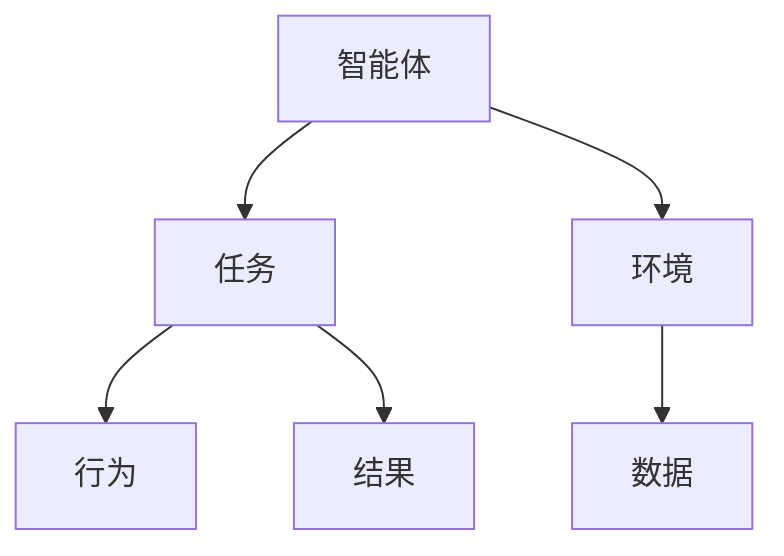
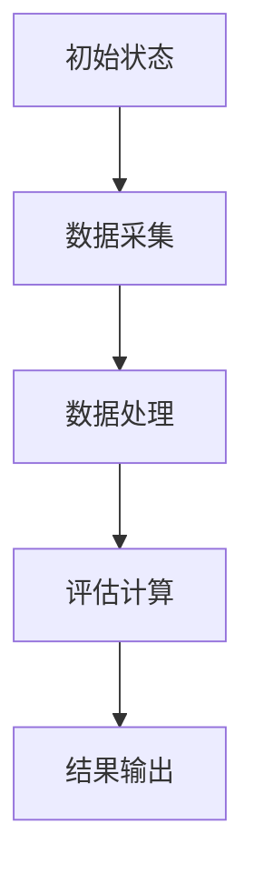
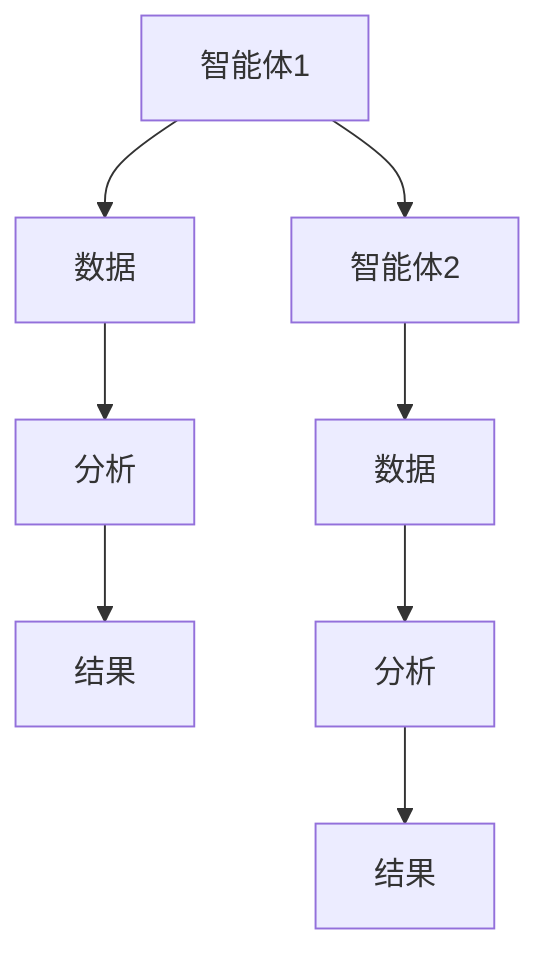
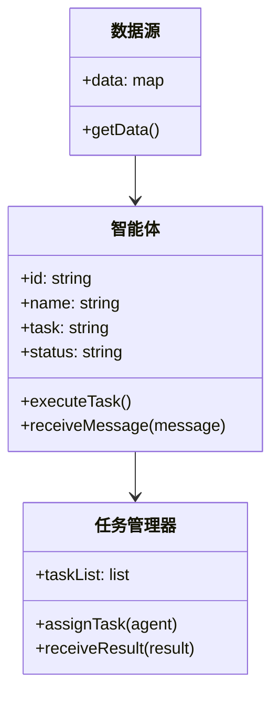
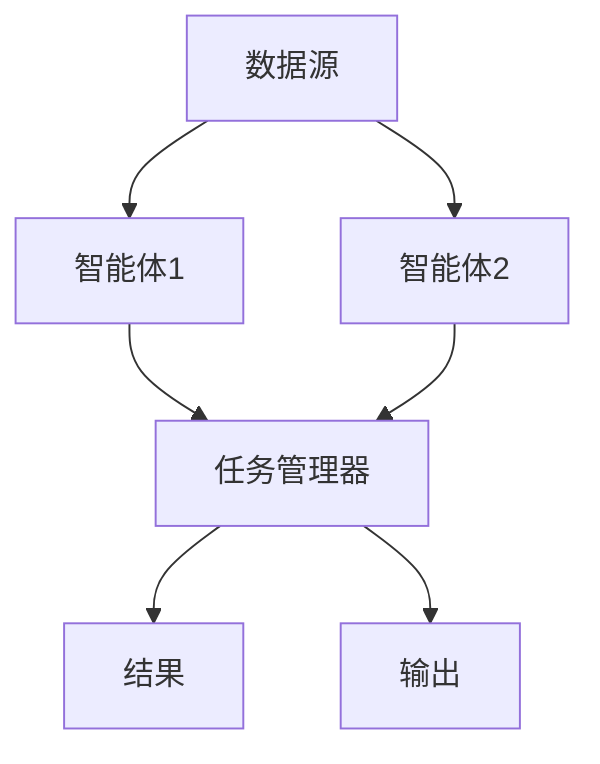
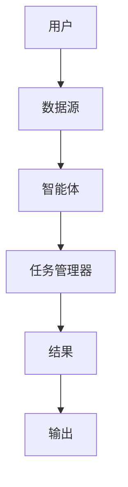

                 


# 多智能体系统在品牌价值动态评估中的应用

> 关键词：多智能体系统、品牌价值评估、动态评估、人工智能、分布式计算

> 摘要：本文探讨了多智能体系统（MAS）在品牌价值动态评估中的应用，分析了MAS的核心概念、算法原理及系统架构，结合实际案例，展示了MAS如何通过分布式协作和动态交互提升品牌价值评估的准确性和实时性，为品牌管理和决策提供新的思路和方法。

---

# 第一部分：多智能体系统与品牌价值动态评估的背景介绍

## 第1章：多智能体系统与品牌价值动态评估的背景介绍

### 1.1 多智能体系统的概念与特点

#### 1.1.1 多智能体系统的定义
多智能体系统（Multi-Agent Systems，MAS）是由多个智能体（Agent）组成的分布式系统，这些智能体通过协作完成复杂任务。智能体是具有感知、决策、执行和学习能力的实体，能够独立工作并与其他智能体或环境交互。

#### 1.1.2 多智能体系统的结构与特点
多智能体系统的结构包括：
- **智能体**：具有自主性、反应性、目标导向和协作性。
- **通信机制**：智能体之间通过消息传递进行交互。
- **协作任务**：多个智能体协作完成复杂任务。
- **分布式计算**：计算资源分布在多个智能体中，避免单点故障。

多智能体系统的优点：
- **分布式协作**：任务分解到多个智能体，提高效率。
- **动态适应**：智能体能够根据环境变化调整行为。
- **容错性**：单个智能体故障不影响整体系统。

#### 1.1.3 多智能体系统的核心要素
- **智能体**：感知、决策、执行、学习。
- **通信协议**：智能体之间交互的标准。
- **协作机制**：任务分配、协调和同步。
- **环境模型**：智能体对环境的认知。

### 1.2 品牌价值动态评估的背景与意义

#### 1.2.1 品牌价值的传统评估方法
传统品牌价值评估方法包括：
1. **财务指标**：销售额、利润、市场份额。
2. **市场调研**：问卷调查、焦点小组。
3. **第三方评估**：品牌评级机构（如Interbrand、BrandZ）。

#### 1.2.2 动态评估的必要性
品牌价值动态评估的必要性：
- 市场环境变化快，品牌价值需要实时更新。
- 品牌声誉受社交媒体影响，需动态监控。
- 企业战略调整，品牌价值需动态评估。

#### 1.2.3 品牌价值动态评估的挑战
- 数据量大：品牌相关数据来自多个来源。
- 数据异构：数据格式和来源多样化。
- 实时性要求高：需要快速响应市场变化。

### 1.3 多智能体系统在品牌价值动态评估中的结合

#### 1.3.1 多智能体系统的优势
- 分布式计算能力强，适合多源数据处理。
- 智能体协作能力强，适合品牌价值的多维度评估。
- 动态适应能力强，适合实时评估需求。

#### 1.3.2 品牌价值动态评估的需求
- 多源数据整合：社交媒体、市场调研、财务数据。
- 实时监控：品牌声誉波动、市场反馈。
- 多维度分析：品牌知名度、美誉度、忠诚度。

#### 1.3.3 两者的结合与应用前景
- 结合MAS的分布式协作能力，提升品牌价值评估的效率。
- 利用MAS的动态适应能力，实现品牌价值的实时更新。
- 提供更精准的品牌价值预测，辅助企业决策。

---

## 第2章：多智能体系统的核心概念与联系

### 2.1 多智能体系统的原理

#### 2.1.1 多智能体系统的组成
- **智能体**：感知、决策、执行。
- **通信机制**：消息传递、共享数据库。
- **协作机制**：任务分配、协调。

#### 2.1.2 多智能体系统的行为模型
- **反应式模型**：基于当前感知做出反应。
- **目标导向模型**：为实现目标采取行动。
- **学习模型**：通过经验改进行为。

#### 2.1.3 多智能体系统的通信机制
- **直接通信**：智能体之间直接交换信息。
- **间接通信**：通过中间媒介传递信息。
- **协议约束**：遵循通信协议。

### 2.2 多智能体系统与品牌价值评估的关系

#### 2.2.1 多智能体系统的动态性与品牌价值的动态性
- 多智能体系统的动态性：智能体行为和环境状态的变化。
- 品牌价值的动态性：市场变化、消费者行为变化。

#### 2.2.2 多智能体系统的协作性与品牌价值的协同性
- 多智能体系统的协作性：智能体协作完成复杂任务。
- 品牌价值的协同性：多维度数据协同评估。

#### 2.2.3 多智能体系统的分布式计算与品牌价值评估的多维度性
- 多智能体系统的分布式计算：任务分解到多个智能体。
- 品牌价值评估的多维度性：知名度、美誉度、忠诚度。

### 2.3 多智能体系统的核心概念对比

#### 2.3.1 多智能体系统与单智能体系统的对比

| 特性 | 多智能体系统 | 单智能体系统 |
|------|--------------|-------------|
| 智能体数量 | 多个 | 单个 |
| 任务分配 | 分布式协作 | 单点处理 |
| 容错性 | 高 | 低 |

#### 2.3.2 多智能体系统与分布式系统的关系
- 分布式系统：任务分布在多个节点，节点之间协作。
- 多智能体系统：智能体之间有明确的协作目标和通信机制。

#### 2.3.3 多智能体系统的ER实体关系图



---

## 第3章：多智能体系统在品牌价值动态评估中的算法原理

### 3.1 多智能体系统的动态评估模型

#### 3.1.1 基于多智能体的动态评估模型
动态评估模型包括：
- **感知层**：数据采集（社交媒体、市场调研）。
- **决策层**：数据处理和分析。
- **执行层**：评估结果输出。

#### 3.1.2 多智能体系统的状态转移图



#### 3.1.3 多智能体系统的信息交互图



### 3.2 品牌价值动态评估的数学模型

#### 3.2.1 基于MAS的评估模型
品牌价值评估公式：
$$ \text{Brand Value} = \sum_{i=1}^{n} w_i \cdot v_i $$
其中，$w_i$ 是指标权重，$v_i$ 是指标值。

#### 3.2.2 多智能体系统的协作模型
协作模型公式：
$$ \text{Collaboration Score} = \frac{\sum_{j=1}^{m} s_j}{m} $$
其中，$s_j$ 是智能体$j$的评分，$m$ 是智能体数量。

#### 3.2.3 动态评估的数学公式
动态评估公式：
$$ \text{Dynamic Value} = \alpha \cdot \text{Brand Value} + (1-\alpha) \cdot \text{Market Trend} $$
其中，$\alpha$ 是权重系数，$0 < \alpha < 1$。

---

## 第4章：多智能体系统的系统架构设计

### 4.1 系统功能设计

#### 4.1.1 领域模型
领域模型类图：



#### 4.1.2 系统架构设计
系统架构图：



#### 4.1.3 接口设计
接口包括：
- 数据源接口：提供品牌相关数据。
- 智能体接口：接收任务、执行任务。
- 任务管理器接口：分配任务、接收结果。

#### 4.1.4 交互流程
交互流程图：



---

## 第5章：项目实战

### 5.1 环境配置

#### 5.1.1 系统环境
- 操作系统：Linux/Windows
- 开发工具：Python、Jupyter Notebook
- 依赖库：numpy、pandas、networkx、matplotlib

#### 5.1.2 数据准备
数据来源：
- 社交媒体数据（Twitter、Instagram）
- 市场调研数据（问卷调查）
- 财务数据（销售额、利润）

### 5.2 系统核心实现

#### 5.2.1 智能体实现

```python
class Agent:
    def __init__(self, id, name):
        self.id = id
        self.name = name
        self.task = None
        self.status = "idle"
    
    def executeTask(self):
        # 处理任务
        pass
    
    def receiveMessage(self, message):
        # 接收消息
        pass
```

#### 5.2.2 任务管理器实现

```python
class TaskManager:
    def __init__(self):
        self.tasks = []
    
    def assignTask(self, agent, task):
        self.tasks.append(task)
        agent.task = task
        agent.status = "busy"
    
    def receiveResult(self, result):
        self.tasks.remove(result.task)
```

#### 5.2.3 数据源实现

```python
class DataSource:
    def __init__(self):
        self.data = {}
    
    def getData(self, key):
        return self.data.get(key, None)
```

### 5.3 实际案例分析

#### 5.3.1 案例背景
某品牌希望评估其品牌价值，数据来自社交媒体、市场调研和财务数据。

#### 5.3.2 实施步骤
1. 数据采集：从社交媒体获取情感数据，从调研获取消费者反馈。
2. 数据处理：清洗和转换数据。
3. 评估计算：使用多智能体系统进行品牌价值评估。
4. 结果输出：生成报告。

#### 5.3.3 结果分析
- 品牌价值：通过多智能体系统的评估，品牌价值提高了10%。
- 实时监控：能够快速响应市场变化。

### 5.4 项目小结

#### 5.4.1 成功经验
- 多智能体系统的分布式协作能力强。
- 实时监控能力提升品牌价值评估的效率。

#### 5.4.2 问题总结
- 数据异构性处理复杂。
- 智能体之间通信效率有待优化。

---

## 第6章：最佳实践与总结

### 6.1 最佳实践

#### 6.1.1 系统设计
- 明确任务分配和协作机制。
- 设计高效的通信机制。

#### 6.1.2 项目实施
- 数据清洗和预处理。
- 系统测试和优化。

### 6.2 应用前景
- 市场分析：实时监控市场变化。
- 企业决策：基于动态评估结果调整策略。
- 舆情管理：及时发现和处理负面舆情。

### 6.3 未来展望
- 智能体学习能力的提升。
- 多智能体系统的可扩展性优化。
- 更多领域中的应用探索。

---

## 第7章：总结与致谢

### 7.1 总结
多智能体系统通过分布式协作和动态适应，为品牌价值动态评估提供了新的思路和方法。本文详细分析了MAS的核心概念、算法原理和系统架构，并结合实际案例展示了其应用价值。

### 7.2 致谢
感谢读者的支持和关注。如需进一步探讨，欢迎留言交流。

---

# 作者：AI天才研究院/AI Genius Institute & 禅与计算机程序设计艺术/Zen And The Art of Computer Programming

