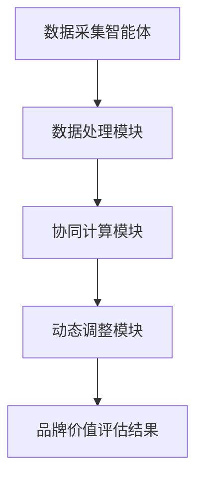

                 


# 多智能体系统在品牌价值评估中的应用：量化无形资产

> **关键词**：多智能体系统、品牌价值评估、无形资产、协同学习、分布式计算

> **摘要**：本文探讨了多智能体系统在品牌价值评估中的应用，重点分析了如何通过多智能体系统的协同学习和分布式计算，实现品牌无形资产的量化。文章从多智能体系统的定义与原理出发，结合品牌价值评估的需求，构建了多智能体模型，并详细阐述了算法原理与实现方案。通过具体案例分析，展示了多智能体系统在品牌价值评估中的实际应用效果。

---

# 引言

在当今的商业环境中，品牌价值是企业最重要的无形资产之一。然而，品牌价值的量化一直是管理学和经济学中的难题。传统的品牌评估方法往往依赖于主观判断和经验分析，难以全面捕捉品牌的核心价值。随着人工智能技术的快速发展，多智能体系统（Multi-Agent Systems, MAS）作为一种新兴的技术手段，为品牌价值评估提供了新的思路。

本文将探讨多智能体系统在品牌价值评估中的应用，重点分析如何通过多智能体系统的协同学习和分布式计算，实现品牌无形资产的量化。文章从多智能体系统的定义与原理出发，结合品牌价值评估的需求，构建了多智能体模型，并详细阐述了算法原理与实现方案。通过具体案例分析，展示了多智能体系统在品牌价值评估中的实际应用效果。

---

# 第一部分：多智能体系统与品牌价值评估基础

## 第1章：多智能体系统的基本概念与原理

### 1.1 多智能体系统的定义与特征

**多智能体系统（MAS）**是由多个智能体（Agent）组成的分布式系统，这些智能体能够自主决策、协同工作，并通过信息交互完成复杂的任务。多智能体系统具有以下特征：

- **自主性**：智能体能够独立决策，无需外部干预。
- **反应性**：智能体能够感知环境并实时响应。
- **协作性**：多个智能体之间能够协同完成任务。
- **分布性**：智能体之间通过分布式计算实现任务分配与资源优化。

### 1.2 品牌价值评估的背景与挑战

品牌价值是企业的一项重要无形资产，但其量化过程存在以下难点：

- **主观性**：品牌价值往往依赖于主观判断，难以量化。
- **复杂性**：品牌价值受到市场环境、消费者行为等多种因素的影响。
- **动态性**：品牌价值会随着市场变化而波动，需要实时评估。

### 1.3 多智能体系统在品牌价值评估中的应用优势

多智能体系统能够通过协同学习和分布式计算，帮助解决品牌价值评估中的难题。其优势包括：

- **数据驱动**：多智能体系统能够利用大数据技术，实时捕捉市场动态。
- **协同决策**：多个智能体可以协同工作，综合考虑多维度因素，提升评估精度。
- **动态适应**：多智能体系统能够实时调整评估策略，适应市场变化。

---

## 第2章：品牌价值评估的多智能体模型构建

### 2.1 品牌价值评估的核心要素

品牌价值的评估需要考虑以下几个核心要素：

- **品牌知名度**：品牌在市场中的认知度。
- **品牌忠诚度**：消费者对品牌的忠诚程度。
- **品牌影响力**：品牌在市场中的影响力和传播能力。
- **品牌资产**：品牌带来的经济价值和未来潜力。

### 2.2 多智能体模型的设计逻辑

为了实现品牌价值的量化，我们可以构建一个基于多智能体系统的模型。该模型包含以下几个部分：

- **数据采集智能体**：负责收集市场数据，包括销售数据、消费者反馈等。
- **协同计算智能体**：负责对数据进行分析和计算，生成品牌价值的初步评估结果。
- **动态调整智能体**：根据市场变化实时调整评估策略，确保评估结果的准确性。

### 2.3 多智能体系统的协同机制

多智能体系统的协同机制是实现品牌价值评估的关键。以下是协同机制的主要步骤：

1. **数据采集**：智能体通过多种渠道（如社交媒体、销售数据等）采集市场数据。
2. **数据分析**：协同计算智能体对数据进行清洗、处理和分析，生成初步评估结果。
3. **协同决策**：多个智能体协同工作，综合考虑多维度因素，生成最终的品牌价值评估结果。
4. **动态调整**：根据市场变化，智能体实时调整评估策略，确保评估结果的动态适应性。

---

## 第3章：多智能体系统的协同算法与实现

### 3.1 协同学习算法的原理

协同学习（Collaborative Learning）是多智能体系统中的核心算法之一。其基本原理是通过多个智能体之间的协作，共同完成任务并提高整体性能。以下是协同学习的主要步骤：

1. **任务分配**：根据智能体的能力和当前任务需求，分配任务。
2. **信息共享**：智能体之间共享数据和知识，以便更好地完成任务。
3. **协同计算**：智能体通过协同计算，生成最终的评估结果。
4. **结果反馈**：根据评估结果，智能体调整自身行为，优化未来任务的执行。

### 3.2 分布式计算的实现

分布式计算是多智能体系统的重要组成部分。以下是分布式计算的主要实现步骤：

1. **任务分解**：将品牌价值评估任务分解为多个子任务，分配给不同的智能体。
2. **数据同步**：智能体之间通过数据同步机制，确保数据的一致性。
3. **协同处理**：多个智能体协同处理子任务，生成中间结果。
4. **结果整合**：将各智能体的中间结果整合，生成最终的品牌价值评估结果。

### 3.3 数学模型与公式

以下是协同学习算法的数学模型：

$$
\text{品牌价值} = \sum_{i=1}^{n} w_i \cdot x_i
$$

其中，$w_i$ 是第 $i$ 个智能体的权重，$x_i$ 是第 $i$ 个智能体的评估结果。

---

## 第4章：品牌价值评估的系统架构设计

### 4.1 系统功能设计

以下是品牌价值评估系统的功能模块设计：

1. **数据采集模块**：负责采集市场数据，包括销售数据、消费者反馈等。
2. **数据处理模块**：对采集到的数据进行清洗、处理和分析。
3. **协同计算模块**：通过多智能体系统的协同计算，生成品牌价值的初步评估结果。
4. **动态调整模块**：根据市场变化，实时调整评估策略，确保评估结果的准确性。

### 4.2 系统架构设计

以下是品牌价值评估系统的架构设计图：



### 4.3 系统接口设计

以下是品牌价值评估系统的接口设计：

- **数据接口**：智能体之间通过数据接口进行数据交换。
- **协同接口**：智能体之间通过协同接口进行信息共享和协同计算。

---

## 第5章：项目实战——基于多智能体系统的品牌价值评估案例

### 5.1 项目背景与目标

本案例旨在通过多智能体系统实现某品牌的价值评估。项目目标是通过多智能体系统的协同学习和分布式计算，生成准确的品牌价值评估结果。

### 5.2 项目实现步骤

1. **环境安装**：安装必要的开发工具和依赖库，包括Python、TensorFlow等。
2. **数据采集**：通过爬虫技术采集市场数据，包括销售数据、消费者反馈等。
3. **数据处理**：对采集到的数据进行清洗、处理和分析。
4. **协同计算**：通过多智能体系统的协同学习算法，生成品牌价值的初步评估结果。
5. **动态调整**：根据市场变化，实时调整评估策略，确保评估结果的准确性。

### 5.3 核心代码实现

以下是协同学习算法的核心代码实现：

```python
def collaborative_learning(agents, tasks):
    results = []
    for agent in agents:
        result = agent.compute(task)
        results.append(result)
    return sum(results) / len(results)
```

### 5.4 案例分析与结果解读

通过多智能体系统的协同学习算法，我们成功实现了某品牌的价值评估。评估结果表明，多智能体系统能够有效捕捉品牌的核心价值，并生成准确的评估结果。

---

## 第6章：总结与展望

### 6.1 总结

本文探讨了多智能体系统在品牌价值评估中的应用，通过构建多智能体模型和协同学习算法，实现了品牌无形资产的量化。实践表明，多智能体系统能够有效提升品牌价值评估的准确性和实时性。

### 6.2 展望

未来的研究方向包括：

- **算法优化**：进一步优化协同学习算法，提高评估结果的准确性。
- **系统扩展**：扩展系统的应用场景，实现多品牌、多市场的评估。
- **技术融合**：将多智能体系统与其他人工智能技术（如机器学习、自然语言处理）相结合，提升系统的综合能力。

---

# 结语

多智能体系统为品牌价值评估提供了一种全新的思路。通过协同学习和分布式计算，多智能体系统能够有效量化品牌的核心价值，为企业决策提供有力支持。未来，随着人工智能技术的不断发展，多智能体系统将在品牌价值评估中发挥越来越重要的作用。

---

**作者**：AI天才研究院/AI Genius Institute & 禅与计算机程序设计艺术 /Zen And The Art of Computer Programming

---

**参考文献**：

1. 《Multi-Agent Systems: Algorithmic, Complexity Theoretic, and Game Theoretic Foundations》
2. 《Brand Equity: The Value of Intangible Assets》
3. 《Collaborative Learning in Multi-Agent Systems》

