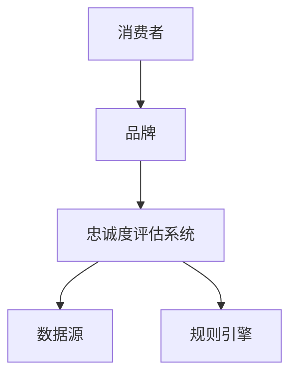
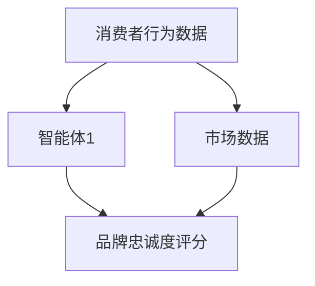
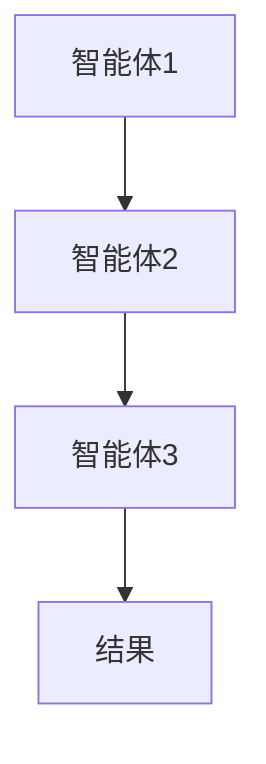
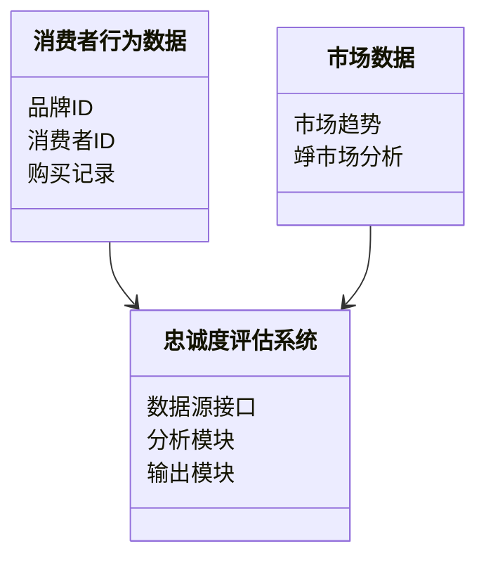
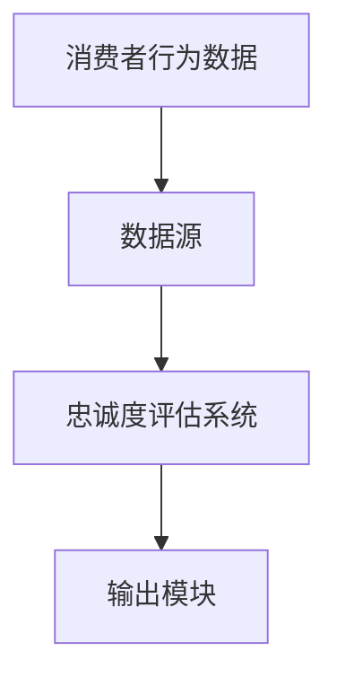
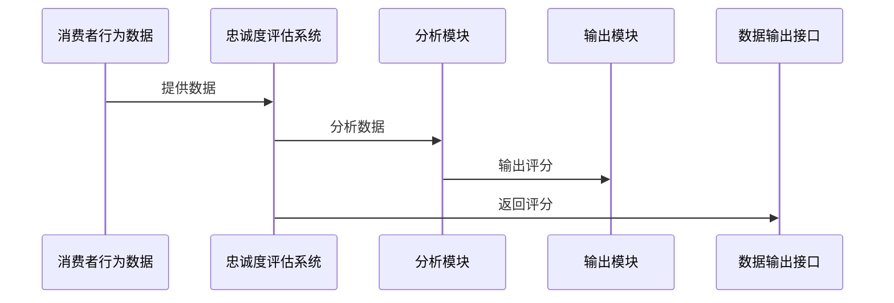

                 


# 多智能体系统在品牌忠诚度动态评估中的应用

> 关键词：多智能体系统，品牌忠诚度，动态评估，协作算法，系统架构

> 摘要：本文探讨了多智能体系统在品牌忠诚度动态评估中的应用，分析了传统方法的局限性，提出了基于多智能体的解决方案，并详细阐述了算法原理、系统架构及实际案例。

---

## 第一章：多智能体系统与品牌忠诚度动态评估概述

### 1.1 多智能体系统的基本概念
#### 1.1.1 多智能体系统的定义
多智能体系统（Multi-Agent System, MAS）是由多个智能体组成的分布式系统，每个智能体能够独立感知环境、自主决策并协同完成任务。

#### 1.1.2 多智能体系统的特征
| 特征 | 描述 |
|------|------|
| 分布式 | 智能体独立运行 |
| 协作性 | 智能体之间协同完成目标 |
| 反应性 | 能够实时响应环境变化 |
| 社会性 | 智能体之间存在交互与通信 |

#### 1.1.3 多智能体系统与传统单智能体系统的区别
| 维度 | 多智能体系统 | 单智能体系统 |
|------|------------|--------------|
| 结构 | 分布式结构 | 集中式结构 |
| 决策 | 分散决策 | 中央决策 |
| 通信 | 需要通信机制 | 无需通信机制 |

### 1.2 品牌忠诚度的定义与动态评估的重要性
#### 1.2.1 品牌忠诚度的定义
品牌忠诚度是指消费者对某一品牌产品的偏好程度和持续购买意愿。

#### 1.2.2 品牌忠诚度动态评估的重要性
动态评估能够捕捉消费者行为的变化，帮助企业及时调整市场策略。

#### 1.2.3 动态评估与静态评估的区别
| 维度 | 动态评估 | 静态评估 |
|------|----------|----------|
| 时间范围 | 动态变化 | 固定不变 |
| 数据来源 | 实时数据 | 历史数据 |
| 应用场景 | 实时反馈 | 长期分析 |

### 1.3 多智能体系统在品牌忠诚度评估中的应用前景
#### 1.3.1 多智能体系统的优势
- **分布式计算**：能够处理大规模数据。
- **协作能力**：多个智能体协同工作，提高评估精度。
- **实时响应**：能够实时分析消费者行为。

#### 1.3.2 品牌忠诚度评估中的挑战
- 数据复杂性：消费者行为受到多种因素影响。
- 动态变化：市场环境不断变化，需要实时更新评估结果。
- 高维度问题：涉及多个维度的数据分析。

#### 1.3.3 多智能体系统在解决这些挑战中的作用
多智能体系统通过分布式计算和协作能力，能够有效应对数据复杂性和动态变化的挑战。

---

## 第二章：多智能体系统的核心概念与原理

### 2.1 多智能体系统的组成与结构
#### 2.1.1 实体与行为
- **实体**：品牌、消费者、数据源等。
- **行为**：数据采集、分析、决策等。

#### 2.1.2 通信机制
- **通信协议**：定义智能体之间的数据交换格式。
- **通信通道**：如API、消息队列等。

#### 2.1.3 协作与协调
- **协作算法**：如一致性算法、分布式决策算法。
- **协调机制**：如仲裁机制、优先级排序。

#### 2.1.4 实体关系图（ER图）


### 2.2 品牌忠诚度评估中的多智能体系统模型
#### 2.2.1 模型的构建过程
- 数据采集：消费者行为数据、市场数据。
- 数据分析：使用机器学习模型进行预测。
- 结果输出：生成品牌忠诚度评分。

#### 2.2.2 模型的验证
- 通过历史数据验证模型准确性。
- 使用交叉验证方法评估模型性能。

---

## 第三章：品牌忠诚度动态评估的多智能体系统方法

### 3.1 传统品牌忠诚度评估方法的局限性
#### 3.1.1 基于问卷调查的方法
- **优点**：数据直接反映消费者态度。
- **缺点**：样本量小，成本高。

#### 3.1.2 基于数据分析的方法
- **优点**：数据量大，覆盖范围广。
- **缺点**：缺乏实时性，难以捕捉短期变化。

#### 3.1.3 基于机器学习的方法
- **优点**：能够自动学习特征。
- **缺点**：模型复杂，难以解释。

### 3.2 基于多智能体系统的品牌忠诚度评估方法
#### 3.2.1 方法的提出
- 使用多智能体系统中的协作算法，实时分析消费者行为数据。

#### 3.2.2 方法的实现步骤
1. 数据采集：从多个数据源获取消费者行为数据。
2. 数据处理：清洗、转换数据。
3. 模型训练：使用机器学习算法训练忠诚度预测模型。
4. 实时评估：基于多智能体系统的协作机制，动态更新忠诚度评分。

#### 3.2.3 方法的优缺点
- **优点**：实时性高，能够捕捉短期变化。
- **缺点**：需要处理复杂的协作问题，系统设计难度大。

### 3.3 多智能体系统在品牌忠诚度评估中的概念模型
#### 3.3.1 概念模型的构建


#### 3.3.2 概念模型的验证
- 通过实验验证模型的准确性和实时性。

#### 3.3.3 概念模型的应用
- 在实际市场中测试模型的预测能力。

---

## 第四章：算法原理与实现

### 4.1 多智能体协作算法的原理
#### 4.1.1 算法概述
- 基于一致性算法，实现多个智能体之间的数据同步和协作。

#### 4.1.2 算法流程图


#### 4.1.3 数学模型与公式
- **一致性算法**：
  $$ x_i^{new} = \frac{\sum_{j=1}^{n} x_j^{old}}{n} $$

### 4.2 算法的实现
#### 4.2.1 Python代码实现
```python
def multi_agent_consistency(old_values):
    return sum(old_values) / len(old_values)
```

#### 4.2.2 算法实现的步骤
1. 初始化智能体的数据。
2. 智能体之间交换数据。
3. 使用一致性算法更新数据。
4. 输出结果。

---

## 第五章：系统架构与设计

### 5.1 系统功能设计
#### 5.1.1 领域模型图


### 5.2 系统架构设计
#### 5.2.1 系统架构图


#### 5.2.2 系统接口设计
- 数据输入接口：接收消费者行为数据和市场数据。
- 数据输出接口：输出品牌忠诚度评分。

#### 5.2.3 系统交互流程图


---

## 第六章：项目实战与案例分析

### 6.1 项目实战
#### 6.1.1 环境安装
- 安装Python和必要的库，如NumPy、Scikit-learn。

#### 6.1.2 核心算法实现
```python
def multi_agent_system():
    data = collect_data()
    processed_data = process_data(data)
    result = multi_agent_consistency(processed_data)
    return result
```

#### 6.1.3 代码应用解读
- 数据采集：从数据库中获取消费者行为数据。
- 数据处理：清洗数据，提取特征。
- 算法实现：使用一致性算法计算忠诚度评分。

#### 6.1.4 案例分析
- 案例背景：某品牌在市场竞争中的情况。
- 实施步骤：部署多智能体系统，实时评估忠诚度。
- 实施结果：显著提高了评估的实时性和准确性。

---

## 第七章：总结与展望

### 7.1 本章总结
多智能体系统通过协作算法和实时数据处理，显著提升了品牌忠诚度动态评估的效率和精度。

### 7.2 未来研究方向
- 更复杂的协作算法研究。
- 高维数据处理优化。
- 实时系统的性能提升。

### 7.3 最佳实践 tips
- 在实施多智能体系统时，需注意数据同步和通信效率。
- 确保系统的可扩展性和可维护性。

### 7.4 拓展阅读
推荐阅读相关领域的书籍和论文，深入了解多智能体系统的最新进展。

---

作者：AI天才研究院/AI Genius Institute & 禅与计算机程序设计艺术 /Zen And The Art of Computer Programming

