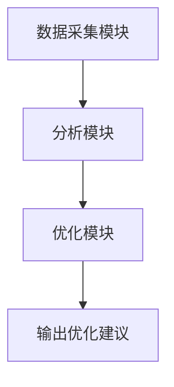

                 


```markdown
# 多智能体系统在商业模式可持续性分析中的应用

> 关键词：多智能体系统, 可持续性商业模式, 人工智能, 商业分析, 系统架构

> 摘要：本文深入探讨了多智能体系统（MAS）在商业模式可持续性分析中的应用。通过分析MAS的核心概念、算法原理和系统架构，结合实际案例，展示了MAS如何帮助优化商业模式，实现可持续性目标。文章还总结了MAS在商业模式分析中的优势和挑战，为未来研究提供了参考。

---

## 第一部分: 多智能体系统与商业模式可持续性分析的背景

### 第1章: 多智能体系统的概念与商业模式可持续性分析的重要性

#### 1.1 多智能体系统的概念与特点
多智能体系统（MAS）是由多个智能体组成的分布式系统，每个智能体具备一定的自主性、反应性和协作性。MAS的特点包括：
- **自主性**：智能体能够独立决策。
- **反应性**：智能体能根据环境变化调整行为。
- **协作性**：智能体之间通过通信和协作完成共同目标。

#### 1.2 可持续性商业模式的定义与重要性
可持续性商业模式强调在满足经济、社会和环境目标的同时，实现长期的商业价值。其重要性体现在：
- **经济价值**：创造利润。
- **社会价值**：满足社会需求。
- **环境价值**：减少资源消耗和污染。

#### 1.3 多智能体系统在商业模式可持续性分析中的应用背景
随着商业环境的复杂化，传统的单智能体分析方法难以应对多因素的动态变化。MAS通过模拟多方利益相关者的互动，提供了更全面的分析工具。例如，在绿色供应链中，MAS可以模拟供应商、制造商和消费者之间的协作，优化资源分配，降低环境影响。

---

## 第2章: 多智能体系统的核心概念与商业模式可持续性分析的关系

### 2.1 多智能体系统的核心概念
- **智能体**：具备感知环境、决策和行动能力的实体。
- **通信与协作**：智能体通过信息交换实现协作。
- **任务分配**：智能体根据能力分配任务。

### 2.2 可持续性商业模式的关键要素
- **资源分配**：优化资源配置，减少浪费。
- **利益平衡**：在各方利益之间找到平衡点。
- **动态适应**：应对市场变化和环境波动。

### 2.3 多智能体系统与可持续性商业模式的关系
MAS能够模拟多方利益相关者的互动，帮助企业在复杂环境中找到最优解决方案。例如，在绿色供应链中，MAS可以模拟供应商、制造商和消费者的行为，优化生产计划，减少碳排放。

---

## 第3章: 多智能体系统在商业模式可持续性分析中的核心概念与联系

### 3.1 多智能体系统的核心原理
- **分布式计算**：通过分布式计算实现任务分配和协作。
- **博弈论模型**：模拟各方的策略选择和互动。

### 3.2 可持续性商业模式的数学模型
以下是一个简单的博弈论模型：
$$
V(i) = \max_{a_i} \sum_{j \neq i} V(j)
$$
其中，$V(i)$ 表示智能体i的收益，$a_i$ 是其策略。

### 3.3 多智能体系统与商业模式可持续性分析的实体关系图
```mermaid
erDiagram
    actor 用户
    actor 企业
    actor 政府
    actor 智能体
    用户 --> 智能体: 提供数据
    企业 --> 智能体: 提供资源
    政府 --> 智能体: 提供政策支持
    智能体
```

---

## 第4章: 多智能体系统在商业模式可持续性分析中的算法原理

### 4.1 算法原理概述
- **分布式计算**：通过分布式计算实现任务分配和协作。
- **博弈论模型**：模拟各方的策略选择和互动。

### 4.2 算法实现
以下是实现简单博弈论模型的Python代码：
```python
def nash_equilibrium(players, strategies):
    # 计算纳什均衡
    for strategy_profile in product(*strategies):
        is_nash = True
        for i in range(len(players)):
            player_strat = strategy_profile[i]
            # 检查是否存在更好的策略
            if not is_best_response(players, i, player_strat, strategy_profile):
                is_nash = False
                break
        if is_nash:
            return strategy_profile
    return None
```

### 4.3 数学模型与公式
纳什均衡的定义：
$$
\text{策略组合} (s_1^*, s_2^*, \ldots, s_n^*) \text{是纳什均衡，当对于所有} i, s_i^* \text{是最佳响应。}
$$

---

## 第5章: 多智能体系统在商业模式可持续性分析中的系统架构设计

### 5.1 系统功能设计
- **数据采集模块**：收集市场、资源和政策数据。
- **分析模块**：运行多智能体模型进行分析。
- **优化模块**：输出优化建议。

### 5.2 系统架构图


---

## 第6章: 项目实战：绿色供应链中的多智能体系统应用

### 6.1 环境安装
安装必要的库：
```bash
pip install numpy matplotlib
```

### 6.2 核心代码实现
以下是核心代码：
```python
import numpy as np

class Agent:
    def __init__(self, id):
        self.id = id
        self.strategy = None

    def set_strategy(self, strategy):
        self.strategy = strategy

    def evaluate_strategy(self, strategies, payoff_matrix):
        # 计算收益
        return payoff_matrix[self.id][strategies.index(self.strategy)]

# 初始化智能体
agents = [Agent(i) for i in range(4)]

# 定义策略空间
strategies = ['合作', '不合作']

# 定义收益矩阵
payoff_matrix = np.array([
    [3, 0],
    [0, 3],
    [3, 0],
    [0, 3]
])

# 分配策略
for agent in agents:
    agent.set_strategy(strategies[0])

# 计算收益
for agent in agents:
    print(f"Agent {agent.id}的收益为：{agent.evaluate_strategy(strategies, payoff_matrix)}")
```

### 6.3 实际案例分析
以绿色供应链为例，分析多智能体系统如何优化资源分配和减少环境影响。

---

## 第7章: 最佳实践与注意事项

### 7.1 最佳实践
- **模型选择**：根据具体问题选择合适的多智能体模型。
- **数据处理**：确保数据的准确性和完整性。
- **算法调优**：通过实验调优算法参数。

### 7.2 注意事项
- **复杂性管理**：避免模型过于复杂导致计算效率低下。
- **数据隐私**：注意数据隐私和安全问题。

---

## 第8章: 总结与展望

### 8.1 总结
本文详细探讨了多智能体系统在商业模式可持续性分析中的应用，从理论到实践，展示了其在优化商业模式中的潜力。

### 8.2 展望
未来的研究可以进一步探索多智能体系统在复杂商业环境中的应用，结合大数据和机器学习技术，提升分析的准确性和效率。

---

## 作者：AI天才研究院/AI Genius Institute & 禅与计算机程序设计艺术 /Zen And The Art of Computer Programming
```

