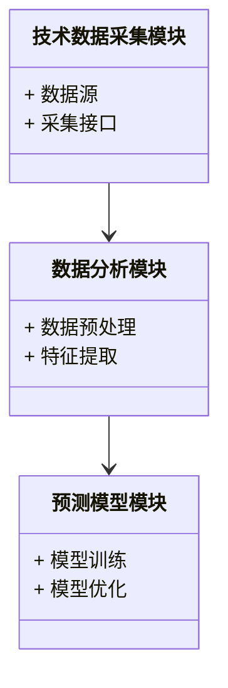
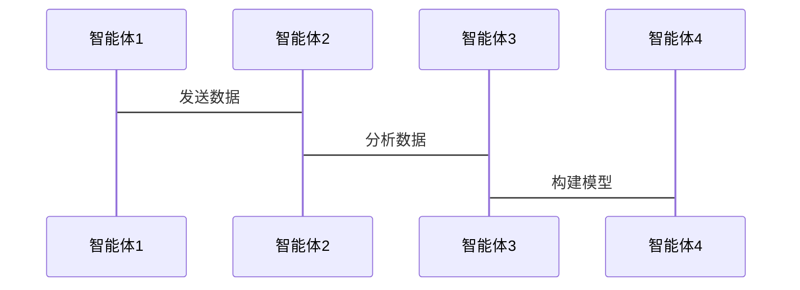

                 


# 多智能体系统在技术趋势预测中的应用：把握创新机遇

## 关键词：多智能体系统，技术趋势预测，分布式计算，协同学习，博弈论，系统架构设计

## 摘要：  
随着技术的飞速发展，准确预测技术趋势变得越来越重要。多智能体系统（Multi-Agent System, MAS）通过多个智能体的协作，能够有效捕捉和分析复杂的技术动态。本文将详细探讨多智能体系统在技术趋势预测中的应用，分析其核心概念、算法原理、系统架构，并通过实际案例展示其优势。通过本文，读者将能够理解多智能体系统如何帮助我们把握技术发展的创新机遇。

---

## 第一章: 多智能体系统与技术趋势预测概述

### 1.1 多智能体系统的定义与特点

#### 1.1.1 多智能体系统的定义  
多智能体系统是由多个智能体组成的分布式系统，每个智能体能够感知环境、自主决策并与其他智能体协作。多智能体系统通过智能体之间的通信与协作，能够完成复杂任务。

#### 1.1.2 多智能体系统的核心特点  
- **分布式性**：智能体独立运行，通过通信协作完成任务。  
- **自主性**：每个智能体能够自主决策。  
- **社会性**：智能体之间通过交互协作解决问题。  
- **动态性**：系统能够适应环境变化。  

#### 1.1.3 多智能体系统的优势与劣势  
**优势**：  
- 高效性：多个智能体协作能够提高问题解决效率。  
- 灵活性：系统能够适应复杂环境的变化。  
**劣势**：  
- 复杂性：多个智能体协作需要复杂的通信和协调机制。  
- 成本高：开发和维护多智能体系统需要较高的资源投入。  

### 1.2 技术趋势预测的背景与挑战

#### 1.2.1 技术趋势预测的定义  
技术趋势预测是指通过分析当前的技术发展、市场动态和用户需求，预测未来技术的发展方向和趋势。

#### 1.2.2 技术趋势预测的难点  
- **数据复杂性**：技术趋势涉及多领域数据，分析难度大。  
- **不确定性**：技术发展受多种因素影响，预测结果存在不确定性。  
- **动态变化**：技术趋势会随着市场和用户需求的变化而变化。  

#### 1.2.3 技术趋势预测的现有方法与不足  
传统方法如统计分析和专家访谈难以捕捉技术动态的复杂性。基于单一智能体的预测模型在处理多维度数据时表现有限。

### 1.3 多智能体系统在技术趋势预测中的应用价值

#### 1.3.1 多智能体系统如何提升技术预测的准确性  
多智能体系统通过多个智能体的协作，能够从多个维度分析数据，提高预测的准确性。

#### 1.3.2 多智能体系统在技术趋势预测中的独特优势  
- **分布式计算**：多个智能体能够同时处理大量数据，提高计算效率。  
- **协同学习**：智能体之间可以共享知识和经验，提升整体预测能力。  

#### 1.3.3 技术趋势预测的创新机遇  
通过多智能体系统的应用，技术趋势预测能够更加精准，为企业和技术开发者提供更有力的支持。

---

## 第二章: 多智能体系统的核心概念与联系

### 2.1 多智能体系统的原理与机制

#### 2.1.1 多智能体系统的组成要素  
- **智能体**：独立运行的个体，能够感知环境并自主决策。  
- **通信机制**：智能体之间的信息交换方式。  
- **协作机制**：智能体如何共同完成任务。  

#### 2.1.2 多智能体系统的通信与协作机制  
- **直接通信**：智能体之间直接交换信息。  
- **间接通信**：通过中间媒介进行信息传递。  

#### 2.1.3 多智能体系统的决策与学习机制  
- **基于规则的决策**：根据预设规则进行决策。  
- **基于学习的决策**：通过机器学习模型进行决策。  

### 2.2 多智能体系统与技术趋势预测的关系

#### 2.2.1 技术趋势预测的核心问题  
- **数据采集**：如何获取多维度的技术数据。  
- **数据分析**：如何从数据中提取有用信息。  
- **预测模型**：如何构建准确的预测模型。  

#### 2.2.2 多智能体系统如何解决技术预测问题  
通过多个智能体的协作，多智能体系统能够同时处理大量的数据，并通过分布式计算提高预测效率。

#### 2.2.3 多智能体系统与技术预测的结合点  
- **数据采集与分析**：多个智能体分别负责不同数据源的采集和分析。  
- **预测模型构建**：多个智能体协作构建复杂的预测模型。  

### 2.3 多智能体系统的核心概念对比

#### 2.3.1 不同智能体模型的对比分析  
| 智能体模型 | 描述 | 优点 | 缺点 |
|------------|------|------|------|
| 单一智能体 | 单个智能体完成任务 | 简单易实现 | 适应性差 |
| 分布式智能体 | 多个智能体协作完成任务 | 高效性 | 复杂性高 |

#### 2.3.2 ER实体关系图架构  
```mermaid
er
  entity 智能体 {
    key 属性: �唯一大智能体标识符
    attribute 状态
    attribute 行为
  }
```

---

## 第三章: 多智能体系统的算法原理

### 3.1 多智能体系统的核心算法

#### 3.1.1 分布式计算  
- **定义**：分布式计算是指将计算任务分配给多个计算节点，共同完成任务。  
- **流程**：任务分解 -> 分配 -> 执行 -> 合并结果。  

#### 3.1.2 协同学习  
- **定义**：协同学习是指多个智能体通过协作学习共同优化模型。  
- **流程**：数据共享 -> 模型训练 -> 模型融合。  

### 3.2 多智能体系统算法的实现步骤

#### 3.2.1 分布式计算的实现步骤  
1. **任务分解**：将问题分解为多个子任务。  
2. **任务分配**：将子任务分配给不同的计算节点。  
3. **任务执行**：各个节点并行执行任务。  
4. **结果合并**：将各个节点的结果合并，得到最终结果。  

#### 3.2.2 协同学习的实现步骤  
1. **数据共享**：各个智能体共享数据。  
2. **模型训练**：各个智能体分别训练模型。  
3. **模型融合**：将各个模型的参数进行融合，得到最终模型。  

### 3.3 多智能体系统算法的数学模型

#### 3.3.1 分布式计算的数学模型  
$$ \text{总计算时间} = \sum_{i=1}^{n} \text{节点i的计算时间} $$  

#### 3.3.2 协同学习的数学模型  
$$ \text{最终模型参数} = \sum_{i=1}^{n} \lambda_i \cdot \text{模型i的参数} $$  

### 3.4 算法实现的代码示例

#### 3.4.1 分布式计算的Python代码示例  
```python
import multiprocessing

def compute_task(task_id):
    # 计算任务逻辑
    return result

if __name__ == "__main__":
    tasks = [1, 2, 3, 4]
    with multiprocessing.Pool() as pool:
        results = pool.map(compute_task, tasks)
        print(results)
```

#### 3.4.2 协同学习的Python代码示例  
```python
import numpy as np

class Agent:
    def __init__(self, data):
        self.model = self.build_model()
        self.model.train(data)

    def build_model(self):
        # 构建模型
        pass

    def train(self, data):
        # 训练模型
        pass

# 初始化多个智能体
agents = [Agent(data_i) for i in range(n)]
# 模型融合
final_weights = np.mean([agent.model.get_weights() for agent in agents], axis=0)
```

---

## 第四章: 多智能体系统的系统分析与架构设计

### 4.1 系统分析

#### 4.1.1 技术趋势预测的场景介绍  
技术趋势预测需要考虑多个因素，包括技术发展、市场动态和用户需求。

#### 4.1.2 系统功能设计  
- **数据采集模块**：采集多维度技术数据。  
- **数据分析模块**：分析数据，提取有用信息。  
- **预测模型模块**：构建和优化预测模型。  

#### 4.1.3 领域模型类图  


### 4.2 系统架构设计

#### 4.2.1 系统架构图  


#### 4.2.2 系统接口设计  
- **数据接口**：智能体之间的数据交互接口。  
- **通信接口**：智能体之间的通信接口。  

#### 4.2.3 系统交互序列图  


---

## 第五章: 多智能体系统的项目实战

### 5.1 项目背景与目标

#### 5.1.1 项目背景  
本项目旨在利用多智能体系统进行技术趋势预测，提高预测的准确性和效率。

#### 5.1.2 项目目标  
- 实现多智能体系统的数据采集和分析功能。  
- 构建和优化预测模型。  

### 5.2 项目实施

#### 5.2.1 环境安装  
- 安装Python和相关库（如multiprocessing、numpy）。  

#### 5.2.2 系统核心实现  
- 数据采集模块：采集技术数据。  
- 数据分析模块：分析数据，提取特征。  
- 预测模型模块：构建和优化预测模型。  

#### 5.2.3 代码实现与解读  
```python
import multiprocessing

def compute_task(task_id, data):
    # 计算任务逻辑
    return result

if __name__ == "__main__":
    tasks = [1, 2, 3, 4]
    data = [data1, data2, data3, data4]
    with multiprocessing.Pool() as pool:
        results = pool.starmap(compute_task, zip(tasks, data))
        print(results)
```

### 5.3 项目案例分析

#### 5.3.1 案例介绍  
本案例通过多智能体系统预测未来一年的技术趋势。

#### 5.3.2 案例分析  
- 数据采集：采集过去五年技术发展趋势数据。  
- 数据分析：提取关键特征。  
- 模型构建：构建预测模型并进行优化。  

#### 5.3.3 项目小结  
通过本项目，我们成功利用多智能体系统提高了技术趋势预测的准确性和效率。

---

## 第六章: 多智能体系统的最佳实践

### 6.1 小结与回顾

#### 6.1.1 多智能体系统的应用价值  
- 提高预测准确性。  
- 提高预测效率。  

#### 6.1.2 技术趋势预测的核心要点  
- 数据采集与分析。  
- 模型构建与优化。  

### 6.2 注意事项与建议

#### 6.2.1 开发建议  
- 确保智能体之间的通信顺畅。  
- 定期优化系统架构。  

#### 6.2.2 使用建议  
- 根据实际需求选择合适的智能体模型。  
- 定期更新模型参数。  

### 6.3 拓展阅读

#### 6.3.1 推荐书籍  
- 《Multi-Agent Systems: Algorithm and Applications》  
- 《Machine Learning: A Probabilistic Perspective》  

#### 6.3.2 推荐博客与资源  
- 多智能体系统相关技术博客。  
- 技术趋势预测相关资源。  

---

## 作者：AI天才研究院 & 禅与计算机程序设计艺术

---

以上是《多智能体系统在技术趋势预测中的应用：把握创新机遇》的完整目录大纲和文章内容。通过本文，读者可以全面了解多智能体系统在技术趋势预测中的应用，并掌握相关的理论知识和实际操作技巧。

