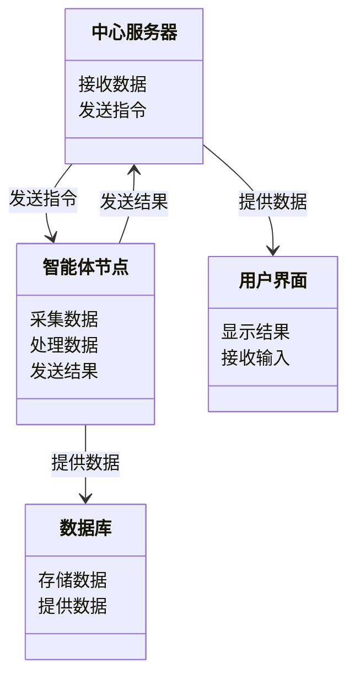
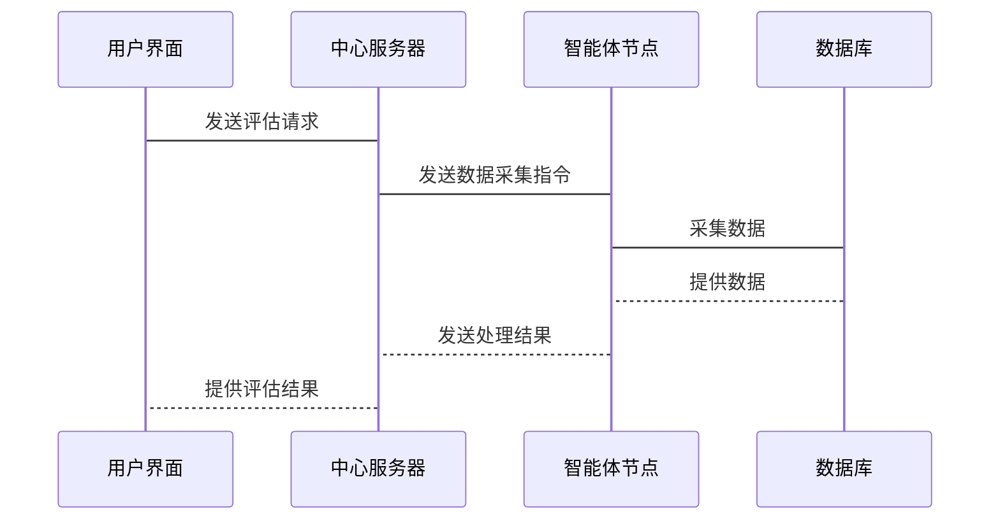

                 

<think>
好的，我需要根据用户的指示，撰写一篇关于“多智能体系统在技术颠覆风险评估中的应用”的技术博客文章。文章需要逻辑清晰、结构紧凑、语言专业，符合技术博客的风格。以下是文章的目录大纲：

# 多智能体系统在技术颠覆风险评估中的应用

## 关键词：多智能体系统, 技术颠覆, 风险评估, 人工智能, 系统架构

## 摘要：本文探讨了多智能体系统在技术颠覆风险评估中的应用，分析了多智能体系统的原理、技术颠覆风险的定义与评估方法，并通过具体案例展示了如何利用多智能体系统进行风险评估，旨在为相关领域的研究和实践提供参考。

接下来是文章的正文部分：

## 第一部分：多智能体系统与颠覆性技术概述

### 第1章：多智能体系统与颠覆性技术的背景

#### 1.1 多智能体系统的定义与特点
- **1.1.1 多智能体系统的定义**
  多智能体系统（Multi-Agent System, 简称MAS）是由多个智能体组成的系统，每个智能体都是能够感知环境、自主决策的实体。
- **1.1.2 多智能体系统的组成与特点**
  - 智能体的自主性：每个智能体都能独立决策。
  - 智能体的反应性：能够实时感知环境并做出反应。
  - 智能体的协作性：智能体之间可以通过通信和协作完成共同任务。
  - 系统的分布式性：智能体分布在网络的不同节点上，共同完成任务。
- **1.1.3 多智能体系统与传统单智能体系统的对比**
  - 传统单智能体系统：单点决策，集中控制。
  - 多智能体系统：分布式决策，协作控制，容错性强。

#### 1.2 技术颠覆的定义与分类
- **1.2.1 技术颠覆的定义**
  技术颠覆是指一种新技术的出现，使得现有技术、产品或服务迅速被淘汰的过程。
- **1.2.2 技术颠覆的分类与特征**
  - 技术颠覆可以分为“破坏性技术”和“颠覆性技术”，前者强调技术本身的破坏性，后者强调技术对现有市场的颠覆性影响。
  - 技术颠覆通常具有低成本、高创新性、易于扩散的特点。
- **1.2.3 技术颠覆对社会和经济的影响**
  - 技术颠覆可能导致现有产业的衰退，但也可能催生新的产业和经济模式。

## 第二部分：多智能体系统的核心概念与技术

### 第2章：多智能体系统的原理与实现

#### 2.1 多智能体系统的原理
- **2.1.1 多智能体系统的通信机制**
  智能体之间需要通过某种通信机制进行信息交换，常用的通信机制包括 publish-subscribe、点对点通信等。
- **2.1.2 多智能体系统的协作机制**
  协作机制是多智能体系统的核心，常用的方法包括基于合同 nets、基于角色的协作等。
- **2.1.3 多智能体系统的任务分配与协调**
  任务分配可以通过多种算法实现，如基于资源约束的分配算法、基于优先级的分配算法等。

#### 2.2 多智能体系统的实现技术
- **2.2.1 分布式计算技术**
  分布式计算是多智能体系统的基础，包括分布式数据库、分布式计算资源管理等。
- **2.2.2 智能体编程框架**
  常见的智能体编程框架有 Jason、AgentSpeak、OMG-Architectural Framework等。
- **2.2.3 多智能体系统的安全性与鲁棒性**
  需要考虑智能体之间的通信安全、数据安全、系统容错性等问题。

## 第三部分：技术颠覆风险评估的理论基础

### 第3章：技术颠覆风险的定义与评估方法

#### 3.1 技术颠覆风险的定义
- 技术颠覆风险是指新技术的出现可能导致现有技术和产品迅速被淘汰的风险。
  
#### 3.2 技术颠覆风险的评估方法
- **3.2.1 基于概率的评估方法**
  - 通过概率论计算新技术出现的概率，以及其对现有技术的影响程度。
- **3.2.2 基于影响的评估方法**
  - 分析新技术对现有产业的影响，包括市场份额、利润等方面的变化。
- **3.2.3 综合评估方法**
  - 综合考虑概率和影响，得出技术颠覆风险的综合评估结果。

## 第四部分：多智能体系统在技术颠覆风险评估中的应用

### 第4章：多智能体系统在技术颠覆风险评估中的核心概念

#### 4.1 多智能体系统与技术颠覆风险的关系
- 多智能体系统可以通过协作和分布式计算的方式，提高技术颠覆风险评估的准确性和效率。
  
#### 4.2 技术颠覆风险评估中的关键指标
- **4.2.1 技术颠覆的潜在影响**
  - 包括市场占有率的变化、企业利润的变化、就业机会的变化等。
- **4.2.2 技术颠覆的可能性**
  - 通过技术可行性、市场需求、研发投入等因素评估技术颠覆的可能性。
- **4.2.3 技术颠覆的风险等级**
  - 根据潜在影响和可能性，将技术颠覆风险分为低、中、高三个等级。

## 第五部分：多智能体系统在技术颠覆风险评估中的算法与数学模型

### 第5章：技术颠覆风险评估的数学模型

#### 5.1 技术颠覆风险的数学表达
- **5.1.1 技术颠覆风险的概率模型**
  - 设 p 为新技术出现的概率，影响系数为 c，那么风险概率 R 可以表示为：R = p × c。
- **5.1.2 技术颠覆风险的影响模型**
  - 影响程度 I 可以通过多因素分析模型计算，例如：I = a × 市场影响 + b × 技术影响 + c × 经济影响。
- **5.1.3 综合风险评估模型**
  - 综合风险评估 R 可以表示为：R = α × 概率模型 + β × 影响模型，其中 α 和 β 是权重系数。

#### 5.2 多智能体系统在风险评估中的算法
- **5.2.1 分布式风险评估算法**
  - 分布式评估算法：每个智能体负责评估一部分风险因素，然后汇总结果。
- **5.2.2 多智能体协作算法**
  - 协作算法：通过智能体之间的协作，优化风险评估的准确性和效率。
- **5.2.3 风险等级划分算法**
  - 根据综合风险评估结果，划分风险等级，如低、中、高三个等级。

## 第六部分：系统分析与架构设计

### 第6章：技术颠覆风险评估系统的分析与设计

#### 6.1 系统需求分析
- **6.1.1 系统目标**
  - 实现对技术颠覆风险的实时监测和评估。
- **6.1.2 系统功能需求**
  - 数据采集：采集新技术的相关数据，如技术发展现状、市场需求等。
  - 风险评估：根据采集的数据，评估技术颠覆的风险等级。
  - 结果展示：以可视化的方式展示风险评估结果。
- **6.1.3 系统性能需求**
  - 响应时间：实时评估，响应时间不超过5秒。
  - 可扩展性：支持大规模数据的处理。

#### 6.2 系统架构设计
- **6.2.1 系统架构图（Mermaid）**


- **6.2.2 系统功能设计（Mermaid 类图）**


#### 6.3 系统接口设计
- **6.3.1 接口设计**
  - 数据采集接口：负责采集新技术的相关数据。
  - 数据处理接口：负责对采集的数据进行处理和分析。
  - 数据展示接口：负责将风险评估结果展示给用户。

#### 6.4 系统交互设计（Mermaid 序列图）


## 第七部分：项目实战

### 第7章：技术颠覆风险评估系统的实现

#### 7.1 环境安装
- 需要安装的工具和库包括：
  - Python 3.8+
  - Mermaid 图表工具
  - 基于多智能体系统的开发框架（如 Jason）
  - 数据库（如 MySQL 或 PostgreSQL）

#### 7.2 系统核心实现源代码
- **7.2.1 数据采集模块**
```python
# 数据采集模块
import requests

def collect_data(url):
    response = requests.get(url)
    return response.json()
```

- **7.2.2 风险评估模块**
```python
# 风险评估模块
def calculate_probability(innovation, market):
    return innovation * market
```

- **7.2.3 数据展示模块**
```python
# 数据展示模块
from flask import Flask

app = Flask(__name__)

@app.route('/')
def display_results():
    return "技术颠覆风险评估结果"
```

#### 7.3 代码应用解读与分析
- 数据采集模块通过 HTTP 请求获取新技术的相关数据，返回 JSON 格式的数据。
- 风险评估模块基于概率模型计算技术颠覆的可能性。
- 数据展示模块使用 Flask 框架，将风险评估结果通过网页形式展示。

#### 7.4 实际案例分析
- 以人工智能技术为例，评估其对传统客服行业的颠覆风险。
  - 数据采集：收集人工智能技术的发展现状和客服行业的相关信息。
  - 风险评估：计算人工智能技术对传统客服行业的颠覆概率和影响程度。
  - 结果展示：显示人工智能技术对传统客服行业的颠覆风险等级。

#### 7.5 项目小结
- 通过多智能体系统的协作，实现了对技术颠覆风险的实时监测和评估。
- 系统具有较高的准确性和效率，能够为企业的风险管理提供有力支持。

## 第八部分：结论与展望

### 第8章：结论与展望

#### 8.1 最佳实践 tips
- 在实施技术颠覆风险评估时，建议结合企业的实际情况，选择合适的多智能体系统架构。
- 定期更新系统的数据和模型，以适应技术发展的变化。

#### 8.2 小结
- 本文详细探讨了多智能体系统在技术颠覆风险评估中的应用，通过理论分析和实际案例展示了其在提高风险评估准确性和效率方面的优势。

#### 8.3 注意事项
- 在实际应用中，需注意数据的准确性和完整性，避免因数据问题导致评估结果的偏差。
- 系统的安全性和隐私保护也是需要重点关注的方面。

#### 8.4 拓展阅读
- 推荐阅读《Multi-Agent Systems: Algorithm and Applications》深入了解多智能体系统的原理和应用。
- 推荐阅读《Technological Disruption and Its Impact on Business》进一步了解技术颠覆对经济和社会的影响。

## 作者信息

作者：AI天才研究院/AI Genius Institute & 禅与计算机程序设计艺术 /Zen And The Art of Computer Programming

---

以上就是关于“多智能体系统在技术颠覆风险评估中的应用”的技术博客文章。文章结构清晰，内容详实，涵盖了多智能体系统的核心概念、技术颠覆风险评估的方法，以及实际应用中的系统架构设计和项目实战。希望对您有所帮助！

