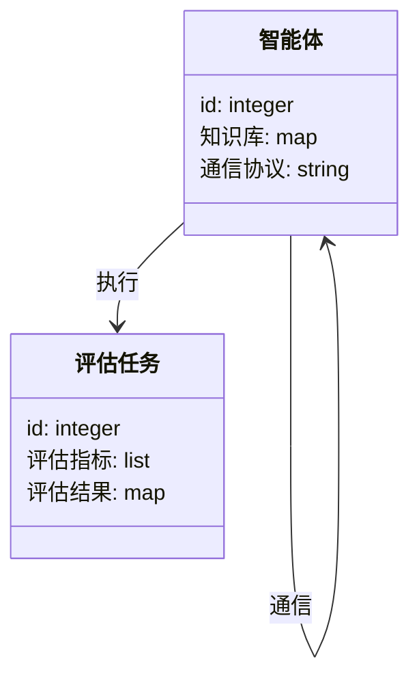
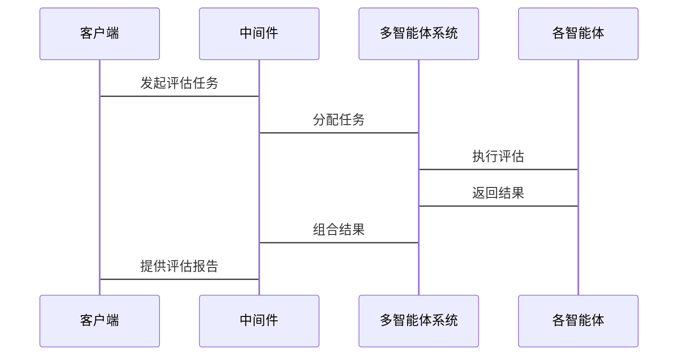

                 


# 多智能体系统在无形资产价值量化中的应用

> 关键词：多智能体系统、无形资产、价值量化、算法原理、系统架构

> 摘要：本文探讨了多智能体系统在无形资产价值量化中的应用，分析了MAS的基本原理、算法实现、系统架构，并通过实际案例展示了其在无形资产评估中的优势，最后总结了相关经验与未来研究方向。

---

# 第1章: 多智能体系统与无形资产价值量化背景

## 1.1 问题背景

### 1.1.1 无形资产价值量化的重要性
无形资产（如专利、品牌、版权）在企业价值中占据重要地位，但其评估难度大，缺乏统一标准。

### 1.1.2 多智能体系统在无形资产量化中的应用潜力
MAS能够通过分布式协作提高评估的准确性和效率。

### 1.1.3 当前研究现状与挑战
现有方法多基于单点评估，MAS的应用尚处于初步探索阶段。

## 1.2 核心概念解析

### 1.2.1 多智能体系统（MAS）的定义与特点
智能体是具有感知和决策能力的实体，MAS通过协作完成复杂任务。

### 1.2.2 无形资产的定义与分类
无形资产分为可确指和不可确指，包括专利、商标等。

### 1.2.3 多智能体系统与无形资产价值量化的联系
MAS可分解评估任务，提升评估效率和准确性。

---

# 第2章: 多智能体系统的核心概念与联系

## 2.1 多智能体系统的核心原理

### 2.1.1 智能体的定义与属性
智能体具备自主性、反应性、协作性和学习性。

### 2.1.2 多智能体系统的架构与协作机制
常用架构包括分散式、集中式和混合式，协作机制涉及任务分配和信息共享。

### 2.1.3 智能体之间的通信与协调
通信协议和协调算法（如一致性算法）是关键。

## 2.2 无形资产价值量化的关键要素

### 2.2.1 无形资产的评估维度
包括经济寿命、市场影响力、技术先进性等。

### 2.2.2 无形资产价值的影响因素
技术风险、法律保护、市场需求等因素影响评估结果。

### 2.2.3 无形资产价值量化的数学模型
构建多元回归模型，综合考虑多因素。

## 2.3 多智能体系统与无形资产价值量化的关联

### 2.3.1 多智能体系统在无形资产价值量化中的角色
MAS可分解任务，提高评估效率。

### 2.3.2 提升评估准确性的方法
通过协作学习和数据共享，提高评估结果的可靠性。

### 2.3.3 与传统方法的对比
MAS在动态环境中的适应性更强。

---

# 第3章: 多智能体系统在无形资产价值量化中的应用原理

## 3.1 多智能体系统的算法原理

### 3.1.1 分布式计算与多智能体协作
通过分布式计算，MAS实现任务分解和协同。

### 3.1.2 智能体之间的信息交换与决策机制
信息交换采用异步通信，决策基于协商和共识。

### 3.1.3 共识算法与协调机制
使用共识算法确保智能体间的一致性。

## 3.2 无形资产价值量化的数学模型

### 3.2.1 线性回归模型
构建多元回归模型，综合评估多因素影响。

### 3.2.2 协同评估模型
基于MAS的协同评估模型，提升评估结果的准确性。

### 3.2.3 数学模型的构建与优化
通过数据训练，优化模型参数，提升评估精度。

---

# 第4章: 系统分析与架构设计

## 4.1 项目背景与目标

### 4.1.1 项目背景介绍
项目旨在利用MAS提升无形资产评估效率。

### 4.1.2 项目目标与范围
构建MAS框架，实现无形资产的协同评估。

### 4.1.3 项目关键成功因素
智能体协作、数据共享、模型优化是关键。

## 4.2 系统功能设计

### 4.2.1 领域模型设计（Mermaid 类图）


### 4.2.2 系统架构设计（Mermaid 架构图）


### 4.2.3 系统接口设计
定义智能体之间的通信接口，实现数据交换和任务分配。

### 4.2.4 系统交互序列图


---

# 第5章: 项目实战

## 5.1 环境安装

### 5.1.1 系统需求
安装Python、相关库（如numpy、scikit-learn）。

### 5.1.2 安装步骤
```bash
pip install numpy scikit-learn
```

## 5.2 核心代码实现

### 5.2.1 多智能体协作算法实现
```python
import numpy as np
from sklearn.linear_model import LinearRegression

class Agent:
    def __init__(self, id):
        self.id = id
        self.knowledge = {}

    def receive_task(self, task):
        # 处理任务并返回结果
        model = LinearRegression()
        model.fit(task.features, task.labels)
        return model.coef_
```

### 5.2.2 代码解读与分析
各智能体接收任务，利用回归模型计算系数，返回结果。

### 5.2.3 实际案例分析
以专利评估为例，展示MAS如何分解任务，协作评估。

## 5.3 项目小结

---

# 第6章: 最佳实践与总结

## 6.1 最佳实践 tips
- 确保智能体之间的通信高效可靠。
- 定期优化评估模型，提升准确性。

## 6.2 小结
MAS在无形资产评估中的应用潜力巨大，可显著提升效率和准确性。

## 6.3 注意事项
- 数据隐私和安全需严格控制。
- 智能体协作需考虑动态环境的适应性。

## 6.4 拓展阅读
推荐相关论文和书籍，深入学习MAS和资产评估的知识。

---

作者：AI天才研究院 & 禅与计算机程序设计艺术

---

本文通过详细分析多智能体系统在无形资产价值量化中的应用，从背景、原理到实战，全面探讨了其应用潜力和实现方法，为相关领域的研究和实践提供了有价值的参考。

