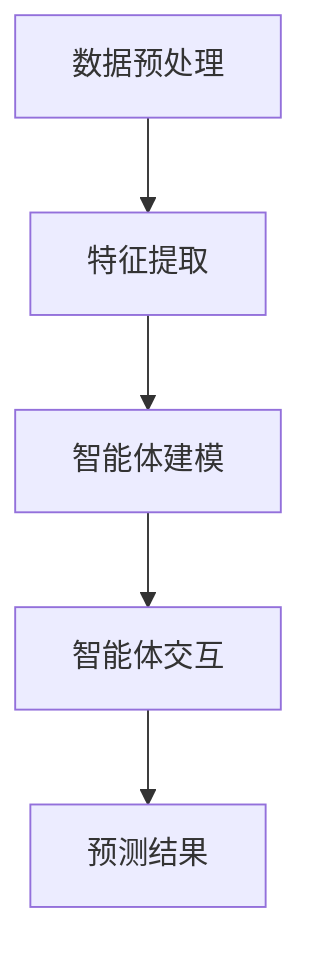
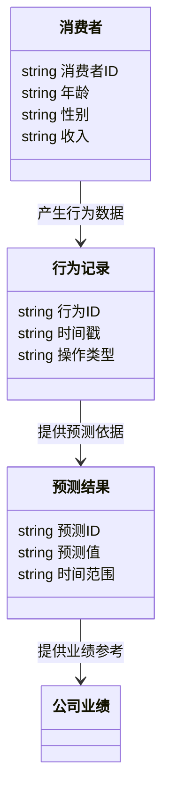
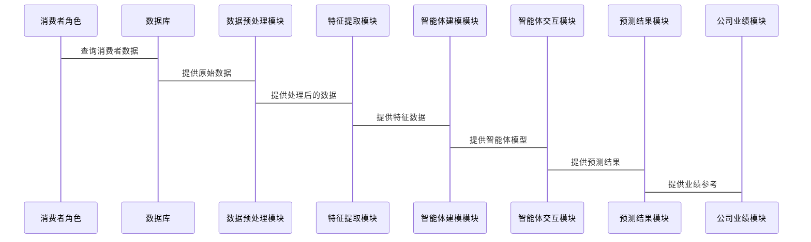

                 


# 多智能体系统在消费者行为预测中的应用：预判公司业绩

## 关键词：
多智能体系统，消费者行为预测，公司业绩，机器学习，人工智能，数据挖掘

## 摘要：
本文探讨了多智能体系统在消费者行为预测中的应用，分析了其如何帮助公司预判业绩。通过介绍多智能体系统的概念、算法原理、系统架构，结合实际案例，展示了如何利用多智能体系统构建预测模型，提升公司业绩预测的准确性。文章内容涵盖背景介绍、核心概念、算法实现、系统设计、项目实战及最佳实践，为读者提供了全面的技术视角。

---

# 第一部分: 多智能体系统与消费者行为预测的背景介绍

## 第1章: 多智能体系统概述

### 1.1 多智能体系统的基本概念

#### 1.1.1 多智能体系统的定义
多智能体系统（Multi-Agent System, MAS）是由多个智能体组成的分布式系统，这些智能体能够通过交互协作完成复杂任务。智能体（Agent）是指能够感知环境并采取行动以实现目标的实体。

#### 1.1.2 多智能体系统的核心特征
- **自主性**：智能体能够自主决策。
- **反应性**：能够实时感知环境变化并做出反应。
- **协作性**：多个智能体协同工作以完成共同目标。
- **分布式性**：智能体分布在不同的位置，通过通信协作。

#### 1.1.3 多智能体系统与传统单智能体系统的区别
| 特性 | 多智能体系统 | 单智能体系统 |
|------|--------------|---------------|
| 结构 | 分布式、协作 | 单一、集中式 | 
| 任务 | 多任务协作完成 | 单任务独立完成 |
| 效率 | 高，任务并行 | 较低，任务串行 |

### 1.2 消费者行为预测的复杂性

#### 1.2.1 消费者行为的多维度特征
消费者行为受多种因素影响，包括经济状况、心理因素、社会影响等。这些因素使得行为预测具有挑战性。

#### 1.2.2 消费者行为预测的挑战
- 数据复杂性：消费者行为数据涉及多个维度。
- 动态性：消费者行为随时间变化。
- 不确定性：预测结果受多种因素影响。

#### 1.2.3 预判公司业绩的重要性
公司业绩与消费者行为密切相关。通过预测消费者行为，公司可以优化产品策略、营销策略，从而提升业绩。

### 1.3 多智能体系统在消费者行为预测中的应用前景

#### 1.3.1 多智能体系统的优势
- 能够处理复杂的交互关系。
- 能够实时响应环境变化。
- 能够分布式协作。

#### 1.3.2 多智能体系统在消费者行为预测中的潜力
通过建模消费者行为的多智能体交互，可以更准确地预测消费者行为，从而帮助公司预判业绩。

#### 1.3.3 预判公司业绩的实际应用场景
例如，零售业可以根据消费者行为预测调整库存，金融行业可以根据投资者行为预测调整投资策略。

---

## 第2章: 多智能体系统的核心概念与联系

### 2.1 多智能体系统的原理

#### 2.1.1 多智能体系统的组成要素
- 智能体：多个智能体构成系统。
- 通信机制：智能体之间通过通信机制交换信息。
- 协作机制：智能体通过协作机制完成任务。
- 环境：智能体所处的环境。

#### 2.1.2 智能体的定义与属性
智能体具备以下属性：
- **目标**：智能体的行为动机。
- **知识**：智能体的行为依据。
- **推理能力**：智能体的决策能力。
- **行动能力**：智能体的执行能力。

#### 2.1.3 智能体之间的交互机制
智能体之间的交互可以通过以下方式进行：
- **直接通信**：智能体之间直接交换信息。
- **间接通信**：通过中间媒介传递信息。
- **协作协议**：智能体之间通过协议协作。

### 2.2 消费者行为预测的多智能体模型

#### 2.2.1 消费者行为预测的核心要素
消费者行为预测的核心要素包括：
- 消费者特征：年龄、性别、收入等。
- 行为数据：购买记录、浏览记录等。
- 环境因素：市场环境、经济状况等。

#### 2.2.2 多智能体模型的构建逻辑
1. **数据收集**：收集消费者行为数据。
2. **特征提取**：提取消费者行为特征。
3. **智能体建模**：为每个消费者构建智能体。
4. **智能体交互**：智能体之间交互协作。
5. **预测结果**：根据智能体的交互结果预测消费者行为。

#### 2.2.3 模型的输入输出关系
输入：消费者行为数据、环境数据。
输出：消费者行为预测结果。

### 2.3 多智能体系统与消费者行为预测的ER实体关系图

```mermaid
erDiagram
    消费者角色 {
        string 消费者ID
        string 年龄
        string 性别
        string 收入
    }
    行为记录 {
        string 行为ID
        string 时间戳
        string 操作类型
    }
    预测结果 {
        string 预测ID
        string 预测值
        string 时间范围
    }
    消费者角色 --> 行为记录 : 产生行为数据
    行为记录 --> 预测结果 : 提供预测依据
    预测结果 --> 公司业绩 : 提供业绩参考
```

---

## 第3章: 多智能体系统在消费者行为预测中的算法原理

### 3.1 多智能体系统的算法实现

#### 3.1.1 基于MAS的消费者行为预测算法
算法步骤如下：
1. **数据预处理**：清洗和转换数据。
2. **特征提取**：提取消费者特征。
3. **智能体建模**：为每个消费者构建智能体。
4. **智能体交互**：智能体之间交互协作。
5. **预测结果**：根据交互结果预测消费者行为。

#### 3.1.2 算法的实现流程图



#### 3.1.3 算法的Python实现代码

```python
class ConsumerAgent:
    def __init__(self, consumer_id, features):
        self.consumer_id = consumer_id
        self.features = features

    def get_feature(self, feature_name):
        return self.features[feature_name]

    def update_feature(self, feature_name, value):
        self.features[feature_name] = value

def predict_behavior(consumer_agents, environment):
    for agent in consumer_agents:
        features = agent.get_feature('收入')
        environment.update_prediction(features)
    return environment.predicted_behavior
```

#### 3.1.4 算法的数学模型和公式
消费者行为预测模型的数学公式可以表示为：
$$ P(b|c) = \prod_{i=1}^{n} P(b_i|c_i) $$
其中，$P(b|c)$表示消费者行为的概率，$b_i$和$c_i$分别表示行为和消费者特征。

---

## 第4章: 系统分析与架构设计方案

### 4.1 项目背景介绍
本项目旨在利用多智能体系统预测消费者行为，帮助公司预判业绩。

### 4.2 系统功能设计

#### 4.2.1 领域模型的类图



### 4.3 系统架构设计

#### 4.3.1 系统架构的Mermaid图


### 4.4 系统接口设计

#### 4.4.1 系统交互的序列图



---

## 第5章: 项目实战

### 5.1 环境安装与配置

#### 5.1.1 安装Python环境
安装Python 3.8及以上版本，并安装必要的库，如numpy、pandas、scikit-learn。

### 5.2 系统核心实现源代码

#### 5.2.1 数据预处理模块

```python
import pandas as pd

def preprocess_data(data_file):
    data = pd.read_csv(data_file)
    data.dropna(inplace=True)
    return data
```

#### 5.2.2 特征提取模块

```python
from sklearn.feature_extraction import DictVectorizer

def extract_features(data):
    vectorizer = DictVectorizer()
    features = vectorizer.fit_transform(data[['年龄', '性别', '收入']].to_dict('records'))
    return features
```

#### 5.2.3 智能体建模模块

```python
class ConsumerAgent:
    def __init__(self, consumer_id, features):
        self.consumer_id = consumer_id
        self.features = features

    def get_feature(self, feature_name):
        return self.features[feature_name]
```

#### 5.2.4 智能体交互模块

```python
from sklearn.naive_bayes import GaussianNB

def agent_interaction(consumer_agents, features):
    model = GaussianNB()
    model.fit(features, [agent.get_feature('收入') for agent in consumer_agents])
    return model
```

#### 5.2.5 预测结果模块

```python
def predict_behavior(model, new_features):
    predicted_labels = model.predict(new_features)
    return predicted_labels
```

### 5.3 案例分析与实际应用

#### 5.3.1 案例分析
以某零售公司为例，通过分析消费者行为数据，预测消费者的购买行为，从而调整库存和营销策略。

#### 5.3.2 实际应用
在实际应用中，该系统可以显著提高消费者行为预测的准确率，帮助公司更好地预判业绩。

### 5.4 项目小结

---

## 第6章: 最佳实践、小结、注意事项与拓展阅读

### 6.1 最佳实践

#### 6.1.1 数据质量的重要性
确保数据的准确性和完整性。

#### 6.1.2 模型选择的策略
根据具体场景选择合适的算法。

#### 6.1.3 系统优化的技巧
定期优化系统，提升预测准确率。

### 6.2 小结

本文详细介绍了多智能体系统在消费者行为预测中的应用，通过理论分析和实际案例展示了其在预判公司业绩中的潜力。

### 6.3 注意事项

- 数据隐私问题需要注意。
- 系统的实时性要求较高。
- 需要持续优化模型。

### 6.4 拓展阅读

- 多智能体系统的最新研究进展。
- 消费者行为预测的其他应用领域。

---

# 结语

通过多智能体系统的应用，公司可以更准确地预测消费者行为，从而更好地预判业绩。这不仅提高了公司的竞争力，也为未来的业务决策提供了有力支持。

---

**作者：AI天才研究院/AI Genius Institute & 禅与计算机程序设计艺术 /Zen And The Art of Computer Programming**

