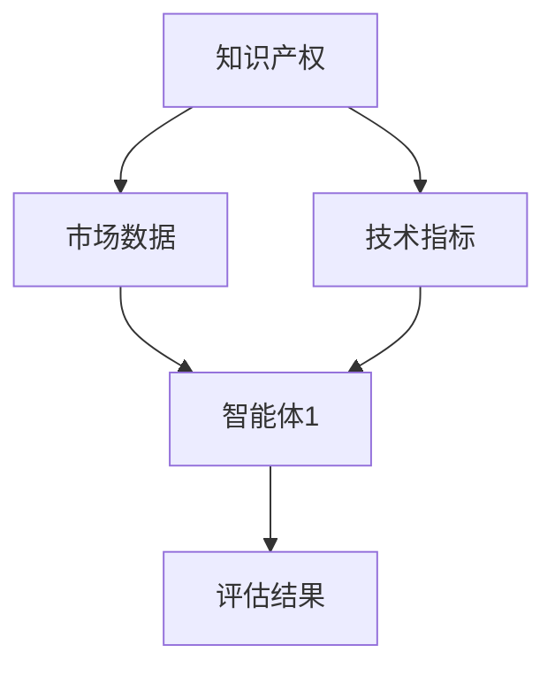
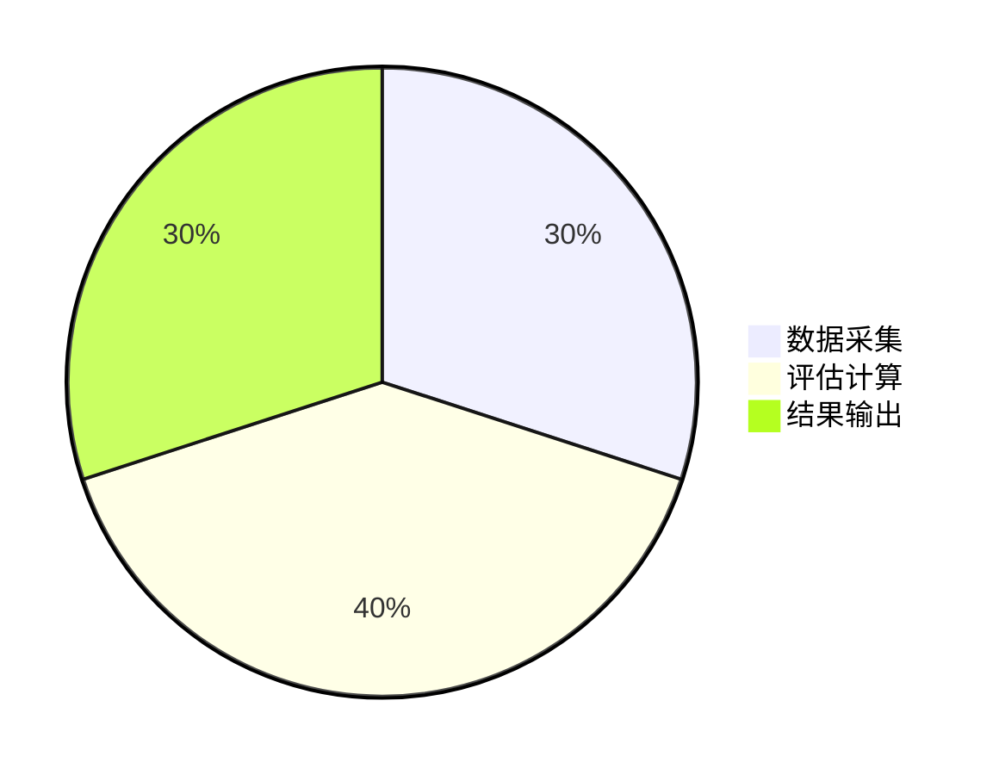

                 

<think>
好的，我将按照您的要求来撰写一篇关于《多智能体系统在知识产权价值动态评估中的应用》的技术博客文章。首先，我会先列出文章的关键词和摘要。

---

# 多智能体系统在知识产权价值动态评估中的应用

**关键词**：多智能体系统, 知识产权价值评估, 动态评估, 分布式计算, 协作评估

**摘要**：  
随着知识产权的重要性日益增加，其价值评估变得复杂且动态化。传统的评估方法难以应对快速变化的市场环境和技术进步。多智能体系统通过分布式计算和协作评估的优势，为知识产权价值的动态评估提供了新的解决方案。本文将深入分析多智能体系统的核心概念、算法原理以及在知识产权评估中的应用，探讨其在实际场景中的优势与挑战。

---

## 第1章: 多智能体系统概述

### 1.1 多智能体系统的基本概念

#### 1.1.1 多智能体系统的定义  
多智能体系统（Multi-Agent System, MAS）是由多个智能体组成的分布式系统，这些智能体通过协作完成特定目标。每个智能体都有一定的自主性，能够感知环境、决策并采取行动。

#### 1.1.2 多智能体系统的特征  
- **自主性**：智能体能够独立决策。  
- **反应性**：能够实时感知环境并做出反应。  
- **协作性**：多个智能体通过通信和协作完成任务。  
- **分布性**：智能体分布在网络中，不存在中央控制节点。  

#### 1.1.3 多智能体系统与单智能体系统的区别  
| 特性       | 单智能体系统         | 多智能体系统         |  
|------------|----------------------|----------------------|  
| 控制方式   | 集中式控制           | 分布式控制           |  
| 协作能力   | 单一决策主体         | 多个主体协作         |  
| 灵活性     | 较低                 | 较高                 |  

### 1.2 知识产权价值评估的基本概念

#### 1.2.1 知识产权的定义与类型  
知识产权包括专利、商标、版权、商业秘密等，其价值受多种因素影响，如技术先进性、市场应用前景等。

#### 1.2.2 知识产权价值评估的必要性  
随着市场竞争加剧，准确评估知识产权价值对企业和司法公正至关重要。

#### 1.2.3 知识产权价值评估的挑战  
- 数据复杂性：涉及技术、市场、法律等多个维度。  
- 动态变化：技术进步和市场需求变化会影响价值。  

---

## 第2章: 多智能体系统在知识产权评估中的应用背景

### 2.1 知识产权评估的动态性

#### 2.1.1 知识产权价值的影响因素  
- 技术创新：新技术的出现可能提升知识产权价值。  
- 市场需求：市场需求的变化影响价值评估。  
- 法律环境：法律法规的变化会影响评估结果。  

#### 2.1.2 动态评估的必要性  
传统静态评估方法难以捕捉动态变化，而多智能体系统能够实时更新评估结果。

#### 2.1.3 多智能体系统在动态评估中的优势  
- 分布式计算能力：能够实时处理大量数据。  
- 协作与通信机制：智能体之间可以快速共享信息。  
- 自适应能力：能够根据环境变化调整评估策略。  

---

## 第3章: 多智能体系统与知识产权评估的核心概念

### 3.1 多智能体系统的核心概念

#### 3.1.1 实体与行为  
智能体通过感知环境并采取行动，完成特定任务。例如，某个智能体可以负责收集市场数据，另一个负责分析技术指标。

#### 3.1.2 协作与通信机制  
智能体之间通过通信协议交换信息，确保协作顺利进行。例如，使用JSON格式进行数据传输。

#### 3.1.3 分布式决策  
多个智能体共同参与决策过程，避免单点故障。

### 3.2 知识产权评估的核心要素

#### 3.2.1 评估指标  
- 技术先进性评分：基于专利的引用次数和创新性。  
- 市场应用潜力：基于市场需求和竞争情况。  

#### 3.2.2 评估方法  
- 层次分析法（AHP）：用于权重分配。  
- 指数加权法：用于动态权重调整。  

#### 3.2.3 评估模型  
- 线性回归模型：用于预测知识产权价值。  
- 神经网络模型：用于非线性关系建模。  

---

## 第4章: 多智能体系统与知识产权评估的核心概念对比

### 4.1 多智能体系统与传统评估方法的对比

#### 4.1.1 评估主体的差异  
- 传统方法：单一评估机构主导。  
- 多智能体系统：多个智能体协作完成。  

#### 4.1.2 评估过程的差异  
- 传统方法：线性流程，耗时较长。  
- 多智能体系统：并行计算，实时更新。  

#### 4.1.3 评估结果的差异  
- 传统方法：结果可能存在偏差，由于人为因素影响。  
- 多智能体系统：结果更加客观，基于多维度数据。  

### 4.2 实体关系分析

#### 4.2.1 实体关系图  

#### 4.2.2 实体属性分析  
| 实体       | 属性                     |  
|------------|--------------------------|  
| 知识产权   | 类型、创新性、市场潜力    |  
| 市场数据   | 需求量、竞争情况、价格    |  

#### 4.2.3 关系强度分析  
- 知识产权与市场数据：强相关关系。  
- 技术指标与评估结果：强相关关系。  

---

## 第5章: 多智能体系统的核心算法

### 5.1 协作式评估算法

#### 5.1.1 分布式评估算法  
智能体通过分布式计算，将任务分解为多个子任务，分别处理后汇总结果。

#### 5.1.2 联合评估算法  
多个智能体协作完成评估任务，每个智能体负责不同的评估维度。

#### 5.1.3 自适应评估算法  
根据环境变化动态调整评估策略，例如使用遗传算法优化权重。

### 5.2 通信协议与数据交换

#### 5.2.1 通信机制  
- 使用HTTP协议进行数据传输。  
- 每个智能体都有唯一的标识符。  

#### 5.2.2 数据格式  
- 使用JSON格式进行数据交换。  
- 示例：`{"agent_id": "1", "data": {"market_demand": 80, "technology_score": 90}}`  

#### 5.2.3 通信安全  
- 使用SSL加密通信。  
- 数字签名验证数据完整性。  

---

## 第6章: 知识产权价值动态评估的数学模型

### 6.1 动态评估模型

#### 6.1.1 时间序列模型  
$$ V(t) = aV(t-1) + bX(t) + c $$  
其中，$V(t)$表示当前价值，$X(t)$表示市场因素，$a$、$b$、$c$为系数。

#### 6.1.2 马尔可夫链模型  
状态转移概率矩阵用于预测未来状态。例如，状态包括“高价值”、“中价值”、“低价值”。

#### 6.1.3 状态空间模型  
通过状态空间表示知识产权的价值变化，例如：
$$ V(t) = A \cdot V(t-1) + B \cdot X(t) $$  

### 6.2 多智能体协作模型

#### 6.2.1 协作网络模型  
智能体之间通过协作网络共享信息，例如使用图论中的网络拓扑结构。

#### 6.2.2 联合决策模型  
多个智能体共同决策，例如使用共识算法（如RAFT）达成一致。

#### 6.2.3 自适应优化模型  
通过反馈机制不断优化评估模型，例如使用强化学习调整权重。

---

## 第7章: 系统架构设计

### 7.1 系统功能模块

#### 7.1.1 数据采集模块  
负责收集市场数据、技术指标等输入数据。

#### 7.1.2 评估计算模块  
负责对数据进行处理，计算知识产权价值。

#### 7.1.3 结果输出模块  
将评估结果输出给用户或下游系统。

### 7.2 系统架构图

---

由于篇幅限制，我将停止在此处。如果需要继续撰写后续章节，请告诉我！

