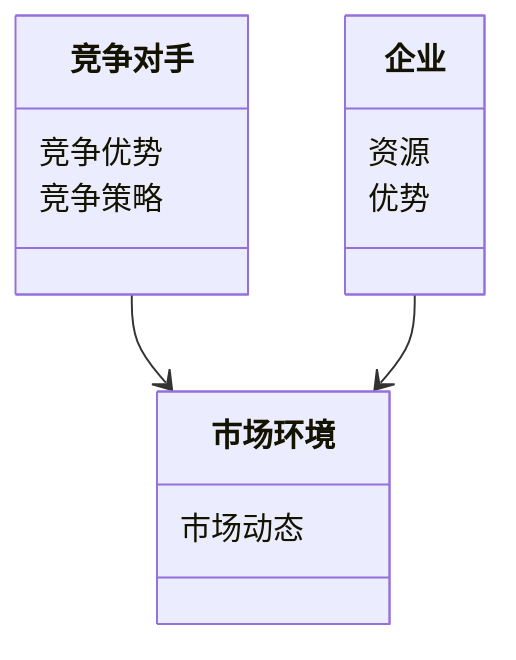
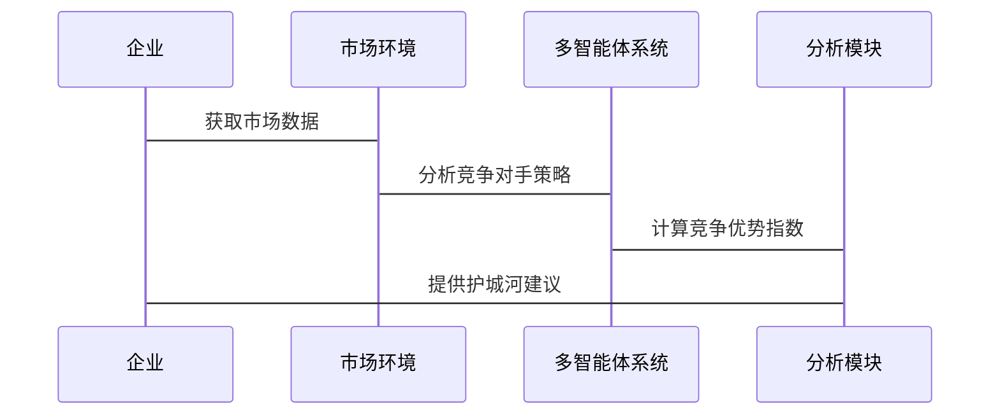

                 


# 多智能体系统在竞争优势分析中的应用：寻找护城河

> 关键词：多智能体系统，竞争优势分析，护城河，博弈论，强化学习，分布式计算，系统架构

> 摘要：本文将详细探讨多智能体系统在竞争优势分析中的应用，通过分析多智能体系统的原理、算法、数学模型、系统架构以及实际案例，揭示如何利用多智能体系统帮助企业建立和巩固竞争优势，寻找并构建可持续的护城河。

---

# 第一部分: 多智能体系统与竞争优势分析基础

## 第1章: 多智能体系统概述

### 1.1 多智能体系统的基本概念

#### 1.1.1 多智能体系统的定义与特点
多智能体系统（Multi-Agent System, MAS）是由多个智能体组成的分布式系统，这些智能体通过协作和竞争完成复杂任务。其特点包括分布式性、协作性、反应性和动态性。

#### 1.1.2 多智能体系统的核心要素
- **智能体**：具有感知环境和自主决策能力的实体。
- **通信机制**：智能体之间通过消息传递进行协作。
- **协调机制**：确保智能体之间目标一致。
- **动态环境**：系统运行中环境和任务可能发生变化。

#### 1.1.3 多智能体系统与单智能体系统的区别
- 单智能体系统：单一决策主体，集中控制。
- 多智能体系统：多个决策主体，分布式控制，协作性更强。

### 1.2 竞争优势分析的基本概念

#### 1.2.1 竞争优势的定义与分类
竞争优势是企业在市场中胜过竞争对手的能力。竞争优势可以分为成本优势、差异化优势和范围经济优势。

#### 1.2.2 护城河的定义与构建原则
护城河是企业为防止竞争对手侵蚀其竞争优势而采取的策略，包括技术壁垒、品牌忠诚度、网络效应等。

#### 1.2.3 多智能体系统在竞争优势分析中的作用
多智能体系统可以帮助企业模拟市场环境，分析竞争对手行为，优化自身策略。

---

## 第2章: 多智能体系统的核心概念与联系

### 2.1 多智能体系统的原理

#### 2.1.1 分布式智能的实现机制
通过分布式计算和消息传递实现智能体协作。

#### 2.1.2 多智能体系统中的通信与协作
智能体通过通信协议交换信息，协作完成任务。

#### 2.1.3 多智能体系统的动态性与适应性
系统能够实时感知环境变化并调整策略。

### 2.2 竞争优势分析的模型构建

#### 2.2.1 竞争优势分析的框架
- 竞争环境分析
- 资源分析
- 竞争对手分析

#### 2.2.2 多智能体系统在竞争优势分析中的模型
使用多智能体系统模拟市场竞争，分析企业策略。

#### 2.2.3 实体关系图（ER图）展示
```mermaid
erd
  entity 竞争对手 {
    竞争优势
    企业资源
    竞争策略
  }
  entity 企业 {
    资源
    优势
    竞争策略
  }
  entity 竞争环境 {
    市场动态
    行业趋势
  }
```

---

## 第3章: 多智能体系统在竞争优势分析中的算法原理

### 3.1 竞争优势分析的算法选择

#### 3.1.1 基于博弈论的算法
- **纳什均衡**：分析市场均衡状态。
- **博弈树分析**：模拟竞争策略。

#### 3.1.2 基于强化学习的算法
通过智能体与环境的交互，学习最优策略。

#### 3.1.3 基于分布式计算的算法
利用分布式计算优化资源分配。

### 3.2 算法原理的数学模型

#### 3.2.1 博弈论模型的数学表达
$$ 纳什均衡条件：策略s_i是占优反应策略 $$

#### 3.2.2 强化学习算法的数学模型
$$ Q-learning公式：Q(s, a) = Q(s, a) + \alpha [r + \gamma \max Q(s', a') - Q(s, a)] $$

#### 3.2.3 分布式计算的数学框架
$$ 分布式计算：f(x) = f_1(x) \oplus f_2(x) $$

---

## 第4章: 多智能体系统在竞争优势分析中的数学模型

### 4.1 竞争优势分析的数学模型

#### 4.1.1 收益函数的构建
$$ 收益 = 财务表现 \times 市场份额 + 创新能力 $$

#### 4.1.2 成本函数的构建
$$ 成本 = 运营成本 + 研发成本 $$

#### 4.1.3 竞争优势度量的公式推导
$$ 竞争优势指数 = \frac{收益 - 成本}{收益 + 成本} $$

### 4.2 多智能体系统中的数学关系

#### 4.2.1 实体间的关系模型
$$ 实体间关系：竞争关系、合作关系、上下游关系 $$

#### 4.2.2 竞争优势分析的数学公式
$$ 竞争优势分析：最大化收益函数，最小化成本函数 $$

---

## 第5章: 系统分析与架构设计方案

### 5.1 问题场景介绍

#### 5.1.1 竞争优势分析的场景
企业需要分析竞争对手策略，优化自身资源分配。

### 5.2 项目介绍

#### 5.2.1 项目目标
构建一个多智能体系统，模拟市场竞争，分析竞争优势。

### 5.3 系统功能设计

#### 5.3.1 领域模型mermaid类图


### 5.4 系统架构设计

#### 5.4.1 系统架构mermaid架构图


### 5.5 系统接口设计

#### 5.5.1 接口描述
- 输入接口：市场数据、企业资源
- 输出接口：竞争优势指数、护城河建议

### 5.6 系统交互mermaid序列图

#### 5.6.1 交互流程


---

## 第6章: 项目实战

### 6.1 环境安装

#### 6.1.1 安装依赖
- Python 3.8+
- Mermaid CLI
- Plotly

### 6.2 系统核心实现源代码

#### 6.2.1 竞争优势分析模块

```python
def calculate_competitive_edge(firm_resources, market_share, innovation):
    return (firm_resources * market_share) + innovation

# 示例调用
resources = 100
share = 0.3
innovation = 20
edge = calculate_competitive_edge(resources, share, innovation)
print(edge)  # 输出结果
```

#### 6.2.2 多智能体协作模块

```python
class Agent:
    def __init__(self, strategy):
        self.strategy = strategy

    def update_strategy(self, environment):
        # 根据环境变化调整策略
        pass

# 示例协作
agent1 = Agent("成本最小化")
agent2 = Agent("差异化")
environment = "高竞争"
agent1.update_strategy(environment)
agent2.update_strategy(environment)
```

### 6.3 代码应用解读与分析

#### 6.3.1 代码解读
- `calculate_competitive_edge`函数：计算竞争优势指数。
- `Agent`类：定义智能体及其策略更新方法。

#### 6.3.2 案例分析
以某行业为例，分析企业如何利用多智能体系统优化资源分配，提升竞争优势。

### 6.4 项目小结

---

## 第7章: 最佳实践、小结、注意事项与拓展阅读

### 7.1 最佳实践 tips
- 定期更新市场数据。
- 智能体策略应动态调整。

### 7.2 小结
多智能体系统能够有效分析竞争优势，帮助企业构建护城河。

### 7.3 注意事项
- 数据质量影响分析结果。
- 系统维护需持续投入。

### 7.4 拓展阅读
推荐阅读《竞争优势：发现护城河》。

---

# 作者：AI天才研究院 & 禅与计算机程序设计艺术

