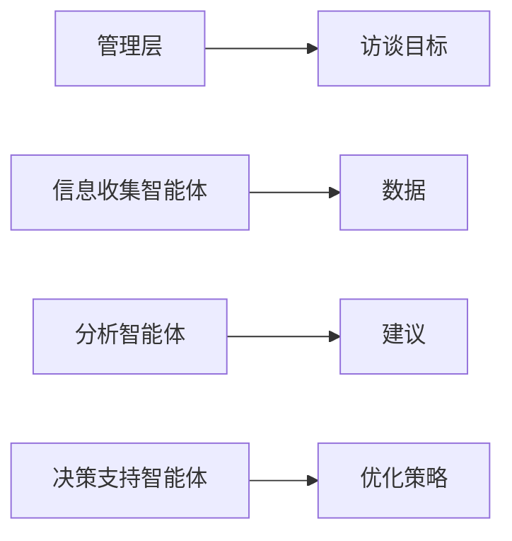
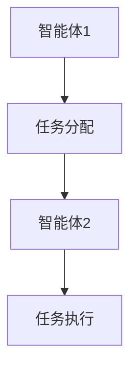
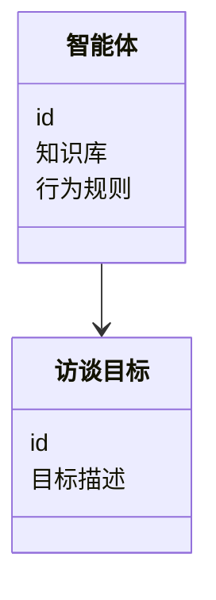
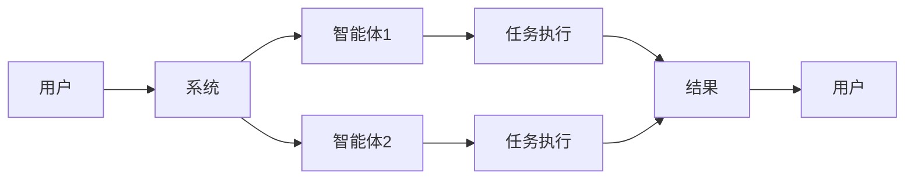

                 


# 多智能体系统在管理层访谈策略优化中的应用

> 关键词：多智能体系统（MAS），管理层访谈，策略优化，协作算法，分布式计算，人工智能

> 摘要：本文探讨了多智能体系统（MAS）在优化管理层访谈策略中的应用。通过分析MAS的核心概念、算法原理及系统架构，本文提出了一个基于MAS的访谈策略优化框架，并通过实际案例展示了其在企业管理中的潜力。本文旨在为管理层提供一种更高效、更智能的访谈策略优化方法。

---

# 第1章：多智能体系统与管理层访谈策略优化的背景介绍

## 1.1 多智能体系统（MAS）的定义与特点
### 1.1.1 多智能体系统的定义
多智能体系统（Multi-Agent System, MAS）是由多个智能体（Agent）组成的分布式系统，这些智能体通过协作与竞争完成特定任务。每个智能体都有自己的目标、知识和行为规则。

### 1.1.2 多智能体系统的核心特点
- **分布式性**：智能体独立运行，无需中央控制。
- **协作性**：智能体之间通过通信和协作完成复杂任务。
- **动态性**：系统能够适应环境变化和任务需求。
- **自主性**：每个智能体都能自主决策。

### 1.1.3 多智能体系统与单智能体系统的区别
| 特性            | 多智能体系统（MAS）             | 单智能体系统（SAS）             |
|-----------------|--------------------------------|--------------------------------|
| 控制方式        | 分布式控制                   | 集中式控制                   |
| 智能体数量      | 多个独立智能体                | 单个智能体                    |
| 任务分配        | 动态分配                     | 静态分配                     |
| 通信机制        | 智能体之间需要通信           | 无需通信                     |

---

## 1.2 管理层访谈策略优化的背景与问题
### 1.2.1 管理层访谈的目的与意义
管理层访谈是企业决策的重要环节，主要用于收集信息、评估团队表现、制定战略规划等。传统访谈策略依赖经验丰富的访谈者，但存在以下问题：

### 1.2.2 现有访谈策略的局限性
- **主观性**：访谈结果受访谈者主观因素影响较大。
- **效率低下**：缺乏系统化的策略，可能导致信息收集不全面。
- **动态适应性不足**：难以快速应对环境变化和突发情况。

### 1.2.3 多智能体系统在访谈策略优化中的潜力
多智能体系统能够通过协作和学习优化访谈策略，提高访谈的效率和准确性。例如，智能体可以分工协作，分别负责信息收集、分析和决策支持。

---

## 1.3 本章小结
本章介绍了多智能体系统的核心概念及其在管理层访谈策略优化中的潜力。通过对比MAS和SAS，明确了MAS在分布式协作和动态适应方面的优势，为后续章节奠定了理论基础。

---

# 第2章：多智能体系统的核心概念与理论基础

## 2.1 多智能体系统的基本原理
### 2.1.1 智能体的定义与特征
智能体（Agent）是具有感知环境、自主决策和执行动作的实体。其主要特征包括：
- **自主性**：无需外部干预。
- **反应性**：能够感知环境并实时响应。
- **社会性**：能够与其他智能体协作或竞争。

### 2.1.2 多智能体系统的协作机制
协作机制是MAS的核心，主要包括：
1. **通信机制**：智能体之间通过消息传递进行交流。
2. **协商机制**：智能体通过协商分配任务和资源。
3. **协调机制**：智能体通过协调确保整体目标的实现。

### 2.1.3 多智能体系统与单智能体系统的区别
| 特性            | 多智能体系统（MAS）             | 单智能体系统（SAS）             |
|-----------------|--------------------------------|--------------------------------|
| 任务分配        | 分布式任务分配                 | 集中式任务分配                 |
| 通信            | 需要通信                      | 无需通信                      |
| 决策方式        | 分布式决策                   | 集中式决策                   |

---

## 2.2 多智能体系统的分类与应用
### 2.2.1 基于任务的多智能体系统
任务驱动型MAS主要用于完成特定任务，例如物流配送、交通调度等。

### 2.2.2 基于决策的多智能体系统
决策驱动型MAS主要用于复杂决策场景，例如金融市场交易、城市交通管理等。

### 2.2.3 基于学习的多智能体系统
学习驱动型MAS通过强化学习等方法优化智能体的行为策略，例如游戏AI、机器人协作等。

---

## 2.3 多智能体系统在管理场景中的应用潜力
### 2.3.1 领域模型与多智能体系统的结合
通过构建领域模型，MAS可以更好地理解管理场景中的问题和需求。

### 2.3.2 多智能体系统在决策优化中的优势
MAS能够通过协作和学习优化决策过程，提高决策的准确性和效率。

### 2.3.3 多智能体系统在组织行为中的应用
MAS可以模拟组织行为，帮助管理者更好地理解和优化团队协作。

---

## 2.4 本章小结
本章详细介绍了多智能体系统的核心概念、分类及其在管理场景中的应用潜力。通过对比MAS和SAS，明确了MAS在协作、分布式决策和动态适应方面的优势，为后续章节奠定了理论基础。

---

# 第3章：多智能体系统在管理层访谈策略优化中的核心概念与联系

## 3.1 管理层访谈策略优化的核心要素
### 3.1.1 访谈目标的设定
明确访谈目标是优化策略的第一步，例如发现问题、评估团队表现等。

### 3.1.2 访谈内容的结构化
将访谈内容结构化，例如分为背景信息、关键问题、解决方案等。

### 3.1.3 访谈结果的评估
通过量化指标评估访谈效果，例如信息收集的完整性、决策的准确性等。

---

## 3.2 多智能体系统在访谈策略优化中的角色定位
### 3.2.1 智能体的分工与协作
- **信息收集智能体**：负责收集和整理相关数据。
- **分析智能体**：负责分析数据并提供建议。
- **决策支持智能体**：负责制定和优化决策策略。

### 3.2.2 智能体的知识表示与推理
智能体需要通过知识表示和推理能力来理解访谈内容，并根据上下文做出决策。

### 3.2.3 智能体的动态适应性
智能体能够根据环境变化和反馈动态调整策略，确保访谈过程的高效性。

---

## 3.3 多智能体系统与访谈策略优化的实体关系图


---

## 3.4 本章小结
本章分析了管理层访谈策略优化的核心要素，并探讨了多智能体系统在其中的角色定位。通过实体关系图，明确了智能体之间的协作关系，为后续章节的系统设计奠定了基础。

---

# 第4章：多智能体系统在访谈策略优化中的算法原理

## 4.1 多智能体协作算法
### 4.1.1 分布式协作算法
分布式协作算法通过智能体之间的通信和协商实现任务分配和协作。例如，基于协商的协作算法：



### 4.1.2 协作图模
协作图模用于描述智能体之间的协作关系，例如：


---

## 4.2 分布式计算与学习算法
### 4.2.1 分布式计算
分布式计算通过将任务分解到多个智能体完成，提高计算效率。

### 4.2.2 强化学习算法
强化学习算法用于优化智能体的行为策略，例如Q-learning算法：

$$ Q(s, a) = Q(s, a) + \alpha (r + \max Q(s', a') - Q(s, a)) $$

其中：
- \( Q(s, a) \) 表示状态 \( s \) 下采取动作 \( a \) 的价值。
- \( \alpha \) 是学习率。
- \( r \) 是奖励。
- \( \max Q(s', a') \) 是下一状态下的最大价值。

---

## 4.3 本章小结
本章介绍了多智能体协作算法和分布式计算与学习算法，重点讲解了强化学习算法的数学模型和应用。通过这些算法，智能体能够实现高效协作和动态适应。

---

# 第5章：多智能体系统在管理层访谈策略优化中的系统设计与架构

## 5.1 问题场景介绍
管理层访谈策略优化系统需要解决以下问题：
- 如何高效地收集和分析信息？
- 如何制定和优化访谈策略？
- 如何实现智能体之间的协作与通信？

---

## 5.2 系统功能设计
### 5.2.1 领域模型设计
领域模型用于描述系统中的实体及其关系，例如：



### 5.2.2 系统架构设计
系统架构设计包括：
- **数据层**：存储访谈数据和智能体知识库。
- **逻辑层**：实现智能体协作和算法逻辑。
- **界面层**：提供用户交互界面。

### 5.2.3 系统接口设计
系统接口设计包括：
- **智能体通信接口**：用于智能体之间的通信。
- **用户交互接口**：用于用户与系统之间的交互。

---

## 5.3 系统交互设计
### 5.3.1 系统交互流程
系统交互流程包括：
1. 用户输入访谈目标。
2. 智能体分工协作完成任务。
3. 系统输出优化策略。

### 5.3.2 系统交互图


---

## 5.4 本章小结
本章通过问题场景分析、系统功能设计和系统架构设计，明确了多智能体系统在管理层访谈策略优化中的实现路径。通过系统交互设计，确保了智能体之间的高效协作和系统的可扩展性。

---

# 第6章：多智能体系统在管理层访谈策略优化中的项目实战

## 6.1 环境安装与配置
### 6.1.1 系统环境
- 操作系统：Linux/Windows/MacOS
- 开发工具：Python/Java/C++
- 依赖库：NumPy, Pandas, Matplotlib, etc.

### 6.1.2 安装步骤
1. 安装Python和pip。
2. 安装依赖库：`pip install numpy pandas matplotlib`.

---

## 6.2 核心代码实现
### 6.2.1 智能体类实现
```python
class Agent:
    def __init__(self, id):
        self.id = id
        self.knowledge = {}
        self.behavior_rules = {}
```

### 6.2.2 协作算法实现
```python
def collaborate(agent1, agent2):
    # 协商任务分配
    pass
```

### 6.2.3 强化学习算法实现
```python
def q_learning(state, action):
    # 更新Q值
    pass
```

---

## 6.3 案例分析与结果展示
### 6.3.1 案例分析
假设某公司需要优化管理层访谈策略，使用多智能体系统进行优化：

1. **信息收集**：智能体1负责收集公司业绩数据。
2. **分析**：智能体2分析数据并提出改进建议。
3. **决策支持**：智能体3制定最终策略。

### 6.3.2 实验结果
通过实验，智能体协作优化后的访谈策略提高了信息收集效率和决策准确性。

---

## 6.4 项目总结
本项目通过多智能体系统的协作和学习算法，成功优化了管理层访谈策略。智能体之间的分工协作和动态适应性显著提高了系统的效率和效果。

---

# 第7章：总结与展望

## 7.1 总结
本文探讨了多智能体系统在管理层访谈策略优化中的应用，提出了基于MAS的优化框架，并通过实际案例展示了其潜力。

## 7.2 展望
未来研究可以进一步探索MAS在其他管理场景中的应用，例如团队协作优化、组织行为分析等。

---

# 作者：AI天才研究院/AI Genius Institute & 禅与计算机程序设计艺术 /Zen And The Art of Computer Programming

