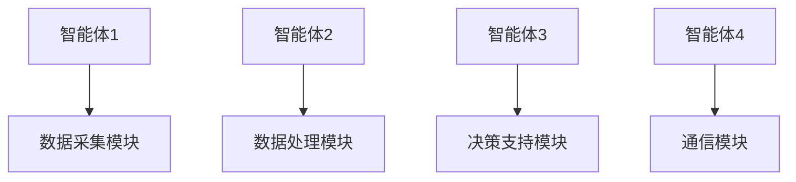

                 


# 多智能体系统在行业分析中的应用

---

## 关键词：
多智能体系统, 行业分析, 协作与竞争, 算法原理, 系统架构, 项目实战

---

## 摘要：
多智能体系统（Multi-Agent System, MAS）作为一种新兴的分布式人工智能技术，近年来在行业分析中的应用日益广泛。本文将从多智能体系统的基本概念出发，逐步分析其核心原理、算法机制、系统架构，并通过实际案例展示其在行业分析中的应用场景。文章还详细探讨了多智能体系统的优势、挑战及未来发展方向，旨在为读者提供一个全面而深入的视角，帮助其更好地理解和应用这一技术。

---

## 第一部分: 多智能体系统基础

---

## 第1章: 多智能体系统概述

### 1.1 多智能体系统的基本概念

#### 1.1.1 多智能体系统的定义
多智能体系统（Multi-Agent System, MAS）是由多个智能体（Agent）组成的分布式系统，这些智能体能够通过协作和竞争完成复杂的任务。智能体是指具有感知环境、做出决策、执行动作能力的实体。

#### 1.1.2 多智能体系统的特征
- **分布式**：智能体分布在不同的位置，通过通信协作完成任务。
- **协作性**：智能体之间可以共享信息、协同完成目标。
- **自主性**：每个智能体都有一定的自主决策能力。
- **动态性**：系统环境和任务可能动态变化，智能体需要自适应。

#### 1.1.3 多智能体系统与单智能体系统的区别
| 特性                | 单智能体系统         | 多智能体系统         |
|---------------------|--------------------|--------------------|
| 智能体数量          | 1                  | 多个               |
| 协作性              | 无或有限           | 高                 |
| 任务分配            | 单一               | 分散               |
| 系统复杂性          | 较低               | 较高               |

---

### 1.2 多智能体系统的发展历程

#### 1.2.1 多智能体系统的起源
多智能体系统起源于20世纪80年代，最初的研究集中在分布式问题求解和协作智能体的设计上。

#### 1.2.2 多智能体系统的演变
随着人工智能技术的进步，多智能体系统逐步从理论研究走向实际应用，尤其是在分布式计算、机器人技术和分布式系统中取得了显著进展。

#### 1.2.3 多智能体系统在现代科技中的地位
多智能体系统是分布式人工智能的核心技术之一，广泛应用于行业分析、机器人协作、自动驾驶等领域。

---

### 1.3 多智能体系统在行业分析中的应用前景

#### 1.3.1 多智能体系统的潜在应用场景
- **金融行业**：实时数据分析、风险评估、投资决策。
- **医疗行业**：疾病诊断、药物研发、患者管理。
- **制造业**：生产优化、供应链管理、设备维护。

#### 1.3.2 行业分析中多智能体系统的独特优势
- **高效协作**：多个智能体协同工作，提升分析效率。
- **动态适应**：智能体能够快速响应环境变化。
- **分布式决策**：避免单点故障，提升系统的鲁棒性。

#### 1.3.3 多智能体系统应用的挑战与机遇
- **挑战**：智能体之间的通信延迟、任务分配的公平性、系统的可扩展性。
- **机遇**：技术创新、行业需求增长、应用场景丰富。

---

## 第2章: 多智能体系统的核心概念与联系

---

### 2.1 多智能体系统的结构与组成

#### 2.1.1 多智能体系统的组成要素
- **智能体**：具备感知、决策和执行能力的实体。
- **环境**：智能体所处的外部世界，包括物理环境和任务环境。
- **通信协议**：智能体之间交互的规则和标准。
- **任务目标**：智能体需要完成的具体任务。

#### 2.1.2 智能体之间的关系
- **协作**：智能体之间共享信息、协同完成任务。
- **竞争**：智能体之间争夺资源或目标，形成竞争关系。

#### 2.1.3 多智能体系统的层次结构
1. **智能体层**：具体执行任务的智能体。
2. **协作层**：负责任务分配和协作协调的中间层。
3. **管理层**：监控和管理整个系统的高层结构。

---

### 2.2 多智能体系统与多任务系统的对比

#### 2.2.1 多智能体系统与多任务系统的定义对比
- 多智能体系统：多个智能体协同完成任务。
- 多任务系统：单个智能体同时处理多个任务。

#### 2.2.2 两者的核心区别
- **智能体数量**：多智能体系统有多个智能体，多任务系统只有一个。
- **任务分配**：多智能体系统通过协作分配任务，多任务系统内部自行处理多个任务。
- **通信机制**：多智能体系统需要智能体之间的通信，多任务系统内部无需通信。

#### 2.2.3 两者在行业分析中的应用差异
- 多智能体系统适用于需要分布式协作的场景。
- 多任务系统适用于需要高效处理多种任务的场景。

---

### 2.3 多智能体系统的核心特征

#### 2.3.1 分布式智能
多智能体系统通过分布式计算实现任务的分解和协作，避免了单点依赖。

#### 2.3.2 协作性
智能体之间通过协作完成任务，提升整体效率。

#### 2.3.3 自适应性
智能体能够根据环境变化动态调整策略，适应复杂场景。

---

## 第3章: 多智能体系统的算法原理

---

### 3.1 多智能体协作与竞争机制

#### 3.1.1 协作机制的定义与实现
协作机制是指智能体之间如何共享信息、分配任务和协同行动。常见的协作机制包括：

1. **分布式任务分配**：智能体根据自身能力和环境信息自主分配任务。
2. **协商与协调**：智能体通过协商确定任务分工和行动顺序。
3. **协作协议**：定义智能体之间的通信规则和协作流程。

#### 3.1.2 竞争机制的定义与实现
竞争机制是指智能体之间如何争夺资源或目标。常见的竞争机制包括：

1. **优先级分配**：根据任务的重要性和紧急性确定优先级。
2. **资源分配算法**：智能体通过竞争规则分配有限资源。
3. **冲突解决**：智能体在发生冲突时通过协商或仲裁机制解决。

#### 3.1.3 协作与竞争的平衡点
在多智能体系统中，协作与竞争需要找到平衡点，以避免资源浪费和效率下降。

---

### 3.2 多智能体系统的通信协议

#### 3.2.1 通信协议的基本概念
通信协议是智能体之间交互的规则和标准，包括信息格式、通信方式和交互流程。

#### 3.2.2 常见的通信协议类型
- **基于消息的通信**：智能体通过交换消息实现信息共享。
- **基于服务的通信**：智能体通过调用服务接口实现协作。
- **基于事件的通信**：智能体通过事件触发机制实现动态协作。

#### 3.2.3 通信协议的选择与设计
选择通信协议时需要考虑系统的实时性、可靠性和可扩展性。

---

### 3.3 多智能体系统的任务分配

#### 3.3.1 任务分配的定义与原则
任务分配是将整体任务分解为多个子任务，并分配给不同的智能体完成。

#### 3.3.2 任务分配算法
- **贪心算法**：根据局部最优选择任务分配。
- **蚁群算法**：模拟蚂蚁觅食行为，寻找最优任务分配路径。
- **遗传算法**：通过模拟进化过程，优化任务分配方案。

#### 3.3.3 任务分配的实现步骤
1. **任务分解**：将整体任务分解为多个子任务。
2. **智能体评估**：评估每个智能体的能力和资源。
3. **任务分配**：根据评估结果分配任务。

---

## 第4章: 多智能体系统的算法实现

---

### 4.1 多智能体协作算法

#### 4.1.1 协作算法的定义
协作算法是实现智能体协作的核心算法，包括任务分配、信息共享和协同行动。

#### 4.1.2 基于协商的协作算法
- **协商机制**：智能体通过协商确定任务分工。
- **冲突解决**：智能体通过协商解决冲突和矛盾。

#### 4.1.3 基于拍卖的协作算法
- **拍卖机制**：智能体通过拍卖方式竞争任务。
- **价格机制**：根据任务的价值和竞争情况确定价格。

---

### 4.2 多智能体竞争算法

#### 4.2.1 竞争算法的定义
竞争算法是智能体在资源有限的情况下，通过竞争机制分配资源的核心算法。

#### 4.2.2 基于优先级的竞争算法
- **优先级排序**：根据任务的重要性和紧急性确定优先级。
- **资源分配**：优先级高的任务优先分配资源。

#### 4.2.3 基于博弈论的竞争算法
- **纳什均衡**：多个智能体在竞争中达到均衡状态。
- **博弈树分析**：通过分析博弈树确定最优策略。

---

### 4.3 多智能体系统的数学模型

#### 4.3.1 协作与竞争的数学模型
多智能体系统可以用博弈论模型进行描述，包括收益矩阵、策略空间和纳什均衡。

#### 4.3.2 竞争与协作的数学公式
假设两个智能体A和B在竞争资源，资源总量为R，每个智能体的收益函数为：
$$ R_A = a \cdot x + b \cdot y $$
$$ R_B = c \cdot x + d \cdot y $$
其中，x和y分别为智能体A和B分配到的资源量，a、b、c、d为权重系数。

---

## 第5章: 多智能体系统的应用案例

---

### 5.1 项目背景与目标
本项目旨在通过多智能体系统实现行业分析中的数据采集、处理和决策支持。

---

### 5.2 系统架构设计

#### 5.2.1 系统功能设计
- **数据采集模块**：负责从多个数据源采集行业数据。
- **数据处理模块**：对采集到的数据进行清洗、转换和分析。
- **决策支持模块**：根据分析结果提供决策建议。
- **通信模块**：实现智能体之间的信息交互。

#### 5.2.2 系统架构图


---

### 5.3 项目实现

#### 5.3.1 环境配置
- 操作系统：Linux
- 开发工具：Python、PyCharm
- 依赖库：numpy、pandas、matplotlib

#### 5.3.2 核心代码实现
```python
class Agent:
    def __init__(self, id):
        self.id = id
        self.data = None
        self.result = None

    def collect_data(self):
        # 从数据源采集数据
        self.data = fetch_data(self.id)

    def process_data(self):
        # 处理数据
        self.result = analyze_data(self.data)

    def communicate(self, other_agent):
        # 与另一个智能体通信
        other_agent.receive_data(self.result)

    def receive_data(self, data):
        # 接收数据
        self.result = data

# 创建多个智能体
agents = [Agent(i) for i in range(1, 5)]

# 智能体协作
for agent in agents:
    agent.collect_data()
    agent.process_data()
    if len(agents) > 1:
        agent.communicate(agents[0])

# 输出结果
for agent in agents:
    print(f"Agent {agent.id} 的结果：{agent.result}")
```

---

### 5.4 实际案例分析

#### 5.4.1 案例背景
某行业分析公司希望通过多智能体系统实现数据采集、处理和决策支持。

#### 5.4.2 案例分析
- **数据采集**：从多个数据源采集行业数据。
- **数据处理**：对数据进行清洗、转换和分析。
- **决策支持**：根据分析结果提供决策建议。

#### 5.4.3 案例总结
通过多智能体系统的应用，行业分析公司实现了数据采集和处理的高效协作，提升了决策的准确性和及时性。

---

## 第6章: 多智能体系统的最佳实践与总结

---

### 6.1 最佳实践

#### 6.1.1 系统设计
- 明确任务目标，合理设计系统架构。
- 确保智能体之间的通信高效可靠。
- 优化任务分配算法，提升系统效率。

#### 6.1.2 开发与测试
- 使用成熟的开发框架和工具，降低开发难度。
- 通过单元测试和集成测试确保系统稳定。

#### 6.1.3 部署与维护
- 选择合适的部署环境，确保系统的可扩展性。
- 定期维护和更新系统，提升性能和安全性。

---

### 6.2 小结

#### 6.2.1 多智能体系统的优势
- 高效协作
- 分布式智能
- 动态适应

#### 6.2.2 多智能体系统的挑战
- 通信延迟
- 任务分配的公平性
- 系统的可扩展性

---

### 6.3 未来展望

#### 6.3.1 技术创新
- 更智能的协作算法
- 更高效的通信协议
- 更强大的分布式计算能力

#### 6.3.2 应用场景拓展
- 更多行业的应用
- 更复杂任务的处理
- 更智能化的决策支持

---

## 作者信息

作者：AI天才研究院/AI Genius Institute  
联系邮箱：contact@ai-genius.com  
个人网站：https://www.ai-genius.com/

