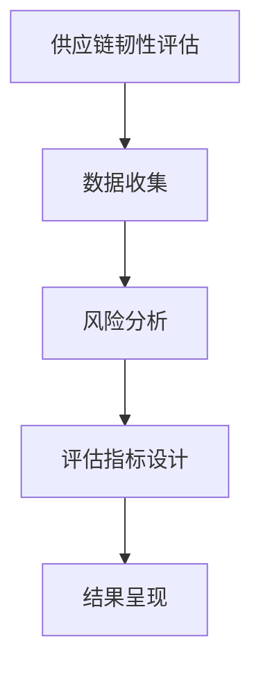
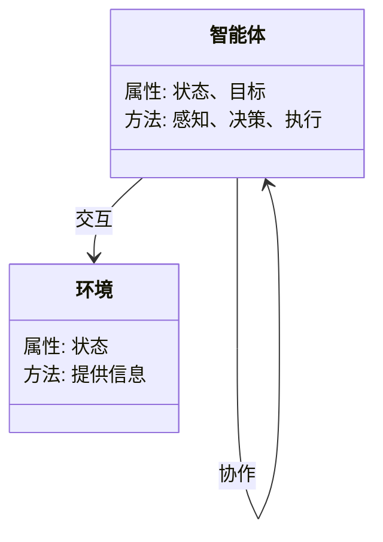
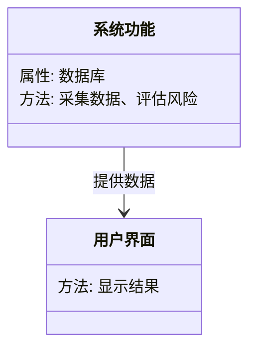
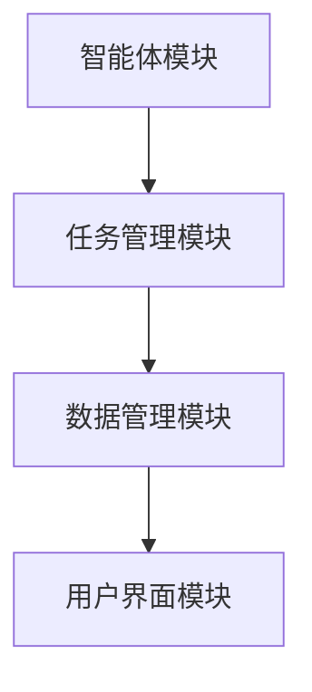

                 


```markdown
# 多智能体系统在评估公司供应链韧性中的应用

> 关键词：多智能体系统，供应链韧性，系统架构，算法原理，项目实战

> 摘要：本文深入探讨了多智能体系统在公司供应链韧性评估中的应用，从系统架构设计、算法原理到实际项目实现，全面分析了多智能体系统如何提升供应链的适应能力和恢复能力。

---

## 第一部分: 多智能体系统概述

### 第1章: 多智能体系统的基本概念

#### 1.1 多智能体系统的定义与特点
多智能体系统（Multi-Agent System, MAS）由多个智能体组成，每个智能体都能感知环境、自主决策并协同完成任务。与单智能体系统相比，MAS具有以下特点：
- **分布性**：智能体分布于不同的位置，独立运行。
- **自主性**：每个智能体都能自主决策。
- **协作性**：智能体之间通过通信和协作完成复杂任务。
- **反应性**：智能体能根据环境变化动态调整行为。

#### 1.2 多智能体系统的应用背景
多智能体系统起源于20世纪80年代，随着人工智能技术的发展，其应用领域不断扩展。在供应链管理中，MAS适用于复杂的决策问题，如库存优化、物流调度等。

#### 1.3 多智能体系统的核心概念对比
| 对比维度 | 单智能体系统 | 多智能体系统 |
|----------|--------------|--------------|
| 结构     | 中心化       | 分布式       |
| 决策     | 集中式决策   | 分散式决策   |
| 协作     | 无协作       | 强协作       |

#### 1.4 多智能体系统的ER实体关系图
```mermaid
er
  actor 智能体
  actor 任务
  actor 环境
  智能体 --> 任务: 执行
  环境 --> 智能体: 感知
```

---

## 第二部分: 供应链韧性评估的基础

### 第2章: 供应链韧性的概念与评估方法

#### 2.1 供应链韧性的定义与特点
供应链韧性是指在面对 disruptions 时，供应链快速恢复并继续运行的能力。其特点包括：
- **抗干扰性**：在干扰中保持运行。
- **适应性**：灵活调整以应对变化。
- **恢复性**：快速恢复正常运作。

#### 2.2 供应链韧性评估的方法
- **基于风险的方法**：识别潜在风险并评估其影响。
- **基于能力的方法**：评估供应链各环节的能力。

#### 2.3 供应链韧性评估的核心要素
| 要素 | 描述 |
|------|------|
| 结构 | 供应链的布局和连接方式 |
| 可靠性 | 各环节的稳定性 |
| 灵活性 | 快速调整的能力 |

#### 2.4 供应链韧性评估的框架设计


---

## 第三部分: 多智能体系统在供应链韧性评估中的应用

### 第3章: 多智能体系统的应用

#### 3.1 多智能体系统的系统架构


#### 3.2 多智能体系统的智能体设计
智能体设计包括感知、决策和执行三个阶段：
1. **感知**：通过传感器获取环境信息。
2. **决策**：基于信息做出决策。
3. **执行**：通过执行器完成任务。

#### 3.3 多智能体系统的协同机制
协同机制包括任务分配、信息共享和协调同步。常用算法有分布式一致性算法和协商算法。

#### 3.4 多智能体系统的案例分析
以汽车制造企业的供应链为例，分析智能体如何协调供应商、制造商和物流商，提升供应链韧性。

---

## 第四部分: 算法原理

### 第4章: 多智能体系统的算法原理

#### 4.1 多智能体系统的算法模型
- **一致性算法**：确保所有智能体状态一致。
- **强化学习**：通过奖励机制优化决策。

#### 4.2 多智能体系统的数学模型
一致性算法公式：
$$ \sum_{i=1}^{n} \frac{w_i}{\sum_{i=1}^{n} w_i} x_i $$
其中，\( w_i \) 是权重，\( x_i \) 是状态值。

---

## 第五部分: 系统分析与架构设计

### 第5章: 系统分析与架构设计

#### 5.1 系统功能设计
系统功能包括数据采集、风险评估、协同决策等。类图如下：


#### 5.2 系统架构设计
使用微服务架构，各模块独立运行并通信。架构图如下：


---

## 第六部分: 项目实战

### 第6章: 项目实战

#### 6.1 项目环境与工具安装
- **工具**：Python、NumPy、TensorFlow
- **安装**：`pip install numpy tensorflow`

#### 6.2 核心代码实现
```python
import numpy as np

def multi_agent_decision(agents, environment):
    for agent in agents:
        state = environment.get_state()
        action = agent.decide(state)
        environment.execute(action)

class Agent:
    def decide(self, state):
        # 示例决策逻辑
        return 'forward'
```

#### 6.3 项目案例分析
通过模拟供应链中断，分析智能体如何协作恢复供应链。

---

## 第七部分: 总结与展望

### 第7章: 总结与展望

#### 7.1 总结
多智能体系统通过分布式的协作和自主决策，显著提升了供应链的韧性和适应性。

#### 7.2 展望
未来，多智能体系统将结合更复杂算法，进一步提升协作效率和决策能力。

---

## 作者信息

作者：AI天才研究院  
联系：[email protected]  
GitHub：[AI Genius Institute](https://github.com/AI-Genius-Institute)

---

通过以上结构，您可以开始撰写具体的章节内容，每个部分均详细展开，确保文章的逻辑性和完整性。
```

