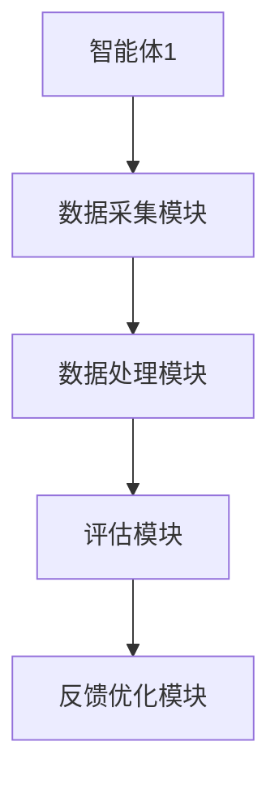

                 


# 多智能体系统在评估公司可持续发展能力中的应用

> 关键词：多智能体系统（MAS）、可持续发展评估、企业风险管理、分布式计算、协作智能、智能体通信、自适应学习

> 摘要：本文探讨了多智能体系统（MAS）在评估公司可持续发展能力中的应用。通过分析多智能体系统的原理、架构和核心算法，结合实际案例，展示了如何利用MAS技术构建一个高效的公司可持续发展能力评估系统。文章从理论到实践，详细阐述了多智能体系统在可持续发展评估中的优势、挑战及解决方案。

---

## 第1章: 多智能体系统概述

### 1.1 多智能体系统的基本概念

#### 1.1.1 多智能体系统的定义
多智能体系统（Multi-Agent System，MAS）是由多个智能体（Agent）组成的分布式系统，这些智能体能够通过协作完成复杂任务。智能体是具有感知、推理、规划和行动能力的实体，可以是软件程序或物理设备。

#### 1.1.2 多智能体系统的特性
- **自主性**：智能体能够自主决策，无需外部干预。
- **反应性**：智能体能够实时感知环境并做出反应。
- **协作性**：多个智能体通过通信和协作完成共同目标。
- **分布性**：智能体分布在不同的节点或设备上，不依赖于中心化的控制节点。

#### 1.1.3 多智能体系统与单智能体系统的主要区别
| 特性 | 单智能体系统 | 多智能体系统 |
|------|--------------|-------------|
| 控制方式 | 单一控制中心 | 分布式控制 |
| 任务分配 | 单一任务处理 | 多任务协作 |
| 效率 | 可能受限于单一决策点 | 更高，任务并行处理 |

#### 1.1.4 多智能体系统在企业中的应用背景
企业在可持续发展评估中需要考虑环境、社会和治理（ESG）等多个维度，多智能体系统能够通过分布式计算和协作智能，高效地处理这些复杂问题。

---

### 1.2 可持续发展能力评估的基本概念

#### 1.2.1 可持续发展的定义与内涵
可持续发展是指在满足当代需求的同时，不损害后代满足其需求的能力。企业在追求经济利益的同时，还需关注环境保护和社会责任。

#### 1.2.2 公司可持续发展能力的评估维度
- **环境维度**：包括碳排放、资源消耗等。
- **社会维度**：包括员工权益、社会责任等。
- **经济维度**：包括盈利能力、财务健康等。

#### 1.2.3 多智能体系统在可持续发展评估中的作用
多智能体系统能够整合企业内外部数据，实时分析并提供决策支持，帮助企业在可持续发展方面实现高效管理。

---

### 1.3 多智能体系统与可持续发展能力评估的关系

#### 1.3.1 多智能体系统如何支持可持续发展评估
通过分布式计算和协作智能，MAS能够快速处理大量数据，提供实时的评估结果。

#### 1.3.2 多智能体系统在可持续发展评估中的优势
- **高效性**：多个智能体同时处理数据，提高评估效率。
- **准确性**：通过协作，能够从多个角度全面评估企业可持续发展能力。
- **灵活性**：智能体可以根据环境变化自适应调整评估策略。

#### 1.3.3 多智能体系统在可持续发展评估中的挑战
- **通信延迟**：智能体之间的通信可能引入延迟。
- **数据隐私**：分布式评估可能涉及敏感数据，需确保隐私安全。

---

## 第2章: 多智能体系统的核心原理

### 2.1 多智能体系统的基本原理

#### 2.1.1 多智能体系统的组成要素
- **智能体**：具有感知、推理、规划和行动能力的实体。
- **通信机制**：智能体之间交换信息的协议和渠道。
- **协作机制**：智能体之间协同完成任务的规则和策略。
- **环境**：智能体所处的物理或数字环境。

#### 2.1.2 多智能体系统中智能体的通信与协作机制
智能体之间的通信可以通过消息传递或共享数据库实现。协作机制包括任务分配、冲突解决和协调同步。

#### 2.1.3 多智能体系统的分布式计算与决策机制
分布式计算通过将任务分配给多个智能体，利用并行处理提高效率。决策机制基于智能体的局部信息和全局目标。

---

### 2.2 多智能体系统中的智能体行为模型

#### 2.2.1 智能体的感知与决策过程
智能体通过传感器或数据源获取信息，经过推理和规划生成行动方案。

#### 2.2.2 智能体之间的协作与冲突解决
协作通过共享目标和资源实现，冲突解决需要协商和仲裁机制。

#### 2.2.3 智能体的自适应与学习能力
智能体可以通过强化学习或监督学习不断优化自身行为。

---

### 2.3 多智能体系统在企业中的应用原理

#### 2.3.1 企业可持续发展评估的核心问题
企业需要综合考虑环境、社会和经济等多个维度的指标，进行全面评估。

#### 2.3.2 多智能体系统如何解决企业可持续发展评估中的问题
通过分布式计算和协作智能，MAS能够快速整合多源数据，提供实时评估结果。

#### 2.3.3 多智能体系统在企业可持续发展评估中的具体应用场景
- **环境数据监测**：智能体实时采集企业碳排放数据。
- **社会责任分析**：智能体评估企业员工权益和社区贡献。
- **经济指标预测**：智能体预测企业的财务健康状况。

---

## 第3章: 多智能体系统与可持续发展评估的结合

### 3.1 可持续发展评估的指标体系

#### 3.1.1 环境维度的评估指标
- 碳排放量
- 能源消耗
- 资源利用效率

#### 3.1.2 社会维度的评估指标
- 员工满意度
- 社会责任履行情况
- 企业声誉

#### 3.1.3 经济维度的评估指标
- 净利润
- 资产负债率
- 投资回报率

#### 3.1.4 综合评估指标的设计方法
综合指标需要考虑各维度的权重，通过加权平均或主成分分析方法计算。

---

### 3.2 多智能体系统在可持续发展评估中的具体应用

#### 3.2.1 多智能体系统的通信协议设计
智能体之间通过消息队列（如Kafka）或共享数据库进行通信。

#### 3.2.2 多智能体系统的协作机制设计
任务分配采用基于角色的协作机制，智能体根据自身能力和目标分配任务。

#### 3.2.3 多智能体系统的自适应学习模型
智能体通过强化学习不断优化评估策略，提高评估准确性和效率。

---

## 第4章: 多智能体系统的算法与实现

### 4.1 多智能体系统的核心算法

#### 4.1.1 基于强化学习的智能体行为决策算法
智能体通过与环境的交互，学习最优行为策略。算法伪代码如下：

```python
def强化学习算法():
    while True:
        状态 = 感知环境()
        行动 = 根据策略选择行动()
        奖励 = 环境反馈奖励()
        更新策略以最大化奖励()
```

#### 4.1.2 基于分布式计算的协作算法
智能体之间通过分布式计算完成任务分配和结果汇总。算法伪代码如下：

```python
def分布式协作算法():
    任务 = 分解任务()
    并行处理任务()
    汇总结果()
```

---

### 4.2 多智能体系统的通信协议设计

#### 4.2.1 智能体之间的消息传递协议
智能体之间通过消息队列（如Kafka）进行通信，消息格式如下：

```json
{
  "类型": "数据",
  "内容": { "环境数据": "温度=25℃" },
  "目标": "智能体A"
}
```

#### 4.2.2 智能体之间的协作协议
协作协议定义了智能体之间的任务分配和结果反馈机制，确保协作过程高效有序。

---

## 第5章: 多智能体系统的系统架构设计

### 5.1 系统功能设计

#### 5.1.1 多智能体系统功能模块
- 数据采集模块：采集企业内外部数据。
- 通信模块：智能体之间通信。
- 协作模块：任务分配与协作。
- 评估模块：计算可持续发展指标。

#### 5.1.2 系统功能流程
数据采集 -> 数据处理 -> 任务分配 -> 协作计算 -> 评估结果 -> 反馈优化。

---

### 5.2 系统架构设计

#### 5.2.1 系统架构图


#### 5.2.2 系统接口设计
- 数据采集接口：用于采集环境数据。
- 通信接口：智能体之间通信的接口。
- 评估接口：计算可持续发展指标的接口。

---

## 第6章: 项目实战

### 6.1 环境安装

#### 6.1.1 安装Python和必要的库
安装Python 3.8以上版本，安装库：`pip install numpy pandas kafka-python`

#### 6.1.2 安装系统依赖
安装必要的系统依赖，如Kafka、Redis。

---

### 6.2 系统核心实现

#### 6.2.1 智能体实现
```python
class 智能体:
    def __init__(self, id):
        self.id = id
        self.目标 = ""
    
    def 感知环境(self):
        # 获取环境数据
        pass
    
    def 采取行动(self):
        # 根据策略采取行动
        pass
```

#### 6.2.2 通信实现
```python
from kafka import KafkaProducer

class 通信模块:
    def __init__(self):
        self.producer = KafkaProducer(bootstrap_servers=['localhost:9092'])
    
    def 发送消息(self, 消息):
        self.producer.send('评估主题', 消息)
```

---

### 6.3 代码实现与解读

#### 6.3.1 环境数据采集代码
```python
import pandas as pd

def 采集环境数据():
    数据 = pd.read_csv('环境数据.csv')
    return 数据
```

#### 6.3.2 分布式计算代码
```python
from concurrent.futures import ThreadPoolExecutor

def 分布式计算(任务):
    executor = ThreadPoolExecutor(max_workers=4)
    futures = []
    for task in 任务:
        futures.append(executor.submit(处理任务, task))
    等待所有任务完成()
    return 结果
```

---

## 第7章: 总结与展望

### 7.1 总结
多智能体系统在评估公司可持续发展能力中具有显著优势，通过分布式计算和协作智能，能够高效地处理复杂问题。

### 7.2 最佳实践 tips
- 数据隐私保护：采用加密技术确保数据安全。
- 系统可扩展性：设计模块化的架构，方便扩展。
- 算法优化：采用强化学习等算法提高评估准确性和效率。

### 7.3 注意事项
- 避免通信延迟：优化通信协议和网络性能。
- 数据质量问题：确保数据来源可靠，减少数据偏差。

### 7.4 拓展阅读
推荐阅读《多智能体系统原理与应用》和《可持续发展评估方法论》。

---

## 作者信息

作者：AI天才研究院（AI Genius Institute） & 禅与计算机程序设计艺术（Zen And The Art of Computer Programming）

---

**注**：以上内容为示例，实际撰写时需要根据具体需求进行调整和补充。

