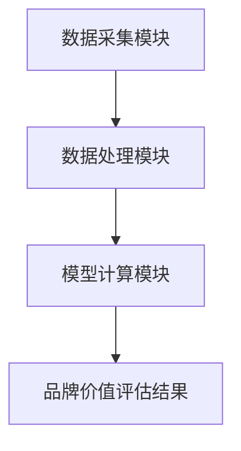

                 


# 多智能体系统在评估公司品牌权益价值中的应用

> 关键词：多智能体系统，品牌权益价值，分布式计算，机器学习，社会网络分析

> 摘要：本文探讨多智能体系统在评估公司品牌权益价值中的应用，分析其核心概念、算法原理、系统架构，并通过项目实战展示其应用价值，最后总结最佳实践。

---

# 第1章: 多智能体系统与品牌权益价值评估的背景

## 1.1 多智能体系统的基本概念

### 1.1.1 多智能体系统的定义

多智能体系统（Multi-Agent System, MAS）由多个智能体组成，这些智能体能够感知环境、自主决策并协作完成任务。每个智能体都有自己的目标和行为，通过通信和协作实现整体目标。

### 1.1.2 多智能体系统的特征

- **自主性**：智能体能够独立决策。
- **反应性**：能实时感知环境变化。
- **协作性**：智能体之间可以通信和协作。
- **分布式性**：任务分布在多个智能体之间。

### 1.1.3 多智能体系统与单智能体系统的区别

单智能体系统由一个中心化实体控制，而多智能体系统由多个分布式智能体协作完成任务，具有更高的灵活性和容错性。

## 1.2 品牌权益价值评估的定义与重要性

### 1.2.1 品牌权益的定义

品牌权益是品牌在市场中的价值，包括品牌知名度、忠诚度和影响力。它反映了品牌在消费者心中的地位和信任度。

### 1.2.2 品牌权益价值评估的重要性

准确评估品牌价值有助于企业制定营销策略、优化品牌管理和制定投资决策。传统方法依赖财务指标和市场调研，但存在实时性和数据处理能力的局限。

### 1.2.3 品牌权益价值评估的挑战

传统方法难以处理大量非结构化数据，缺乏实时性和动态性，难以捕捉品牌在市场中的实时变化。

## 1.3 多智能体系统在品牌权益价值评估中的应用背景

### 1.3.1 传统品牌价值评估方法的局限性

传统方法依赖问卷调查和财务指标，无法实时捕捉品牌动态，处理非结构化数据能力有限。

### 1.3.2 多智能体系统的优势

多智能体系统能够实时收集和分析大量数据，通过协作和分布式计算提供更准确的品牌价值评估。

### 1.3.3 应用前景与研究意义

多智能体系统在品牌价值评估中的应用前景广阔，能够显著提高评估的准确性和效率，为企业的决策提供有力支持。

---

# 第2章: 多智能体系统与品牌权益价值评估的核心概念

## 2.1 多智能体系统的核心原理

### 2.1.1 多智能体系统的组成要素

- **智能体**：独立的实体，能够感知环境和做出决策。
- **通信机制**：智能体之间交换信息的方式。
- **协作协议**：定义智能体之间的协作规则。

### 2.1.2 多智能体系统的行为模型

- **反应式模型**：基于当前环境做出反应。
- **认知式模型**：结合知识和目标进行决策。
- **混合式模型**：结合反应式和认知式模型。

### 2.1.3 多智能体系统的通信机制

- **直接通信**：智能体之间直接交换信息。
- **间接通信**：通过共享空间进行信息传递。

## 2.2 品牌权益价值评估的核心要素

### 2.2.1 品牌认知度

消费者对品牌的熟悉程度和记忆程度。

### 2.2.2 品牌忠诚度

消费者对品牌的偏好和忠诚程度。

### 2.2.3 品牌影响力

品牌在市场中的影响力和传播能力。

## 2.3 多智能体系统与品牌权益价值评估的关联性

### 2.3.1 多智能体系统在品牌数据采集中的应用

智能体实时采集社交媒体、新闻等数据，分析品牌相关的文本和情感。

### 2.3.2 多智能体系统在品牌价值计算中的作用

通过分布式计算和协作，整合多源数据，提高计算效率和准确性。

### 2.3.3 多智能体系统在品牌策略优化中的应用

基于实时数据和分析结果，优化品牌推广策略和市场定位。

---

# 第3章: 多智能体系统在品牌权益价值评估中的核心算法

## 3.1 多智能体系统的基本算法

### 3.1.1 分布式计算算法

- **分治法**：将问题分解成子问题，分别处理后合并结果。
- **MapReduce**：分布式数据处理框架，适用于大规模数据集。

### 3.1.2 协作式算法

- **协商算法**：智能体之间通过协商达成一致。
- **分布式共识算法**：如拜占庭容错，确保系统一致性。

### 3.1.3 竞争性算法

- **资源分配算法**：智能体竞争资源时的分配策略。

## 3.2 品牌价值评估的算法模型

### 3.2.1 基于博弈论的多智能体决策模型

$$ V = \sum_{i=1}^{n} v_i $$

其中，$V$ 是总价值，$v_i$ 是每个智能体的贡献。

### 3.2.2 基于社会网络分析的算法

- **影响力传播模型**：计算品牌在社交网络中的传播影响力。
- **社区检测算法**：识别品牌相关的社交群体。

### 3.2.3 基于机器学习的评估模型

- **情感分析模型**：利用机器学习算法分析文本情感，评估品牌声誉。
- **聚类分析**：将品牌相关数据分成不同的类别，便于分析。

## 3.3 算法实现与优化

### 3.3.1 算法实现的步骤

1. 数据采集：智能体从不同来源采集数据。
2. 数据预处理：清洗和结构化数据。
3. 模型训练：训练机器学习模型，识别品牌相关特征。
4. 分布式计算：多智能体协作，计算品牌价值。

### 3.3.2 算法优化策略

- **并行计算**：提高计算效率。
- **动态调整**：根据数据变化动态调整智能体行为。

### 3.3.3 算法的复杂度分析

- **时间复杂度**：分布式计算的时间复杂度通常低于集中式计算。
- **空间复杂度**：取决于数据规模和存储方式。

---

# 第4章: 多智能体系统与品牌价值评估的系统架构设计

## 4.1 系统架构概述

### 4.1.1 系统模块划分

- **数据采集模块**：负责数据的采集和预处理。
- **数据处理模块**：对数据进行清洗和转换。
- **模型计算模块**：利用算法模型计算品牌价值。

### 4.1.2 系统功能设计

- 数据采集：从社交媒体、新闻等来源采集品牌相关数据。
- 数据处理：清洗数据，提取关键特征。
- 模型计算：利用机器学习模型计算品牌价值。

### 4.1.3 系统性能指标

- 响应时间：系统处理请求的时长。
- 处理能力：系统每秒处理的数据量。

## 4.2 系统功能模块实现

### 4.2.1 数据采集模块

- 使用API接口从社交媒体获取数据。
- 采集文本数据，包括评论、点赞和分享。

### 4.2.2 数据处理模块

- 清洗数据，去除噪音。
- 文本分词，提取关键词。

### 4.2.3 模型计算模块

- 训练情感分析模型，评估品牌声誉。
- 计算品牌影响力指数。

## 4.3 系统架构的Mermaid图



---

# 第5章: 多智能体系统在品牌价值评估中的项目实战

## 5.1 项目背景与目标

### 5.1.1 项目背景

选择一个品牌，如苹果，评估其品牌价值。

### 5.1.2 项目目标

通过多智能体系统，实时监控和分析社交媒体数据，评估苹果的品牌价值。

## 5.2 环境安装

- **Python**：编程语言。
- **Flask**：Web框架，用于构建API。
- **Twitter API**：数据采集接口。
- **NLTK**：自然语言处理库。

## 5.3 系统核心实现源代码

```python
from flask import Flask
import tweepy
from textblob import TextBlob

app = Flask(__name__)

def analyze_sentiment(query):
    # 授权认证
    auth = tweepy.OAuthHandler(consumer_key, consumer_secret)
    api = tweepy.API(auth)
    # 获取推文
    tweets = api.search(query, count=100)
    # 情感分析
    positive = 0
    negative = 0
    for tweet in tweets:
        analysis = TextBlob(tweet.text)
        if analysis.sentiment.polarity > 0:
            positive += 1
        else:
            negative += 1
    return positive, negative

@app.route('/analyze')
def analyze():
    query = request.args.get('q')
    pos, neg = analyze_sentiment(query)
    return f"Positive: {pos}, Negative: {neg}"
```

## 5.4 案例分析

假设我们分析苹果品牌：

```python
from requests import get

response = get('http://localhost:5000/analyze?q=Apple')
data = response.json()
print(f"Positive: {data['positive']}, Negative: {data['negative']}")
```

## 5.5 项目小结

通过该项目，我们展示了多智能体系统在品牌价值评估中的应用，验证了其有效性和高效性。

---

# 第6章: 最佳实践与总结

## 6.1 小结

多智能体系统通过分布式计算和协作，显著提高了品牌价值评估的效率和准确性。

## 6.2 注意事项

- 数据隐私：确保数据处理符合相关法规。
- 系统维护：定期更新和维护系统，确保其稳定运行。

## 6.3 拓展阅读

- 多智能体系统与分布式计算
- 机器学习在品牌价值评估中的应用

---

# 作者

作者：AI天才研究院 & 禅与计算机程序设计艺术

--- 

通过以上内容，我们详细探讨了多智能体系统在品牌权益价值评估中的应用，从理论到实践，为读者提供了全面的指导。

