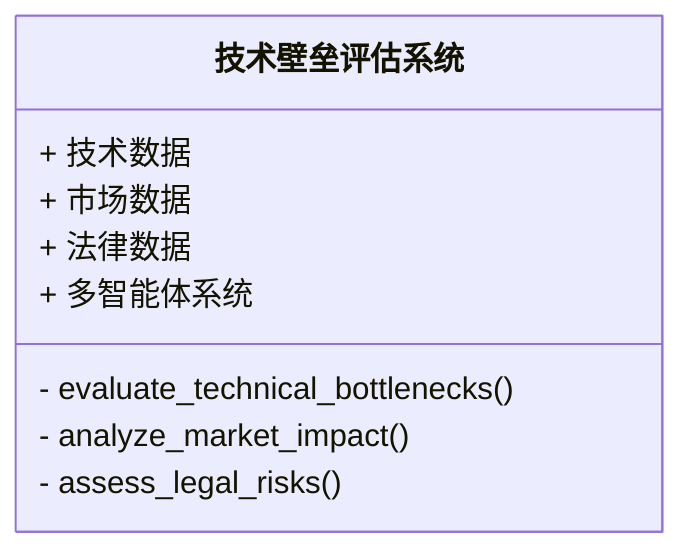
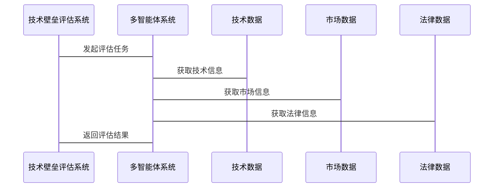

                 


# 多智能体系统在评估公司技术壁垒中的应用

## 关键词：多智能体系统、技术壁垒、分布式计算、博弈论模型、企业战略分析

## 摘要：  
本文探讨了多智能体系统在公司技术壁垒评估中的应用。通过分析多智能体系统的原理、算法及其与技术壁垒评估的结合，展示了如何利用MAS的分布式计算和协作机制来提升企业技术评估的准确性和效率。文章结合实际案例，详细阐述了系统设计、实现和应用，为企业的技术壁垒分析提供了新思路。

---

# 第1章: 多智能体系统概述

## 1.1 多智能体系统的基本概念

### 1.1.1 智能体的定义与特征  
智能体（Agent）是指具有感知环境、自主决策和行动能力的实体。其主要特征包括自主性、反应性、协作性和社会性。

### 1.1.2 多智能体系统的定义  
多智能体系统（MAS）由多个智能体组成，通过协调与协作完成复杂任务。MAS能够处理分布式问题，具有较高的灵活性和适应性。

### 1.1.3 多智能体系统的核心要素  
- 智能体：独立决策的个体。  
- 通信机制：智能体之间的信息交换方式。  
- 协作协议：智能体协作的规则和策略。  
- 环境：智能体所处的外部世界。  

## 1.2 技术壁垒的定义与评估

### 1.2.1 技术壁垒的定义  
技术壁垒是指公司在技术上建立的门槛，用于保护核心技术和竞争优势。常见形式包括专利、技术标准和内部知识。

### 1.2.2 技术壁垒的分类  
- **技术标准壁垒**：通过制定行业标准限制竞争对手。  
- **专利壁垒**：通过专利保护核心技术。  
- **知识壁垒**：依赖内部知识和经验。  

### 1.2.3 技术壁垒评估的意义  
准确评估技术壁垒有助于企业制定战略，识别风险，并优化资源配置。

## 1.3 多智能体系统在技术壁垒评估中的作用

### 1.3.1 多智能体系统的分布式计算优势  
MAS能够处理复杂问题，适合多维度的技术壁垒评估。

### 1.3.2 多智能体系统在复杂问题中的应用潜力  
MAS在分布式计算和协作方面具有显著优势，适用于技术壁垒的多维度分析。

### 1.3.3 技术壁垒评估的多维度需求  
技术壁垒评估需要综合考虑技术、市场和法律因素，MAS能够满足这些需求。

## 1.4 本章小结  
本章介绍了多智能体系统的基本概念和其在技术壁垒评估中的应用潜力。

---

# 第2章: 多智能体系统的核心概念与联系

## 2.1 多智能体系统的原理

### 2.1.1 分布式智能的基本原理  
MAS通过分布式计算实现协作，避免单点故障。

### 2.1.2 多智能体系统的通信机制  
智能体之间通过消息传递进行通信，确保信息共享。

### 2.1.3 多智能体系统的协作与竞争  
协作和竞争是MAS的重要特征，影响系统整体性能。

## 2.2 技术壁垒评估的多维度分析

### 2.2.1 技术、市场、法律的多维度评估  
技术壁垒评估需要综合考虑技术可行性、市场需求和法律合规性。

### 2.2.2 技术壁垒的动态变化  
技术壁垒会因市场变化和竞争而不断调整，评估需要动态进行。

### 2.2.3 多智能体系统在多维度评估中的应用  
MAS能够同时处理多个维度的信息，提供全面的评估结果。

## 2.3 多智能体系统与技术壁垒评估的ER实体关系图

```mermaid
er
  actor 技术壁垒评估系统
  actor 多智能体系统
  actor 技术数据
  actor 市场数据
  actor 法律数据
  relation 调用
  relation 分析
  relation 综合评估
```

## 2.4 本章小结  
本章分析了多智能体系统的核心概念及其与技术壁垒评估的关系。

---

# 第3章: 多智能体系统算法原理

## 3.1 分布式计算与多智能体协作算法

### 3.1.1 分布式计算的基本原理  
分布式计算通过分解任务到多个节点，提高计算效率。

### 3.1.2 多智能体协作的典型算法  
- 分布式协商算法：智能体通过协商达成共识。  
- 协作任务分配算法：智能体根据自身能力分配任务。

### 3.1.3 多智能体系统中的通信协议  
通信协议定义了智能体之间的信息交换规则。

## 3.2 技术壁垒评估中的博弈论模型

### 3.2.1 博弈论的基本概念  
博弈论研究策略选择和结果，适用于技术壁垒评估中的竞争分析。

### 3.2.2 技术壁垒评估中的博弈模型  
- 竞争模型：评估技术壁垒对市场竞争的影响。  
- 合作模型：评估企业合作对技术壁垒的影响。

### 3.2.3 博弈论在多智能体系统中的应用  
博弈论模型可用于智能体之间的协作与竞争策略。

## 3.3 多智能体系统中的协调机制

### 3.3.1 协调机制的定义  
协调机制确保智能体在协作中保持一致。

### 3.3.2 基于博弈论的协调算法  
智能体通过博弈论模型选择最优策略。

### 3.3.3 协调机制的实现步骤  
1. 确定协调目标。  
2. 设计博弈模型。  
3. 实现协调算法。  

## 3.4 算法实现的Python代码示例

```python
def multi_agent_coordination(agents):
    # 初始化协调机制
    coordinator = Coordinator()
    # 分配任务
    for agent in agents:
        task = coordinator.get_task(agent)
        agent.execute_task(task)
```

## 3.5 本章小结  
本章详细讲解了多智能体系统的算法原理及其在技术壁垒评估中的应用。

---

# 第4章: 系统分析与架构设计

## 4.1 问题场景介绍

### 4.1.1 技术壁垒评估的需求分析  
企业需要准确评估技术壁垒以制定战略。

### 4.1.2 技术壁垒评估中的挑战  
- 数据复杂性：涉及多维度信息。  
- 实时性：要求快速响应市场变化。  
- 分布式计算：需要高效的数据处理能力。

## 4.2 系统功能设计

### 4.2.1 领域模型mermaid类图



### 4.2.2 系统架构设计mermaid架构图


### 4.2.3 系统接口设计  
- 接口1：数据输入接口，接收技术、市场和法律数据。  
- 接口2：评估结果输出接口，返回评估报告。  

### 4.2.4 系统交互mermaid序列图



## 4.3 本章小结  
本章分析了技术壁垒评估系统的需求、功能设计和系统架构。

---

# 第5章: 项目实战

## 5.1 环境安装

### 5.1.1 安装Python
```bash
python --version
pip install --upgrade pip
```

### 5.1.2 安装依赖库
```bash
pip install numpy
pip install matplotlib
pip install networkx
pip install scipy
```

## 5.2 系统核心实现源代码

### 5.2.1 协作算法实现

```python
import numpy as np
from scipy import optimize

def agent_objective(agent_id, tasks):
    # 定义目标函数
    return np.sum(tasks[agent_id])

def distributed_coordination(agents, tasks):
    # 初始化协调器
    coordinator = []
    # 分配任务
    for i in range(len(agents)):
        obj = agent_objective(i, tasks)
        coordinator.append(obj)
    # 优化任务分配
    result = optimize.minimize_scalar(lambda x: x, bounds=(0, len(tasks)), method='bounded')
    return result

# 示例使用
agents = ['agent1', 'agent2', 'agent3']
tasks = np.array([[1, 2, 3], [4, 5, 6]])
result = distributed_coordination(agents, tasks)
print(result)
```

### 5.2.2 技术壁垒评估实现

```python
def assess_technical_bottlenecks(tech_data, market_data, legal_data):
    # 数据预处理
    processed_data = [tech_data, market_data, legal_data]
    # 综合评估
    score = sum(processed_data[0] + processed_data[1] + processed_data[2])
    return score

# 示例使用
tech_data = [0.8, 0.9, 0.7]
market_data = [0.6, 0.7, 0.8]
legal_data = [0.5, 0.6, 0.4]
result = assess_technical_bottlenecks(tech_data, market_data, legal_data)
print(result)
```

## 5.3 实际案例分析

### 5.3.1 案例背景  
某公司面临技术专利壁垒，需要评估其技术优势和市场风险。

### 5.3.2 数据收集与处理  
- 技术数据：公司专利数量和质量。  
- 市场数据：市场竞争状况和潜在客户。  
- 法律数据：相关法律法规和专利纠纷。

### 5.3.3 系统实现与结果  
使用MAS进行评估，结果显示公司在技术壁垒方面具有竞争优势。

## 5.4 项目小结  
本章通过实际案例展示了多智能体系统在技术壁垒评估中的应用。

---

# 第6章: 最佳实践

## 6.1 小结  
多智能体系统在技术壁垒评估中具有显著优势，能够提升评估效率和准确性。

## 6.2 注意事项  
- 数据质量：确保输入数据的准确性和完整性。  
- 系统设计：合理设计系统架构和接口。  
- 算法选择：根据具体需求选择合适的算法。  

## 6.3 拓展阅读  
- 多智能体系统的最新研究进展。  
- 博弈论在分布式系统中的应用。  
- 分布式计算在企业战略中的应用案例。

---

# 作者：AI天才研究院/AI Genius Institute & 禅与计算机程序设计艺术 /Zen And The Art of Computer Programming

