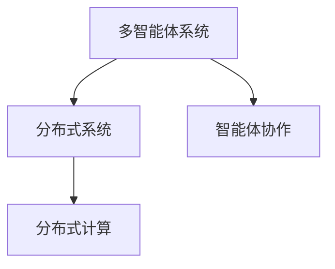

                 

# 多智能体系统在评估公司数字化转型能力中的应用

> 关键词：多智能体系统, 数字化转型, 企业能力评估, 智能体协作, 系统架构设计

> 摘要：随着数字化转型的深入推进，企业对自身数字化能力的评估需求日益增长。多智能体系统作为一种分布式人工智能系统，具有分布式决策、协作优化和自适应学习等特性，为数字化转型能力评估提供了新的思路。本文从多智能体系统的概念出发，探讨其在数字化转型能力评估中的应用，分析其优势和挑战，并通过实际案例展示其在评估中的具体应用，为企业的数字化转型能力评估提供参考。

---

# 第1章: 多智能体系统与数字化转型概述

## 1.1 多智能体系统的定义与特点

### 1.1.1 多智能体系统的定义

多智能体系统（Multi-Agent System, 简称MAS）是由多个智能体（Agent）组成的分布式系统。每个智能体都是一个能够感知环境、自主决策、执行任务的实体。多智能体系统通过智能体之间的协作与通信，完成复杂的任务。

**关键特点：**

- **分布式性**：智能体独立运行，分布在网络中。
- **协作性**：智能体之间通过通信和协调完成共同目标。
- **自主性**：每个智能体都能自主决策，无需外部干预。
- **反应性**：智能体能实时感知环境变化并做出反应。
- **多样性**：智能体可以有不同的目标、能力和服务。

### 1.1.2 多智能体系统的核心特点

与传统单智能体系统相比，多智能体系统具有以下独特优势：

- **分布式计算**：通过分布式计算提高系统的容错性和扩展性。
- **协作优化**：智能体通过协作实现整体目标的最优。
- **动态适应性**：系统能够动态调整以适应环境变化。
- **复杂问题处理**：适用于复杂问题的分解与协作解决。

### 1.1.3 多智能体系统与传统单智能体系统的区别

| 特性          | 多智能体系统                 | 单智能体系统               |
|---------------|------------------------------|----------------------------|
| 系统结构      | 分布式、多个独立智能体       | 集中式、单个控制中心       |
| 协作性        | 强调协作与通信               | 单一决策，无需协作         |
| 可扩展性      | 高                          | 较低                       |
| 复杂性        | 高                          | 较低                       |

---

## 1.2 数字化转型的定义与目标

### 1.2.1 数字化转型的定义

数字化转型是指企业利用数字技术（如大数据、人工智能、云计算等）改变其业务模式、流程、文化等，以提高效率、创造新价值的过程。数字化转型不仅仅是技术的升级，更是企业战略和组织结构的深刻变革。

### 1.2.2 数字化转型的主要目标

数字化转型的核心目标包括：

1. **提高效率**：通过自动化和智能化减少人工干预，提高业务处理效率。
2. **创造新价值**：利用数字技术开发新产品、服务和商业模式。
3. **增强竞争力**：通过数字化能力提升企业在市场中的竞争力。
4. **优化决策**：利用数据驱动的决策方法提高决策的准确性和及时性。

### 1.2.3 数字化转型对企业的影响

- **业务模式创新**：企业通过数字化转型实现从传统模式向数字模式的转变。
- **组织结构优化**：数字化转型推动企业组织结构的扁平化和灵活化。
- **客户体验提升**：通过数字化手段提高客户满意度和忠诚度。
- **成本降低**：通过自动化和智能化减少运营成本。

---

## 1.3 多智能体系统在数字化转型中的应用前景

### 1.3.1 多智能体系统在数字化转型中的优势

多智能体系统在数字化转型中的优势主要体现在以下几个方面：

1. **分布式决策**：多智能体系统能够实现分布式决策，避免单点故障。
2. **协作优化**：通过智能体之间的协作，实现资源的最优配置。
3. **动态适应**：多智能体系统能够快速适应环境变化，提高系统的灵活性。
4. **智能扩展**：多智能体系统可以根据需求动态扩展智能体数量。

### 1.3.2 多智能体系统在企业中的潜在应用场景

多智能体系统在企业数字化转型中的潜在应用场景包括：

1. **智能制造**：通过多智能体系统实现生产过程的智能化和自动化。
2. **供应链管理**：利用多智能体系统优化供应链的协同与效率。
3. **客户服务**：通过智能客服机器人实现客户问题的智能化处理。
4. **数据分析**：利用多智能体系统实现数据的分布式分析和处理。

### 1.3.3 多智能体系统应用的挑战与机遇

#### 挑战：

1. **智能体协作的复杂性**：多智能体系统的协作需要复杂的通信和协调机制。
2. **系统安全性**：多智能体系统的分布式特性增加了系统安全风险。
3. **性能优化**：大规模智能体系统的性能优化是一个难题。

#### 机遇：

1. **技术创新**：多智能体系统的应用推动了人工智能和分布式计算的技术创新。
2. **行业应用**：多智能体系统在多个行业的成功应用为数字化转型提供了新的思路。
3. **市场拓展**：多智能体系统的应用为企业开拓了新的市场机会。

---

## 1.4 本章小结

本章主要介绍了多智能体系统和数字化转型的基本概念、特点以及它们在数字化转型中的应用前景。通过对比分析，我们看到多智能体系统在数字化转型中的独特优势，但也需要面对协作复杂性、系统安全性和性能优化等挑战。接下来的章节将深入探讨多智能体系统在数字化转型能力评估中的具体应用。

---

# 第2章: 多智能体系统的核心概念与原理

## 2.1 多智能体系统的核心概念

### 2.1.1 智能体的定义与特征

智能体（Agent）是指具有感知环境、自主决策、执行任务能力的实体。智能体的核心特征包括：

- **自主性**：智能体能够自主决策，无需外部干预。
- **反应性**：智能体能够实时感知环境变化并做出反应。
- **目标导向性**：智能体的行为目标明确，能够主动追求目标。

### 2.1.2 多智能体系统的组成要素

多智能体系统由以下组成要素构成：

1. **智能体**：系统的执行单元，负责具体任务的完成。
2. **环境**：智能体所处的外部环境，包括物理环境和任务环境。
3. **通信机制**：智能体之间进行信息交换的通道。
4. **协作协议**：智能体之间协作的规则和协议。
5. **任务分配**：智能体之间任务的分配和协调机制。

### 2.1.3 多智能体系统与分布式系统的关系

多智能体系统与分布式系统的关系可以表示为：

多智能体系统是一种分布式系统，但具有更强的智能性和协作性。

---

## 2.2 多智能体系统的协作机制

### 2.2.1 协作的基本原理

多智能体系统的协作机制是实现智能体之间协作的核心。协作的基本原理包括：

1. **通信与信息共享**：智能体之间通过通信机制共享信息。
2. **任务分配与协调**：根据任务需求分配智能体的角色和任务。
3. **冲突解决**：通过协商和冲突解决机制处理协作中的冲突。

### 2.2.2 协作协议与通信机制

协作协议是智能体之间协作的规则，通信机制是智能体之间信息交换的通道。常见的协作协议包括：

1. **分布式一致性协议**：用于保证系统中各智能体的一致性。
2. **协商协议**：用于智能体之间的任务分配和角色分配。
3. **信息交换协议**：用于智能体之间的数据共享和信息传递。

### 2.2.3 协作中的冲突解决与一致性问题

在多智能体系统的协作中，冲突解决和一致性问题是关键。常见的解决方法包括：

- **协商机制**：通过协商解决冲突。
- **仲裁机制**：通过仲裁者解决冲突。
- **补偿机制**：通过调整任务分配实现一致性。

---

## 2.3 多智能体系统的数学模型与算法

### 2.3.1 多智能体系统的数学模型

多智能体系统的数学模型可以表示为：

$$
\text{智能体} = \{ \text{状态}, \text{目标}, \text{行为} \}
$$

其中，状态表示智能体当前的状态，目标表示智能体的行为目标，行为表示智能体采取的动作。

### 2.3.2 常见的多智能体系统算法

常见的多智能体系统算法包括：

1. **分布式算法**：如分布式一致性算法。
2. **协商算法**：如分布式协商算法。
3. **任务分配算法**：如基于目标的任务分配算法。

### 2.3.3 算法的优缺点分析

- **优点**：算法能够提高系统的协作效率和任务完成度。
- **缺点**：算法的复杂性和计算量较大，可能导致系统性能下降。

---

## 2.4 本章小结

本章主要介绍了多智能体系统的核心概念和协作机制，包括智能体的定义与特征、多智能体系统的组成要素、协作协议与通信机制、冲突解决与一致性问题等。同时，还探讨了多智能体系统的数学模型与算法。这些内容为后续章节的数字化转型能力评估奠定了基础。

---

（由于篇幅限制，后续章节内容将在后续部分继续展开。）

