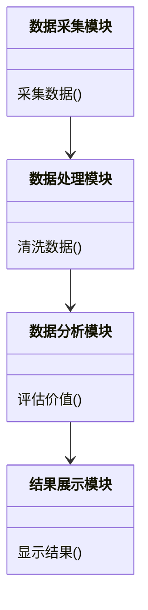

                 


# 多智能体系统在评估公司数据资产价值中的应用

## 关键词：多智能体系统、数据资产价值评估、MAS、分布式计算、协作算法、系统架构设计、数据资产评估

## 摘要：本文深入探讨了多智能体系统（MAS）在公司数据资产价值评估中的应用，从背景介绍到系统设计，再到项目实战，系统性地分析了MAS在数据资产评估中的核心作用。文章详细讲解了多智能体系统的算法原理、系统架构设计，提供了具体的实现案例和代码示例，为读者提供全面的技术指导和实践参考。

---

## 第一部分：多智能体系统与数据资产价值评估背景

### 第1章：多智能体系统与数据资产价值评估概述

#### 1.1 多智能体系统的定义与特点

多智能体系统（Multi-Agent Systems，MAS）是由多个智能体（Agent）组成的分布式系统，这些智能体能够通过协作或竞争完成特定任务。智能体是具有感知环境、自主决策、学习和推理能力的实体。

**1.1.1 多智能体系统的定义**

- 多智能体系统由多个智能体组成，每个智能体都有自己的目标和行为规则。
- 智能体之间通过通信和协作完成复杂的任务。
- MAS的应用领域包括分布式计算、机器人控制、自动驾驶、金融交易等。

**1.1.2 多智能体系统的核心特点**

| 特性 | 描述 |
|------|------|
| 分布式 | 智能体独立运行，无中心控制节点 |
| 协作性 | 智能体通过协作完成共同目标 |
| 反应性 | 能够感知环境变化并实时响应 |
| 学习性 | 具备学习和自适应能力 |

**1.1.3 多智能体系统在企业中的应用**

- **分布式计算**：通过MAS实现任务的分布式处理。
- **数据协作**：多个智能体协作处理数据，提升处理效率。
- **风险管理**：智能体协作识别和应对风险。

#### 1.2 数据资产价值评估的背景与意义

**1.2.1 数据资产的定义与分类**

数据资产是指企业拥有或控制的，能够为企业创造价值的数据资源。数据资产可以分为以下几类：

- **结构化数据**：如数据库中的表格数据。
- **非结构化数据**：如文本、图像、视频等。
- **半结构化数据**：如JSON、XML格式的数据。

**1.2.2 数据资产价值评估的重要性**

- 数据资产是企业的重要资产，需准确评估其价值。
- 通过评估数据资产，企业可以优化数据管理策略。
- 数据资产价值评估有助于企业制定数据驱动的决策。

**1.2.3 数据资产价值评估的挑战**

- 数据量大，难以处理。
- 数据分布复杂，评估难度高。
- 数据安全和隐私问题。

#### 1.3 多智能体系统在数据资产价值评估中的应用

**1.3.1 多智能体系统的协作优势**

- 多智能体系统能够高效处理大规模数据。
- 智能体协作可以提升数据资产评估的准确性和效率。
- 分布式计算能力使得MAS能够处理复杂的任务。

**1.3.2 数据资产评估中的 MAS 应用场景**

- **数据清洗与预处理**：智能体协作处理数据，消除冗余和错误。
- **数据分析与建模**：智能体协作构建数据模型，评估数据价值。
- **风险评估与应对**：智能体实时监控数据风险，制定应对策略。

---

## 第二部分：多智能体系统与数据资产评估的核心概念

### 第2章：多智能体系统与数据资产评估的核心概念

#### 2.1 多智能体系统的核心原理

**2.1.1 智能体的行为模型**

- **反应式模型**：智能体基于当前感知做出反应。
- **认知式模型**：智能体具备推理和规划能力。
- **混合式模型**：结合反应式和认知式模型。

**2.1.2 智能体之间的通信与协作**

- **通信机制**：智能体之间通过消息传递进行通信。
- **协作协议**：定义智能体之间的协作规则和流程。

**2.1.3 分布式计算与任务分配**

- **分布式计算**：任务分解到多个智能体完成。
- **任务分配算法**：根据智能体的能力分配任务。

#### 2.2 数据资产评估的核心原理

**2.2.1 数据资产评估的指标**

- **数据的完整性**：数据是否完整、准确。
- **数据的可用性**：数据是否易于访问和处理。
- **数据的价值**：数据对业务的贡献程度。

**2.2.2 数据资产评估的方法**

- **基于规则的方法**：根据预设规则评估数据价值。
- **基于机器学习的方法**：利用机器学习模型评估数据价值。
- **基于市场的评估方法**：参考市场数据进行评估。

#### 2.3 多智能体系统与数据资产评估的结合

**2.3.1 MAS在数据资产评估中的作用**

- **数据清洗与预处理**：MAS中的智能体协作处理数据。
- **数据分析与建模**：智能体协作构建数据模型。
- **风险评估与应对**：智能体实时监控数据风险。

**2.3.2 MAS与数据资产评估的结合方式**

- **智能体协同分析**：智能体协作完成数据的分析与评估。
- **分布式计算能力**：MAS利用分布式计算提高评估效率。
- **动态调整与优化**：MAS根据实时数据动态调整评估策略。

---

## 第三部分：多智能体系统在数据资产评估中的算法原理

### 第3章：多智能体系统的算法原理

#### 3.1 多智能体协作算法

**3.1.1 分布式协作算法**

- **分布式一致性算法**：如Paxos、Raft，用于保证系统一致性。
- **分布式任务分配算法**：如基于负载均衡的任务分配。

**3.1.2 智能体通信协议**

- **Gossip协议**：用于智能体之间的消息传播。
- **Round-robin协议**：用于负载均衡的通信。

#### 3.2 数据资产评估算法

**3.2.1 数据清洗算法**

- **基于规则的清洗算法**：根据预设规则过滤无效数据。
- **基于统计的清洗算法**：利用统计方法识别异常数据。

**3.2.2 数据分析算法**

- **聚类分析**：用于数据分组和分类。
- **回归分析**：用于预测数据价值。

#### 3.3 算法实现与优化

**3.3.1 算法实现**

```python
def distributed_cleaning(data, agents):
    cleaned_data = []
    for agent in agents:
        cleaned = agent.clean_data(data)
        cleaned_data.append(cleaned)
    return cleaned_data
```

**3.3.2 算法优化**

- **负载均衡优化**：动态调整智能体的任务分配。
- **通信优化**：减少智能体之间的通信开销。

---

## 第四部分：系统分析与架构设计

### 第4章：系统分析与架构设计

#### 4.1 问题场景介绍

- **数据资产评估的复杂性**：数据分布广，类型多样。
- **MAS的优势**：利用MAS的协作和分布式计算能力。

#### 4.2 系统功能设计

**4.2.1 功能模块**

- **数据采集模块**：采集企业数据。
- **数据处理模块**：清洗和预处理数据。
- **数据分析模块**：分析数据并评估价值。
- **结果展示模块**：展示评估结果。

**4.2.2 领域模型类图**



#### 4.3 系统架构设计

**4.3.1 系统架构图**

```mermaid
archi
    title 数据资产评估系统架构
    节点 数据采集模块 {
        类 数据采集模块 {
            属性: 采集接口
            方法: 采集数据()
        }
    }
    节点 数据处理模块 {
        类 数据处理模块 {
            属性: 处理接口
            方法: 清洗数据()
        }
    }
    节点 数据分析模块 {
        类 数据分析模块 {
            属性: 分析接口
            方法: 评估价值()
        }
    }
    节点 结果展示模块 {
        类 结果展示模块 {
            属性: 展示接口
            方法: 显示结果()
        }
    }
    数据采集模块 --> 数据处理模块
    数据处理模块 --> 数据分析模块
    数据分析模块 --> 结果展示模块
```

#### 4.4 系统接口设计

**4.4.1 系统接口**

- **数据采集接口**：`GET /api/data-collect`
- **数据处理接口**：`POST /api/data-process`
- **数据分析接口**：`POST /api/data-analyze`
- **结果展示接口**：`GET /api/result`

#### 4.5 系统交互设计

**4.5.1 交互序列图**

```mermaid
sequenceDiagram
    participant 用户
    participant 数据采集模块
    participant 数据处理模块
    participant 数据分析模块
    participant 结果展示模块
    用户 -> 数据采集模块: 发起数据采集请求
    数据采集模块 -> 数据处理模块: 传输数据
    数据处理模块 -> 数据分析模块: 请求评估价值
    数据分析模块 -> 结果展示模块: 返回评估结果
    用户 <- 结果展示模块: 显示评估结果
```

---

## 第五部分：项目实战与案例分析

### 第5章：项目实战

#### 5.1 环境安装

- **安装Python**：确保安装Python 3.8及以上版本。
- **安装依赖库**：`pip install numpy pandas scikit-learn`

#### 5.2 系统核心实现

**5.2.1 数据采集模块**

```python
import requests

def collect_data(api_url):
    response = requests.get(api_url)
    return response.json()
```

**5.2.2 数据处理模块**

```python
import pandas as pd

def clean_data(data):
    df = pd.DataFrame(data)
    df = df.dropna()
    return df.to_dict('records')
```

**5.2.3 数据分析模块**

```python
from sklearn.cluster import KMeans

def assess_value(data):
    df = pd.DataFrame(data)
    model = KMeans(n_clusters=3)
    model.fit(df)
    return model.labels_
```

#### 5.3 代码解读与分析

- **数据采集模块**：通过HTTP请求采集数据。
- **数据处理模块**：使用Pandas库清洗数据。
- **数据分析模块**：利用K-Means算法进行聚类分析，评估数据价值。

#### 5.4 实际案例分析

**案例分析：**

假设我们有一个公司，需要评估其客户数据的价值。我们使用MAS中的多个智能体协作处理数据。

1. **数据采集**：智能体1从数据库中采集客户数据。
2. **数据清洗**：智能体2清洗数据，去除无效数据。
3. **数据分析**：智能体3使用聚类算法评估客户数据的价值。
4. **结果展示**：智能体4将结果展示给用户。

---

## 第六部分：总结与展望

### 第6章：总结与展望

#### 6.1 项目总结

- **项目背景**：数据资产价值评估的重要性。
- **项目目标**：利用MAS提升数据资产评估的效率和准确性。
- **项目成果**：实现了MAS在数据资产评估中的应用，提高了评估的效率。

#### 6.2 最佳实践

- **模块化设计**：将系统模块化设计，便于维护和扩展。
- **智能体协作**：合理设计智能体的协作机制，提升系统性能。
- **安全性考虑**：确保数据的安全性和智能体的通信安全。

#### 6.3 未来研究方向

- **智能体学习能力**：研究智能体的自适应学习能力。
- **MAS的可扩展性**：提升MAS的可扩展性，适应更大规模的数据处理。
- **多模态数据处理**：研究MAS在多模态数据处理中的应用。

---

## 结语

通过本文的系统介绍和详细分析，我们可以看到，多智能体系统在评估公司数据资产价值中的应用具有巨大的潜力。通过MAS的协作和分布式计算能力，企业可以更高效、更准确地评估数据资产的价值，从而优化数据管理策略，提升企业的竞争力。

---

## 作者：AI天才研究院 & 禅与计算机程序设计艺术

