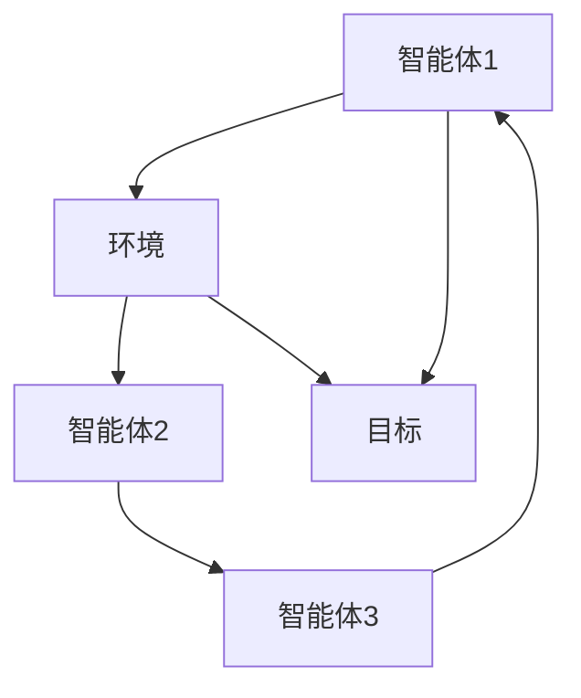
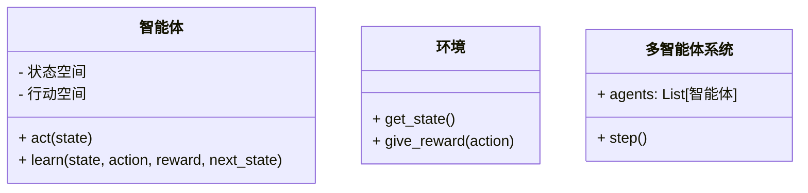
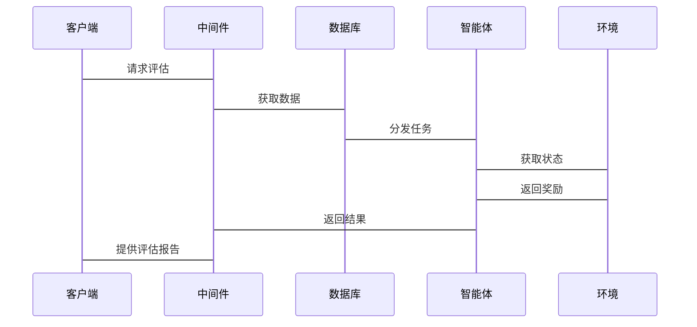

                 


# 多智能体系统在评估公司环境责任表现中的应用

---

## 关键词

多智能体系统 (Multi-Agent System), 环境责任评估, 强化学习, 系统架构设计, 环境影响评估, 社会责任, 可持续发展

---

## 摘要

多智能体系统 (MAS) 作为一种分布式人工智能技术，近年来在多个领域展现出强大的应用潜力。本文探讨了MAS在评估公司环境责任表现中的应用，详细分析了其在环境影响评估、社会责任履行和社会经济效益评估中的优势。文章从 MAS 的核心概念出发，结合具体的算法原理和系统架构设计，展示了如何通过MAS构建一个多维度的环境责任评估系统。通过实际案例分析，验证了MAS在提升企业环境责任表现评估中的有效性和优势。

---

## 第1章: 多智能体系统与环境责任评估背景

### 1.1 多智能体系统的基本概念

#### 1.1.1 多智能体系统的定义

多智能体系统 (Multi-Agent System, MAS) 是由多个智能体 (Agent) 组成的分布式系统，每个智能体都是能够感知环境、自主决策并进行交互的实体。MAS 的核心在于各个智能体之间的协作与竞争，通过分布式计算实现复杂任务的高效完成。

#### 1.1.2 多智能体系统的特征

- **自主性**：智能体能够自主决策，无需外部干预。
- **反应性**：智能体能够实时感知环境并做出响应。
- **协作性**：智能体之间能够通过通信和协作完成共同目标。
- **分布性**：智能体是分布式的，不存在集中化的控制中心。

#### 1.1.3 多智能体系统与单智能体系统的区别

单智能体系统 (Single-Agent System) 依赖于中心化的决策系统，而 MAS 则通过多个智能体的协作实现任务目标。MAS 的优势在于能够处理复杂环境下的分布式问题，而单智能体系统在简单或线性环境中表现更优。

### 1.2 环境责任评估的基本概念

#### 1.2.1 环境责任的定义

环境责任是指企业在经营过程中对环境造成的影响所应承担的责任，包括减少污染、节约资源、降低碳排放等方面。

#### 1.2.2 环境责任评估的重要性

环境责任评估是企业实现可持续发展的重要手段，也是衡量企业社会责任履行情况的重要指标。通过环境责任评估，企业可以识别环境风险，优化环境管理策略。

#### 1.2.3 环境责任评估的指标体系

环境责任评估的指标体系通常包括：

1. **环境影响评估**：包括碳排放、能源消耗、废弃物产生等指标。
2. **社会责任评估**：包括员工权益、社区贡献等指标。
3. **经济效益评估**：包括环境管理成本、环境项目收益等指标。

### 1.3 多智能体系统在环境责任评估中的应用

#### 1.3.1 多智能体系统的优势

多智能体系统在环境责任评估中的优势在于其分布式计算和协作能力，能够处理多维度、多目标的评估问题。

#### 1.3.2 应用案例

例如，某企业使用 MAS 对其供应链的环境影响进行评估。系统中的每个智能体代表供应链中的一个环节，通过协作完成数据收集、分析和优化。

---

## 第2章: 多智能体系统的核心概念与环境责任评估的联系

### 2.1 多智能体系统的原理

#### 2.1.1 分布式智能

MAS 的核心在于分布式的智能体协作，每个智能体负责特定的任务，并通过通信实现整体目标的优化。

#### 2.1.2 协作与竞争

智能体之间的协作和竞争是 MAS 的核心机制。协作有助于实现共同目标，而竞争则能够促进系统效率的提升。

#### 2.1.3 动态环境适应

MAS 具备动态适应环境的能力，能够根据环境变化实时调整策略。

### 2.2 环境责任评估的指标体系

#### 2.2.1 环境影响评估

环境影响评估是衡量企业环境责任的重要指标，包括碳排放、能源消耗、水资源使用等。

#### 2.2.2 社会责任评估

社会责任评估包括员工权益、社区贡献、供应链社会责任等指标。

#### 2.2.3 经济效益评估

经济效益评估包括环境管理成本、环境项目收益等经济指标。

### 2.3 多智能体系统与环境责任评估的结合

#### 2.3.1 系统架构

环境责任评估的 MAS 架构通常包括数据采集层、智能体协作层和决策层。

#### 2.3.2 数据流与信息共享

数据流在 MAS 中通过智能体之间的通信实现共享，确保各智能体能够协同工作。

#### 2.3.3 协作机制

协作机制是 MAS 的核心，包括任务分配、信息共享和决策优化等环节。

---

## 第3章: 多智能体协作算法

### 3.1 多智能体协作的基本原理

多智能体协作算法的核心在于如何实现多个智能体之间的协作，以达到共同目标。常见的协作算法包括基于强化学习的协作、基于博弈论的协作等。

#### 3.1.1 基于强化学习的协作

强化学习是一种通过试错机制优化决策的算法，适用于动态环境下的协作问题。MAS 中的强化学习算法通过智能体之间的交互，不断优化协作策略。

#### 3.1.2 基于博弈论的协作

博弈论是一种分析智能体之间竞争与合作的理论工具，适用于多智能体协作中的策略选择。

### 3.2 多智能体协作算法的实现

#### 3.2.1 算法流程图



#### 3.2.2 Python实现代码

```python
import numpy as np

class Agent:
    def __init__(self, state_space, action_space):
        self.state_space = state_space
        self.action_space = action_space
        self.model = self.build_model()
    
    def build_model(self):
        # 构建神经网络模型
        pass
    
    def act(self, state):
        # 根据状态选择动作
        pass
    
    def learn(self, state, action, reward, next_state):
        # 强化学习算法
        pass

class MAS:
    def __init__(self, num_agents, state_space, action_space):
        self.agents = [Agent(state_space, action_space) for _ in range(num_agents)]
    
    def step(self, state):
        # 智能体采取动作
        actions = [agent.act(s) for agent, s in zip(self.agents, state)]
        # 更新智能体模型
        [agent.learn(s, a, r, next_s) for agent, s, a, r, next_s in zip(self.agents, state, actions, rewards, next_states)]
```

#### 3.2.3 数学模型与公式

MAS 的协作过程可以用以下数学模型描述：

$$
\text{Reward} = \sum_{i=1}^{n} r_i
$$

其中，\( r_i \) 是第 \( i \) 个智能体的奖励。

---

## 第4章: 系统分析与架构设计方案

### 4.1 问题场景介绍

假设某企业需要对其全球供应链的环境影响进行评估，涉及多个供应商、运输环节和生产过程。

### 4.2 项目介绍

本项目旨在构建一个多智能体环境责任评估系统，实现对供应链各环节的环境影响评估。

### 4.3 系统功能设计

#### 4.3.1 领域模型设计



#### 4.3.2 系统架构设计


#### 4.3.3 系统接口设计

- 智能体接口：`act(state)` 和 `learn(state, action, reward, next_state)`
- 环境接口：`get_state()` 和 `give_reward(action)`

#### 4.3.4 系统交互流程



---

## 第5章: 项目实战

### 5.1 环境安装

安装所需的 Python 库，例如 `numpy`, `tensorflow`, `mermaid`, 等。

### 5.2 核心代码实现

实现 MAS 的核心部分，包括智能体类和 MAS 类。

### 5.3 案例分析

分析一个具体的案例，例如对某企业的供应链环境影响进行评估。

### 5.4 项目总结

总结项目实施的经验和教训，提出改进建议。

---

## 第6章: 最佳实践与扩展

### 6.1 最佳实践 tips

- 确保数据的准确性和及时性
- 合理设计智能体的协作机制
- 定期优化系统模型

### 6.2 小结

MAS 在环境责任评估中的应用前景广阔，通过合理设计和优化，可以显著提升企业的环境责任表现评估能力。

### 6.3 注意事项

- 注意数据隐私和安全问题
- 确保系统的可扩展性和灵活性
- 定期更新系统模型以适应环境变化

### 6.4 拓展阅读

- 推荐阅读相关领域的学术论文和书籍
- 关注多智能体系统在其他领域的应用案例

---

## 作者

作者：AI天才研究院/AI Genius Institute & 禅与计算机程序设计艺术 /Zen And The Art of Computer Programming

---

这篇文章详细探讨了多智能体系统在公司环境责任表现评估中的应用，从理论到实践，全面分析了MAS的优势和实现方法。希望对读者有所帮助！

