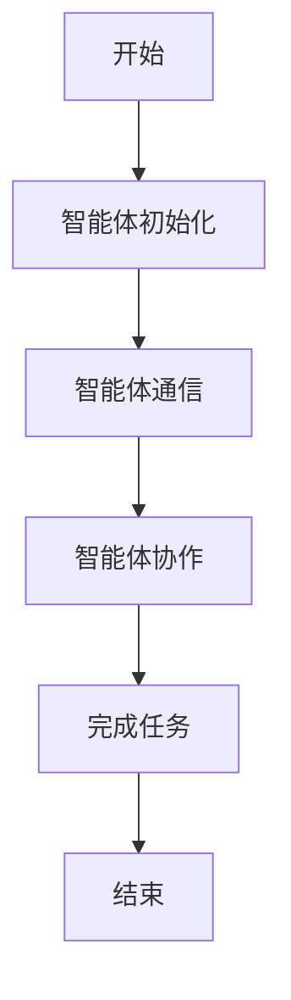
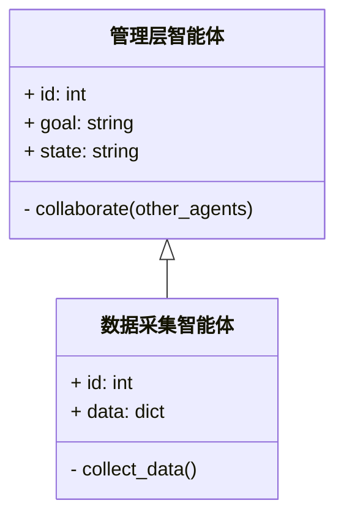
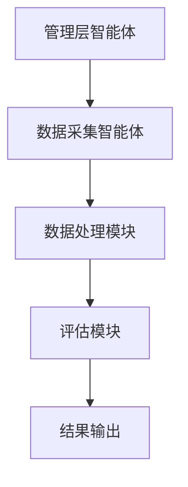

                 


# 多智能体系统在评估公司管理层诚信度中的应用

## 关键词：多智能体系统（MAS）、企业诚信管理、数学模型、评估体系、算法优化、协同学习

## 摘要：  
随着企业规模的不断扩大和管理复杂度的增加，如何准确评估公司管理层的诚信度成为一项重要挑战。本文通过多智能体系统的视角，探讨如何利用MAS的独特优势，构建一个高效、智能的诚信评估体系。文章详细分析了MAS的基本原理、算法实现、系统架构，并通过实际案例展示了其在诚信管理中的应用价值。本文还提出了优化建议和未来发展方向，为企业的诚信管理提供了新的思路。

---

## 第一部分：多智能体系统与诚信评估背景

### 第1章：多智能体系统与诚信评估概述

#### 1.1 多智能体系统的基本概念  
多智能体系统（Multi-Agent System，MAS）由多个智能体（Agent）组成，这些智能体能够自主决策、协作完成任务。MAS的核心在于智能体之间的通信与协作，每个智能体都有自己的目标和行为规则。  

- **智能体的定义**：智能体是指能够感知环境并采取行动以实现目标的实体。它可以是一个软件程序、一个机器人，甚至是人类。  
- **智能体的分类**：根据智能体的结构和行为，可以分为反应式智能体、基于模型的智能体、效用驱动智能体等。  

MAS与单智能体系统（Single-Agent System）的主要区别在于，MAS能够通过智能体之间的协作完成复杂任务，而单智能体系统则依赖单一的决策中心。  

#### 1.2 诚信评估的重要性  
诚信是企业生存和发展的基石。管理层的诚信度直接关系到企业的声誉和长期发展。然而，传统的诚信评估方法往往依赖人工判断，存在主观性强、效率低下的问题。MAS的引入为解决这一问题提供了新的思路。  

- **诚信评估的维度**：包括决策透明度、财务合规性、道德行为、领导力等。  
- **诚信评估的挑战**：数据来源复杂、评估标准不统一、主观性问题突出。  
- **诚信评估的意义**：提升企业信任度、优化内部管理、降低风险。  

#### 1.3 多智能体系统在诚信评估中的应用背景  
MAS在诚信评估中的应用，主要是利用其分布式计算和协作能力，实现对管理层行为的多维度分析。通过MAS，可以实时监控管理层的决策行为，并结合历史数据进行综合评估。  

- **传统方法的局限性**：传统诚信评估依赖人工审核，效率低且容易受到主观因素影响。  
- **MAS的优势**：MAS能够通过分布式计算和智能体协作，实现高效、客观的评估。  
- **问题解决思路**：通过MAS构建一个动态、实时的诚信评估系统，利用多智能体的协作能力，提升评估的准确性和效率。  

---

## 第二部分：多智能体系统的核心概念与联系

### 第2章：多智能体系统的核心原理

#### 2.1 多智能体系统的原理  
MAS的核心在于智能体之间的协作与通信。每个智能体都有自己的目标和行为规则，通过相互协作完成复杂的任务。  

- **智能体的自主性**：智能体能够独立决策，无需外部干预。  
- **智能体的协作性**：智能体之间通过通信机制协作完成任务。  
- **智能体的协调性**：MAS需要解决智能体之间的冲突和协调问题，确保系统整体目标的实现。  

#### 2.2 多智能体系统的属性特征对比  
MAS与单智能体系统在多个方面存在显著差异，以下是一个对比表格：  

| **属性**         | **MAS**                     | **单智能体系统**             |
|------------------|-----------------------------|-----------------------------|
| 系统结构         | 分布式                     | 集中式                     |
| 智能体数量       | 多个                       | 单个                       |
| 决策方式         | 分布式决策                 | 中央决策                   |
| 协作能力         | 高                        | 低                        |

#### 2.3 实体关系图（ER图）架构  
以下是一个MAS的ER图架构（使用Mermaid）：  

```mermaid
erDiagram
    actor 管理层智能体 {
        role 智能体A
        role 智能体B
    }
    actor 管理层数据 {
        role 数据采集智能体
        role 数据处理智能体
    }
    管理层智能体 --> 管理层数据 : 通信与协作
    管理层数据 --> 管理层智能体 : 数据共享
```

---

## 第三部分：算法原理与数学模型

### 第3章：多智能体协作算法

#### 3.1 多智能体协作算法的原理  
MAS中的协作算法是实现智能体协作的核心。以下是协作算法的流程图（使用Mermaid）：  



#### 3.2 算法实现代码  
以下是一个简单的MAS协作算法的Python代码示例：  

```python
class Agent:
    def __init__(self, id):
        self.id = id
        self.goal = None
        self.state = "idle"

    def set_goal(self, goal):
        self.goal = goal
        self.state = "active"

    def collaborate(self, other_agents):
        # 与其他智能体协作
        pass

# 初始化智能体
agent1 = Agent(1)
agent2 = Agent(2)
agent3 = Agent(3)

# 设置目标
agent1.set_goal("完成任务A")
agent2.set_goal("完成任务B")
agent3.set_goal("完成任务C")

# 智能体协作
agent1.collaborate([agent2, agent3])
```

#### 3.3 数学模型与公式  
MAS的协作算法可以通过数学模型进行优化。以下是一个简单的优化模型：  

$$ \text{优化目标} = \sum_{i=1}^{n} \text{智能体} i \text{的贡献} $$  

其中，智能体的贡献可以通过以下公式计算：  

$$ \text{贡献} = \frac{\text{智能体} i \text{的收益}}{\text{智能体} i \text{的成本}} $$  

---

## 第四部分：系统分析与架构设计

### 第4章：系统功能与架构设计

#### 4.1 问题场景介绍  
在企业诚信评估中，MAS可以用于实时监控管理层的行为，并通过多维度数据进行综合评估。  

- **问题场景**：企业需要对管理层的诚信度进行动态评估，以确保企业运营的合规性和透明度。  
- **系统目标**：构建一个基于MAS的诚信评估系统，实现对管理层行为的实时监控和评估。  

#### 4.2 系统功能设计  
以下是系统功能的领域模型类图（使用Mermaid）：  



#### 4.3 系统架构设计  
以下是系统架构图（使用Mermaid）：  



---

## 第五部分：项目实战

### 第5章：项目实现与案例分析

#### 5.1 环境安装  
- **Python环境**：安装Python 3.x及以上版本。  
- **依赖库**：安装`mermaid`和`matplotlib`。  

#### 5.2 核心实现  
以下是核心代码示例：  

```python
import matplotlib.pyplot as plt

class Agent:
    def __init__(self, id):
        self.id = id
        self.data = {}

    def collect_data(self):
        # 收集数据
        self.data[self.id] = "诚信数据"

    def analyze_data(self):
        # 分析数据
        return self.data

# 初始化智能体
agent1 = Agent(1)
agent2 = Agent(2)
agent3 = Agent(3)

# 收集数据
agent1.collect_data()
agent2.collect_data()
agent3.collect_data()

# 分析数据
data = agent1.analyze_data()
data.update(agent2.analyze_data())
data.update(agent3.analyze_data())

# 可视化
plt.bar(data.keys(), [1]*len(data.keys()))
plt.title("诚信数据可视化")
plt.show()
```

#### 5.3 案例分析  
通过上述代码，可以实现对管理层诚信数据的可视化分析。以下是一个案例分析：  

- **案例背景**：某公司管理层存在诚信问题，需要通过MAS进行评估。  
- **数据分析**：通过智能体收集和分析数据，发现管理层的决策存在不透明性。  
- **评估结果**：系统给出管理层诚信度为“中”，并提出改进建议。  

---

## 第六部分：未来展望与总结

### 第6章：未来展望与总结

#### 6.1 未来展望  
随着人工智能技术的不断发展，MAS在诚信评估中的应用将更加广泛。未来的研究方向包括：  

- **更复杂的协作算法**：优化MAS的协作能力，提升评估的准确性。  
- **多模态数据处理**：结合文本、图像等多种数据源，实现更全面的评估。  
- **动态调整机制**：根据实时数据动态调整评估策略。  

#### 6.2 总结  
本文通过MAS的视角，探讨了其在评估公司管理层诚信度中的应用。MAS的独特优势在于其分布式计算和协作能力，能够为企业的诚信管理提供新的思路。通过本文的分析和实践，我们可以看到，MAS在诚信评估中的应用前景广阔，值得进一步研究和推广。

---

## 作者：AI天才研究院/AI Genius Institute & 禅与计算机程序设计艺术 /Zen And The Art of Computer Programming

