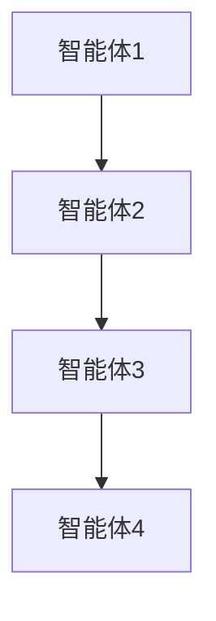

                 


# 多智能体系统在评估公司适应性和抗风险能力中的应用

---

## 关键词：多智能体系统、企业适应性、抗风险能力、分布式计算、人工智能、风险管理

---

## 摘要

多智能体系统（Multi-Agent System, 简称 MAS）是一种由多个智能体组成的分布式系统，每个智能体都能自主决策、协作和通信。在企业环境中，多智能体系统可以通过分布式计算和协作机制，实时分析和评估公司的适应性和抗风险能力。本文将详细探讨多智能体系统的核心原理、其在企业适应性评估中的具体应用，以及如何通过多智能体系统的建模与优化来提升企业的抗风险能力。通过实际案例和算法实现，本文将展示多智能体系统在现代企业风险管理中的巨大潜力。

---

## 第一章：多智能体系统概述

### 1.1 多智能体系统的基本概念

#### 1.1.1 多智能体系统的定义

多智能体系统（Multi-Agent System, MAS）是由多个智能体（Agent）组成的分布式系统。智能体是具有感知环境、自主决策、协作和通信能力的实体，可以是软件程序、机器人或其他智能设备。多智能体系统的目的是通过智能体之间的协作，实现复杂问题的解决方案。

#### 1.1.2 多智能体系统的特征

- **自主性**：智能体能够自主决策，无需外部干预。
- **反应性**：智能体能够实时感知环境并做出反应。
- **协作性**：多个智能体可以协作完成共同目标。
- **分布式性**：智能体分布在网络中，通过通信进行协作。

#### 1.1.3 多智能体系统与单智能体系统的区别

| 特性         | 单智能体系统               | 多智能体系统               |
|--------------|----------------------------|----------------------------|
| 决策中心化   | 单个智能体决策              | 多个智能体协作决策          |
| 通信方式     | 无需通信                   | 需要通信                   |
| 复杂性       | 简单                       | 复杂                       |

---

### 1.2 多智能体系统的组成与架构

#### 1.2.1 智能体的定义与分类

- **智能体**：能够感知环境、自主决策、与环境和其他智能体交互的实体。
- **分类**：
  - **简单反应型智能体**：基于当前感知做出反应。
  - **基于模型的反应型智能体**：使用内部模型进行决策。
  - **目标驱动型智能体**：根据目标驱动行为。
  - **实用驱动型智能体**：根据效用函数驱动行为。

#### 1.2.2 多智能体系统的架构类型

- **集中式架构**：所有智能体向一个中心节点报告，中心节点进行全局决策。
- **分布式架构**：智能体之间直接通信，无中心节点。
- **混合式架构**：结合集中式和分布式架构。

#### 1.2.3 多智能体系统的通信机制

- **直接通信**：智能体之间直接交换信息。
- **间接通信**：通过中介（如共享数据库）进行通信。
- **广播通信**：所有智能体接收相同信息。

---

### 1.3 多智能体系统的应用领域

#### 1.3.1 分布式计算与多智能体系统

- 多智能体系统在分布式计算中的应用，如分布式任务分配、资源调度。

#### 1.3.2 人工智能与多智能体系统

- 多智能体系统在AI中的应用，如自动驾驶、智能城市。

#### 1.3.3 多智能体系统在企业中的应用

- **风险管理**：通过多智能体系统实时监控企业风险。
- **供应链管理**：优化供应链中的协作与资源分配。
- **决策支持**：通过多智能体系统辅助企业决策。

---

## 第二章：多智能体系统的原理与算法

### 2.1 多智能体系统的原理

#### 2.1.1 分布式智能的基本原理

- 分布式智能是多智能体系统的核心思想，通过多个智能体的协作实现整体智能。

#### 2.1.2 多智能体系统的协作机制

- **任务分配**：智能体之间协作完成任务。
- **信息共享**：智能体通过共享信息提升整体决策能力。
- **协调与同步**：智能体之间需要协调动作和同步决策。

#### 2.1.3 多智能体系统的动态环境适应

- 多智能体系统能够适应动态变化的环境，通过实时通信和协作调整决策。

---

### 2.2 多智能体系统的算法基础

#### 2.2.1 分布式计算算法

- **分布式任务分配算法**：如负载均衡算法。
- **分布式一致性算法**：如Paxos、Raft。

#### 2.2.2 协作与通信算法

- **分布式共识算法**：如拜占庭容错（Byzantine Fault Tolerance）。
- **分布式协作算法**：如分布式多目标追踪。

#### 2.2.3 多智能体系统的优化算法

- **分布式优化算法**：如分布式梯度下降。
- **分布式强化学习**：智能体通过强化学习协作完成任务。

---

### 2.3 多智能体系统的数学模型

#### 2.3.1 多智能体系统的状态表示

- 状态空间：表示系统中所有智能体的状态。
- 行动空间：表示智能体可以采取的动作。

#### 2.3.2 多智能体系统的动作选择

- 智能体根据当前状态选择动作，动作选择基于效用函数或策略。

#### 2.3.3 多智能体系统的收益函数

- 收益函数：定义智能体协作后的整体收益。

---

## 第三章：企业适应性与抗风险能力评估

### 3.1 企业适应性的定义与指标

#### 3.1.1 企业适应性的概念

- 企业适应性是指企业在面对外部环境变化时的调整和应对能力。

#### 3.1.2 企业适应性的评估指标

- **灵活性**：企业快速调整的能力。
- **学习能力**：企业从经验中学习的能力。
- **应变能力**：企业在危机中的应对能力。

#### 3.1.3 企业适应性与抗风险能力的关系

- 适应性越强，抗风险能力越强。

---

### 3.2 抗风险能力的评估方法

#### 3.2.1 风险识别与评估

- 风险识别：识别潜在风险。
- 风险评估：评估风险的可能性和影响。

#### 3.2.2 风险应对策略

- **规避**：避免风险。
- **降低**：减少风险的影响。
- **接受**：接受风险。

#### 3.2.3 风险评估的数学模型

- 风险评估模型：$$ R = P \times I $$
  - R：风险值
  - P：风险发生的概率
  - I：风险的影响

---

### 3.3 多智能体系统在企业适应性评估中的应用

#### 3.3.1 多智能体系统在风险识别中的作用

- 多智能体系统通过实时数据采集和分析，帮助识别潜在风险。

#### 3.3.2 多智能体系统在风险应对中的应用

- 多智能体系统通过协作和通信，制定和执行风险应对策略。

#### 3.3.3 多智能体系统在企业适应性优化中的应用

- 多智能体系统通过优化算法，提升企业的适应性和抗风险能力。

---

## 第四章：多智能体系统的建模与仿真

### 4.1 多智能体系统的建模方法

#### 4.1.1 系统建模的基本概念

- 系统建模：通过数学模型描述系统的结构和行为。

#### 4.1.2 多智能体系统的建模工具

- **工具**：如MATLAB、Simulink、NetLogo。
- **建模方法**：如基于状态图的建模、基于Petri网的建模。

#### 4.1.3 多智能体系统的模型验证

- 通过仿真验证模型的准确性和有效性。

---

### 4.2 多智能体系统的仿真过程

#### 4.2.1 系统仿真步骤

1. **需求分析**：明确仿真目标。
2. **模型设计**：设计多智能体系统的模型。
3. **仿真执行**：运行模型，观察结果。
4. **结果分析**：分析仿真结果，优化模型。

#### 4.2.2 多智能体系统仿真的应用场景

- **供应链管理**：优化供应链的协作和资源分配。
- **风险管理**：通过仿真评估风险应对策略的有效性。

---

## 第五章：多智能体系统的算法实现与优化

### 5.1 多智能体系统的算法实现

#### 5.1.1 分布式计算算法的实现

- 通过分布式任务分配算法实现资源的均衡分配。

#### 5.1.2 协作与通信算法的实现

- 通过分布式共识算法实现智能体之间的协作。

#### 5.1.3 多智能体系统的优化算法

- 通过分布式强化学习优化智能体的协作策略。

---

### 5.2 多智能体系统的优化策略

#### 5.2.1 算法优化方法

- **局部优化**：优化单个智能体的行为。
- **全局优化**：优化整个系统的协作。

#### 5.2.2 多智能体系统的性能评估

- **响应时间**：系统的响应速度。
- **资源利用率**：资源的使用效率。
- **系统稳定性**：系统的稳定性。

---

## 第六章：系统设计与实现

### 6.1 系统设计

#### 6.1.1 系统架构设计

- **分层架构**：分为感知层、协作层和执行层。
- **模块化设计**：每个智能体作为一个模块，通过通信模块协作。

#### 6.1.2 系统功能设计

- **风险识别模块**：实时监控风险。
- **协作决策模块**：制定风险应对策略。
- **执行模块**：执行决策。

---

### 6.2 系统实现

#### 6.2.1 环境安装

- 安装Python、分布式计算库（如Dask）、通信库（如ZeroMQ）。

#### 6.2.2 核心代码实现

```python
import zmq

context = zmq.Context()
socket = context.socket(zmq.PUBLISHER)
socket.bind("tcp://*:5555")

while True:
    # 获取当前状态
    state = get_current_state()
    # 发布状态
    socket.send_pyobj(state)
```

#### 6.2.3 系统交互流程图



---

## 第七章：项目实战

### 7.1 项目背景

- 某公司希望通过多智能体系统优化供应链管理，提升抗风险能力。

### 7.2 核心代码实现

```python
def distributed_task_distribution(tasks, agents):
    # 分配任务给智能体
    return {agent: tasks[i] for i, agent in enumerate(agents)}
```

### 7.3 实际案例分析

- 通过多智能体系统实时监控供应链中的潜在风险，优化资源分配，提升供应链稳定性。

### 7.4 项目小结

- 多智能体系统在企业适应性评估中的应用能够显著提升企业的抗风险能力。

---

## 第八章：最佳实践与注意事项

### 8.1 最佳实践

- **模块化设计**：智能体设计尽量模块化。
- **通信机制**：选择合适的通信机制，确保实时性。
- **算法优化**：根据实际需求优化算法。

### 8.2 小结

- 多智能体系统在企业适应性评估中的应用前景广阔，能够显著提升企业的抗风险能力。

---

## 第九章：未来展望

### 9.1 多智能体系统的未来发展方向

- **强化学习的进一步应用**：通过强化学习优化多智能体协作。
- **边缘计算的结合**：多智能体系统与边缘计算的结合。
- **智能体的自主性提升**：提升智能体的自主决策能力。

### 9.2 多智能体系统的应用潜力

- 多智能体系统在企业适应性评估中的应用潜力巨大，未来将更加智能化和自动化。

---

## 作者：AI天才研究院/AI Genius Institute & 禅与计算机程序设计艺术/Zen And The Art of Computer Programming

---

本文通过详细分析多智能体系统的原理、算法和应用，展示了其在企业适应性评估中的巨大潜力。通过实际案例和代码实现，读者可以深入了解如何利用多智能体系统提升企业的抗风险能力。

