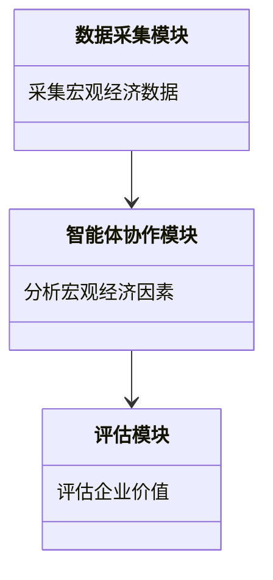
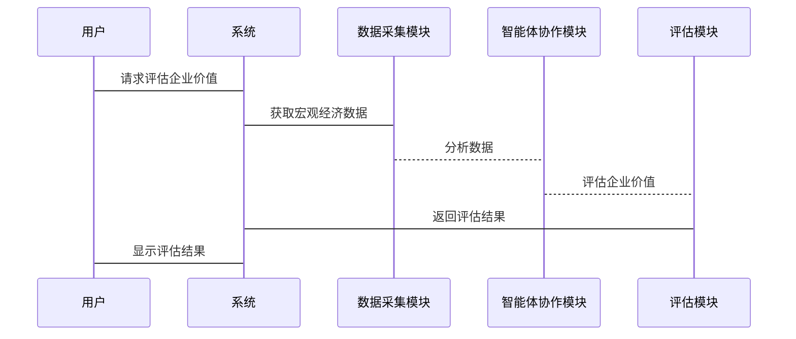

                 


# 多智能体系统在评估宏观经济因素对企业价值影响中的应用

## 关键词：
多智能体系统，宏观经济因素，企业价值，智能体协作，系统架构，算法原理，案例分析

## 摘要：
本文探讨了多智能体系统（MAS）在评估宏观经济因素对企业价值影响中的应用。通过分析宏观经济因素如GDP、利率、通货膨胀率等如何影响企业价值，结合MAS的协作机制，构建了一个基于MAS的宏观经济评估系统。文章从背景介绍、核心概念、算法原理、系统架构到项目实战，详细阐述了如何利用MAS进行宏观经济分析，并通过具体案例展示了其应用效果。文章最后总结了研究成果，并展望了未来的发展方向。

---

# 第一部分：背景介绍

## 第1章：多智能体系统与宏观经济因素概述

### 1.1 多智能体系统的基本概念

#### 1.1.1 多智能体系统的定义
多智能体系统（Multi-Agent System, MAS）是由多个智能体（Agent）组成的系统，这些智能体能够自主决策、协作和通信，以完成特定任务。MAS的智能体具有主动性、反应性和社会性。

#### 1.1.2 多智能体系统的特征
- **自主性**：智能体能够自主决策。
- **反应性**：能够感知环境并实时响应。
- **协作性**：通过通信和协作完成复杂任务。
- **分布式**：智能体分布在不同的位置，具有分布式结构。

#### 1.1.3 多智能体系统的应用场景
- 经济学模拟
- 供应链管理
- 智能城市
- 金融市场分析

### 1.2 宏观经济因素对企业价值的影响

#### 1.2.1 宏观经济因素的定义
宏观经济因素包括GDP、利率、通货膨胀率、就业率等，这些因素对企业价值有直接影响。

#### 1.2.2 宏观经济因素对企业价值的影响机制
- GDP增长促进企业收入增长。
- 利率上升增加企业融资成本。
- 通货膨胀影响企业成本和定价。

#### 1.2.3 多智能体系统在宏观经济分析中的作用
MAS能够模拟经济主体的行为，分析宏观经济因素对企业的影响。

---

# 第二部分：核心概念与联系

## 第2章：宏观经济因素与企业价值的关系

### 2.1 宏观经济因素的分类

#### 2.1.1 GDP与企业价值
GDP增长通常意味着企业收入增长，进而影响企业价值。

#### 2.1.2 利率对企业价值的影响
利率上升会增加企业融资成本，影响企业利润和价值。

#### 2.1.3 通货膨胀率与企业价值的关系
通货膨胀影响企业成本和定价，进而影响企业价值。

### 2.2 多智能体系统在宏观经济分析中的应用

#### 2.2.1 多智能体系统的协作机制
智能体通过通信和协作，模拟经济主体的行为，分析宏观经济因素的影响。

#### 2.2.2 宏观经济因素与企业价值的关系建模
建立宏观经济因素与企业价值的关系模型，分析其影响。

---

# 第三部分：算法原理

## 第3章：宏观经济因素与企业价值的关系建模

### 3.1 算法原理

#### 3.1.1 线性回归模型
建立宏观经济因素与企业价值的线性回归模型，分析各因素的影响力。

$$ 企业价值 = \beta_0 + \beta_1 \times GDP + \beta_2 \times 利率 + \beta_3 \times 通货膨胀率 $$

#### 3.1.2 贝叶斯网络
使用贝叶斯网络建模宏观经济因素与企业价值的关系，分析其因果关系。

---

# 第四部分：系统分析与架构设计

## 第4章：系统架构设计

### 4.1 项目介绍

#### 4.1.1 项目背景
本项目旨在利用MAS分析宏观经济因素对企业价值的影响，构建一个宏观经济评估系统。

### 4.2 系统功能设计

#### 4.2.1 领域模型
使用Mermaid类图展示系统模块，包括数据采集、智能体协作、评估模块等。



### 4.3 系统架构设计

#### 4.3.1 架构图
使用Mermaid架构图展示系统的整体架构，包括前端、后端、数据库等。

```mermaid
archi
    节点 Web前端 {
        负责用户交互
    }
    节点 后端服务 {
        负责业务逻辑处理
    }
    节点 数据库 {
        负责数据存储
    }
    Web前端 --> 后端服务
    后端服务 --> 数据库
```

### 4.4 系统接口设计

#### 4.4.1 接口描述
- 数据采集接口：接收宏观经济数据。
- 智能体协作接口：智能体之间的通信接口。
- 评估接口：输出企业价值评估结果。

### 4.5 系统交互设计

#### 4.5.1 交互流程
使用Mermaid序列图展示系统的交互流程，包括用户请求、数据处理、结果返回。



---

# 第五部分：项目实战

## 第5章：项目实现

### 5.1 环境安装

#### 5.1.1 安装Python
安装Python 3.x以上版本。

#### 5.1.2 安装依赖库
安装numpy、pandas、scikit-learn等库。

### 5.2 核心代码实现

#### 5.2.1 数据采集模块
编写代码采集宏观经济数据。

```python
import pandas as pd

def collect_data():
    data = pd.read_csv('macroeconomic_factors.csv')
    return data
```

#### 5.2.2 智能体协作模块
编写智能体协作代码，分析宏观经济因素。

```python
class Agent:
    def __init__(self, data):
        self.data = data

    def analyze(self):
        # 分析数据并返回结果
        return self.data
```

#### 5.2.3 评估模块
编写评估企业价值的代码。

```python
class Evaluator:
    def __init__(self, data):
        self.data = data

    def evaluate(self):
        # 使用线性回归模型评估企业价值
        model = linear_model.LinearRegression()
        model.fit(self.data[['GDP', '利率', '通货膨胀率']], self.data['企业价值'])
        return model.predict(self.data[['GDP', '利率', '通货膨胀率']])
```

### 5.3 案例分析

#### 5.3.1 数据分析
分析宏观经济数据，评估企业价值。

### 5.4 项目总结

#### 5.4.1 成果展示
展示评估结果，分析MAS的应用效果。

#### 5.4.2 经验总结
总结项目中的经验教训，提出改进建议。

---

# 第六部分：总结与展望

## 第6章：总结与展望

### 6.1 研究总结

#### 6.1.1 核心成果
MAS在宏观经济分析中的应用，构建了企业价值评估系统。

### 6.1.2 研究不足
MAS的复杂性，模型的准确性需要进一步提高。

### 6.2 未来展望

#### 6.2.1 研究方向
进一步优化MAS模型，探索新的应用场景。

#### 6.2.2 发展趋势
MAS在宏观经济分析中的应用前景广阔，未来将更加智能化和自动化。

---

# 作者信息

作者：AI天才研究院/AI Genius Institute & 禅与计算机程序设计艺术 /Zen And The Art of Computer Programming

---

**本文通过详细分析宏观经济因素对企业价值的影响，结合多智能体系统的协作机制，构建了一个高效的宏观经济评估系统。从理论到实践，系统地展示了MAS的应用，为企业的价值评估提供了新的思路。未来的研究将进一步优化模型，探索更多应用场景，推动MAS在宏观经济分析中的广泛应用。**

