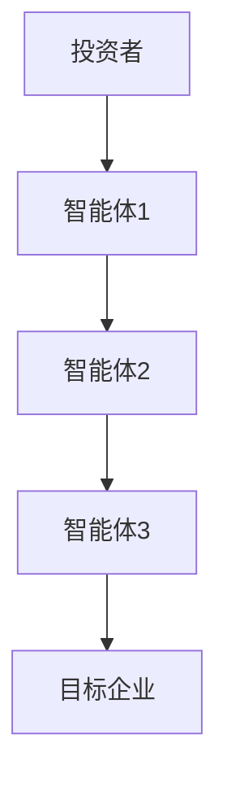
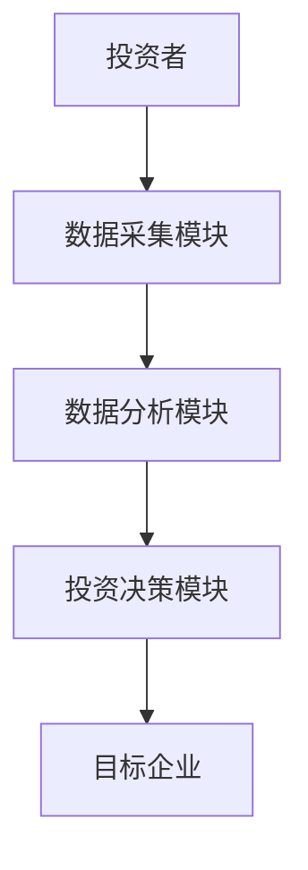

                 


```markdown
# 多智能体系统在识别和评估ESG投资机会中的作用

> 关键词：多智能体系统、ESG投资、投资机会、人工智能、可持续发展

> 摘要：本文探讨了多智能体系统（Multi-Agent System, MAS）在识别和评估ESG（环境、社会和治理）投资机会中的作用。通过分析多智能体系统的结构、通信机制和协作算法，结合ESG评估的核心指标体系，本文详细阐述了如何利用多智能体系统的优势来优化ESG投资决策。文章从理论到实践，结合实际案例和代码实现，展示了多智能体系统在ESG投资中的应用潜力和最佳实践。

---

# 第一部分: 多智能体系统与ESG投资机会概述

## 第1章: 多智能体系统与ESG投资机会的背景介绍

### 1.1 多智能体系统的定义与特点
#### 1.1.1 多智能体系统的定义
多智能体系统（Multi-Agent System, MAS）是由多个智能体组成的分布式系统，这些智能体能够通过环境和彼此之间的交互来感知和响应变化。与单智能体系统相比，MAS具有更高的灵活性和协作能力。

#### 1.1.2 多智能体系统的特性
- **自主性**：每个智能体能够独立决策和行动。
- **反应性**：智能体能够实时感知环境并做出响应。
- **协作性**：智能体之间通过通信和协作完成共同目标。
- **分布式性**：智能体分布在不同的位置，通过网络进行交互。

#### 1.1.3 多智能体系统与单智能体系统的区别
| 特性          | 多智能体系统          | 单智能体系统          |
|---------------|-----------------------|-----------------------|
| 系统结构      | 分布式结构            | 集中式结构            |
| 智能体数量    | 多个智能体            | 单个智能体            |
| 决策方式      | 分布式决策            | 集中式决策            |
| 适应性        | 高                   | 中                   |

### 1.2 ESG投资机会的定义与重要性
#### 1.2.1 ESG的定义
ESG（Environmental, Social, and Governance）是指企业在环境、社会和公司治理方面的表现。ESG投资关注企业在可持续发展方面的表现，旨在通过投资促进社会和环境的积极变化。

#### 1.2.2 ESG投资的重要性
- **社会责任**：通过投资促进企业和社会的可持续发展。
- **风险控制**：识别和评估企业在环境和社会方面的潜在风险。
- **收益潜力**：ESG表现良好的企业通常具有更强的抗风险能力和长期收益潜力。

#### 1.2.3 ESG与传统投资的区别
| 特性          | ESG投资              | 传统投资              |
|---------------|-----------------------|-----------------------|
| 投资目标      | 可持续发展目标        | 财务回报              |
| 关注因素      | 环境、社会、治理      | 财务表现              |
| 风险评估      | 包括非财务风险        | 仅关注财务风险        |

### 1.3 多智能体系统在ESG投资中的作用
#### 1.3.1 多智能体系统在ESG投资中的优势
- **分布式数据处理**：多智能体系统能够同时处理大量的环境、社会和治理数据。
- **协作决策**：多个智能体可以协同工作，提供更全面的ESG评估。
- **动态适应性**：智能体能够实时响应市场变化，优化投资策略。

#### 1.3.2 多智能体系统如何帮助识别ESG投资机会
- **数据采集与分析**：通过智能体收集和分析企业的ESG数据，识别潜在的投资机会。
- **风险评估**：利用多智能体系统的协作能力，评估企业的环境和社会风险。
- **投资组合优化**：通过智能体的协作，优化投资组合，降低风险，提高收益。

#### 1.3.3 多智能体系统在ESG投资中的应用前景
随着全球对可持续发展的关注增加，多智能体系统在ESG投资中的应用前景广阔。通过智能化的协作和数据分析，多智能体系统能够帮助投资者更高效地识别和评估ESG投资机会。

---

## 第2章: 多智能体系统的核心概念与原理

### 2.1 多智能体系统的体系结构
#### 2.1.1 分层结构
多智能体系统的分层结构包括感知层、决策层和执行层。感知层负责数据的采集和处理，决策层负责制定决策，执行层负责执行决策。

#### 2.1.2 分布式结构
分布式结构通过多个智能体的协作完成任务，适用于大规模数据处理和复杂决策。

#### 2.1.3 集中式结构
集中式结构通过一个中央控制节点协调多个智能体，适用于任务简单、决策统一的场景。

### 2.2 多智能体系统中的通信机制
#### 2.2.1 信息交换协议
信息交换协议定义了智能体之间的通信规则，包括数据格式、传输方式和安全机制。

#### 2.2.2 通信模型
通信模型描述了智能体之间的信息流，包括单向通信和双向通信。

#### 2.2.3 通信效率优化
通过优化通信协议和数据压缩技术，提高智能体之间的通信效率。

### 2.3 多智能体系统中的协作机制
#### 2.3.1 协作任务分配
协作任务分配通过智能体之间的协作完成任务分配，确保资源的合理利用。

#### 2.3.2 协作决策过程
协作决策过程通过智能体之间的协作和协商，制定最优决策。

#### 2.3.3 协作效果评估
协作效果评估通过评估指标，如任务完成率、资源利用率等，衡量协作的效果。

---

## 第3章: ESG投资机会的识别与评估方法

### 3.1 ESG数据的收集与处理
#### 3.1.1 数据来源
ESG数据来源于企业公开报告、第三方评级机构和政府数据库。

#### 3.1.2 数据清洗
数据清洗包括去除噪声数据、填补缺失值和处理异常值。

#### 3.1.3 数据预处理
数据预处理包括数据标准化、数据归一化和特征提取。

### 3.2 ESG评估指标体系
#### 3.2.1 环境指标
环境指标包括碳排放、能源使用效率和水资源管理。

#### 3.2.2 社会指标
社会指标包括员工权益、社会责任和社区关系。

#### 3.2.3 治理指标
治理指标包括董事会结构、高管薪酬和公司治理透明度。

### 3.3 ESG投资机会的评估模型
#### 3.3.1 评分模型
评分模型通过对环境、社会和治理指标的加权评分，评估企业的ESG表现。

#### 3.3.2 风险评估模型
风险评估模型通过分析环境和社会风险，评估企业的潜在风险。

#### 3.3.3 投资组合优化模型
投资组合优化模型通过优化投资组合，降低风险，提高收益。

---

## 第4章: 多智能体系统在ESG投资中的算法原理

### 4.1 分布式计算与多智能体协作
#### 4.1.1 分布式计算的基本原理
分布式计算通过多个计算节点协作完成任务，适用于大规模数据处理和复杂计算。

#### 4.1.2 多智能体协作算法
多智能体协作算法包括任务分配、信息交换和协作决策等步骤。

#### 4.1.3 算法流程图


### 4.2 多智能体系统中的通信机制
#### 4.2.1 信息交换协议
信息交换协议包括数据格式、传输方式和安全机制。

#### 4.2.2 通信模型
通信模型包括单向通信和双向通信。

#### 4.2.3 通信效率优化
通过优化通信协议和数据压缩技术，提高通信效率。

### 4.3 多智能体系统中的协作机制
#### 4.3.1 协作任务分配
协作任务分配通过智能体之间的协作完成任务分配。

#### 4.3.2 协作决策过程
协作决策过程通过智能体之间的协作和协商，制定最优决策。

#### 4.3.3 协作效果评估
协作效果评估通过评估指标，如任务完成率、资源利用率等，衡量协作的效果。

---

## 第5章: 系统架构设计与实现

### 5.1 问题场景介绍
在ESG投资中，投资者需要实时获取和分析大量的环境、社会和治理数据，以识别和评估投资机会。

### 5.2 系统功能设计
#### 5.2.1 数据采集模块
数据采集模块负责采集企业的ESG数据，包括环境、社会和治理指标。

#### 5.2.2 数据分析模块
数据分析模块通过多智能体系统的协作，对数据进行分析和评估。

#### 5.2.3 投资决策模块
投资决策模块根据分析结果，制定投资策略。

### 5.3 系统架构设计


### 5.4 系统接口设计
系统接口设计包括数据接口、通信接口和用户接口。

### 5.5 系统交互流程
系统交互流程包括数据采集、数据分析、投资决策和结果输出。

---

## 第6章: 项目实战与案例分析

### 6.1 环境安装与配置
#### 6.1.1 系统环境
需要安装Python、Java和相关开发工具。

#### 6.1.2 依赖安装
安装必要的库和工具，如Pandas、NumPy和scikit-learn。

### 6.2 系统核心实现
#### 6.2.1 数据采集模块实现
通过API获取企业的ESG数据。

#### 6.2.2 数据分析模块实现
使用多智能体系统的协作算法，分析企业的ESG表现。

#### 6.2.3 投资决策模块实现
根据分析结果，制定投资策略。

### 6.3 代码实现与解读
#### 6.3.1 数据采集模块代码
```python
import requests

def get_esg_data(company_id):
    url = f"https://api.example.com/esg/{company_id}"
    response = requests.get(url)
    return response.json()
```

#### 6.3.2 数据分析模块代码
```python
from sklearn import linear_model

def analyze_esg(data):
    model = linear_model.LinearRegression()
    model.fit(data[['环境指标', '社会指标']], data['治理指标'])
    return model.predict(new_data)
```

#### 6.3.3 投资决策模块代码
```python
def make_investment_decision(risk_score, return_score):
    if risk_score < 0.2 and return_score > 0.8:
        return "投资"
    else:
        return "不投资"
```

### 6.4 实际案例分析
通过实际案例分析，验证系统的有效性和可行性。

### 6.5 项目总结与优化
总结项目的实现过程，并提出优化建议。

---

## 第7章: 总结与展望

### 7.1 总结
本文详细探讨了多智能体系统在识别和评估ESG投资机会中的作用，从理论到实践，展示了多智能体系统在ESG投资中的应用潜力。

### 7.2 展望
未来，随着人工智能和大数据技术的发展，多智能体系统在ESG投资中的应用将更加广泛和深入。

---

作者：AI天才研究院/AI Genius Institute  
联系方式：[email protected]
```

