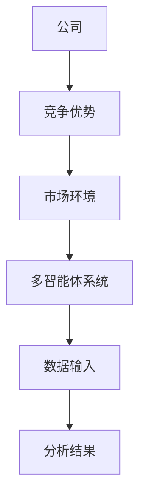
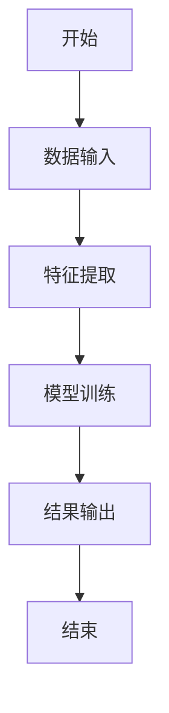
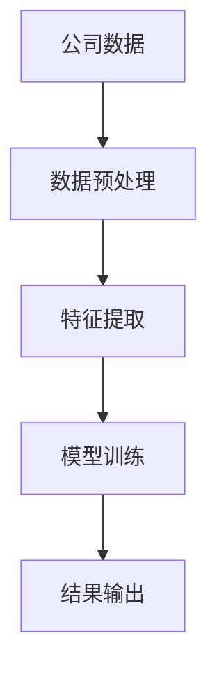

                 


# 多智能体系统在识别和评估公司竞争优势中的作用

> 关键词：多智能体系统，公司竞争优势，算法原理，系统架构，项目实战

> 摘要：本文探讨了多智能体系统在识别和评估公司竞争优势中的作用，通过详细分析多智能体系统的原理、算法、架构设计以及实际应用案例，展示了如何利用多智能体系统帮助公司优化竞争优势。文章结构清晰，内容涵盖从理论到实践的各个方面，旨在为读者提供全面的技术指导。

---

## 第1章: 多智能体系统与公司竞争优势的背景介绍

### 1.1 多智能体系统的定义与特点
多智能体系统（Multi-Agent System, MAS）是由多个智能体组成的分布式系统，每个智能体都是一个能够感知环境、自主决策并采取行动的实体。其特点包括分布性、协作性、反应性和适应性。多智能体系统广泛应用于自动驾驶、机器人协作、经济模拟等领域。

### 1.2 公司竞争优势的定义与构成
竞争优势是指公司在市场中相对于竞争对手的有利条件，包括资源、能力、品牌、技术等方面。竞争优势的核心要素包括市场地位、资源能力、创新能力等。

### 1.3 多智能体系统与公司竞争优势的关系
多智能体系统能够通过分析市场数据、预测趋势、优化资源配置等方式帮助公司识别和评估竞争优势，从而提升公司在市场中的竞争力。

---

## 第2章: 多智能体系统的核心概念与联系

### 2.1 多智能体系统的原理
多智能体系统由多个智能体组成，通过信息交互和协同工作实现目标。其原理包括分布式计算、协作与竞争机制以及自适应学习算法。

### 2.2 多智能体系统与公司竞争优势的核心联系
多智能体系统能够通过分析市场数据和公司内部资源，识别竞争优势，并通过优化资源配置和预测市场变化，帮助公司提升竞争力。

### 2.3 多智能体系统的实体关系图


### 2.4 多智能体系统的算法流程图


---

## 第3章: 多智能体系统的算法原理与数学模型

### 3.1 多智能体系统的算法原理
多智能体系统的算法包括分布式计算、协作与竞争机制、自适应学习算法等。这些算法能够帮助系统高效地处理复杂问题。

### 3.2 多智能体系统的数学模型
竞争优势评估模型：
$$
\text{竞争优势} = f(\text{市场地位}, \text{资源能力}, \text{创新能力})
$$

多智能体系统优化模型：
$$
\text{优化目标} = \min_{x} f(x) \quad \text{subject to} \quad g(x) \leq 0
$$

### 3.3 算法实现与代码示例
多智能体系统的Python实现：
```python
class Agent:
    def __init__(self, id):
        self.id = id
        self.state = None
    def update_state(self, new_state):
        self.state = new_state
```

竞争优势评估的代码实现：
```python
def evaluate_competitive_advantage(agents):
    advantage = 0
    for agent in agents:
        advantage += agent.state['market_position'] * 0.3 + \
                     agent.state['resource_capability'] * 0.4 + \
                     agent.state['innovation_capability'] * 0.3
    return advantage / len(agents)
```

---

## 第4章: 系统分析与架构设计

### 4.1 问题场景介绍
公司竞争优势评估需要考虑市场环境、资源能力、创新能力等多个因素，通过多智能体系统可以实时分析这些因素，帮助公司制定优化策略。

### 4.2 系统功能设计
系统功能包括数据采集、特征提取、模型训练、结果输出等。

### 4.3 系统架构设计


### 4.4 系统接口设计
系统接口包括数据输入接口、模型训练接口、结果输出接口等。

### 4.5 系统交互流程图


---

## 第5章: 项目实战

### 5.1 环境安装
安装Python、TensorFlow、Keras等工具。

### 5.2 核心代码实现
```python
import numpy as np
from tensorflow import keras

# 定义多智能体系统
class MultiAgentSystem:
    def __init__(self, num_agents):
        self.agents = [Agent(i) for i in range(num_agents)]
    def run(self, data):
        for agent in self.agents:
            agent.update_state(data[agent.id])
```

### 5.3 案例分析
通过实际案例分析，展示多智能体系统如何帮助公司识别和优化竞争优势。

### 5.4 项目小结
项目实战展示了多智能体系统在实际应用中的有效性。

---

## 第6章: 总结与展望

### 6.1 最佳实践 tips
在使用多智能体系统时，建议结合公司实际情况，选择合适的算法和模型。

### 6.2 小结
本文详细介绍了多智能体系统在识别和评估公司竞争优势中的作用，通过理论分析和实际案例展示了其应用价值。

### 6.3 注意事项
在实际应用中，需注意数据质量和模型的可解释性。

### 6.4 拓展阅读
推荐阅读《多智能体系统原理与应用》和《人工智能与竞争优势》。

---

## 作者信息

作者：AI天才研究院/AI Genius Institute & 禅与计算机程序设计艺术 /Zen And The Art of Computer Programming

