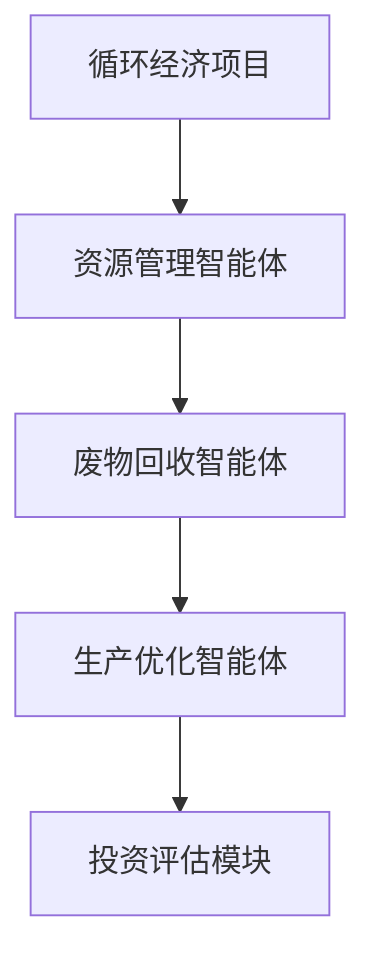

                 


---

# 多智能体系统在识别和评估循环经济投资机会中的作用

## 关键词：多智能体系统，循环经济，投资机会，协作算法，系统架构

## 摘要：  
循环经济强调资源的高效利用和闭环管理，而多智能体系统通过协作和信息共享，能够有效识别和评估循环经济中的投资机会。本文将详细探讨多智能体系统在循环经济投资中的作用，分析其算法原理、系统架构，并通过实际案例展示其应用价值。

---

## 第一部分: 多智能体系统与循环经济的背景介绍

### 1.1 多智能体系统的定义与特点  
多智能体系统（Multi-Agent System, MAS）是由多个智能体组成的分布式系统，这些智能体能够通过协作完成复杂的任务。其特点包括：  
- **分布式性**：智能体独立决策，通过通信协作完成目标。  
- **自主性**：每个智能体都有自己的决策机制。  
- **社会性**：智能体之间通过交互实现协作。  

### 1.2 循环经济的概念与特征  
循环经济是一种以资源高效利用和闭环管理为核心的经济模式，其特征包括：  
- **资源节约**：减少资源消耗，延长资源生命周期。  
- **废弃物减量化**：通过回收和再利用减少废弃物产生。  
- **系统性**：强调经济、社会和环境的协调发展。  

### 1.3 问题背景与问题描述  
循环经济的投资机会往往涉及复杂的社会经济系统，传统方法难以全面评估。多智能体系统通过协作和数据共享，能够更有效地识别和评估这些机会。  

---

## 第二部分: 多智能体系统与循环经济的核心概念联系

### 2.1 多智能体系统的组成与功能  
- **组成要素**：智能体、通信机制、协作算法。  
- **功能**：数据收集、分析、决策支持。  

### 2.2 循环经济的核心要素与多智能体系统的结合  
通过表格对比循环经济的核心要素与多智能体系统的功能，展示其互补性：

| 循环经济要素 | 多智能体系统功能 |
|--------------|-----------------|
| 资源管理      | 数据采集与分析 |
| 废物回收      | 协作决策支持   |
| 闭环生产      | 系统优化与控制 |

### 2.3 实体关系图（Mermaid）  


---

## 第三部分: 多智能体系统在循环经济投资中的算法原理

### 3.1 多智能体协作算法  
- **分布式协作算法**：通过局部信息实现全局优化。  
- **基于博弈论的协作机制**：模拟市场行为，优化决策。  

### 3.2 信息共享与决策优化  
- **数学模型**：建立收益函数和约束条件。  
- **算法实现**：使用分布式优化算法，确保协作效率。  

### 3.3 实例分析  
假设某循环经济项目涉及资源管理、废物回收和生产优化三个智能体。通过协作算法，各智能体共享数据，优化投资决策。  

---

## 第四部分: 系统分析与架构设计

### 4.1 问题场景介绍  
循环经济投资机会识别涉及多个领域，数据来源多样，需要多智能体协作处理。  

### 4.2 系统功能设计  
- **领域模型类图**：展示系统各模块的关系。  
- **架构图**：展示系统整体结构和模块交互。  

### 4.3 系统接口设计  
- **数据接口**：智能体之间通过API通信。  
- **用户界面**：提供投资机会的可视化展示。  

---

## 第五部分: 项目实战

### 5.1 环境安装  
- 安装Python和相关库（如Flask、TensorFlow）。  

### 5.2 核心代码实现  
```python
class Agent:
    def __init__(self, name):
        self.name = name
        self.data = {}

    def collect_data(self):
        # 数据采集逻辑
        pass

    def collaborate(self, other_agent):
        # 协作逻辑
        pass

# 创建智能体实例
agent1 = Agent("ResourceAgent")
agent2 = Agent("WasteAgent")

# 协作过程
agent1.collect_data()
agent2.collect_data()
agent1.collaborate(agent2)
```

### 5.3 实际案例分析  
通过具体案例分析，展示多智能体系统在循环经济投资中的应用效果。  

---

## 第六部分: 结论与展望

### 6.1 最佳实践  
- 数据质量是关键。  
- 系统设计需考虑可扩展性。  

### 6.2 小结  
多智能体系统通过协作和信息共享，有效识别和评估循环经济投资机会，具有广泛的应用潜力。  

### 6.3 注意事项  
- 数据隐私和安全问题需重视。  
- 系统的可解释性需进一步优化。  

### 6.4 拓展阅读  
推荐相关书籍和论文，深入学习多智能体系统与循环经济的结合。  

---

## 作者：  
**AI天才研究院/AI Genius Institute**  
**禅与计算机程序设计艺术/Zen And The Art of Computer Programming**  

---

通过以上结构，文章系统地介绍了多智能体系统在循环经济投资中的应用，结合理论分析和实际案例，为读者提供了全面的知识和见解。

