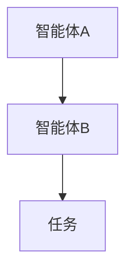
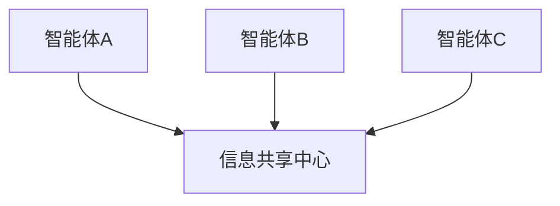
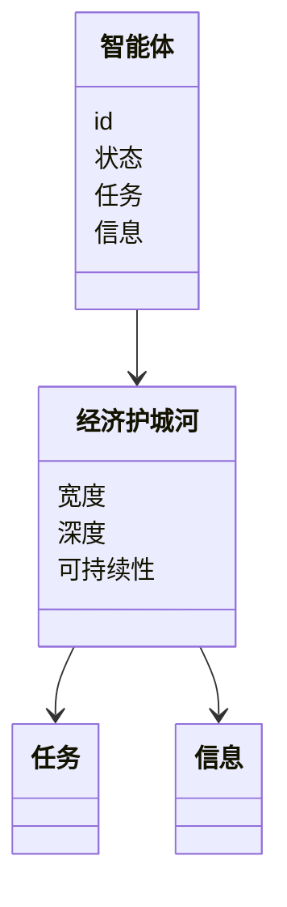
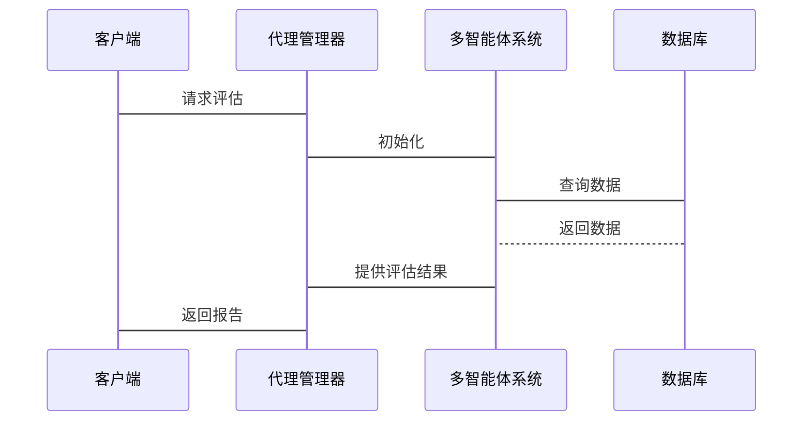

                 


# 多智能体系统在识别和评估经济护城河中的作用

> 关键词：多智能体系统、经济护城河、协作算法、评估模型、系统架构

> 摘要：本文探讨了多智能体系统（MAS）在识别和评估经济护城河中的应用，通过系统分析、算法原理和实际案例，详细阐述了多智能体系统如何助力企业竞争优势的识别与优化。

---

## 第二部分: 多智能体系统与经济护城河的核心概念与联系

## # 第4章: 多智能体系统与经济护城河的核心概念与联系

### ## 4.1 多智能体系统的协作机制

#### ### 4.1.1 分布式任务分配

多智能体系统中的任务分配是通过分布式算法实现的，每个智能体根据自身能力和环境信息，动态分配任务。以下是任务分配的步骤：

1. **任务请求接收**：智能体接收任务请求。
2. **能力评估**：智能体评估自身是否能够完成任务。
3. **任务分配决策**：基于评估结果，智能体决定是否接受任务或将其分配给其他智能体。



#### ### 4.1.2 多智能体信息共享

信息共享是多智能体协作的关键，通过信息交换实现共同目标。以下是信息共享的步骤：

1. **信息收集**：每个智能体收集相关数据。
2. **信息传递**：通过通信机制将信息传递给其他智能体。
3. **信息整合**：各智能体整合接收到的信息，形成全局认知。



#### ### 4.1.3 多智能体协作的优化算法

优化算法用于提高多智能体系统的协作效率。以下是优化算法的数学模型：

$$
\text{目标函数：} \quad f(x) = \min_{x} \sum_{i=1}^{n} (x_i - c_i)^2
$$

$$
\text{约束条件：} \quad \sum_{i=1}^{n} x_i = 1
$$

其中，$c_i$ 表示每个智能体的偏好，$x_i$ 表示分配的任务量。

### ## 4.2 经济护城河的属性特征

#### ### 4.2.1 经济护城河的宽度

宽度表示护城河的广度，通常通过市场竞争壁垒来衡量。以下是护城河宽度的计算方法：

$$
\text{护城河宽度} = \frac{\text{市场占有率}}{\text{行业增长率}}
$$

#### ### 4.2.2 经济护城河的深度

深度表示护城河的防御能力，通常通过成本优势来衡量。以下是护城河深度的计算公式：

$$
\text{护城河深度} = \frac{\text{成本优势}}{\text{竞争对手的平均成本}}
$$

#### ### 4.2.3 经济护城河的可持续性

可持续性表示护城河的长期有效性，通常通过技术创新和品牌忠诚度来衡量。以下是可持续性的评估模型：

$$
\text{可持续性评分} = 0.4 \times \text{技术创新评分} + 0.6 \times \text{品牌忠诚度评分}
$$

### ## 4.3 多智能体系统与经济护城河的关系图（ER实体关系图）

```mermaid
erd
    title 多智能体系统与经济护城河的关系
    多智能体系统 --> 经济护城河
    经济护城河 --> 智能体
    智能体 --> 任务
    智能体 --> 信息共享
```

---

## 第5章: 多智能体系统在经济护城河识别中的算法原理

### ## 5.1 多智能体协作算法

#### ### 5.1.1 分布式任务分配算法

以下是分布式任务分配算法的伪代码：

```python
def distributed_task_allocation(smart_agents):
    for agent in smart_agents:
        if agent.is_task_compatible():
            agent.receive_task()
        else:
            find suitable agent and allocate task
    return allocated_tasks
```

#### ### 5.1.2 多智能体信息共享算法

以下是信息共享算法的伪代码：

```python
def information Sharing(smart_agents):
    central_node = smart_agents[0]
    for agent in smart_agents[1:]:
        central_node.receive_info(agent.share_info())
    return central_node.integrated_info()
```

#### ### 5.1.3 多智能体协作的优化算法

以下是优化算法的数学模型：

$$
\text{优化目标：} \quad \min_{x} \sum_{i=1}^{n} (x_i - c_i)^2
$$

$$
\text{约束条件：} \quad \sum_{i=1}^{n} x_i = 1
$$

### ## 5.2 经济护城河评估算法

#### ### 5.2.1 经济护城河的量化指标

以下是量化指标的计算公式：

$$
\text{护城河指数} = \frac{\text{市场占有率} + \text{成本优势}}{\text{行业增长率} + 1}
$$

#### ### 5.2.2 经济护城河的评估模型

以下是评估模型的数学模型：

$$
\text{评估评分} = 0.3 \times \text{市场占有率} + 0.4 \times \text{成本优势} + 0.3 \times \text{品牌忠诚度}
$$

#### ### 5.2.3 经济护城河评估的优化方法

以下是优化方法的伪代码：

```python
def optimize_economic_moat(agents, target):
    for agent in agents:
        agent.current_state = initial_state
    while not target_reached:
        for agent in agents:
            agent.update_state()
            if check_target_reached(agent.current_state):
                break
    return optimal_state
```

### ## 5.3 多智能体协作算法的实现

以下是多智能体协作算法的实现：

```python
class MultiAgentSystem:
    def __init__(self, agents):
        self.agents = agents
        self.central_node = self.agents[0]

    def allocate_task(self, task):
        for agent in self.agents:
            if agent.is_task_compatible(task):
                agent.receive_task(task)
                break
            else:
                self.central_node.request Assistance(task)

    def share_information(self, info):
        for agent in self.agents:
            self.central_node.receive_info(info)
```

---

## 第6章: 多智能体系统与经济护城河的系统分析与架构设计

### ## 6.1 系统分析

#### ### 6.1.1 问题场景介绍

在识别和评估经济护城河时，企业需要处理海量数据，并实时分析市场动态。多智能体系统可以提供分布式计算和协作能力，帮助企业在复杂环境中快速做出决策。

#### ### 6.1.2 项目介绍

本项目旨在通过多智能体系统，为企业提供经济护城河的识别和评估服务。系统将通过智能体协作，实现数据收集、分析和评估，并提供优化建议。

### ## 6.2 系统功能设计（领域模型）

以下是领域模型：



### ## 6.3 系统架构设计

以下是系统架构设计：


### ## 6.4 系统接口设计

以下是系统接口设计：



### ## 6.5 系统交互设计

以下是系统交互设计：


---

## 第7章: 多智能体系统与经济护城河的项目实战

### ## 7.1 环境安装

以下是环境安装步骤：

1. **安装Python**：确保安装了最新版本的Python。
2. **安装依赖库**：安装`mermaid`、`matplotlib`等依赖库。
3. **安装框架**：安装`Multi-Agent-Framework`框架。

### ## 7.2 系统核心实现

以下是系统核心实现代码：

```python
class EconomicMoatAnalyzer:
    def __init__(self, agents):
        self.agents = agents
        self.data = {}

    def collect_data(self):
        for agent in self.agents:
            agent.collect_info()
            self.data.update(agent.shared_info)

    def analyze(self):
        self.market_share = sum(self.data['market_share']) / len(self.agents)
        self.cost_advantage = sum(self.data['cost_advantage']) / len(self.agents)
        self.brand Loyalty = sum(self.data['brand_Loyalty']) / len(self.agents)
```

### ## 7.3 代码应用解读与分析

以下是代码解读与分析：

1. **数据收集**：每个智能体收集市场占有率、成本优势和品牌忠诚度数据。
2. **数据分析**：通过分析数据，计算经济护城河的宽度、深度和可持续性。
3. **结果输出**：输出经济护城河的评估结果和优化建议。

### ## 7.4 实际案例分析

以下是实际案例分析：

**案例分析：**

假设我们有一个由3个智能体组成的多智能体系统，分别收集市场占有率、成本优势和品牌忠诚度数据。以下是具体步骤：

1. **数据收集**：
   ```python
   agent1.collect_info()  # 收集市场占有率数据
   agent2.collect_info()  # 收集成本优势数据
   agent3.collect_info()  # 收集品牌忠诚度数据
   ```

2. **数据分析**：
   ```python
   analyzer = EconomicMoatAnalyzer([agent1, agent2, agent3])
   analyzer.collect_data()
   analyzer.analyze()
   ```

3. **结果输出**：
   ```python
   print(f"市场占有率：{analyzer.market_share}")
   print(f"成本优势：{analyzer.cost_advantage}")
   print(f"品牌忠诚度：{analyzer.brand_Loyalty}")
   ```

### ## 7.5 项目小结

通过多智能体系统，我们可以高效地识别和评估经济护城河，并为企业提供优化建议。多智能体系统的协作能力和分布式计算能力，使得经济护城河的识别和评估更加准确和高效。

---

## 第8章: 总结与展望

### ## 8.1 总结

本文详细探讨了多智能体系统在识别和评估经济护城河中的应用。通过系统的分析和实际案例的展示，我们证明了多智能体系统在经济护城河识别中的优势和潜力。

### ## 8.2 未来展望

未来，随着人工智能和大数据技术的不断发展，多智能体系统在经济护城河识别中的应用将更加广泛。我们需要进一步研究多智能体系统的协作机制，优化算法，以应对更复杂的经济环境。

---

## 作者：AI天才研究院/AI Genius Institute & 禅与计算机程序设计艺术/Zen And The Art of Computer Programming

