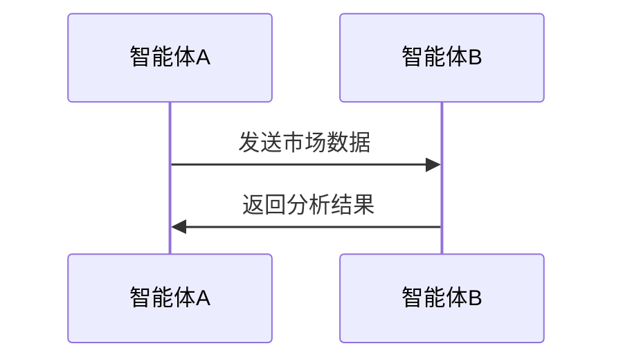
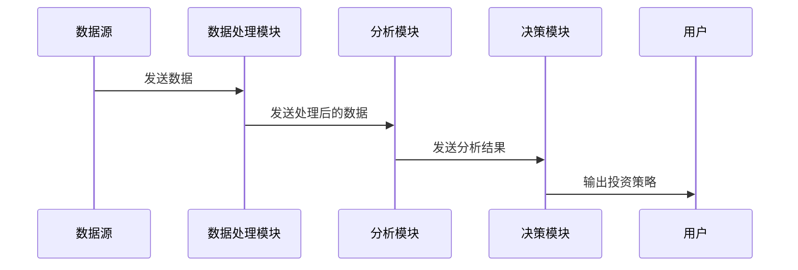
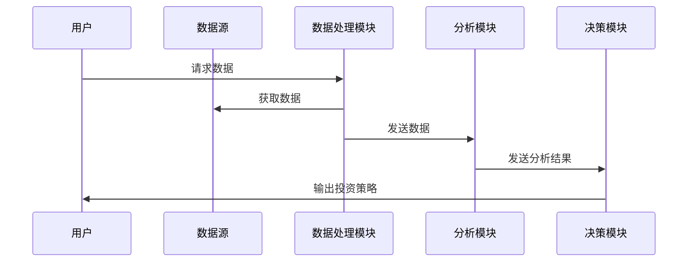

                 

# 多智能体系统在识别和评估颠覆性技术投资机会中的作用

---

## 关键词：多智能体系统，颠覆性技术，投资机会，通信协作机制，博弈论，概率论，系统架构

---

## 摘要

在现代投资领域，颠覆性技术的识别和评估至关重要。多智能体系统（Multi-Agent Systems, MAS）通过其分布式智能和协作能力，能够有效提高投资决策的准确性和效率。本文将详细探讨多智能体系统在识别和评估颠覆性技术投资机会中的作用，从理论基础到实际应用，全面解析其优势和实现方法。

---

## 第1章: 多智能体系统与颠覆性技术概述

### 1.1 多智能体系统的定义与特点

#### 1.1.1 多智能体系统的定义

多智能体系统是由多个智能体组成的分布式系统，每个智能体具备一定的自主性、反应性和协作能力。这些智能体通过通信和协作，共同完成复杂任务。

#### 1.1.2 多智能体系统的核心特点

- **自主性**：智能体能够自主决策和行动。
- **反应性**：智能体能够感知环境并实时响应。
- **协作性**：多个智能体通过通信和协作完成任务。
- **分布式性**：智能体分布在网络中，避免单点故障。

#### 1.1.3 多智能体系统与传统单智能体系统的区别

| 特性         | 多智能体系统                          | 单智能体系统                          |
|--------------|--------------------------------------|--------------------------------------|
| 结构         | 分布式、多节点                       | 单一节点                             |
| 智能体数量   | 多个                                | 单个                                 |
| 任务处理     | 分工协作，处理复杂任务               | 单一智能体完成所有任务               |
| 故障容忍度   | 高，智能体故障不影响整体系统           | 低，单点故障可能导致系统崩溃         |

### 1.2 颠覆性技术的定义与特点

#### 1.2.1 颠覆性技术的定义

颠覆性技术是指能够从根本上改变现有市场、产业或技术格局的技术。它通常通过提供更高效、更经济或更具创新性的解决方案，取代现有的技术或商业模式。

#### 1.2.2 颠覆性技术的核心特征

- **创新性**：颠覆性技术通常具有创新性，能够突破现有技术的局限。
- **经济性**：颠覆性技术往往能够降低成本，提高效率。
- **市场颠覆性**：能够改变市场的竞争格局，甚至取代现有的技术或产品。

#### 1.2.3 颠覆性技术对行业的影响

- **改变市场规则**：颠覆性技术能够重新定义行业的游戏规则。
- **创造新机会**：为投资者提供新的投资机会。
- **引发行业重组**：可能导致现有企业的淘汰或转型。

### 1.3 多智能体系统在投资中的作用

#### 1.3.1 多智能体系统在投资决策中的优势

- **分布式决策**：多个智能体可以同时处理不同的信息，提高决策效率。
- **协作能力**：智能体之间可以协作，提供更全面的分析和建议。
- **实时反馈**：智能体能够实时感知市场变化，快速调整投资策略。

#### 1.3.2 多智能体系统如何识别颠覆性技术

- **信息收集**：多个智能体分别收集不同来源的信息，全面分析市场动态。
- **模式识别**：通过协作分析，识别潜在的颠覆性技术趋势。
- **风险评估**：智能体通过博弈论模型评估技术的可行性。

#### 1.3.3 多智能体系统在风险评估中的应用

- **概率模型**：利用概率论评估技术成功的可能性。
- **博弈论模型**：分析技术在市场中的竞争力和潜在风险。

---

## 第2章: 多智能体系统的通信与协作机制

### 2.1 多智能体系统的通信机制

#### 2.1.1 通信协议的定义

通信协议是智能体之间交换信息的规则和格式。常见的通信协议包括HTTP、TCP/IP等。

#### 2.1.2 通信协议的实现

智能体通过定义的通信协议，发送和接收信息。例如，智能体A向智能体B发送市场数据，智能体B根据数据进行分析。

#### 2.1.3 通信协议在投资决策中的应用

智能体之间的通信可以帮助快速传递市场变化，辅助投资决策。

### 2.2 多智能体系统的协作机制

#### 2.2.1 协作任务的分配

智能体之间通过协商分配任务。例如，智能体A负责数据收集，智能体B负责分析。

#### 2.2.2 协作过程中的冲突解决

通过协商和优先级排序，解决协作中的冲突。

#### 2.2.3 协作结果的评估

通过评估结果的准确性，优化协作机制。

### 2.3 本章小结

通信与协作机制是多智能体系统的核心，确保智能体之间能够高效协作，完成复杂任务。

---

## 第3章: 多智能体系统的决策模型与算法

### 3.1 基于博弈论的决策模型

#### 3.1.1 博弈论的基本概念

博弈论研究理性决策者在竞争环境中的行为。主要包括参与者、策略、收益等概念。

#### 3.1.2 博弈论在多智能体系统中的应用

智能体之间通过博弈论模型，模拟市场中的竞争和合作。

#### 3.1.3 基于博弈论的决策算法

### 3.2 基于概率论的决策模型

#### 3.2.1 概率论的基本概念

概率论研究随机事件的可能性。例如，事件A发生的概率为P(A)。

#### 3.2.2 概率论在多智能体系统中的应用

通过概率模型评估技术成功的可能性。

#### 3.2.3 基于概率论的决策算法

使用贝叶斯定理更新概率，进行决策。

---

## 第4章: 多智能体系统的数学模型与公式

### 4.1 基于博弈论的数学模型

#### 4.1.1 博弈论的基本公式

收益矩阵：

| 智能体A选择 | 智能体B选择 | 收益 |
|------------|------------|------|
| 策略1       | 策略1       | 5    |
| 策略1       | 策略2       | 3    |
| 策略2       | 策略1       | 4    |
| 策略2       | 策略2       | 2    |

#### 4.1.2 多智能体系统中的博弈模型

纳什均衡：在策略组合中，任何单个智能体都无法通过单方面改变策略而获益。

$$ \text{纳什均衡条件：} \forall i, u_i(s_i, s_{-i}) \geq u_i(s'_i, s_{-i}) $$

#### 4.1.3 博弈模型在投资决策中的应用

通过分析收益矩阵，找到最优投资策略。

### 4.2 基于概率论的数学模型

#### 4.2.1 概率论的基本公式

概率加法公式：

$$ P(A \cup B) = P(A) + P(B) - P(A \cap B) $$

#### 4.2.2 多智能体系统中的概率模型

贝叶斯网络：通过条件概率，更新技术成功的概率。

$$ P(T|D) = \frac{P(D|T)P(T)}{P(D)} $$

#### 4.2.3 概率模型在投资决策中的应用

通过概率模型，评估技术风险，优化投资决策。

---

## 第5章: 投资机会识别与评估系统分析

### 5.1 系统目标与范围

#### 5.1.1 系统目标

识别和评估颠覆性技术投资机会，提高投资效率。

#### 5.1.2 系统范围

涵盖市场分析、技术评估、风险分析等模块。

#### 5.1.3 系统边界

系统与外部数据源、投资决策者交互。

### 5.2 系统功能需求

#### 5.2.1 投资机会识别功能

- 数据收集：收集市场和技术数据。
- 模式识别：识别潜在的颠覆性技术。

#### 5.2.2 投资机会评估功能

- 技术评估：评估技术的可行性和潜力。
- 风险评估：评估技术的市场风险和财务风险。

#### 5.2.3 系统监控与反馈功能

- 实时监控：监控市场变化。
- 反馈优化：根据结果优化系统模型。

### 5.3 本章小结

系统功能需求明确，涵盖数据收集、分析和反馈优化。

---

## 第6章: 系统架构设计

### 6.1 系统架构概述

#### 6.1.1 系统架构图

#### 6.1.2 系统模块划分

- 数据处理模块：收集和处理数据。
- 分析模块：分析数据，识别颠覆性技术。
- 决策模块：基于分析结果，制定投资策略。

#### 6.1.3 系统模块之间的关系

数据处理模块向分析模块提供数据，分析模块向决策模块提供分析结果。

### 6.2 系统接口设计

#### 6.2.1 系统内部接口

- 数据处理模块与分析模块的接口。
- 分析模块与决策模块的接口。

#### 6.2.2 系统外部接口

- 数据源接口：与市场数据源交互。
- 用户接口：与投资决策者交互。

#### 6.2.3 接口交互流程

### 6.3 系统交互设计

#### 6.3.1 系统交互流程

从数据收集到决策输出的完整流程。

#### 6.3.2 系统交互图

#### 6.3.3 交互流程优化

通过优化接口设计，减少延迟，提高效率。

### 6.4 本章小结

系统架构设计合理，模块划分清晰，交互流程优化。

---

## 第7章: 投资机会识别与评估系统实现

### 7.1 项目实战与案例分析

#### 7.1.1 环境安装

安装必要的软件和库，例如Python、NumPy、Pandas等。

#### 7.1.2 系统核心实现源代码

实现数据处理、分析和决策模块。

#### 7.1.3 代码应用解读与分析

详细解读代码实现，分析其在投资中的应用。

#### 7.1.4 实际案例分析

以人工智能技术为例，分析其作为颠覆性技术的投资机会。

---

## 作者信息

作者：AI天才研究院/AI Genius Institute & 禅与计算机程序设计艺术/Zen And The Art of Computer Programming

---

通过以上目录和内容的撰写，您可以逐步展开每章的详细内容，确保文章逻辑清晰、结构紧凑，并且涵盖所有必要的部分。

