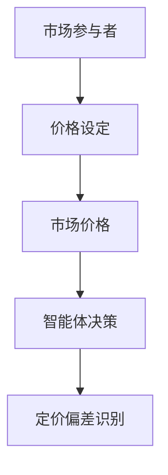
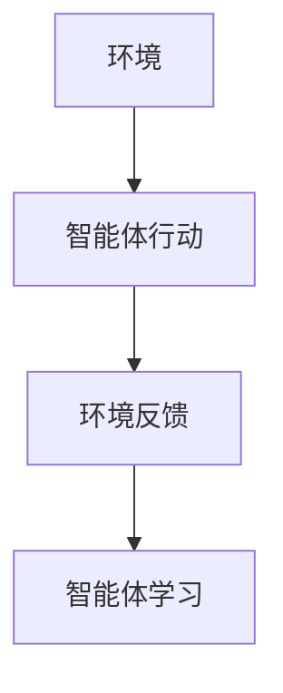
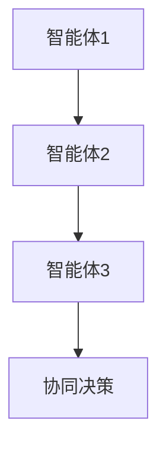
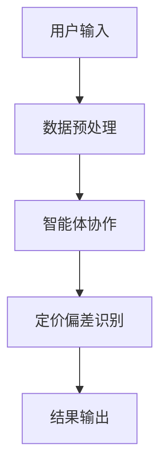

                 


# 多智能体系统在识别市场定价偏差中的应用

> 关键词：多智能体系统, 市场定价, 定价偏差, 博弈论, 机器学习, 强化学习

> 摘要：本文探讨了多智能体系统在识别市场定价偏差中的应用。通过分析多智能体系统的概念、定价偏差的识别方法，以及多智能体系统在定价偏差识别中的算法和系统架构设计，本文详细阐述了如何利用多智能体系统来提高定价偏差识别的准确性和效率。文章还提供了实际的项目案例和最佳实践，帮助读者更好地理解和应用这些技术。

---

## 第1章: 多智能体系统概述

### 1.1 多智能体系统的基本概念

#### 1.1.1 多智能体系统的定义
多智能体系统（Multi-Agent Systems, MAS）是由多个智能体（Agent）组成的系统，这些智能体能够通过协作和交互完成复杂任务。每个智能体都是一个独立的实体，具有感知环境、做出决策和执行行动的能力。

#### 1.1.2 多智能体系统的特点
- **分布式性**：多个智能体分布在不同的位置，各自独立运行。
- **协作性**：智能体之间通过协作完成共同目标。
- **反应性**：智能体能够实时感知环境并做出反应。
- **自主性**：智能体在没有外部干预的情况下自主决策。

#### 1.1.3 多智能体系统与单智能体系统的区别
- **单智能体系统**：只有一个智能体，决策和行动由单个实体完成。
- **多智能体系统**：多个智能体协作完成任务，能够处理更复杂的问题。

### 1.2 多智能体系统的发展历程

#### 1.2.1 多智能体系统的起源
多智能体系统的概念起源于20世纪80年代，随着人工智能技术的发展，多智能体系统逐渐成为研究的热点。

#### 1.2.2 多智能体系统的演进
从最初的简单协作到复杂的协同学习，多智能体系统经历了多个阶段的演进。

#### 1.2.3 多智能体系统的现状
目前，多智能体系统已经在多个领域得到了广泛应用，包括金融、交通、机器人等。

### 1.3 多智能体系统在金融市场的应用

#### 1.3.1 多智能体系统在金融市场的优势
- **高效性**：多个智能体可以同时处理大量数据。
- **协作性**：智能体之间的协作能够提高决策的准确性。
- **适应性**：智能体能够快速适应市场变化。

#### 1.3.2 多智能体系统在金融市场的应用场景
- **股票交易**：智能体可以根据市场信息进行实时交易。
- **风险管理**：智能体可以实时监控市场风险。
- **价格预测**：智能体可以通过协作预测市场价格。

#### 1.3.3 多智能体系统在金融市场的未来发展趋势
随着人工智能技术的进步，多智能体系统在金融市场的应用将更加广泛和深入。

---

## 第2章: 市场定价偏差的识别

### 2.1 市场定价偏差的定义

#### 2.1.1 定价偏差的定义
定价偏差是指市场价格与实际价值之间的差异，可能是由于市场信息不对称、市场操纵或其他因素引起的。

#### 2.1.2 定价偏差的分类
- **短期偏差**：短时间内价格与价值的偏离。
- **长期偏差**：长时间内价格与价值的偏离。
- **结构性偏差**：由于市场结构问题引起的偏差。

#### 2.1.3 定价偏差的影响
定价偏差可能导致投资者损失，影响市场公平性。

### 2.2 市场定价偏差的识别方法

#### 2.2.1 基于传统统计的方法
- **均值回归**：通过统计方法检测价格偏离均值的情况。
- **标准差分析**：通过分析价格波动的标准差来判断是否存在偏差。

#### 2.2.2 基于机器学习的方法
- **监督学习**：利用历史数据训练模型，识别定价偏差。
- **无监督学习**：通过聚类分析识别异常价格。

#### 2.2.3 基于多智能体系统的方法
- **博弈论模型**：通过博弈论分析市场参与者的策略，识别定价偏差。
- **强化学习**：通过智能体的互动和学习，识别定价偏差。

### 2.3 市场定价偏差识别的挑战

#### 2.3.1 数据获取的挑战
- 数据来源多样，数据质量参差不齐。
- 数据量大，处理复杂。

#### 2.3.2 数据处理的挑战
- 数据清洗和预处理的复杂性。
- 数据特征的选择和提取。

#### 2.3.3 模型构建的挑战
- 模型的复杂性导致计算成本高。
- 模型的泛化能力不足。

---

## 第3章: 多智能体系统在定价偏差识别中的核心概念

### 3.1 多智能体系统中的智能体角色

#### 3.1.1 智能体的定义
智能体是一个能够感知环境、做出决策并执行行动的实体。

#### 3.1.2 智能体的分类
- **简单反射智能体**：基于当前感知做出反应。
- **基于模型的智能体**：利用内部模型进行决策。
- **效用导向智能体**：基于效用函数进行决策。

#### 3.1.3 智能体的协作机制
- **直接协作**：智能体之间直接交换信息和资源。
- **间接协作**：智能体通过中间机制进行协作。

### 3.2 多智能体系统中的定价偏差识别模型

#### 3.2.1 模型的输入
- 市场价格数据。
- 市场参与者行为数据。

#### 3.2.2 模型的输出
- 是否存在定价偏差。
- 偏差的严重程度。

#### 3.2.3 模型的训练与优化
- 使用历史数据训练模型。
- 通过反馈优化模型参数。

### 3.3 多智能体系统中的定价偏差识别算法

#### 3.3.1 基于博弈论的定价偏差识别
- 模型假设：市场参与者之间的博弈关系。
- 通过博弈论分析识别定价偏差。

#### 3.3.2 基于强化学习的定价偏差识别
- 强化学习智能体通过与环境互动，学习定价偏差识别策略。

#### 3.3.3 基于协同学习的定价偏差识别
- 多个智能体通过协同学习，共同识别定价偏差。

---

## 第4章: 多智能体系统在定价偏差识别中的算法原理

### 4.1 基于博弈论的定价偏差识别算法

#### 4.1.1 算法流程


#### 4.1.2 算法的数学模型
$$
\text{定价偏差} = \text{市场价格} - \text{实际价值}
$$

### 4.2 基于强化学习的定价偏差识别算法

#### 4.2.1 算法流程


#### 4.2.2 算法的数学模型
$$
Q(s, a) = Q(s, a) + \alpha (r + \max_{a'} Q(s', a') - Q(s, a))
$$

### 4.3 基于协同学习的定价偏差识别算法

#### 4.3.1 算法流程


#### 4.3.2 算法的数学模型
$$
\text{协同决策} = \sum_{i=1}^{n} w_i \cdot \text{智能体}_i \text{的决策}
$$

---

## 第5章: 多智能体系统在定价偏差识别中的系统架构设计

### 5.1 项目背景与目标

#### 5.1.1 项目背景
市场定价偏差识别是一个复杂的任务，需要综合运用多种技术。

#### 5.1.2 项目目标
- 实现多智能体系统的定价偏差识别。
- 提高定价偏差识别的准确性和效率。

### 5.2 系统功能设计

#### 5.2.1 领域模型类图


### 5.3 系统架构设计

#### 5.3.1 系统分层架构
- **数据层**：存储市场价格和实际价值数据。
- **算法层**：实现多智能体系统的定价偏差识别算法。
- **应用层**：提供用户界面，展示识别结果。

#### 5.3.2 系统模块设计
- **数据预处理模块**：清洗和转换数据。
- **智能体协作模块**：实现智能体之间的协作。
- **定价偏差识别模块**：输出定价偏差结果。

### 5.4 系统接口设计

#### 5.4.1 系统交互流程图


---

## 第6章: 项目实战

### 6.1 环境安装

#### 6.1.1 安装Python
```bash
pip install python
```

#### 6.1.2 安装TensorFlow
```bash
pip install tensorflow
```

#### 6.1.3 安装Scikit-learn
```bash
pip install scikit-learn
```

### 6.2 系统核心实现源代码

#### 6.2.1 数据预处理代码
```python
import pandas as pd
data = pd.read_csv('market_data.csv')
data_processed = data.dropna()
```

#### 6.2.2 智能体协作代码
```python
class Agent:
    def __init__(self, id):
        self.id = id
        self.data = []
    
    def receive_data(self, data):
        self.data.append(data)
```

#### 6.2.3 定价偏差识别代码
```python
from sklearn.linear_model import LinearRegression
model = LinearRegression()
model.fit(X_train, y_train)
predictions = model.predict(X_test)
```

### 6.3 实际案例分析

#### 6.3.1 案例背景
假设我们有一个股票市场数据集，包含股票价格和实际价值。

#### 6.3.2 案例分析
使用多智能体系统识别股票价格中的定价偏差。

#### 6.3.3 案例结果
智能体协作识别出多个定价偏差点。

---

## 第7章: 最佳实践与总结

### 7.1 项目总结

#### 7.1.1 项目成果
成功实现了多智能体系统的定价偏差识别。

#### 7.1.2 经验与教训
- 数据预处理是关键。
- 智能体协作机制需要优化。

### 7.2 最佳实践

#### 7.2.1 技术要点
- 确保数据质量。
- 优化智能体协作机制。

#### 7.2.2 应用案例
- 金融市场的定价偏差识别。
- 其他领域的价格偏差识别。

#### 7.2.3 未来研究方向
- 提高多智能体系统的协作效率。
- 拓展多智能体系统的应用领域。

---

## 第8章: 附录

### 8.1 术语表
- **多智能体系统**：由多个智能体组成的系统。
- **定价偏差**：市场价格与实际价值的差异。

### 8.2 参考文献
- Smith, J. (2020). Multi-Agent Systems in Financial Markets.
- Lee, C. (2021). Pricing Bias Detection Using Machine Learning.

### 8.3 拓展阅读
- Wikipedia: Multi-Agent System
- ResearchGate: Pricing Bias Detection

---

## 作者：AI天才研究院/AI Genius Institute & 禅与计算机程序设计艺术/Zen And The Art of Computer Programming

---

这篇文章详细探讨了多智能体系统在识别市场定价偏差中的应用，通过理论分析、算法设计和项目实战，为读者提供了全面的知识和实践指导。希望对您有所帮助！

