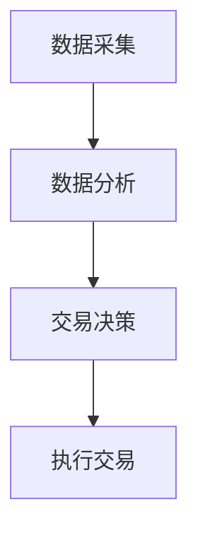

                 


# 多智能体系统在识别市场异常机会中的应用

## 关键词：
多智能体系统、市场机会识别、异常检测、智能体协作、算法实现

## 摘要：
本文探讨了多智能体系统在识别市场异常机会中的应用，结合理论分析和实际案例，详细讲解了多智能体系统的构建、算法实现及系统架构设计。通过系统化的解决方案，展示了如何利用多智能体系统的优势来捕捉市场中的异常机会，为投资者和企业提供了新的思路。

---

## 第1章：多智能体系统概述

### 1.1 多智能体系统的定义与特点
多智能体系统（Multi-Agent System, MAS）是由多个智能体组成的复杂系统，每个智能体能够独立决策并与其他智能体协作。其特点包括分布性、自主性、反应性和社会性。

#### 1.1.1 智能体的基本概念
智能体是具有感知环境和自主决策能力的实体，可以是软件程序或物理设备。智能体的核心要素包括：
- **感知**：通过传感器或数据源获取信息。
- **推理**：基于感知信息进行逻辑推理。
- **决策**：根据推理结果做出决策。
- **执行**：通过执行机构将决策转化为行动。

#### 1.1.2 多智能体系统的分类
多智能体系统可以根据智能体的结构和交互方式分为以下几类：
- **集中式系统**：所有智能体共享一个集中控制中心。
- **分布式系统**：智能体之间通过分布式通信协作。
- **层次式系统**：智能体按层次结构组织，高层智能体协调低层智能体。

#### 1.1.3 多智能体系统的优势与挑战
- **优势**：
  - 高度适应性：能够根据环境变化动态调整。
  - 分布式计算：利用分布式计算提高系统的可靠性和效率。
- **挑战**：
  - 协作复杂性：智能体之间的协作需要复杂的通信和协调机制。
  - 性能优化：在大规模系统中优化性能是难点。

### 1.2 市场异常机会的识别
市场异常机会是指在市场中出现的非正常波动或模式，可能是短期的套利机会或市场错误。

#### 1.2.1 市场机会的定义与分类
- **定义**：市场机会是通过分析市场数据，发现价格波动、交易量异常等现象。
- **分类**：
  - 技术性机会：基于技术分析的短期波动。
  - 基本面机会：基于公司财务状况的长期投资机会。
  - 统计套利机会：利用市场定价偏差进行套利。

#### 1.2.2 多智能体系统在市场机会识别中的作用
多智能体系统能够通过分布式的感知和协作，快速发现市场中的异常机会，并制定相应的交易策略。

---

## 第2章：市场机会识别的基本理论

### 2.1 市场分析的基本方法
市场分析包括技术分析和基本面分析。

#### 2.1.1 技术分析
技术分析通过分析历史价格和交易量数据，预测未来的价格走势。

#### 2.1.2 基本面分析
基本面分析关注公司的财务状况、行业地位等内在因素。

#### 2.1.3 统计套利
统计套利利用市场定价偏差，通过算法寻找套利机会。

### 2.2 市场异常检测的基本方法
异常检测方法包括统计方法、机器学习方法等。

#### 2.2.1 统计方法
- **均值-方差分析**：检测数据分布的偏离。
- **Grubbs检验**：检测异常值。

#### 2.2.2 机器学习方法
- **孤立森林算法**：用于无监督异常检测。
- **神经网络**：用于复杂模式识别。

### 2.3 市场数据的特征分析
市场数据具有时间序列特征，常用滑动窗口方法进行分析。

#### 2.3.1 时间序列数据的特性
- 趋势性：数据呈现长期上升或下降趋势。
- 周期性：数据呈现周期性波动。
- 随机性：数据呈现无规律的波动。

---

## 第3章：多智能体系统在市场机会识别中的应用模型

### 3.1 多智能体系统的构建
多智能体系统由多个智能体组成，每个智能体负责不同的任务。

#### 3.1.1 智能体的功能设计
- 数据采集智能体：负责收集市场数据。
- 数据分析智能体：负责分析数据，发现异常。
- 交易决策智能体：负责制定交易策略。

#### 3.1.2 智能体的协作机制
- 通信协议：智能体之间的通信规则。
- 协调机制：智能体之间的协作方式。

### 3.2 多智能体系统的算法实现
使用强化学习算法进行交易决策。

#### 3.2.1 强化学习算法
- **Q-learning**：通过状态-动作-奖励机制进行学习。
- **Deep Q-Network (DQN)**：使用深度神经网络近似Q值函数。

#### 3.2.2 算法实现步骤
1. 状态空间定义：市场数据特征。
2. 动作空间定义：买入、卖出、持有。
3. 奖励函数设计：基于交易收益。
4. 策略网络实现：使用深度神经网络。

---

## 第4章：系统架构设计

### 4.1 项目需求分析
系统需要实时监控市场数据，识别异常机会，并制定交易策略。

### 4.2 系统功能模块设计
- 数据采集模块：实时采集市场数据。
- 数据分析模块：分析数据，识别异常。
- 交易决策模块：制定交易策略。

### 4.3 系统架构设计
使用微服务架构，每个模块独立运行，通过API通信。

#### 4.3.1 系统架构图


### 4.4 系统通信机制
- 消息队列：使用Kafka进行异步通信。
- RESTful API：模块之间通过API调用。

---

## 第5章：项目实战

### 5.1 项目背景
开发一个多智能体系统，用于监控股票市场，识别异常交易机会。

### 5.2 项目环境搭建
- 安装Python和相关库（如TensorFlow、Pandas）。
- 配置数据源（如Yahoo Finance API）。

### 5.3 核心代码实现
#### 5.3.1 数据采集模块
```python
import pandas as pd
from pandas_datareader import data

def get_stock_data(ticker, start_date, end_date):
    df = data.DataReader(ticker, 'yahoo', start_date, end_date)
    return df
```

#### 5.3.2 数据分析模块
```python
import numpy as np
from sklearn.ensemble import IsolationForest

def detect_anomalies(data):
    model = IsolationForest(n_estimators=100, contamination=0.05)
    model.fit(data)
    anomalies = model.predict(data)
    return anomalies
```

#### 5.3.3 交易决策模块
```python
import numpy as np
import gym
from gym import spaces

class TradingEnv(gym.Env):
    def __init__(self, data):
        self.data = data
        self.current_step = 0
        self.action_space = spaces.Discrete(3)  # 0: sell, 1: hold, 2: buy
        self.observation_space = spaces.Box(low=-np.inf, high=np.inf, shape=(4,))
    
    def _get_state(self):
        state = self.data.iloc[self.current_step].values
        return state
    
    def step(self, action):
        # 执行交易操作并更新状态
        reward = calculate_reward(action)
        self.current_step += 1
        return self._get_state(), reward, done, info
    
    def calculate_reward(self, action):
        # 根据交易结果计算奖励
        return profit
```

### 5.4 系统测试与优化
- 测试系统在不同市场条件下的表现。
- 根据回测结果优化交易策略。

---

## 第6章：总结与展望

### 6.1 总结
本文详细讲解了多智能体系统在识别市场异常机会中的应用，从理论到实践，展示了系统的构建过程和实际案例。

### 6.2 展望
未来，随着人工智能和大数据技术的发展，多智能体系统在金融领域的应用将更加广泛。结合区块链和边缘计算等新技术，系统将更加高效和智能。

---

## 作者：AI天才研究院 & 禅与计算机程序设计艺术

---

通过以上步骤，我们可以系统地构建一个多智能体系统，用于识别市场异常机会，并在实际应用中取得良好的效果。

