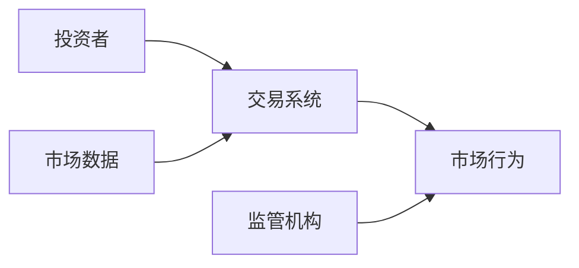
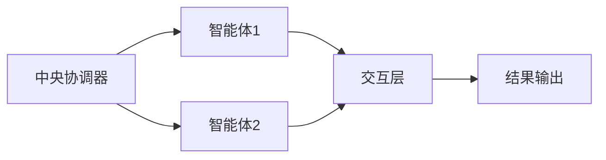
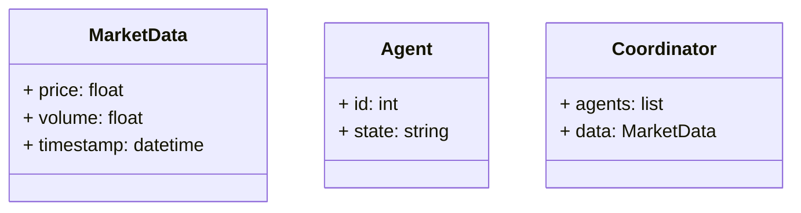
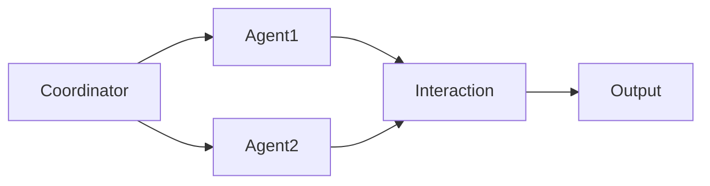

                 


# 多智能体系统在识别市场泡沫形成中的应用

## 关键词：多智能体系统, 市场泡沫, 金融市场, 人工智能, 算法原理

## 摘要：本文探讨了多智能体系统（MAS）在识别金融市场泡沫中的应用。通过分析市场泡沫的形成机制，结合多智能体系统的原理，提出了基于MAS的市场泡沫识别框架。文章详细介绍了多智能体系统的定义、核心概念、算法原理、系统架构，并通过实际案例展示了MAS在识别市场泡沫中的应用效果。最后，本文总结了MAS的优势及未来发展方向。

---

# 第一部分: 多智能体系统与市场泡沫概述

## 第1章: 多智能体系统与金融市场概述

### 1.1 多智能体系统的定义与特点

#### 1.1.1 多智能体系统的定义
多智能体系统（Multi-Agent System，MAS）是由多个智能体（Agent）组成的系统，这些智能体能够自主决策、协作和交互，共同完成复杂任务。智能体可以是软件程序，也可以是物理实体，具备感知环境、推理和行动的能力。

#### 1.1.2 多智能体系统的核心特点
- **自主性**：智能体能够自主决策，无需外部干预。
- **反应性**：智能体能够实时感知环境变化并做出反应。
- **协作性**：多个智能体能够协同工作，共同完成目标。
- **分布性**：智能体分布在网络中，能够独立运行。

#### 1.1.3 多智能体系统与传统金融模型的区别
传统金融模型通常基于假设和统计分析，而多智能体系统能够模拟市场参与者的复杂行为，提供更动态和实时的市场分析。

---

### 1.2 金融市场中的市场泡沫

#### 1.2.1 市场泡沫的定义与特征
市场泡沫是指资产价格远高于其实际价值的现象，通常由投资者的非理性行为或过度投机引起。其特征包括价格虚高、交易量激增、市场参与者情绪高涨等。

#### 1.2.2 市场泡沫的形成机制
市场泡沫的形成通常涉及以下几个阶段：
1. **信息不对称**：部分投资者掌握更多信息，导致价格波动。
2. **羊群效应**：投资者盲目跟随市场趋势，导致价格虚高。
3. **杠杆效应**：过度使用杠杆资金放大市场波动。

#### 1.2.3 市场泡沫对金融市场的危害
市场泡沫可能导致市场崩盘、投资者损失惨重，甚至引发金融危机。

---

### 1.3 多智能体系统在金融市场中的应用前景

#### 1.3.1 多智能体系统在金融分析中的优势
- **动态模拟**：能够模拟市场参与者的复杂行为，提供实时分析。
- **分布式决策**：多个智能体协同工作，提高决策效率。

#### 1.3.2 多智能体系统在市场泡沫识别中的潜在价值
通过模拟投资者行为，多智能体系统能够提前识别市场泡沫，帮助投资者做出更明智的决策。

#### 1.3.3 当前市场对多智能体系统的应用需求
随着金融市场复杂性增加，市场参与者行为难以预测，多智能体系统的应用需求日益增长。

---

## 第2章: 多智能体系统的原理与架构

### 2.1 多智能体系统的原理

#### 2.1.1 智能体的定义与分类
智能体（Agent）是指能够感知环境、做出决策并采取行动的实体。根据智能体的智能水平，可以分为简单反应式智能体和复杂智能体。

#### 2.1.2 智能体的感知与决策机制
智能体通过感知环境信息，利用决策算法做出行动选择。决策算法可以基于规则、机器学习或博弈论。

#### 2.1.3 智能体之间的交互与协作
智能体之间可以通过通信协议进行信息交换，实现协作。协作机制可以基于分布式计算或集中式协调。

---

### 2.2 市场参与者的实体关系图



---

### 2.3 多智能体系统的架构设计



---

## 第3章: 多智能体系统的算法与实现

### 3.1 多智能体系统的协调算法

#### 3.1.1 分层协调算法
分层协调算法通过层次化结构，将多个智能体分成不同层次，每个层次负责不同的任务。

#### 3.1.2 分布式协调算法
分布式协调算法通过去中心化的方式，使智能体之间自行协调，避免单点故障。

#### 3.1.3 基于博弈论的协调算法
博弈论模型通过模拟市场参与者的策略选择，帮助智能体做出最优决策。

---

### 3.2 异常检测算法

#### 3.2.1 基于统计的异常检测
通过统计方法，识别市场数据中的异常值。

#### 3.2.2 基于机器学习的异常检测
使用机器学习模型，如随机森林和神经网络，识别市场数据中的异常模式。

---

### 3.3 算法实现代码示例

#### 异常检测算法实现
```python
import numpy as np
from sklearn.ensemble import IsolationForest

# 示例数据
X = np.random.normal(loc=0, scale=1, size=1000)
# 添加异常点
X[10] = 100
X[20] = -100

# 训练模型
model = IsolationForest(n_estimators=100, contamination=0.05)
model.fit(X.reshape(-1, 1))

# 预测异常点
outliers = model.predict(X.reshape(-1, 1))
print(outliers)
```

---

## 第4章: 多智能体系统的系统分析与架构设计

### 4.1 项目背景

#### 4.1.1 项目目标
识别市场泡沫，帮助投资者做出更明智的决策。

#### 4.1.2 项目范围
专注于金融市场中的股票和加密货币市场。

---

### 4.2 系统功能设计

#### 4.2.1 数据采集模块
采集市场数据，包括价格、交易量等。

#### 4.2.2 智能体交互模块
实现智能体之间的通信和协作。

#### 4.2.3 泡沫预警模块
通过算法分析，识别市场泡沫并发出预警。

---

### 4.3 系统架构设计

#### 4.3.1 领域模型类图



#### 4.3.2 系统架构图



---

## 第5章: 项目实战

### 5.1 环境安装

#### 5.1.1 安装Python
```bash
python --version
pip install numpy
pip install scikit-learn
pip install matplotlib
```

### 5.2 系统核心实现

#### 5.2.1 数据预处理

```python
import pandas as pd
data = pd.read_csv('market_data.csv')
data = data.dropna()
```

#### 5.2.2 模型训练

```python
from sklearn.ensemble import IsolationForest
model = IsolationForest(n_estimators=100, contamination=0.05)
model.fit(X.reshape(-1, 1))
```

#### 5.2.3 结果分析

```python
import matplotlib.pyplot as plt
outlier_indices = np.where(outliers == -1)
plt.scatter(range(len(data)), data, c=outliers, cmap='viridis')
plt.xlabel('Index')
plt.ylabel('Value')
plt.show()
```

---

## 第6章: 最佳实践与总结

### 6.1 小结
本文详细介绍了多智能体系统在识别市场泡沫中的应用，从理论到实践，展示了系统的实现过程。

### 6.2 注意事项
- 数据质量对模型性能影响重大。
- 算法选择需根据具体场景调整。

### 6.3 拓展阅读
推荐阅读《Multi-Agent Systems: Complexity and Cognitive Science》和《Machine Learning for Asset Managers》。

---

## 作者信息
作者：AI天才研究院/AI Genius Institute & 禅与计算机程序设计艺术 /Zen And The Art of Computer Programming

---

**摘要：**  
本文探讨了多智能体系统在识别金融市场泡沫中的应用。通过分析市场泡沫的形成机制，结合多智能体系统的原理，提出了基于MAS的市场泡沫识别框架。文章详细介绍了多智能体系统的定义、核心概念、算法原理、系统架构，并通过实际案例展示了MAS在识别市场泡沫中的应用效果。最后，本文总结了MAS的优势及未来发展方向。

