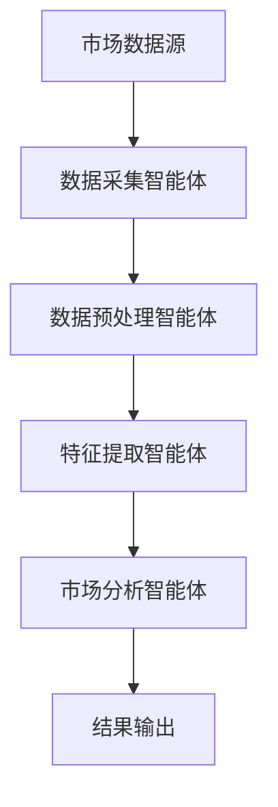

                 


# 多智能体系统在识别市场结构性变化中的应用

---

## 关键词：多智能体系统, 市场结构性变化, 市场分析, 金融交易, 供应链优化

---

## 摘要：  
随着市场环境的日益复杂化和动态化，传统的单一智能体分析方法已难以满足市场结构性变化识别的需求。多智能体系统（Multi-Agent Systems, MAS）通过多个智能体的协作与交互，能够有效捕捉和分析市场中的复杂模式，从而为市场参与者提供更精准的决策支持。本文将深入探讨多智能体系统在识别市场结构性变化中的应用，结合实际案例和系统设计，全面解析其核心原理、算法实现和实际应用场景。

---

## 第一部分: 多智能体系统与市场结构性变化概述

---

### 第1章: 多智能体系统的基本概念

#### 1.1 多智能体系统的定义与特点  
多智能体系统（MAS）是由多个具有自主性、反应性和协作性的智能体组成的分布式系统。这些智能体能够通过通信和协作完成复杂的任务，同时适应动态变化的环境。MAS的核心特点包括：  
- **自主性**：智能体能够自主决策，无需外部干预。  
- **反应性**：智能体能够实时感知环境并做出响应。  
- **协作性**：智能体之间通过通信和协作完成共同目标。  
- **分布性**：智能体分布在不同的位置，具有局部决策能力。  

#### 1.2 市场结构性变化的定义与特征  
市场结构性变化是指市场中供需关系、价格波动、竞争格局等关键因素发生的显著变化。其主要特征包括：  
- **动态性**：市场环境不断变化，导致结构性变化的出现。  
- **复杂性**：结构性变化涉及多个因素的相互作用，难以单独分析。  
- **突发性**：结构性变化可能在短时间内迅速发生，具有突发性。  

#### 1.3 多智能体系统在市场分析中的应用价值  
MAS在市场分析中的应用价值主要体现在以下几个方面：  
- **多维度数据处理**：MAS能够整合来自不同数据源的信息，提供全面的市场分析。  
- **实时响应能力**：MAS能够实时感知市场变化，快速做出响应。  
- **协作优化**：通过智能体之间的协作， MAS能够优化市场分析的准确性和效率。  

---

### 第2章: 多智能体系统的核心原理

#### 2.1 多智能体系统的体系结构  
多智能体系统的体系结构主要分为以下三种类型：  
1. **分布式多智能体系统**：智能体分布在网络中，通过通信协议进行交互。  
2. **集中式多智能体系统**：智能体通过中央控制器进行协调，适用于任务高度集中化的场景。  
3. **混合式多智能体系统**：结合分布式和集中式的特点，适用于复杂场景。  

#### 2.2 多智能体系统中的通信与协作  
智能体之间的通信与协作是MAS的核心机制。通信机制包括：  
- **直接通信**：智能体之间通过消息传递进行交互。  
- **间接通信**：智能体通过共享数据库或中间媒介进行通信。  

协作机制则包括：  
- **任务分配**：智能体根据自身能力和环境信息分配任务。  
- **协调协议**：智能体通过协议达成一致行动。  
- **冲突解决**：智能体在协作过程中可能产生冲突，需要通过协商或仲裁机制解决。  

#### 2.3 多智能体系统的动态性与适应性  
MAS在动态环境中的适应性主要体现在：  
- **自适应行为**：智能体能够根据环境变化调整自身行为。  
- **分布式决策**：MAS通过分布式决策机制，能够在动态环境中快速做出响应。  

---

## 第二部分: 市场结构性变化的识别方法

---

### 第3章: 市场数据的采集与预处理

#### 3.1 数据来源与采集方法  
市场数据的来源包括：  
- **金融市场数据**：如股票价格、成交量等。  
- **供应链数据**：如物流信息、库存数据等。  
- **新闻与社交媒体数据**：如市场新闻、社交媒体情绪分析等。  

#### 3.2 数据清洗与特征提取  
数据清洗是确保数据质量的重要步骤，包括：  
- **去除噪声数据**：剔除异常值和错误数据。  
- **数据标准化**：将数据转换为统一的格式，便于后续分析。  

特征提取则包括：  
- **时间序列特征**：如趋势、周期性等。  
- **文本特征**：如关键词提取、情感分析等。  

#### 3.3 数据分析与特征工程  
数据分析的目标是提取能够反映市场结构性变化的关键特征。例如，可以通过时间序列分析提取价格波动的特征，或者通过自然语言处理提取市场情绪特征。  

---

### 第4章: 市场结构性变化的识别算法

#### 4.1 基于MAS的市场分析框架  
基于MAS的市场分析框架包括以下几个步骤：  
1. **数据采集**：从多个数据源采集市场数据。  
2. **特征提取**：提取能够反映市场结构性变化的特征。  
3. **智能体协作**：多个智能体协作完成市场分析任务。  
4. **结果输出**：输出分析结果并提供决策支持。  

#### 4.2 基于MAS的市场分析算法  
以下是一个基于MAS的市场分析算法的伪代码示例：  

```python
class MarketAgent:
    def __init__(self, data_source):
        self.data_source = data_source
        self.features = []
    
    def collect_data(self):
        # 从数据源采集数据
        data = self.data_source.get_data()
        return data
    
    def extract_features(self, data):
        # 提取特征
        features = extract_features(data)
        return features
    
    def analyze(self, features):
        # 分析特征，识别市场结构性变化
        result = analyze_features(features)
        return result

class MarketAnalyzer:
    def __init__(self, agents):
        self.agents = agents
    
    def run_analysis(self):
        # 启动市场分析
        for agent in self.agents:
            data = agent.collect_data()
            features = agent.extract_features(data)
            result = agent.analyze(features)
            self.process_result(result)
    
    def process_result(self, result):
        # 处理分析结果
        pass
```

---

### 第5章: 系统设计与实现

#### 5.1 系统架构设计  
以下是一个基于MAS的市场分析系统的架构设计图：  



#### 5.2 实现步骤  
1. **环境搭建**：安装必要的库，如TensorFlow、NumPy、Pandas等。  
2. **智能体开发**：开发多个智能体，每个智能体负责不同的任务。  
3. **通信机制设计**：设计智能体之间的通信协议。  
4. **系统集成**：将多个智能体集成到一个系统中，实现协作分析。  

---

### 第6章: 项目实战

#### 6.1 环境搭建  
需要安装以下库：  
- `numpy`  
- `pandas`  
- `tensorflow`  
- `scikit-learn`  

#### 6.2 系统核心实现源代码  
以下是一个简单的基于MAS的市场分析系统实现代码示例：  

```python
import numpy as np
import pandas as pd
from sklearn.decomposition import PCA

class DataAgent:
    def __init__(self, data_source):
        self.data_source = data_source
    
    def collect_data(self):
        return self.data_source.get_data()
    
    def extract_features(self, data):
        # 提取特征，例如使用PCA降维
        pca = PCA(n_components=2)
        features = pca.fit_transform(data)
        return features

class MarketAnalyzer:
    def __init__(self, agents):
        self.agents = agents
    
    def analyze_market(self):
        for agent in self.agents:
            data = agent.collect_data()
            features = agent.extract_features(data)
            self.analyze_features(features)
    
    def analyze_features(self, features):
        # 分析特征，识别市场结构性变化
        # 示例：计算特征之间的相关性
        correlation_matrix = np.corrcoef(features.T)
        print("Correlation Matrix:\n", correlation_matrix)

# 示例数据源
class DataSource:
    def __init__(self, data):
        self.data = data
    
    def get_data(self):
        return self.data

# 示例数据
data = np.random.randn(100, 5)
data_source = DataSource(data)
agent = DataAgent(data_source)
analyzer = MarketAnalyzer([agent])
analyzer.analyze_market()
```

---

## 第三部分: 总结与展望

---

### 第7章: 总结  
本文详细探讨了多智能体系统在识别市场结构性变化中的应用，从理论基础到实际实现，全面解析了MAS在市场分析中的优势和价值。通过实际案例和系统设计，展示了MAS在复杂市场环境中的应用潜力。

---

### 第8章: 展望  
未来，随着人工智能和大数据技术的进一步发展，MAS在市场分析中的应用将更加广泛。研究方向包括：  
- **智能体协同优化**：进一步提高智能体之间的协作效率。  
- **动态环境适应性**：增强智能体在动态环境中的适应能力。  
- **多模态数据融合**：结合文本、图像等多种数据源，提高分析的准确性。  

---

## 作者：AI天才研究院/AI Genius Institute & 禅与计算机程序设计艺术 /Zen And The Art of Computer Programming

---

通过以上目录和内容，您可以根据实际需求进一步扩展每个部分的具体内容，添加更多细节和实际案例，以确保文章的完整性和深度。

