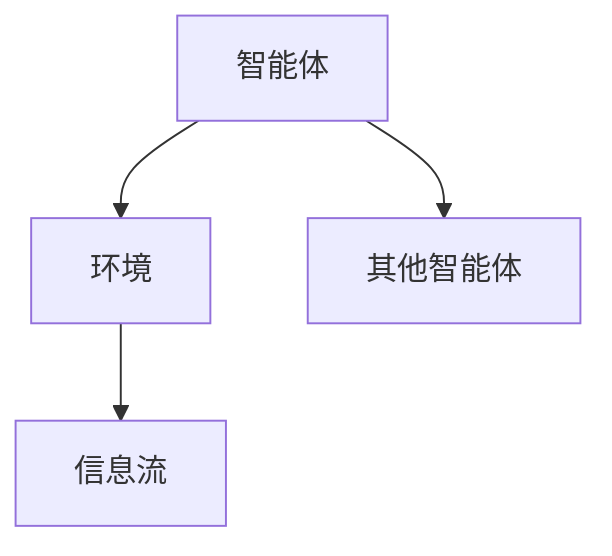
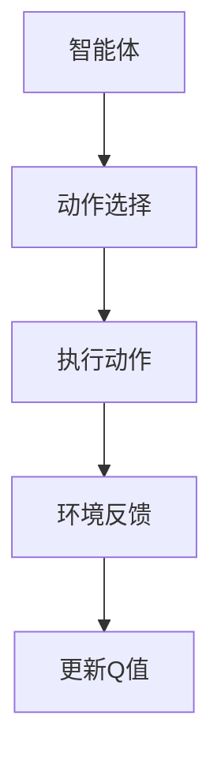
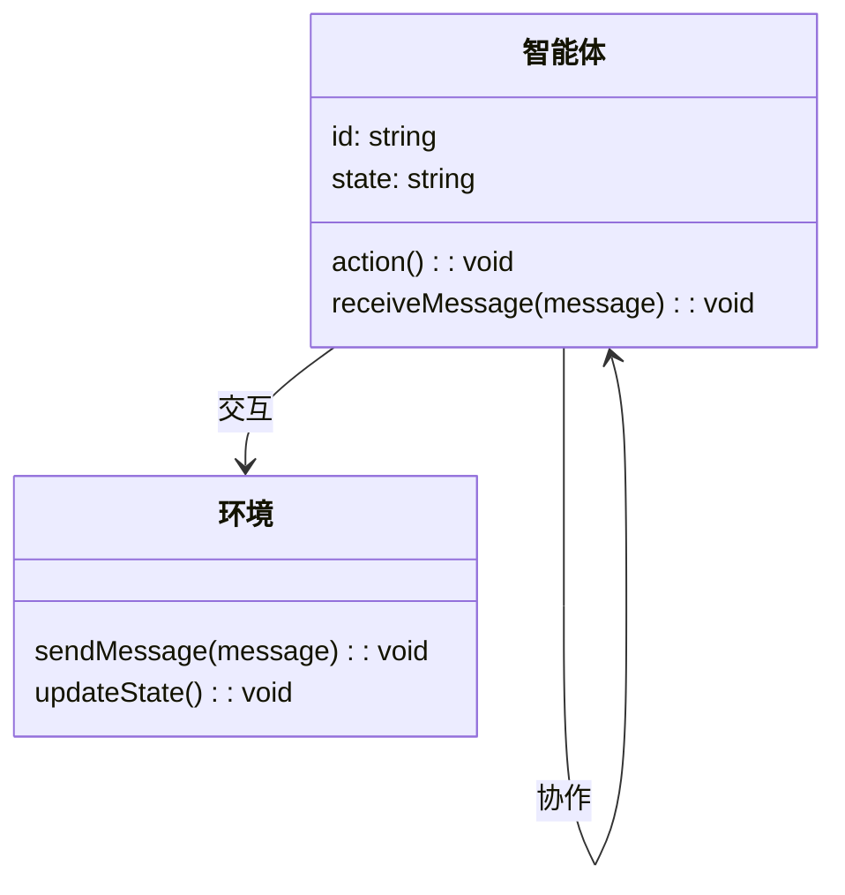
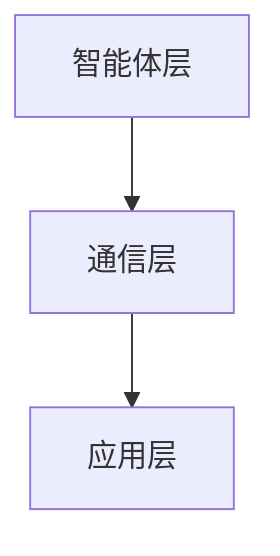
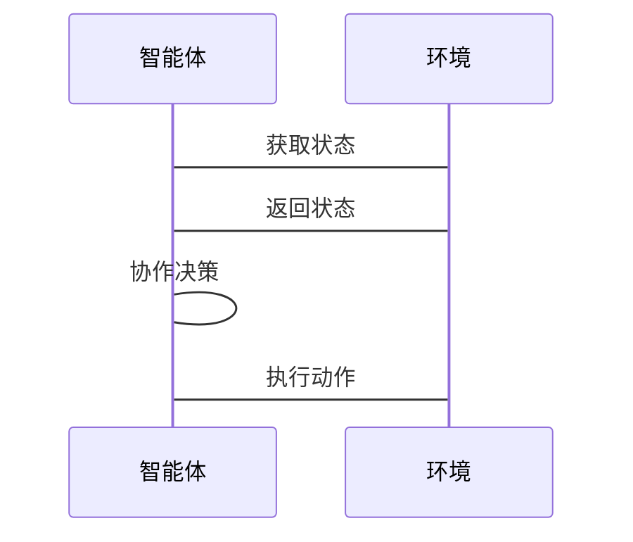

                 


# 多智能体系统在识别行业转型和颠覆性创新中的作用

> 关键词：多智能体系统（MAS）、行业转型、颠覆性创新、智能体协作、分布式计算、强化学习

> 摘要：本文探讨多智能体系统（MAS）在识别行业转型和推动颠覆性创新中的核心作用。通过分析MAS的基本概念、数学模型、算法原理、系统架构设计，结合实际项目案例，详细阐述MAS如何通过协作、分布式计算和强化学习等方法，助力企业在数字化转型中实现创新突破。本文旨在为技术从业者和企业管理者提供理论支持和实践指导，帮助他们更好地理解和应用MAS技术，推动行业变革。

---

## 第一部分: 多智能体系统基础与行业转型概述

### 第1章: 多智能体系统概述

#### 1.1 多智能体系统的基本概念

##### 1.1.1 多智能体系统的定义
多智能体系统（Multi-Agent System，MAS）是由多个智能体组成的复杂系统，这些智能体能够自主决策、协作和交互，共同完成特定任务。智能体是具有感知、推理、规划和执行能力的实体，可以是软件程序、机器人或其他智能设备。

**图1-1：多智能体系统的概念图**



##### 1.1.2 多智能体系统的核心特征
- **自主性**：智能体能够独立决策。
- **反应性**：智能体能实时感知环境并做出反应。
- **协作性**：多个智能体通过通信和协作完成共同目标。
- **分布式性**：智能体分布在不同的空间或计算节点上。

##### 1.1.3 多智能体系统与单智能体系统的区别
| 特性 | 单智能体系统 | 多智能体系统 |
|------|--------------|--------------|
| 决策 | 中央控制     | 分布式决策   |
| 通信 | 无          | 高          |
| 协作 | 无          | 高          |

#### 1.2 多智能体系统的结构与组成

##### 1.2.1 智能体的分类
- **简单反射型智能体**：基于当前感知做出反应，无内部状态。
- **基于模型的反射型智能体**：维护环境模型，用于决策。
- **目标驱动型智能体**：根据目标选择行动。
- **效用驱动型智能体**：基于效用函数优化决策。

##### 1.2.2 多智能体系统的通信机制
智能体之间的通信可以通过以下方式实现：
- **直接通信**：智能体之间通过共享内存或消息传递进行通信。
- **间接通信**：通过中间媒介（如数据库或消息队列）进行通信。

##### 1.2.3 多智能体系统的协作机制
协作机制包括：
- **同步协作**：智能体按照预定顺序协作。
- **异步协作**：智能体独立行动，通过通信协调。

#### 1.3 多智能体系统的应用领域

##### 1.3.1 多智能体系统在制造业中的应用
例如，工厂中的机器人和传感器组成的MAS可以实时监控生产过程，优化资源配置。

##### 1.3.2 多智能体系统在物流与供应链中的应用
通过智能体协调运输车辆和仓储系统，优化物流路径。

##### 1.3.3 多智能体系统在金融领域的应用
智能体可以用于实时市场监控、风险评估和交易决策。

---

### 第2章: 多智能体系统与行业转型

#### 2.1 行业转型的背景与挑战

##### 2.1.1 数字化转型的现状
企业正面临数字化转型的压力，传统模式难以适应快速变化的市场。

##### 2.1.2 行业转型的核心问题
- **效率低下**：传统流程缺乏智能化。
- **资源浪费**：资源分配不合理。
- **创新不足**：难以快速响应市场需求。

##### 2.1.3 多智能体系统在行业转型中的作用
MAS通过智能化和分布式协作，帮助企业提高效率、降低成本并推动创新。

#### 2.2 多智能体系统如何推动行业创新

##### 2.2.1 多智能体系统的灵活性与适应性
MAS能够快速响应变化，适应市场需求。

##### 2.2.2 多智能体系统的智能化与决策能力
智能体能够基于实时数据做出最优决策。

##### 2.2.3 多智能体系统的协作与资源共享
通过协作机制，MAS能够高效利用资源，避免重复劳动。

#### 2.3 多智能体系统在颠覆性创新中的应用

##### 2.3.1 颠覆性创新的定义与特征
颠覆性创新是指通过新技术或新商业模式对现有市场进行根本性改变。

##### 2.3.2 多智能体系统如何实现颠覆性创新
通过智能化协作和分布式计算，MAS能够创造新的商业模式和竞争优势。

##### 2.3.3 多智能体系统在创新中的案例分析
例如，智能交通系统通过MAS协调交通信号灯和自动驾驶车辆，实现更高效的交通管理。

---

## 第二部分: 多智能体系统的数学模型与算法原理

### 第3章: 多智能体系统的数学模型

#### 3.1 多智能体系统的状态表示

##### 3.1.1 状态空间的定义
状态空间是智能体所有可能状态的集合，可以用向量表示。

##### 3.1.2 状态转移的概率模型
状态转移可以通过马尔可夫链建模，描述智能体从一个状态转移到另一个状态的概率。

##### 3.1.3 状态空间的维度分析
状态空间的维度影响算法的复杂度，维度越高，计算越复杂。

#### 3.2 多智能体系统的决策模型

##### 3.2.1 Q-learning算法在多智能体系统中的应用
Q-learning是一种强化学习算法，适用于多智能体协作决策。

**图3-1：Q-learning算法流程**



##### 3.2.2 多智能体系统的联合决策模型
联合决策模型通过多个智能体共同优化决策，最大化整体效用。

##### 3.2.3 多智能体系统的博弈论模型
博弈论模型通过纳什均衡等概念，分析智能体之间的竞争与合作。

#### 3.3 多智能体系统的通信与协作模型

##### 3.3.1 通信协议的数学表示
通信协议可以用图论中的图结构表示，节点代表智能体，边代表通信关系。

##### 3.3.2 协作机制的数学建模
协作机制可以通过矩阵或向量表示，描述智能体之间的协作关系。

##### 3.3.3 信息交换的数学模型
信息交换可以用概率论中的贝叶斯网络建模，描述信息的传递和更新。

---

### 第4章: 多智能体系统的算法原理

#### 4.1 基于强化学习的多智能体算法

##### 4.1.1 多智能体强化学习的基本原理
强化学习通过奖励机制，训练智能体做出最优决策。

##### 4.1.2 多智能体强化学习的挑战与解决方案
- **同步与异步更新**：避免梯度干扰。
- **价值函数分解**：分解复杂任务为子任务。

##### 4.1.3 多智能体强化学习的数学公式推导
智能体的Q值更新公式：
$$ Q_i(a) = Q_i(a) + \alpha (r + \max_j Q_j(a') - Q_i(a)) $$

#### 4.2 基于分布式计算的多智能体算法

##### 4.2.1 分布式计算的基本原理
分布式计算将任务分解为多个子任务，分别在不同的计算节点上执行。

##### 4.2.2 多智能体系统的分布式计算模型
分布式计算模型可以用DAG（有向无环图）表示，节点代表任务，边代表依赖关系。

##### 4.2.3 分布式计算的数学模型与算法实现
分布式计算的负载均衡问题可以用图论中的流网络模型解决。

#### 4.3 基于博弈论的多智能体算法

##### 4.3.1 博弈论的基本概念
博弈论研究智能体之间的策略互动，常用纳什均衡分析稳定状态。

##### 4.3.2 博弈论在多智能体系统中的应用
博弈论模型可以用于智能体间的资源分配和任务协作。

---

## 第三部分: 系统分析与架构设计

### 第5章: 系统分析与架构设计

#### 5.1 问题场景介绍
以智能制造为例，分析MAS在工厂生产优化中的应用。

#### 5.2 系统功能设计

##### 5.2.1 领域模型设计
领域模型可以用类图表示，展示智能体之间的关系和交互。

**图5-1：领域模型类图**



#### 5.3 系统架构设计

##### 5.3.1 系统架构图
系统架构可以用分层架构表示，包括智能体层、通信层和应用层。

**图5-2：系统架构图**



#### 5.4 系统接口设计
系统接口包括智能体间通信接口和与外部环境的接口。

#### 5.5 系统交互设计

##### 5.5.1 交互流程
智能体接收环境信息，做出决策，发送动作指令。

**图5-3：系统交互流程**



---

## 第四部分: 项目实战

### 第6章: 项目实战

#### 6.1 环境安装
安装Python、NumPy、Matplotlib等工具，搭建MAS开发环境。

#### 6.2 系统核心实现源代码
以下是一个MAS实现的Python代码示例：

```python
class Agent:
    def __init__(self, id):
        self.id = id
        self.state = 'idle'
    
    def receive_message(self, message):
        print(f"Agent {self.id} received message: {message}")
        self.state = 'busy'
    
    def send_message(self, message, recipient):
        print(f"Agent {self.id} sending message to {recipient}: {message}")
        recipient.receive_message(message)

# 初始化智能体
agent1 = Agent(1)
agent2 = Agent(2)

# 智能体交互
agent1.send_message("Start task", agent2)
```

#### 6.3 代码应用解读与分析
上述代码展示了两个智能体之间的通信和协作，agent1向agent2发送消息，agent2接收并处理消息。

#### 6.4 实际案例分析
以智能交通系统为例，分析MAS如何优化交通流量。

#### 6.5 项目小结
通过实际项目，验证MAS在优化资源配置和提高效率方面的优势。

---

## 第五部分: 总结与展望

### 第7章: 总结与展望

#### 7.1 本章总结
本文全面探讨了多智能体系统在识别行业转型和颠覆性创新中的作用，分析了MAS的核心概念、算法原理和系统设计。

#### 7.2 未来展望
未来，MAS将在更多领域得到应用，尤其是在人工智能和区块链结合的场景中，MAS将展现出更大的潜力。

---

## 第六部分: 参考文献与附录

### 第8章: 参考文献

#### 8.1 参考文献
1. 王晓峰. 多智能体系统基础[M]. 北京: 清华大学出版社, 2019.
2. Russell S, Norvig P. 人工智能:一种现代方法[M]. 北京: 清华大学出版社, 2016.

### 第9章: 附录

#### 9.1 工具与资源
- Python编程语言
- NumPy、Matplotlib等Python库
- Mermaid图表工具

#### 9.2 代码仓库
GitHub代码仓库链接：[https://github.com/...](#)

---

## 作者信息

作者：AI天才研究院/AI Genius Institute & 禅与计算机程序设计艺术 /Zen And The Art of Computer Programming

---

感谢您的耐心阅读，希望本文能为您提供有价值的见解和启发。如需进一步探讨或获取更多资料，请随时联系作者。

